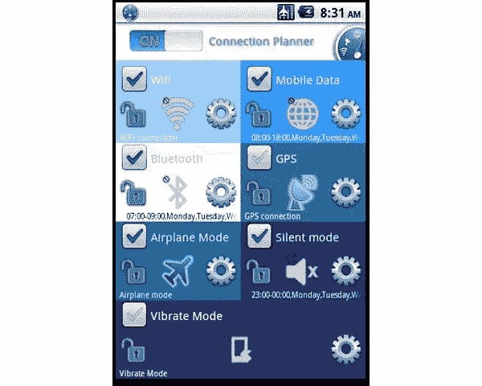
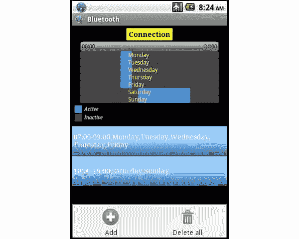
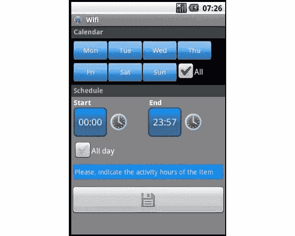

# 使用面向 Android 的 Connection Planner 充分利用您的数据计划和电池

> 原文：<https://www.sitepoint.com/automatic-wireless-radio-management-with-connection-planner-for-android/>

一般来说，当你自动化更多的事情时，你的生活会更容易处理。例如，你的手机账单可能已经自动记入你的信用卡。同样的事情也可以说是自动化你的 Android 智能手机上的过程，帮助你消除一些你可能不得不以手动方式做的步骤。

当然，你可以让你的智能手机开着所有的无线电，但是你会很快发现这会在几个小时内耗尽你的电池寿命。这就是为什么你只在需要的时候才打开 GPS 或蓝牙，但是每次都需要手动操作，这很麻烦。这就是为什么像 San2Mob 的 [Connection Planner](https://play.google.com/store/apps/details?id=com.jomasapa.android.cplanner&hl=en) 这样的应用程序很有意义。这里的想法是，你计划你的连接，应用程序会处理剩下的事情。自动地。

### 管理您的所有无线连接

连接规划是一个应用程序，让您计划您的连接。这包括智能手机上的所有无线电台，如 Wi-Fi、移动数据(3G/4G)、蓝牙和 GPS。您还可以管理飞行模式、静音模式和振动模式。

虽然其中一些通常可以通过在 Android 设备上向下滑动顶部工具栏来获得，但它们并不总是适用于每个版本的 Android。例如，许多智能手机不太容易打开和关闭你的移动数据，所以有一个单一的连接应用程序可以同时管理所有这些无疑是一个优势。

但这不是 Connection Planner 为数字表带来的主要功能。相反，更重要的是能够安排您希望某些连接和功能处于活动状态的时间和日期。这将自动执行该过程，因此您不必根据需要手动打开和关闭它们。

### 使用预定无线电节省电池和时间

让我们说，你通常戴上蓝牙耳机去上班，你通常在早上 8 点到 9 点之间开车。如果是这样的话，你可以安排智能手机上的蓝牙在上午 8 点自动开启，在上午 9 点自动关闭。

这种相同类型的连接时间表定制可以不同地应用于一周中的每一天。也许你在星期五有不同的工作安排，你在早上 7 点到 8 点之间开车。如果是这样的话，你可以设置周一到周四早上 8 点到 9 点的蓝牙时间表，周五早上 7 点到 8 点的时间表，周六和周日完全关闭蓝牙。

连接计划的复杂性完全由您决定。您可以一目了然地看到所有不同的计划项目，这也以图形方式用灰色和蓝色条表示，如上所示。这里的例子是蓝牙，但完全相同的事情可以做的所有其他无线电台和功能包括在这个应用程序中。

设置每个计划项目非常简单。首先点击与您想要配置的无线电台相关的设置“齿轮”图标，然后点击添加新的计划项目。一周中的每一天都在顶部，您可以为所选项目设置广播活动的开始和结束时间。例如，当你知道你需要驾驶方向时，你可以打开 GPS。当你知道你将离开家或办公室时，你也可以打开 3G/4G 移动数据，当你知道你可以连接到 Wi-Fi 时，节省有限的移动数据计划兆字节。

你可以看到这是如何在你的手机上安排静音和震动模式的。你可能想在晚上睡觉时保持 Wi-Fi 活跃，以便过滤所有的常规电子邮件和 WhatsApp 信息，但你可能想激活静音模式，这样你就不会被每个新的电子邮件通知惊醒。这真的取决于你想如何使用这个应用程序，你可以随时通过根据需要手动更改它们来覆盖自动设置。

### 悬挂式应用的问题是

这听起来是个好主意，应用程序的实际布局也相对容易理解。然而，在实际执行 Connection Planner 时，我遇到了不少问题。我把它安装在我的三星 Galaxy S Captivate 上，它仍然运行在 Android 2.2 Froyo 上(我知道，我知道)。它不是最强大的智能手机，但它能够处理我扔给它的大多数应用程序。

不幸的是，Connection Planner 并不像我希望的那样好。有几次应用程序会“挂起”并变得没有响应，特别是当我添加新的连接计划项目时。甚至有几次应用程序会完全崩溃，迫使手机自动重启或迫使我拔掉电池。

### 理论上一个很好的自动化想法

现在，我不能肯定地说你是否会遇到和我一样的冻结或崩溃问题。也就是说，Connection Planner 的实际核心真的不应该如此复杂或对智能手机造成负担，因为它真正做的只是按照计划打开和关闭连接。这不是图形上的紧张，这不是一个严重依赖物理引擎的游戏，或者类似的东西。

当 Connection Planner 实际上完成了它设定的工作时，我可以看到这对那些知道什么时候需要 GPS，什么时候可以关闭蓝牙的人来说是一个很有价值的补充。Connection Planner 是从谷歌 Play 商店免费下载的，所以试一试，看看它如何与你选择的 Android 智能手机配合使用。如果你遇到和我一样的问题，那么卸载它并回到更传统的手动管理连接的方法并不需要太多。

## 分享这篇文章