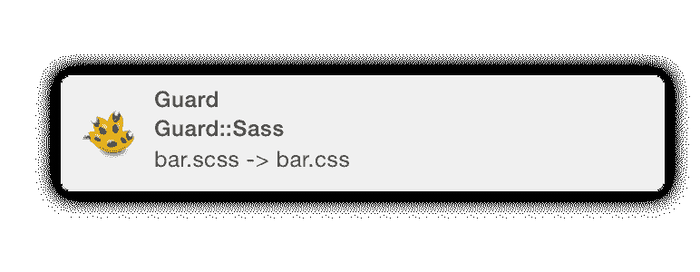

# 自动重新加载所有的东西与警卫

> 原文：<https://www.sitepoint.com/automatically-reload-things-guard/>

想象你自己在这种情况下:

这是办公室里一个轻松的下午，在过去的 12 个小时里，你一直在一个前端项目上拼命工作。你不得不反复经历浏览器的整个保存-编译-重新加载阶段。当我说编译时，我的意思是用一系列辛苦的 shell 命令编译那些您迫切需要的 SCSS 和 CoffeeScript 文件。“我是个卢布主义者！”，你大喊，“一定有更好的办法！”。嗯，有。请允许我向您介绍[卫士](http://guardgem.org/)，您的新宠红宝石前端。

## 什么是守卫？

Guard 只是一个文件系统监视器。换句话说，它检测你何时保存一个文件，然后运行一个命令。这比那稍微复杂一点，但是我们将在下一个讨论它。

## 警卫如何帮助我？

还记得你刚才的情景吗？好吧，这一次让我们插入守卫:

这是办公室里一个轻松的下午，但你并不介意，因为你刚刚完成了最新的前端项目。在你站着的办公桌前(是的，[你是最酷的](https://en.wikipedia.org/wiki/Standing_desk))，你有几扇窗户开着。在您的大监视器上，您最喜欢的代码编辑器是打开的，终端被最小化以便于访问。在笔记本电脑的屏幕上，有一个打开的浏览器窗口。你已经好几个小时没碰过这个窗口了，因为 Guard 和 LiveReload 会根据你的变化自动更新浏览器。这包括编译你的 SCSS 和咖啡脚本！你喝了一口咖啡，然后大喊，“我是个卢布主义者！”，同时看看您的同事，他们仍在经历保存-编译-重新加载阶段。生活是美好的，一切都归功于守护。

你想要这个吗？你当然有！让我们开始吧…

## 安装防护装置和朋友

安装防护罩就像`gem install guard`一样简单。然后，您就可以开始设置了。

接下来，你必须决定你想要哪些插件。在本教程中，我们将讨论以下插件:(你需要安装它们:`gem install PLUGIN`)

*   `guard-coffeescript`–([网站](https://rubygems.org/gems/guard-coffeescript)
*   `guard-sass`–([网站](https://rubygems.org/gems/guard-sass)
*   `guard-less`–([网站](https://rubygems.org/gems/guard-less)
*   `guard-livereload`–([网站](https://rubygems.org/gems/guard-livereload)
*   `guard-rspec`–([网站](https://rubygems.org/gems/guard-rspec)

每个插件都有点不同，但也有很多相同之处。一旦你学会了如何设置这 5 个插件，你将能够设置其他 [267+可用的守卫插件](http://rubygems.org/search?query=guard-)。

对于大多数项目来说，为依赖项设置一个`Gemfile`是明智的。如果你使用所有的插件，你的`Gemfile`应该是这样的:

```
source 'https://rubygems.org/'

group :development do
  gem 'guard'
  gem 'guard-coffeescript'
  gem 'guard-sass'
  gem 'guard-less', git: 'git://github.com/guard/guard-less.git'
  gem 'therubyracer'
  gem 'guard-livereload'
end
```

**注意:**在这个时间点，需要从 git 构建`guard-less` gem，因为维护人员还没有把最新版本推送到 RubyGems。这可能会改变，但现在，就是这样。(参见[问题#16](https://github.com/guard/guard-less/issues/16) )您可以在没有`git`选项的情况下尝试，但我不能保证安装无误。还有，宝石`therubyracer`是`guard-less`需要的，但是没有作为依赖使用，所以我们要自己添加。

## 咖啡脚本

你是个卢布主义者。承认吧，CoffeeScript 的 Ruby 风格的语法从一开始就吸引了你。有了`guard-coffeescript`,你不再需要在丑陋的 JavaScript 和丑陋的 CoffeeScript 编译过程之间做出选择。让我们用 CoffeeScript 初始化 Guard:

```
$ bundle exec guard init coffeescript
```

这将为您的“守卫”(插件)生成一个配置文件(`Guardfile`)。让我们看看里面:

```
# A sample Guardfile
# More info at https://github.com/guard/guard#readme

guard 'coffeescript', :input => 'app/assets/javascripts'
```

这很好，但是我们将 CoffeeScript 保存在与编译后的 JavaScript 不同的目录中，所以让我们更改文件:

```
guard 'coffeescript', :input => 'coffee', :output => 'js'
```

注意，我们在选项中添加了`:output`。这样，CoffeeScript 位于`coffee`目录中，并被编译到`js`目录中。

启动警卫，看它看我们的文件:

```
$ bundle exec guard
```

向我们的项目添加一点 CoffeeScript 并保存:

```
# file: coffee/test.coffee

console.log 'It worked!'
```

请注意，在终端中，当您保存文件时，它会在`js`目录中生成 JavaScript:

```
[1] guard(main)> 
20:54:21 - INFO - Compile coffee/test.coffee
20:54:21 - INFO - 08:54:21 PM Successfully generated js/test.js
```

当您在`coffee`目录中保存任何`*.coffee`文件时，Guard 会使用相同的名称将其编译到`js`目录中。就这么简单。

## 萨斯/萨斯

来吧，我们都喜欢萨斯/SCSS。这个过程与 CoffeeScript 非常相似。事实上，我们甚至会建立在相同的`Guardfile`之上。`guard-sass`插件确实有一个`init`模板，但这次我们将自己制作。幸运的是，这很简单:

```
guard 'sass', :input => 'scss', :output => 'css'
```

和`guard-coffeescript`的配置完全一样，做的事情也差不多。输入目录中的所有 Sass/SCSS 文件(本例中为`scss`)将被编译到输出目录中(`css`)。好看又容易；就应该是这样。

## 较少的

“Less”配置与`guard-coffeescript`和`guard-sass`略有不同。它在块中使用正则表达式和`watch`方法。这可能看起来有点混乱，但你马上就会明白。

```
guard :less, output: 'css' do
  watch %r{^less/.*\.less$}
end
```

这个例子展示了一个带有`watch`方法的`guard :less`块。`watch`采用匹配项目中所有文件的正则表达式。在这个例子中，正则表达式匹配目录`less`中所有扩展名为`.less`的文件。如果你不熟悉正则表达式，你可以在这里使用这个。注意`%r{}`和`//`在 Ruby 中是作为正则表达式来求值的。然而，使用`%r`语法，不需要对正斜杠('/')进行转义。我们可以像这样简单地写出同样的东西:

```
guard :less, output: 'css' do
  watch /^less\/.*\.less$/
end
```

让我们运行 Guard 并对此进行测试:

```
$ bundle exec guard
```

现在，在`less`目录下创建一个小文件。

```
// file: less/foo.less
@black: #000;

body {
        background: @black;
}
```

一旦保存，请注意由于`:output`选项的缘故，`foo.css`被编译到`css`目录中。
GEG

## 肝负荷

我们已经处理了资产预编译，但是“保存-编译-刷新”的“刷新”部分呢？向`guard-livereload`问好，因为它刚刚让你的生活轻松了许多。

**什么是 LiveReload？**
LiveReload 是一个浏览器自动刷新实用程序。当文件发生变化时，Guard 会通知它，LiveReload(在您的浏览器中)会自动更新页面。

**安装**你可以在这里下载[。](https://chrome.google.com/webstore/detail/livereload/jnihajbhpnppcggbcgedagnkighmdlei)现在，我们来配置`guard-livereload`。

以下是我们希望在保存时重新加载的资产列表:

*   超文本标记语言
*   半铸钢ˌ钢性铸铁(Cast Semi-Steel)
*   射流研究…
*   PNG
*   使用 jpeg 文件交换格式存储的编码图像文件扩展名

请注意，我们没有包括 Sass、SCSS、Less 或 CoffeeScript，因为它们会在更改时由 LiveReload 编译和重新加载。这是一个美丽的循环。让我们创建正则表达式来实现这一切。

regexp 为:`%r{^.*\.(html|css|js|png|jpg)$}`。请在 [rubular](http://rubular.com/r/zJqTms5XTE) 随意测试，以确保它按照我们想要的方式工作。

像这样把这个放进`Guardfile`:

```
guard 'livereload' do
  watch %r{^.*\.(html|css|js|png|jpg)$}
end
```

如果我们保存任何匹配正则表达式的文件，浏览器将重新加载这些文件。但首先，我们必须将分机连接到警卫。为此，让我们创建一个简单的 HTML 文件:

```
<!DOCTYPE html>
<html>
  <head>
    <title>Guard Rocks!</title>
    <link rel="stylesheet" href="css/foo.css">
  </head>

  <body>
    <h1>Hello, Guard!</h1>
  </body>
</html>
```

没什么特别的，只是不错的。因为它是一个静态文件，你可以使用`file://`协议来访问它，但是 Chrome 对访问本地文件的扩展有很大的限制(并且有很好的理由)，所以我们应该使用一个简单的服务器来提供我们的文件。露比再次出手相救！

在项目的根目录下创建一个名为`serve.rb`的文件。

```
# file: serve.rb

require 'rack'

server = Rack::Builder.new do
  run Rack::Directory.new(Dir.pwd)
end

Rack::Handler::WEBrick.run(server)
```

这只是一个简单的 Rack/WEBrick 服务器，它将在`localhost:8080`上托管我们的文件。跑完`ruby serve.rb`，你就可以出发了！您可以随时使用 control-C 关闭服务器。

现在，我们可以在`localhost:8080/index.html`的浏览器中访问它。要将扩展连接到 Guard，单击浏览器扩展栏中的 LiveReload 按钮，Guard 应该会输出“Browser connected”。**在连接浏览器之前，这不会起作用**。

假设我们希望正文中的文本是白色的。我们所要做的就是将`color: #ffffff`输入到我们的`body`选择器中。完成后，Guard 会将你的 SCSS/Sass/Less 编译成 CSS 并重新加载浏览器，立即显示你的修改。这同样适用于 JavaScript/CoffeeScript 文件。厉害！

## 通知

我听到你对着电脑大喊大叫。你在说，“哇！这个超级牛逼！我只希望我能在电脑屏幕上得到通知，这样我就不用看着我的终端来确认构建了。”幸运的是，Guard 允许很容易地做到这一点。但是，它因系统而异。让我们从我最喜欢的到最不喜欢的操作系统开始。

**给外面的读者一个提示:**
[无守卫](https://github.com/guard/guard-less)插件目前不支持通知。它实际上维护得很糟糕，所以如果你有一些空闲时间，也许叉它。

### 麦克·OS X

对于 Mac，我们将使用一种叫做[咆哮](http://growl.info)的东西。需要说明的是，咆哮不是免费的，但它是开源的。因此，如果 4 美元(直接用于项目)对您来说太多了，您可以尝试自己构建它。你可以在这里找到那个[的说明](http://growl.info/documentation/developer/growl-source-install.php)，尽管这可能会是一个艰苦的过程。

一旦你安装了咆哮，将`gem 'ruby_gntp'`添加到你的`Gemfile`和`bundle install`中。守卫和咆哮配合得很好，所以他们除了让咆哮运行之外完全不需要其他设置:

```
$ bundle exec guard
14:54:30 - INFO - Guard is using GNTP to send notifications.
14:54:30 - INFO - Guard is using TerminalTitle to send notifications.
14:54:30 - INFO - Guard::Less 1.0.0 is on the job!
14:54:30 - INFO - Guard::Less: compiling all files
14:54:30 - INFO - Guard::Less: Skipping less/foo.less because css/foo.css is already up-to-date
14:54:30 - INFO - Guard is now watching at '/path/to/project'
```

现在，任何时候我们改变一个文件，咆哮+守卫会让我们知道。



### Linux 操作系统

对于 Linux，我们有两种方法:[grow for Linux](https://github.com/mattn/growl-for-linux)和 Libnotify。

#### 面向 Linux 的咆哮

[为 Linux](https://github.com/mattn/growl-for-linux#installation) 安装咆哮，并将`gem 'ruby_gntp'`添加到你的`Gemfile`中，然后运行`bundle exec guard`，你就可以开始了！

#### Libnotify

在你喜欢的包管理器(`sudo apt-get install libnotify-bin`)中安装`libnotify-bin`，在你的`Gemfile`中添加`gem 'libnotify'`，然后运行`bundle exec guard`。

注意:这可能不适用于所有的 Linux 发行版。

### Windows 操作系统

守卫建议要么对着窗户咆哮，要么对着咆哮。一旦你安装了其中一个，只需将`gem 'ruby_gntp'`添加到你的`Gemfile`和`bundle exec guard`中。

**免责声明:**这两种 Windows 方法我都没有测试过，不能保证成功。

## 轨道(RSpec)

你一想到护栏就开始流口水，是吗？让我们让这个奇迹发生吧。情况类似于上面的情况:您正在处理一个 Rails 应用程序，一遍又一遍地运行相同的测试命令变得很乏味。别担心，警卫会保护你的。

1.  把`gem 'guard-rspec'`加到你的`Gemfile`(和`bundle install`)。
2.  运行`guard init rspec`创建一个标准项目脚手架。
3.  跑`bundle exec guard`看魔术。

就这么简单。然而，我可以有把握地假设您喜欢定制东西，所以让我们稍微修改一下`Guardfile`。首先，这里是守卫给我们的:

```
# A sample Guardfile
# More info at https://github.com/guard/guard#readme

# Note: The cmd option is now required due to the increasing number of ways
#       rspec may be run, below are examples of the most common uses.
#  * bundler: 'bundle exec rspec'
#  * bundler binstubs: 'bin/rspec'
#  * spring: 'bin/rsspec' (This will use spring if running and you have
#                          installed the spring binstubs per the docs)
#  * zeus: 'zeus rspec' (requires the server to be started separetly)
#  * 'just' rspec: 'rspec'
guard :rspec, cmd: 'bundle exec rspec' do
  watch(%r{^spec/.+_spec\.rb$})
  watch(%r{^lib/(.+)\.rb$})     { |m| "spec/lib/#{m[1]}_spec.rb" }
  watch('spec/spec_helper.rb')  { "spec" }

  # Rails example
  watch(%r{^app/(.+)\.rb$})                           { |m| "spec/#{m[1]}_spec.rb" }
  watch(%r{^app/(.*)(\.erb|\.haml|\.slim)$})          { |m| "spec/#{m[1]}#{m[2]}_spec.rb" }
  watch(%r{^app/controllers/(.+)_(controller)\.rb$})  { |m| ["spec/routing/#{m[1]}_routing_spec.rb", "spec/#{m[2]}s/#{m[1]}_#{m[2]}_spec.rb", "spec/acceptance/#{m[1]}_spec.rb"] }
  watch(%r{^spec/support/(.+)\.rb$})                  { "spec" }
  watch('config/routes.rb')                           { "spec/routing" }
  watch('app/controllers/application_controller.rb')  { "spec/controllers" }
  watch('spec/rails_helper.rb')                       { "spec" }

  # Capybara features specs
  watch(%r{^app/views/(.+)/.*\.(erb|haml|slim)$})     { |m| "spec/features/#{m[1]}_spec.rb" }

  # Turnip features and steps
  watch(%r{^spec/acceptance/(.+)\.feature$})
  watch(%r{^spec/acceptance/steps/(.+)_steps\.rb$})   { |m| Dir[File.join("**/#{m[1]}.feature")][0] || 'spec/acceptance' }
end
```

你可能决定你想要所有这些东西，但是我喜欢把事情简化一点:

```
guard :rspec, cmd: 'bundle exec rspec' do
  watch('spec/spec_helper.rb') { "spec" }
  watch('config/routes.rb') { "spec/routing" }
  watch('app/controllers/application_controller.rb') { "spec/controllers" }
  watch(%r{^spec/.+_spec\.rb$})
  watch(%r{^app/(.+)\.rb$}) { |m| "spec/#{m[1]}_spec.rb" }
  watch(%r{^app/(.*)(\.erb|\.haml|\.slim)$}) { |m| "spec/#{m[1]}#{m[2]}_spec.rb" }
  watch(%r{^lib/(.+)\.rb$}) { |m| "spec/lib/#{m[1]}_spec.rb" }
  watch(%r{^app/controllers/(.+)_(controller)\.rb$}) { |m| ["spec/routing/#{m[1]}_routing_spec.rb", "spec/#{m[2]}s/#{m[1]}_#{m[2]}_spec.rb", "spec/acceptance/#{m[1]}_spec.rb"] }
end
```

这将涵盖所有(或者至少是大部分)通常在 Rails 应用程序中运行的测试。这将使你和你的手指从所有额外的测试中解脱出来。我想在这段代码中注意的一点是`cmd`选项。这指定了将运行哪个测试命令。在这种情况下，是`bundle exec rspec`，但也可能是`bundle exec rake test`；每个项目都会不一样。

如你所见，Guard 是一个非常棒的自动化工具。您可以观察项目的文件更改，然后编译、测试，甚至重新加载浏览器窗口。挽回自己的挫败感，获得[守卫](http://guardgem.org/)。

## 分享这篇文章