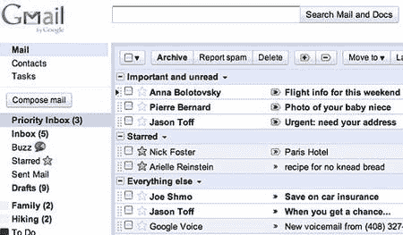

# 通过 gmail 的优先收件箱避免电子邮件霸王

> 原文：<https://www.sitepoint.com/avoid-email-overload-with-gmails-priority-inbox/>

对于谷歌的 GMail 开发者来说，这是忙碌的一周。他们最近增加了[免费电话语音通话](https://www.sitepoint.com/google-gmail-free-telephone-voice-calls/)，现在他们又推出了一项新功能，让你免受电子邮件超载的困扰。一个典型的企业用户平均每天发送或接收 110 封邮件，每周花 8 小时处理收件箱。这是公认的压力原因，会让人感到不知所措，并阻止他们完成更重要的任务。GMail 新的优先收件箱可以帮助你减轻压力。这是一个实验性的功能，将在未来几天向所有用户推出。在页面的右上角寻找一个鲜红色的“优先收件箱”链接——你应该很快就会看到它。本质上，优先收件箱是一个反垃圾邮件过滤器。它识别重要的信息——比如来自你老板的信息——并降低非关键信息的优先级。例如，客户 Bob 在咖啡机空了时抄送给整个公司的邮件。像往常一样，谷歌发布了一个俗气的视频来解释这个概念:

<object width="560" height="340"><param name="movie" value="https://www.youtube.com/v/5nt3gE9dGHQ?fs=1&amp;hl=en_GB&amp;color1=0x006699&amp;color2=0x54abd6"><param name="allowFullScreen" value="true"><param name="allowscriptaccess" value="always"><embed src="https://www.youtube.com/v/5nt3gE9dGHQ?fs=1&amp;hl=en_GB&amp;color1=0x006699&amp;color2=0x54abd6" type="application/x-shockwave-flash" allowscriptaccess="always" allowfullscreen="" width="560" height="340"></object>

优先收件箱关注您阅读和回复的内容。随着时间的推移，它会不断学习，应该会更有效率地将重要的事情从琐碎的事情中分离出来。收件箱分为三个部分——重要和未读、已标星和其他(你可以在 GMail 的设置中配置):如果过滤器出错，你可以使用+和–按钮相应地将邮件标记为更重要或更不重要。谷歌已经在内部测试了 18 个月的优先收件箱。根据 it 自己的内部报告，员工现在花在阅读无关邮件上的时间减少了 13%。更多信息，请参阅[优先收件箱页面](https://mail.google.com/mail/help/priority-inbox.html)。它会让你免于邮件超载吗？

## 分享这篇文章