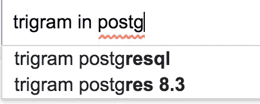
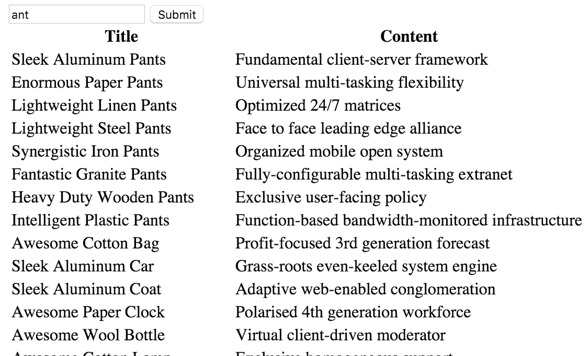

# awesome Autocomplete:Rails 和 PostgreSQL 中的三元组搜索

> 原文：<https://www.sitepoint.com/awesome-autocomplete-trigram-search-in-rails-and-postgresql/>



PostgreSQL 通常被称为 Postgres，是目前最成熟、最强大的数据库之一。它是一个多平台、开源的数据库管理系统，是第二大使用的开源数据库管理系统。

今天我们将了解如何在 Postgres 和 Rails 中使用三元模型实现基本的自动完成搜索。本教程分为三个部分:

1.  什么是三元模型？
2.  Postgres 中的三元模型
3.  在示例 rails 应用程序中实现三元模型

## 什么是三元模型？

三元模型只不过是由三个字母序列组成的 n 元模型。那么，什么是 n-gram？来自维基百科，

> 在计算语言学和概率领域，n 元语法是来自给定文本或语音序列的 n 个项目的连续序列。

那到底是什么意思？它意味着通过维护一个单词中可变的字符序列来找到匹配的单词。

在三元模型中，n 元模型中的变量序列是 3。为了找到两个单词 wordA 和 wordB 之间的相似性，将 wordA 分成三个字母序列，并与从 wordB 计算的三个字母序列组合进行比较。该比较旨在找出两个单词之间的共享集合的数量。序列匹配的数量越多，意味着单词之间的相似性越高。这在自动完成方面非常有用。

每个单词都以两个空格为前缀，一个空格为后缀，以平衡 n 字符单词的三元组数量。那就混乱了，我们来举个例子。

假设我们有一个由三个单词组成的单词组`[google, toddle, beagle]`，搜索词是 *googlr* 。我们需要从一批搜索项中找到最匹配的词。首先，将批字分成三个字母组:

```
google - g, go, goo, oog, ogl, gle, le
toddle - t, to, tod, odd, ddl, dle, le
beagle - b, be, bea, eag, agl, gle, le 
```

将为搜索词计算三个字母的三元组，并与它们共享的序列的批中的单词进行比较:

```
g, go, goo, oog, ogl, glr, lr

google - 5
toddle - 0
beagle - 0 
```

相似性是使用它们共享的三元模型的数量来计算的，这在我们的例子中是非常微不足道的。所以`google`会高居相似度指数榜首。

对于第二个用例，假设搜索词只是`gle`。三元模型是:

```
g, gl, gle, le

Matches -
    google - 3
    toddle - 1
    beagle - 2 
```

为此，`google`将排在结果的前面，后面跟着`beagle`。一旦你熟悉了这个概念，我们就可以转到 Postgres 中三元模型是如何实现的。

## PostgreSQL 中的三元模型

Postgres 通过一个名为 [pg_trgm](http://www.postgresql.org/docs/current/static/pgtrgm.html) 的扩展支持三元模型，这是一个官方支持的扩展。值得注意的是，pgtrgm 在计算三元模型时会忽略特殊字符。

下面的列表包含了扩展附带的特性，这有助于进行三元模型搜索:

*   `similarity(text1, text2)`–计算`text1`和`text2`之间的相似性指数，范围为 0 到 1，0 表示最不相似。

*   `show_trgm(text)`–列出可以从给定的`text`中计算出的可能三元模型，就像我们上面所做的一样。

*   `show_limit()`–由`%`方法使用的设置过滤器(见下文)。只有在执行三元模型搜索时，才会显示高于此限制的相似性指数。默认限制为 0.3。

*   `set_limit(real)`–设置由`%`方法使用的限值。

*   `text1 % text2`–如果`text1`和`text2`之间的相似度高于设定的限制，则返回 true。

*   `text1 <-> text2`–距离运算符，是相似度的倒数。返回`text1`和`text2`之间的距离。

*   `gist\_trgm\_ops`和`gin\_trgm\_ops`–分别在一个文本列上构建 GiST 或 GIN 索引，以实现更快的相似性搜索。

让我们从在 Rails 应用程序中实现三元组搜索开始。

## 在 Rails 中实现三元模型

我们的示例应用程序非常简单，只有一个模型`Post`，它有两列`title`和`content`。让我们使用下面的命令快速创建应用程序、模型和控制器。我使用的是 Rails 4.2:

```
rails new app_name -d postgresql
cd app_name
rails generate model post title content
rake db:create && rake db:migrate
rails generate controller posts index 
```

在数据库里植入一些假数据。我用的是 [Faker](https://github.com/stympy/faker) gem。下面是种子文件:

```
(0..100).each do |p|
  Post.create(title: Faker::Commerce.product_name, content: Faker::Company.catch_phrase)
  puts "Created #{p}"
end 
```

让我们也为控制器添加一些基本内容:

```
def index
  if params[:q].present?
    @posts = Post.where(title: params[:q])
  else
    @posts = Post.all
  end
end 
```

在**app/views/post/index . html . erb**文件中，添加以下几行，其中包括一个基本搜索框以及所有帖子的列表:

```
<form method="GET" action="/">
  <input placeholder="Search" id="search" type="text" name="q" />
  <input type="submit">
</form>

<table>
  <tr>
    <th>Title</th>
    <th>Content</th>
  </tr>
  <% @posts.each do |post| %>
    <tr>
      <td><%= post.title %></td>
      <td><%= post.content %></td>
    </tr>
  <% end %>
</table> 
```

我们现在有了一个基本的应用程序，它只有一个模型、100 行文章、一个索引页面和一个只匹配文章完整标题的搜索选项。让我们插入一个三元模型搜索。

#### 安装 pg_trgm 扩展

如前所述，Postgres 通过`pg_trgm`扩展提供三元模型功能。使用迁移将它安装在应用程序中，而不是直接在 psql 控制台中安装。使用以下命令创建迁移:

```
rails generate migration AddPgTrgmExtensionToDB 
```

将以下内容添加到迁移中:

```
execute "create extension pg_trgm;" 
```

运行迁移。这将在 Postgres 中安装 pg_trgm 扩展。

#### 添加搜索索引

当我们这样做时，让我们也为将要搜索的列添加一个索引。GiST(广义搜索树)和 GIN(广义倒排索引)是 Postgres 中的两种索引。添加索引不是强制性的，但是为了加快查询速度，这是可取的。在这一点上，我真的不能推荐 GiST 或 GIN，因为我在过去已经有过不同的性能差异。两个指标的主要区别以及如何选择可以在[这里](http://www.postgresql.org/docs/9.1/static/textsearch-indexes.html)找到。添加最适合你的。

创建一个迁移，并将下面一行添加到其中:

```
add_index :posts, :title 
```

运行迁移，就这样！我们在数据库方面都准备好了。快速添加搜索查询以利用三元模型相似性。

#### 搜索方法

要添加搜索选项，请在我们的`Post`模型中添加一个方法:

```
class Post < ActiveRecord::Base
  def self.text_search(query)
    self.where("similarity(title, ?) > 0.3", query).order("similarity(title, #{ActiveRecord::Base.connection.quote(query)}) DESC")
  end
end 
```

让我们也替换控制器中的搜索行

```
@posts = Post.where(title: params[:q]) 
```

到

```
@posts = Post.text_search(params[:q]) 
```

就是这样。启动服务器，然后去搜索错别字，看看相似的单词出现的魔力。



在 **post.rb** 中的`text_search`方法中，阈值分数设置为`0.3`。请随意调整以满足您的需求。阈值越大，结果越少，搜索越严格。

提高搜索速度的一种方法是使用一个单独的列来保存标题列的所有三元组序列。然后，我们可以对预填充的列执行搜索。或者我们可以利用`ts_vector`，但是对于模糊的单词来说，这将变得毫无用处。

## 结论

有一个名为 [pg_search](https://github.com/Casecommons/pg_search) 的 gem 提供了开箱即用的三元模型搜索功能，但是出于某种原因，这个 gem 中的三元模型搜索对我来说比原始 SQL 慢。我以后可能会盖这个宝石。

本示例中使用的所有代码都托管在 [GitHub](https://github.com/sitepoint-editors/trigram-search-rails) 上。随便用它来叉一出戏。

感谢您的阅读。我希望这对您的 Rails 应用程序开发有用。

## 分享这篇文章