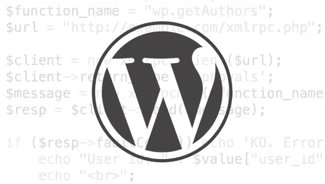

# 净化、转义和验证 WordPress 中的数据

> 原文： [https://www.sitepoint.com/sanitizing-escaping-validating-data-in-wordpress/](https://www.sitepoint.com/sanitizing-escaping-validating-data-in-wordpress/)

当创建 WordPress 插件和主题时，它们将被数以千计的网站使用，你需要小心处理进入 WordPress 的数据和呈现给用户的数据。

在本教程中，我们将会看到能够保护、清理和检查进出 WordPress 的数据的本地函数。当创建设置页面、HTML 表单、操作短代码等时，这是必要的。



## 什么是消毒？

简而言之，**净化就是清理用户输入**。不允许从输入中删除文本、字符或代码。

**Gmail 示例:**在 HTML 电子邮件显示在 Gmail 浏览器客户端之前，Gmail 会删除其中的`<style>`标签及其内容。这样做是为了防止电子邮件 CSS 覆盖 Gmail 样式。

Widget 标题中不能有 HTML 标签。如果你在标题中加入了 HTML 标签，那么在标题被保存之前它们会被自动删除。

WordPress 提供了各种功能来将不同的数据整理成不同的形式。以下是其中的一些:

### sanitize_email()

此功能删除了电子邮件地址中不允许的所有字符。代码示例:

```
<?php 

echo sanitize_email("narayan prusty@sitepoint.com"); //Output "narayanprusty@sitepoint.com"
```

电子邮件地址不允许空白字符。因此，我的电子邮件地址中的空白字符被删除了。

### 整理文件名()

此函数从文件名中删除字符，这些字符在命令行中引用文件时会导致问题。WordPress Media Uploader 使用这个函数来清理媒体文件名。代码示例:

```
<?php

echo sanitize_file_name("_profile pic--1_.png"); //Output "profile-pic-1_.png"
```

这里，名称开头的下划线被删除，双破折号被一个单破折号代替。最后，空格被一个破折号代替了。

### sanitize_key()

选项、元数据和瞬态键只能包含小写字母数字字符、破折号和下划线。该函数用于清理密钥。代码示例:

```
<?php

echo sanitize_key("http://SitePoint.com"); //Output "httpsitepointcom"
```

在这里，大写字符被转换成小写字符，其他无效字符被删除。

### sanitize_text_field()

这个函数删除无效的 UTF-8 字符，将 HTML 特定字符转换为实体，去除所有标签，删除换行符、制表符和多余的空格，去除八位字节。

WordPress 用这个来净化小工具标题。

```
<?php

echo sanitize_text_field("<b>Bold<</b>"); //Output "Bold&lt;"
```

### sanitize_title()

这个函数从字符串中移除 PHP 和 HTML 标签，并移除重音符号。空白字符被转换成破折号。

**注意:**这个函数不用于整理标题。对于消毒标题，您需要使用`sanitize_text_field`。WordPress 使用这个函数从文章/页面标题中为文章/页面生成 slug。代码示例:

```
<?php

echo sanitize_title("Sanítizing, Escaping and Validating Data in WordPress"); //Output "sanitizing-escaping-and-validating-data-in-wordpress"
```

在这里,`í`字符被转换为`i`,空格被替换为`-`字符。最后，大写字符被转换成小写字符。

## 什么是逃避？

简单来说，**转义就是安全输出**。这样做是为了防止 XSS 攻击，也是为了确保数据按照用户期望的方式显示。

转义将特殊 HTML 字符转换为 HTML 实体，以便显示它们，而不是执行它们。

**例子:**脸书在显示聊天信息时会将其转义。以确保用户不会在彼此的计算机上运行代码。

WordPress 提供了一些函数来转义不同种类的数据。

### esc_html()

这个函数对 HTML 特定的字符进行转义。示例代码:

```
<?php

echo esc_html("<html>HTML</html>"); //Output "&lt;html&gt;HTML&lt;/html&gt;"
```

### esc_textarea()

在文本区显示文本时，使用`esc_textarea()`而不是`esc_html()`。因为`esc_textarea()`可以对实体进行双重编码。

### esc_attr()

该功能对`<`、`>`、`&`、`"`和`'`字符进行编码。它永远不会对实体进行双重编码。这个函数用于转义 HTML 标签属性的值。

```
<?php

echo esc_html("<html>HTML</html>"); //Output "&lt;html&gt;HTML&lt;/html&gt;"
```

### esc_url()

URL 中也可以包含 JavaScript 代码。所以，如果你想显示一个 URL 或者一个完整的`<a>`标签，那么你应该对`href`属性进行转义，否则会导致 XSS 攻击。

```
<?php
	$url = "javascript:alert('Hello')";
?>
<a href="<?php echo esc_url($url);?>">Text</a>
```

### esc_url_raw()

如果您想要在数据库中存储 URL 或在 URL 重定向中使用，则使用此选项。`esc_url`和`esc_url_raw`的区别在于，`esc_url_raw`并不代替&符号和单引号。

### 反垃圾邮件()

有许多电子邮件机器人，它们不断地寻找电子邮件地址。我们可能希望向用户显示电子邮件地址，但不希望它被电子邮件机器人识别。让我们能够做到这一点。

`antispambot`将电子邮件地址字符转换为 HTML 实体，以阻止垃圾邮件机器人。示例代码:

```
<?php

echo antispambot("narayanprusty@sitepoint.com"); //Output "&#110;&#97;&#114;&#97;y&#97;npr&#117;sty&#64;s&#105;&#116;e&#112;oi&#110;&#116;.&#99;om"
```

## 什么是验证？

简而言之，**验证就是检查用户输入**。这样做是为了检查用户是否输入了有效值。

如果数据无效，则不会对其进行处理或存储。要求用户再次输入该值。

**示例:**在网站上创建账户时，我们被要求输入两次密码。两个密码都经过验证；检查它们以确认它们是否相同。

你不应该依赖 HTML5 验证，因为它很容易被绕过。在处理或存储特定数据之前，需要进行服务器端验证。

WordPress 提供了几个函数来验证某些类型的数据。开发人员通常定义他们自己的函数来验证数据。让我们看看 WordPress 提供的一些验证功能:

### is_email()

提交评论、联系表格和创建帐户时需要电子邮件验证。WordPress 提供的功能是检查给定的是否是电子邮件地址。代码示例:

```
<?php

if(is_email("narayanprusty@sitepoint.com"))
{
	echo "Valid Email";
}
else
{
	echo "Invalid Email";
}
```

### is _ 序列化()

`is_serialized()`检查传递的数据是否为字符串。WordPress 在存储选项、元数据和瞬变时使用这个功能。如果与一个关键字相关的值不是一个字符串，那么 WordPress 会在存储到数据库之前将其序列化。

下面是如何使用它的示例代码:

```
<?php

$data = array("a", "b", "c");

//while storing

if(!is_serialized($data)) 
{ 
  //serialize it 
  $data = maybe_serialize($data); 

  //or else ask user to re-input the data
}

//while displaying

echo maybe_unserialize($data);
```

## 结论

我们看到了什么是净化、验证和转义，以及为什么对每个开发人员来说了解与它们相关的函数是重要的。你可以在 WordPress.org 的数据验证法典页面[找到更多关于这个主题的阅读材料。在开发 WordPress 主题或插件时，包含这些功能总是一个好主意。遗憾的是，相当多的插件开发的很差，没有逃脱输出。结果是他们使网站对潜在的 XSS 攻击开放。请在下面的部分随意添加任何评论或有用的提示。](https://codex.wordpress.org/Data_Validation)

## 分享这篇文章