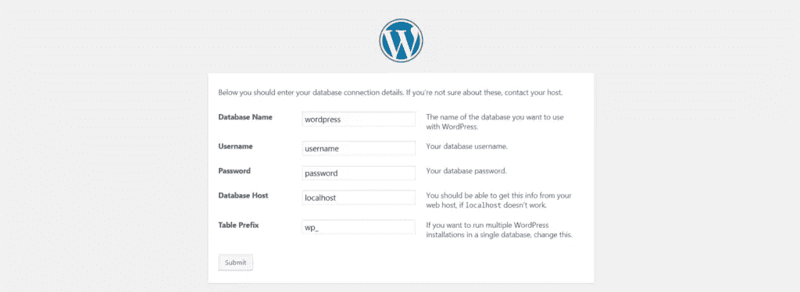
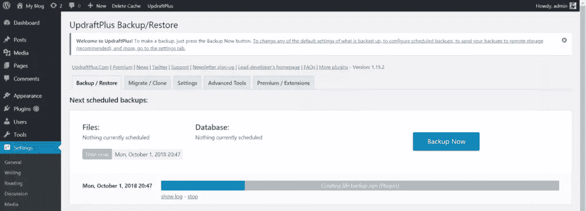
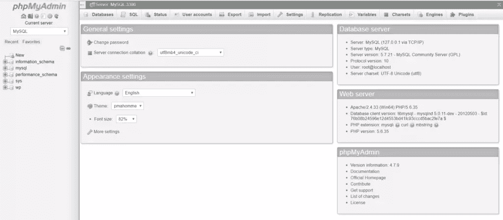
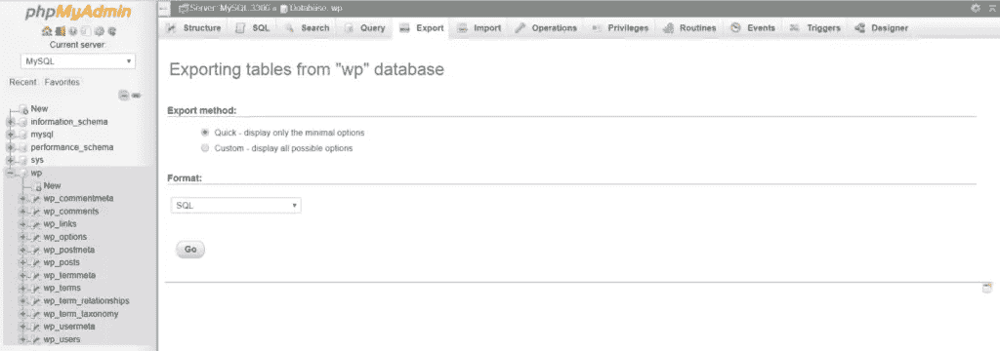

# 在 WordPress 中备份和恢复数据库的 3 种方法

> 原文：<https://www.sitepoint.com/back-up-restore-wordpress-databases/>

WordPress 直到今天仍然有意义，甚至在它第一次发布的 15 年后。这往往是一个人开始新博客时想到的第一个选择。

虽然 WordPress 的初衷是作为一个内容管理系统，但是除了博客之外，它还被应用于很多领域，比如音乐和电子商务。截至 2018 年，WordPress 网站在排名前 100 的网站中占 [14.7%。](https://www.whoishostingthis.com/compare/wordpress/stats/#top-100-websites)

如果你管理一个 WordPress 站点，WP Admin 应该足够了。然而，为了保护自己免受类似于[损坏的数据库](https://wordpress.org/support/topic/sql-table-structure/)或黑客攻击的情况，你应该保留备份。作为一个标准指南，你可以浏览 WordPress Codex 的[备份数据库](https://codex.wordpress.org/Backing_Up_Your_Database)页面中的建议，这将帮助你创建数据库的备份。

WordPress 只支持 MySQL 和 MariaDB 作为数据库，尽管[也不是不可能同步其他数据库，比如 PostgreSQL](https://codex.wordpress.org/Using_Alternative_Databases) 。这篇文章将假设你使用默认的 WordPress 数据库选项——MySQL——尽管 MariaDB 的步骤非常相似。我们将首先介绍 WordPress 数据库的基础知识，然后继续讨论备份和恢复操作。

## WordPress 数据库基础

当你第一次安装 WordPress 时，WordPress 数据库会提供给你。大多数网站管理员再也不会碰到数据库了——因为 WordPress 上每一个与管理相关的操作都是通过 GUI 来完成的。

WordPress database defined during installation

如果你仔细观察，你会发现你提供了 MySQL 服务器的主机 WordPress，它的用户名和密码来创建所需的表。注意，还提供了一个前缀，这意味着所有与 WordPress 相关的表都将以前缀开头(以防您想要创建备份)。

WordPress 使用数据库广泛存储以下数据:

*   您网站的设置
*   在您的网站上注册的用户的详细信息
*   已发布帖子和草稿的详细信息
*   标记与您的帖子相关的信息
*   对你的帖子的评论(假设你使用 WordPress 的评论系统，而不是像 Disqus 这样的第三方评论管理器)。

*注意:如果你有兴趣了解 WordPress 数据库中各种表格的细节及其功能，你可以参考 SitePoint 上的[本指南。](https://www.sitepoint.com/the-wordpress-database-demystified/)*

不用说，保留 WordPress 目录的备份不足以保证安全。数据库也需要定期备份。

## #1 WordPress 插件: [Udraft Plus](https://wordpress.org/plugins/updraftplus/)

Udraft Plus 是一个插件，可以让你备份和恢复你的整个网站，包括你的数据库。安装并激活插件后，会要求您创建一个备份。创建备份后，您可以从过去的任何备份点进行恢复。

Udraft Plus creating a backup

在免费层，您可以创建远程位置的备份(Dropbox、Drive 或亚马逊 S3)，因为在服务器内备份会使其容易受到服务器故障和攻击的影响。高级版附带了高级选项，如站点克隆和迁移、计划备份和报告。

## #2 phpMyAdmin

下一种通过 GUI 管理数据库转储而不使用任何代码的方法是通过 [phpMyAdmin](https://www.phpmyadmin.net/) 。

如果您的服务器管理是通过像 WAMP 或 cPanel 这样的软件工具，PhpMyAdmin 是预装的。如果您的服务器运行在基于 Linux 的操作系统上，phpMyAdmin 甚至会预装！在其他情况下，您可以[通过下载 phpMyAdmin](https://docs.phpmyadmin.net/en/latest/setup.html) 的源代码并进行配置来安装它。安装页面有检查 phpMyAdmin 可能预安装在哪个目录中的说明。

当您成功登录 phpMyAdmin 后，数据库列表会显示在左栏中。

phpMyAdmin dashboard

接下来，选择要备份的数据库。在这个例子中，WordPress 数据库被命名为`wp`。选择数据库后，选择“导出”选项卡。

Export options of phpMyAdmin

默认情况下，数据库中的所有表都以`SQL`查询的形式导出。您可以根据需要从下拉列表中选择不同的导出选项，也可以选择特定的表进行导出。但是，如果您导出的主要原因是为了备份，请确保您仅从这些格式中选择:`SQL`、`CSV`或`XML`。phpMyAdmin 还支持其他三种格式，但是如果您想通过其他工具进行传输，您应该坚持使用这三种格式。您可以通过转到 import 选项卡并上传转储文件来导入数据库。

在这一点上，必须提到的是，默认情况下，文件大小限制设置为 2MB。您必须[在您的`php.ini`文件](https://stackoverflow.com/questions/3958615/import-file-size-limit-in-phpmyadmin)中修改它，并重启服务器来处理更大的数据库转储。

对于非常大的数据库(比如几千兆字节)，通过浏览器下载数据库转储并在以后上传可能会变得很困难。如果您面临这样的问题，您可以尝试下一个选项。

## MySQL 命令行转储

在 MySQL 中，可以使用`mysqldump`命令下载数据库的转储:

```
mysqldump -u [username] -p[password] [db_name] > backup.sql 
```

在这段代码中:

*   用户名是 MySQL 用户名
*   密码是 MySQL 的密码
*   `db_name`是否要备份数据库
*   `backup.sql`是存储备份的文件的名称。

`backup.sql`存储在运行命令的同一目录中。注意语法中的`[username]`前有一个空格，但`[password]`前没有。

如果您的用户名是`root`，密码是`test`，并且要备份的数据库是`wp`，则该命令会转换为以下内容:

```
mysqldump -u root -ptest wp > backup.sql 
```

如果您只想下载特定的表，则需要在数据库后提供表名:

```
mysqldump -u root -ptest wp wp_posts wp_postmeta > backup.sql 
```

要恢复数据库，您可以在命令中用一个`<`替换`>`:

```
mysqldump -u [username] -p[password] [db_name] < backup.sql 
```

没有修改只恢复特定的表，因为该命令恢复备份中存在的任何内容。

## 最后的想法

在这篇文章中，我们看了 WordPress 数据库的基本功能以及备份数据库的重要性。此外，我们探索了三种方法——通过帮助您备份的插件、通过 phpMyAdmin 和通过命令行。

## 分享这篇文章