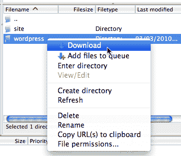
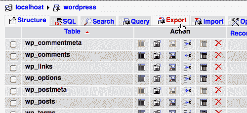
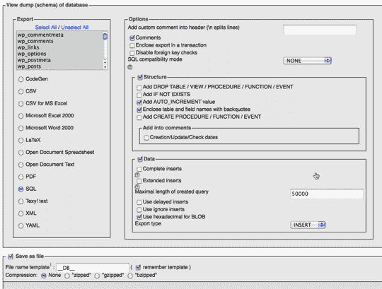
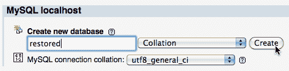
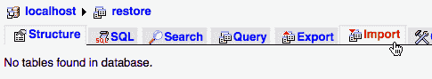
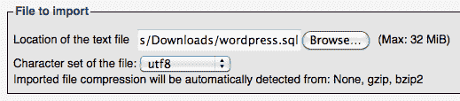
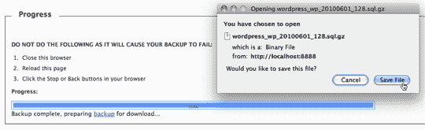
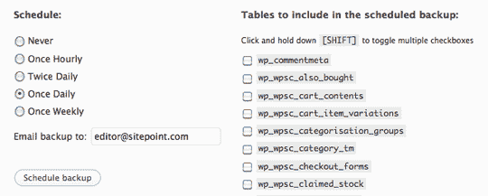
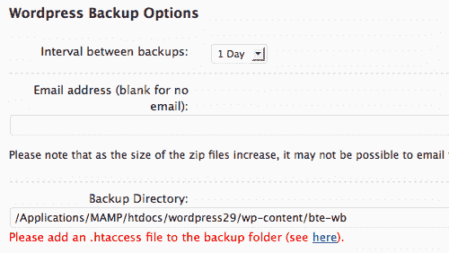

# 保护你的博客安全:备份你的 WordPress 安装

> 原文：<https://www.sitepoint.com/backup-your-wordpress-site/>

随着你的 WordPress 站点的增长，越来越多的数据被积累并存储在服务器上。您累积配置设置、主题和插件。用户上传文件；当然，随着帖子、页面和评论的增加，你的数据库也在发展。

无论你多么信任你的托管公司，灾难都会发生在每个人身上。你也可能决定改变主机，在这种情况下，你需要迁移你的 WordPress 安装。不管是哪种情况，你都应该有一个 WordPress 数据库和文件的完整备份，这样你就可以很容易地恢复，而不会丢失任何重要的数据。

为了做一个 WordPress 站点的完整备份，你需要备份 WordPress 安装的文件和它的数据库。虽然这很容易手动完成，但是有几个很棒的插件可以让这个任务变得更简单。

## 手动操作

首先，我将向您展示如何手动备份您的站点，这样您就可以更好地了解到底备份了什么，以及恢复站点需要做些什么。

### 备份文件

要手动备份你的 WordPress 文件，你需要一个 FTP 客户端(FileZilla 是一个很好的免费软件，可以在任何平台上运行。)连接到你主机的 FTP，找到你的 WordPress 安装目录。如果你自己安装了 WordPress，这应该很简单，否则你可能需要找到安装的位置。通常在一个叫`wordpress`的文件夹里。

只需将整个目录下载到您的计算机，并保存在一个安全的地方。

**图一。下载 WordPress 目录**



### 备份数据库

那是容易的部分。现在是稍微不太容易的部分。许多主机提供商让你通过 phpMyAdmin 访问你的数据库。如果您使用不同的数据库管理工具，说明可能会稍有不同，但功能应该是相同的。

登录 phpMyAdmin 并浏览你的 WordPress 数据库。在那里，点击导出选项卡来导出您的数据库。

**图二。导出选项卡**



点击导出后，会在[图 3 中显示如下导出画面，“导出为 SQL，保存为文件”](#fig_export_sql "Figure 3. Export as SQL, and save as a file")。在左边你会看到 WordPress 数据库中所有表格的列表。选择 SQL 作为导出格式，勾选另存为文件选项。最后，点击 Go 导出你的数据库。完成后，您将下载一个文件，其中包含重新创建数据库所需的所有 SQL 语句。如果您在文件名模板字段中保留默认值，文件名将为`yourdatabasename.sql`，其中`yourdatabasename`是您的数据库名称。

**图 3。导出为 SQL，并另存为文件**



### 恢复您的网站

要恢复你的 WordPress 安装，你需要做的就是把你下载的`wordpress`目录放回服务器上，并从你制作的`yourdatabasename.sql`备份文件中恢复你的数据库。

要恢复你的 WordPress 文件，你需要再次使用可信的 FTP 客户端。把它们放回你发现它们的地方。

在恢复所有数据之前，您必须创建一个新的数据库。如何做到这一点取决于你的主机提供商。一些主机允许你使用 phpMyAdmin 创建一个数据库，而另一些则要求你使用位于你的主机控制面板中的特殊表单。如果你发现如何创建一个新的数据库有困难，问问你的主机；他们应该能给你指出正确的方向。[图 4，“创建新数据库”](#fig_new_myadmin "Figure 4. Create a new database")显示了 phpMyAdmin 中的新数据库表单。

**图 4。创建一个新的数据库**



在您创建了一个新的数据库之后，您应该能够导航到它并点击导入链接，如图[图 5 所示，“点击导入链接”](#fig_import "Figure 5. Click the Import link")。

**图 5。点击导入链接**



phpMyAdmin 将提示您选择您的`yourdatabasename.sql`文件。

**图 6。导入你的`.sql`文件**



选择文件后，点击 Go ，你的 WordPress 数据库将被恢复。

## 使用插件

如果你想避免手动备份你的网站，这里有几个插件可以自动完成这项任务。

### WP-DB-Backup 插件

WP-DB-Backup 是一个备份你的 WordPress 站点数据库的插件。你必须下载这个插件并从你的 WordPress 管理面板激活它。一旦这个插件被激活，你会看到一个备份链接被添加到工具菜单下，如图[图 7，“新备份链接”](#fig_new_link "Figure 7. New Backup link")。

**图 7。新备份链接**


当你点击备份链接时，你的 WordPress 数据库表的列表就会显示出来，如图[图 8，“你所有表的列表”](#fig_table_list "Figure 8. A list of all your tables")所示。有一个总是会被备份的数据库表的列表；这些对于 WordPress 的正常运行是必不可少的。您还会看到可以选择备份的表的列表；通常这些是你安装插件时创建的表，你也应该备份这些表。

**图 8。您所有牌桌的列表**


该插件还为您提供了处理生成的备份文件的不同选项，如您在[图 9“备份选项”](#fig_options "Figure 9. Backup options")中所见。您可以选择以下选项之一:

*   保存到服务器:数据库备份文件存储在网站所在服务器的文件夹中。

*   下载到您的电脑:您可以将文件下载并保存到您的本地电脑。

*   邮件备份到:文件将通过邮件发送到指定的邮箱。

**图 9。备份选项**


点击立即备份！它将生成您的数据库的备份 SQL 文件。这可能需要一点时间，取决于数据库的大小。如果您选择了下载到您的电脑，系统会提示您保存文件，如图[图 10，“下载备份文件”](#fig_download "Figure 10. Downloading the backup file")。

**图 10。下载备份文件**



该插件还提供了定期安排备份的选项——每小时、每天或每周——并将备份文件通过电子邮件发送到指定的电子邮件地址，如图[图 11“安排定期备份”](#fig_schedule "Figure 11. Scheduling a regular backup")所示。

**图 11。安排定期备份**



安排自动备份是明智的做法。如果您站点上的内容(帖子或评论)被频繁添加，并且您没有进行定期备份，您可能会面临不得不恢复旧版本站点的困境—所有最新的内容都将永远丢失。

### WordPress 备份插件

[WordPress Backup](http://wordpress.org/extend/plugins/wordpress-backup/) 是一个插件，备份你的 WordPress 安装的 *文件* 。

WordPress Backup 会将你的上传目录(图片、视频和其他文件)、当前主题目录和插件目录备份到一个存储在你服务器上的`.zip`文件中。你甚至可以通过电子邮件将`.zip`文件发送到指定的电子邮件地址，尽管随着`.zip`文件的增大，这可能不可行。

要访问配置选项，在 WordPress admin 中访问你的插件管理页面，点击配置选项在这里链接，如图[图 12 所示，“配置选项在这里”](#fig_config_here "Figure 12. Configuration options are here")。

**图 12。配置选项在这里**


在选项表单上，如图[图 13，“WordPress 备份选项表单”](#fig_wp_options "Figure 13. WordPress Backup Options form")所示，您可以指定备份间隔、发送备份文件的电子邮件地址以及在您的服务器上存储所有备份文件的目录。从上面的下拉列表中可以看出，您可以选择想要进行备份的时间间隔。您可以指定存储备份的文件夹。

您的备份间隔应该反映文件上传到您的站点的频率。你需要确保定期下载这些备份文件，以防服务器崩溃导致无法访问。在这种情况下，通过电子邮件发送备份也很有用，尽管您可能会发现它的大小妨碍了通过电子邮件发送。

**图 13。WordPress 备份选项表单**



要正确设置这个插件，还有一个重要的步骤。通过向目录添加包含以下内容的`.htaccess`文件，防止用户浏览您的备份目录:

```
<Files ~ ".*..*">order allow,denydeny from all</Files>
```

这是在选项页上推荐的，正如你在图 13 的[“WordPress 备份选项表”](#fig_wp_options "Figure 13. WordPress Backup Options form")中看到的，也在插件的网站上。

## 结论

一个好的备份策略对于任何繁忙的网站都是必不可少的。如果发生灾难，将您的站点恢复到完美的工作状态(最大限度地减少内容丢失)所需的时间与您对备份的小心程度直接相关。

从用户的角度来看，没有什么比在服务器故障后看着所有的评论从网站上消失更糟糕的了；这很可能会考验他们的忠诚度，更不用说如果你的作者发现他们精心制作的帖子消失了，他们的心智是否健全。在商业环境中，这可能会花费你很多钱，所以定期备份并保存在安全的地方是很重要的。

这只是对备份和 WordPress 的简单介绍；还有其他一些考虑因素，我们在这里没有足够的篇幅来讨论。最重要的是，你应该考虑定期练习修复。如果你不能使用备份来恢复你的站点，那么备份有什么用呢？创建一个虚拟的 WordPress 站点，尝试恢复你最近的备份。

一般来说，在 WordPress 博客上，帖子和评论内容的变化比主题或插件快，所以数据库备份比安装文件备份更快过时。因此，对于高流量网站，应该更频繁地进行数据库备份，可能每小时一次，甚至更频繁。

不管你采取什么策略，都要享受内心的平静，因为你知道一旦灾难降临，你会受到保护。

*人物形象由[伊万·沃什](http://www.flickr.com/photos/ivanwalsh/3657331200/)拍摄。*

## 分享这篇文章