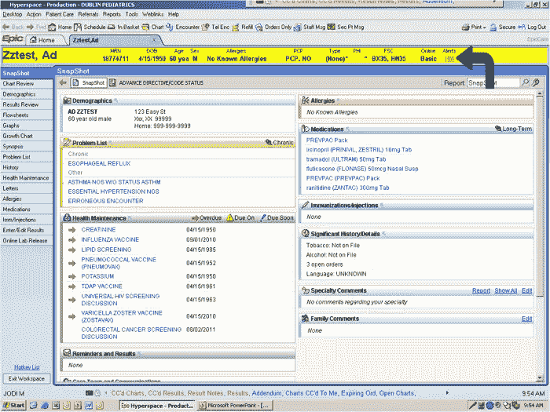
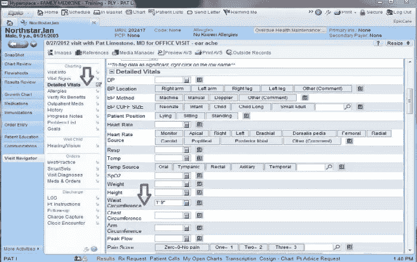

# UX 医疗保健:当 UX 伤害甚至杀戮

> 原文：<https://www.sitepoint.com/bad-ux-healthcare/>

什么*是*用户体验差(UX)？

通常是技术与用户需求不匹配的时候。不幸的事实是，医疗保健是一个经常遭受如此贫穷的 UX 的领域。

UX 医疗保健问题对我们生活的影响比其他任何领域都更深，也更个人化。

专门的医疗保健软件已经成为一个独立的领域，通常保守且发展缓慢。一般来说，当医疗机构购买 EHR ( [电子健康记录](http://en.wikipedia.org/wiki/Electronic_health_record "Electronic health record from Wikipedia"))系统时——这些系统通常以百万计的价格出售——如果该系统很少考虑可用性，他们将在该系统的生命周期内一直受到不良 UX 的困扰。没有简单的出口。

但这是关键问题。在医疗保健行业，可用性差不仅仅是一个令人烦恼的问题，它还会导致严重的医疗错误和创伤性后果。

你上次去医院是什么时候，你注意到他们使用的技术了吗？毫无疑问，每个地区都有所不同，但很有可能技术比你在家里使用的系统更老，功能更差。

每年我们都会看到巨大的技术进步，然而这些进步往往需要很长时间才能渗透到医疗保健系统中。他们好像被卡住了，就这样。

## 当可怜的 UX 受伤时

除了受困于旧技术之外，UX 不佳的系统也会受到伤害。这正是发生在[托伊·瓦伦丁](http://www.adaptivepath.com/ideas/what-a-broken-back-taught-me-about-ux-in-healthcare/)身上的事情，她是一名急诊室医生和护士的女儿，她的父母希望她跟随他们在医学领域的领导，但最终挑战了她的家庭期望，搬到纽约市成为一名室内设计师。

在夏天，托伊曾经在俄勒冈州的滑雪板营地工作。一年夏天，托伊不幸遭遇了一场滑雪板事故，她的脊椎撞到了滑雪板栏杆的边缘，导致她被送往当地医院。

当托伊走进混乱的急诊室时，可怜的 UX 的感觉开始变得清晰起来。Toi 慢慢得出结论，那里的玩家不知道他们的角色是什么，也不知道如何与作为病人的她互动。她最终去了手术室做手术，而不是去放射科做一个基本的 x 光检查。

Toi 意识到这些错误不是人为错误，而是设计缺陷。

例如，正是患者 ID 腕带的糟糕设计导致 Toi 被错误地送到手术室。糟糕的空间设计和规划也造成了治疗延误，因为工作人员要来回跑去取用品。

这个故事让我开始了 UX 设计师的新职业。她认识到，设计更多的是理解用户的需求和行为，而不是让东西看起来漂亮。

显而易见，失败的破碎的 UX 是完全没有必要的。

## 当可怜的 UX 杀人时

Jonathan Shariat 的妻子是一名护理专业的学生，她分享了 Jonathan 对医疗技术的热情。然而，她的老师持有相反的观点，并分享了她的故事。

病人的真实姓名没有被提及，但为了故事的目的，给了名字珍妮。

小女孩珍妮在过去的四年里一直在接受癌症治疗，现已出院。不幸的是，她复发了，需要很强的化疗。

给药后，三名护士使用图表软件，输入所需的数据并下达适当的命令。

那些护士，每个都有超过 10 年的经验，只是忽略了一个非常重要的信息。珍妮应该接受 3 天的静脉注射补水。不幸的是，护士们很难理解和响应软件界面。

珍妮死于中毒和脱水。她已经两次轮班没喝水了。为什么？因为护士无法解读系统传递的信息。

## 例子

那么这些 ui 是什么样的呢？

下面的第一个截图显示了一个类似于 Jonathan 的妻子每天使用的系统。其他两个界面是医院工作人员日常使用的典型界面。

## 最后

我们在日常旅行中都会遇到可怜的 UX，但是，当这影响到我们的健康和福祉时——就像上面的例子一样——这个问题必须得到更认真的对待。

看了上面两个故事，很难没有感觉。我还怀疑，还有许多类似的但不为人知的坏 UX 故事，我们从来没有听说过。

你认为在这个问题上需要采取什么解决方案或步骤？你，或者知道谁因为可怜的 UX 而受苦吗？与我们分享你的故事。

## 分享这篇文章