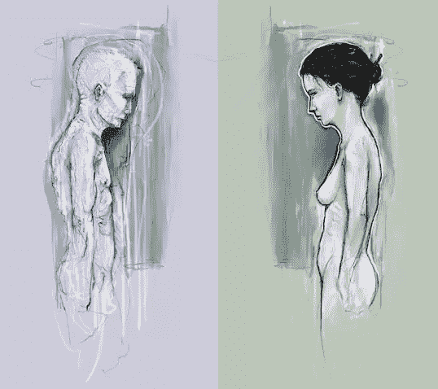
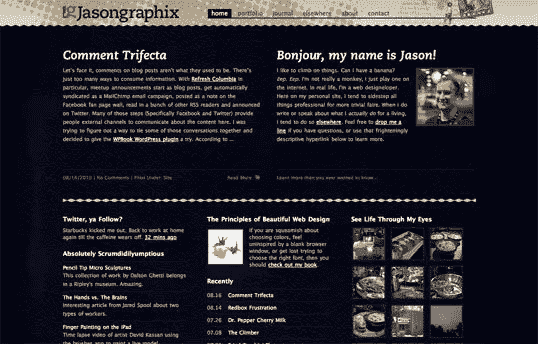
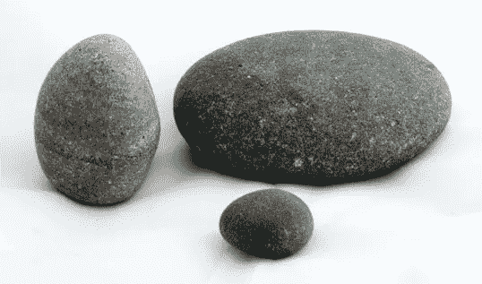
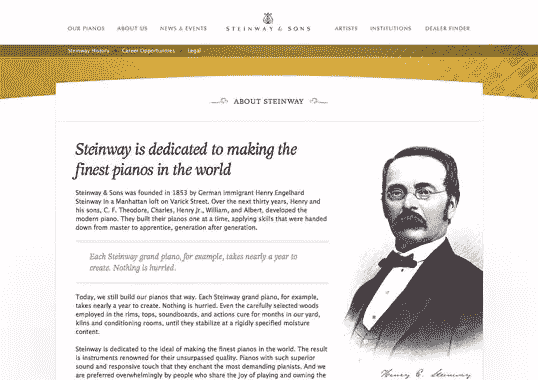

# 设计中的平衡

> 原文：<https://www.sitepoint.com/balance-in-design/>

从比喻意义上来说，*视觉平衡*的概念类似于跷跷板所展示的身体平衡。正如物理对象有重量一样，布局的元素也有重量。如果布局两边的元素重量相等，它们会相互平衡。视觉平衡主要有两种形式:对称和不对称。

## 对称平衡

对称平衡，或称形式上的平衡，发生在构图的元素在轴线的两边都相同的时候。下面展示的大卫·拉纳姆的数字绘画*沉思*，很好地诠释了这个概念。注意男性和女性在位置和比例上是多么的相似。甚至阴影背景框也是彼此的镜像。

虽然这可能并不适用于所有的设计和客户，但这种对称——称为*水平对称*——可以通过将内容居中或在列之间平衡来应用于网站布局。我的个人网站设计的[主页布局就是这种对称的一个例子。请注意下面的屏幕截图，内容区域从页面顶部的两列逐渐变为底部的三列，但布局仍然保持对称平衡:](http://jasongraphix.com/ "Jason Beaird’s homepage")

由于媒介的性质，另外两种对称平衡的形式在网站设计中不太常见。然而，它们通常出现在标志和印刷设计中:

*   *左右对称*，当构图在一个以上的轴上平衡时存在
*   *径向对称*，当元素围绕一个中心点等距分布时出现

## 不对称平衡

不对称平衡，或者非正式的平衡，比对称平衡更抽象一点(一般来说视觉上更有趣)。不对称平衡涉及不同大小、形状、色调或位置的物体，而不是布局两边的镜像。这些对象的排列方式使得，尽管它们有所不同，但它们均衡了页面的重量；例如，如果你在页面的一边放一个大的物体，在另一边放几个小的物体，构图仍然可以感觉平衡。

我的朋友杰里米·达蒂的音乐会海报就是不对称平衡的一个很好的例子。左边大的粉红色火烈鸟的视觉重量被布局右边较小的火烈鸟和文本块的组合重量所平衡。还要注意杰里米对三分法的运用。Pop Sucks 标题后面的蓝色云占据了垂直空间的三分之一，横跨了水平空间的三分之二。

看看下面三块石头的照片。这可能不是一个特别令人兴奋的图片，但只要平衡去，它摇滚！如果你用一张纸盖住下面三块石头中的任何一块，整张照片会感觉不平衡和不完整。这通常是平衡的工作方式。仿佛整个构图都在一个画框里，用一颗钉子挂在墙上。几乎不需要任何一方的重量就能使整个画面失去平衡。

与对称平衡不同，不对称平衡是多用途的，因此，在网页上使用得更多。如果你看一看大多数两栏的网站布局，你会注意到较宽的栏通常颜色较浅——这是一种为文本和主要内容创造良好对比的策略。小型的导航栏通常更暗，有某种边框，或者以另一种方式突出，以在布局中创造平衡。斯坦威&之子网站的[关于我们的页面，如下面的屏幕截图所示，是不对称平衡的一个很好的例子。在这个例子中，没有定义的右栏，只有公司创始人的一个大的斯多葛派图片。那史诗般的小胡子很有分量，但它被主要内容顶部相当大的斜体标题抵消了。](http://www.steinway.com/about/)

在杰西·贝内特·张伯伦对斯坦威父子公司网站的设计中，还有许多其他原则在起作用，它超越了不对称平衡。这个网站非常和谐(没有双关的意思)，这来自于曲线、纹理和一致的字体的重复使用。这种和谐很大程度上可以通过统一的原则来解释。

## 美丽网页设计的原则

这篇文章来自杰森·比厄德的 [*美丽网页设计的原则*一书](https://www.sitepoint.com/premium/library "SitePoint.com: The Principles of Beautiful Web Design, 2nd Edition")(第二版现已出版)。这是第一章的第五部分。

如果你更喜欢色彩，请务必在设计节上查看现有的[色彩章节的数字化版本。](https://www.sitepoint.com/design-ux/color/ "DesignFestival.com: Everything on Color")

## 分享这篇文章