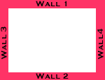

# Flash 脚本–球和墙碰撞效果

> 原文：<https://www.sitepoint.com/ball-wall-collision-effect/>

 **<object type="application/x-shockwave-flash" data="https://i2.sitepoint.com/flash/circlecoll.swf" width="400" height="400" bgcolor="black"><param name="movie" value="https://i2.sitepoint.com/flash/circlecoll.swf"></object>**

在本教程中，我将向你展示如何创建一个球和墙碰撞的效果。

我会用 Flash 中简单的`hittest()`函数来达到这个效果。[在这里下载样本文件](https://www.sitepoint.com/examples/flashscript/circlecoll.zip)。让我们开始工作。

**1。**打开一部宽度=550、高度=400 的新电影。

**2。**首先，我们将创建外墙。创建一个像这样的小矩形对象:


**3。**将 rectangle 对象转换为 movieclip，命名为“wall”。

**4。**现在，拖动墙对象的四个实例，排列如下。



**5。**给每面墙一个实例名。我使用了实例名 border1、border2、border3 和 border4。

**6。**现在让我们创建球。创建一个小圆对象。

**7。**将其转换为 movieclip，并给它一个实例名。我称之为“圆”。

**8。**现在我们来给动作脚本。创建如下所示的三个关键帧。


**9。**在第一个关键帧中，插入动作:

```
 flag = 0; 

  //x coordinate =0 

  x= 190; 

   //y cordinate =0 

  y=190; 

  //random = 0 

  rand = 0;
```

10。初始化第一个关键帧的变量。

**11。**在第二个关键帧中，插入这些动作:

```
 //set the x and y property of the circle movieclip 

  setProperty ("/circle", _x, x); 

  setProperty ("/circle", _y, y); 

  // creates a random number with this function 

  function random_fun() 

  { 

  r = random(10); 

  return r; 

  } 

  // check if circle has hit border4 if hit change x and y values 

  if (circle.hittest(border4)) 

  { 

  tellTarget ("/circle") {gotoAndPlay(2)} 

  flag = 1; 

  rand = random_fun() 

  } 

  // check if circle has hit border3 if hit change x and y values 

  if (circle.hittest(border3)) 

  { 

  tellTarget ("/circle") {gotoAndPlay(2)} 

  flag = 2; 

  rand = random_fun() 

  } 

  // check if circle has hit border2 if hit change x and y values 

  if (circle.hittest(border2)) 

  { 

  tellTarget ("/circle") {gotoAndPlay(2)} 

  flag = 3; 

  rand = random_fun() 

  } 

  // check if circle has hit border1 if hit change  

x and y values 

  if (circle.hittest(border1)) 

  { 

  tellTarget ("/circle") {gotoAndPlay(2)} 

  flag = 4; 

  rand = random_fun() 

  } 

  // set the x and y co-ordinates according the the  

place where the circle hit 

  if (flag ==0) { 

  x = x+rand; 

  y = y+5; 

  } 

  if (flag == 1) { 

  x = x+5; 

  y = y-rand; 

  } 

  if (flag == 2) { 

  x = x-5; 

  y = y-rand; 

  } 

  if (flag == 3) { 

  x = x-rand; 

  y = y+5; 

  } 

  if (flag == 4) { 

  x = x + 5; 

  y = y - rand; 

  } 

  // end action script
```

**12。**在第三个关键帧插入动作:

```
 gotoAndPlay (2);
```

就是这样！电影现在应该工作了！

这部电影没有看起来那么复杂。实际上，与网上找到的其他方法相比，这非常容易。这部电影有很多可能性。让你的想象驰骋吧！

## 分享这篇文章