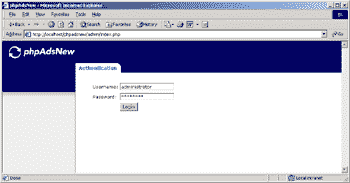
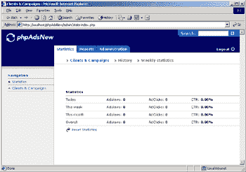
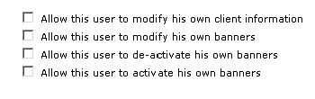
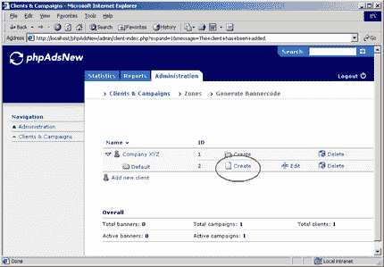
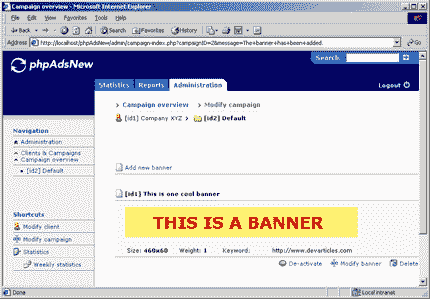
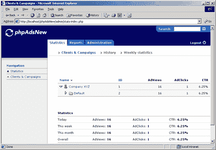
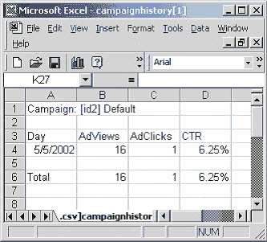

# 审查 phpAdsNew 新横幅管理系统

> 原文：<https://www.sitepoint.com/banner-management-system/>

像 SourceForge 这样的开源软件仓库的一个伟大之处在于，它们提供了访问由来自世界各地的天才开发人员制作的大量高质量软件的途径。

SourceForge 是为开源驱动的网站寻找高质量免费 Web 应用和脚本的 Web 开发人员的梦想成真。SourceForge 上最受欢迎的应用之一叫做 phpAdsNew。phpAdsNew 是一个 PHP/MySQL 驱动的 Web 应用程序，允许任何人将广告集成到他们的网站中。

phpAdsNew 是互联网上最受欢迎的开源广告项目之一。我在自己的网站上使用它，老实说，这是我用过的最好的广告管理系统。在本文中，我将带您参观 phpAdsNew。如果你经营自己的网站，每天吸引几千个访问者，那么你可能会考虑使用 phpAdsNew 来为你所有的辛勤工作创造一些收入。

##### phpAdsNew 是什么？

在我看来，它是互联网上最好的广告管理系统。然而我有点偏见，因为我喜欢开源软件。这是“官方”的描述，正如在 SourceForge 页面上看到的:

<q>*“phpAdsNew 是一个用 PHP 编写的横幅管理和跟踪系统。目前，它可以管理每个广告客户的多个横幅(任何大小)，查看每日、整体和汇总统计数据，并通过电子邮件将统计数据发送给广告客户。”*</q>

我认为这个描述已经说明了一切。在撰写本文时，phpAdsNew 是:

*   在成熟发展阶段，
*   独立于操作系统，并且
*   在 SourceForge 上有 99.8656%的活跃度

这意味着它是 SourceForge 最受欢迎的下载之一……而且有充分的理由！phpAdsNew 由来自世界各地的 9 名开发人员组成的团队维护。

phpAdsNew 的当前版本是版本 2 beta 6.1，你可以[在这里](http://sourceforge.net/project/showfiles.php?group_id=11386)下载。获取 tar (262k)或 zip (378k)版本，并将其解压缩到 Web 服务器上的文件夹中。默认情况下，该文件夹的名称类似于 phpAdsNew_2.61，但将其重命名为 phpAdsNew。

接下来，我们需要配置数据库的细节。打开 phpAdsNew 目录中的 config.inc.php 文件，在文件的顶部查找以下行:

```
/*********************************************************/  

/* Database configuration */  

/*********************************************************/  

// MySQL hostname  

$phpAds_hostname = "localhost";  

// MySQL username  

$phpAds_mysqluser = "mysqlusername";  

// MySQL password  

$phpAds_mysqlpassword = "mysqlpassword";  

// The database phpAdsNew lives in  

$phpAds_db = "phpads"; 
```

您必须更改上面显示的变量，以匹配安装了 MySQL 的 Web 服务器的细节，这样 phpAdsNew 才能工作。要使`$phpAds_db`变量起作用，MySQL 服务器上必须存在一个同名的数据库，因此启动 MySQL 控制台应用程序并输入以下内容:

```
create database phpads;  

exit; 
```

接下来，找到 config.inc.php 中的管理员配置部分，并更改`$phpAds_admin`的值，这是我们稍后将用来登录 phpAdsNew 的用户名。您还应该将`$phpAds_admin_pw`更改为合适的密码。

最后，修改 phpAdsNew 配置部分下的变量。保存 config.inc.php 并在 Web 浏览器中访问 http://yourserver/phpadsnew。显然，您需要将上面地址中的“yourserver”替换为安装 phpAdsNew 的服务器的名称或 IP 地址。

既然我们已经创建了 phpAdsNew 数据库，我们需要为它导入表结构，可以在 phpAdsNew 主目录的 all.sql 中找到它。跳到您的 MySQL 服务器上，导入 all.sql 的内容，如下所示:

```
mysql -uadmin -ppassword phpads < c:phpadsnewall.sql 
```

我已经在运行 Apache 的 Windows 2000 服务器上安装了 phpAdsNew，所以很明显，如果您运行的是 Linux，那么您需要将路径更改为 all.sql。如果出现任何错误，请仔细检查您的登录凭证、数据库名称以及您告诉 MySQL 在哪里找到 all.sql。

现在，在浏览器中加载 phpAdsNew。我在我的 Web 服务器上本地安装了它，所以我加载了 http://localhost/phpadsnew。它看起来是这样的:



输入您在 config.inc.php 文件中指定的用户名和密码，然后单击登录按钮。phpAdsNew stats 屏幕将加载:



##### 使用 phpAdsNew

phpAdsNew 有区域、客户端和横幅。首先，我们要添加一个客户端，因此单击“管理”选项卡，然后单击“添加新客户端”链接。当页面加载时，完成客户端的详细信息。在您点击保存更改按钮之前，您应该仔细考虑是否允许该客户登录到您的 phpAdsNew 系统并修改他或她的活动。

如果您想让您的客户随时灵活地更改他们的横幅，那么您应该为他们输入用户名和密码，并为他们选择相应的复选框，如下所示:



完成后，单击保存更改按钮。phpAdsNew 将允许您为该客户端创建一个新的活动。phpAdsNew 最棒的一点是，你可以设置这个客户广告的浏览量，你可以设置广告的激活和到期日期，或者你可以让广告运行多久就运行多久。

权重字段是广告显示的频率。默认值为 1，但是如果您希望广告在循环中比其他广告出现得更频繁，您可以将其设置为更高的值。

为此客户的活动设置选项，然后单击保存更改。phpAdsNew 将创建新的活动，并将您重定向回区域页面。要为该客户创建横幅，请单击其活动下的创建链接:



加载“添加新横幅”页面后，我们可以创建四种类型的横幅:

***横幅存储在 SQL***

该选项允许您将图像直接上传到 phpAdsNew MySQL 数据库中。它被存储为一个 blob，你不必担心在你的服务器上存储图像文件。

***存储在网页服务器上的横幅***

如果您想将横幅图像存储在您的 Web 服务器上，请选择此选项。

***通栏引用到网址***

此选项允许您引用在线提供的横幅(如 http://…)。如果你把横幅广告作为广告网络的一部分，那么这就是你所追求的选择。

***HTML 横幅***

HTML 横幅广告非常适合富媒体广告，如 flash 电影，甚至纯文本广告，这些广告通常具有很高的点击率(CTR)。

对于本文，我们将创建一个存储在 SQL 中的横幅，因此选择该选项并从您的硬盘中选择/创建一个横幅。我创建了一个简单的 468×60 的横幅。一旦你点击了提交广告按钮，phpAdsNew 将向你展示你的横幅广告将会是什么样子。这是我的样子:



现在我们的横幅已经创建好了，是时候告诉 phpAdsNew 为它生成横幅代码了，我们可以将它包含在我们的 Web 页面中以显示横幅。单击“管理”选项卡，然后单击该选项卡下的“生成横幅代码”链接。还是那句话，有几个选项可以选择。横幅的调用方式有以下五种:

*   **远程调用**:将生成一个图像标签，指向 phpAdsNew 的 adview.php 脚本的位置，传入我们想要显示其横幅的客户端的 ID。
*   **用 JavaScript 进行远程调用**:生成一个引用 adjs.php 的<脚本>标签，该标签使用 JavaScript 的 document.write 函数来显示横幅。
*   iframe 的远程调用:生成一个引用 adframe.php 的 iframe >标签<。Adframe.php 返回图像，因此它显示在 iFrame 内部。
*   **组合远程调用**:使用一个< iframe >标签和< script >标签的组合，在一个 iframe 内部生成一个从 JavaScript 调用的横幅。
*   **本地模式**:包含 phpadsnew.inc.php 并调用脚本视图函数 PHP 代码。这是默认模式，但是如果你在网站的其他地方使用 MySQL 来显示数据，那么我建议你不要使用这个选项。

选择横幅显示选项后，您需要从 ClientID 下拉列表中选择要显示的横幅。如果您希望横幅链接的 URL 在新窗口中打开，请在目标字段中输入类似于`_blank`的内容。在这个例子中，我使用的是远程调用，所以下面是我单击 generate 按钮时 phpAdsNew 生成的代码:

```
<a href='http://localhost/phpAdsNew/adclick.php' target='_blank'></a> 
```

显然，在这一点上，只是简单地将生成的代码复制并粘贴到您的 Web 页面中，然后保存它。

在这一点上，我们还没有真正探索 phpAdsNew 的功能，所以现在让我们看看它强大的报告和横幅旋转特性。

##### 统计数字

我非常喜欢 phpAdsNew 的一点是它强大的统计和绘图功能。只需点击 phpAdsNew 中的 statistics 选项卡，您就可以看到您当前开展的每项活动的详细统计数据:



对于每个活动，phpAdsNew 都会显示其 ID、广告浏览量、广告点击数和点击率(CTR)。每个活动的详细信息下面是一组所有横幅的整体统计数据，包括今天、本周和本月显示的横幅数量，以及每个时期的点击量和点击率。

在统计页面上，还有两个历史和每周统计的链接。如果你点击历史链接，你将会看到一个列表，显示这些天的广告浏览量、点击量和点击率。“每周统计”链接显示了许多相同的内容，但是以每周的格式显示。

有时离线使用我们的横幅统计数据很方便，如果您单击 reports 选项卡，就会看到 phpAdsNew 支持这一功能。只需选择您想要的活动，phpAdsNew 将生成一个名为 campaignhistory.csv 的文件，它是一组用逗号分隔的值。通过选择打开这个 CSV 文件，我的 Windows 2000 server 启动了 Excel，它看起来像这样:



当然，我只添加了一个活动来演示 phpAdsNew 如何工作，但如果您有几十个活动，那么 Excel 的图表向导将允许您从 phpAdsNew 活动数据中创建专业的图表，这些图表可以在您的媒体工具包中使用，以帮助说服潜在的广告商在您的网站上做广告。

##### 横幅旋转

为你的网站创造更多收入的最好方法之一就是设置横幅轮换。与普通横幅相比，一个广告空间中包含几个(通常 5-20 个)横幅；为每个页面视图显示从集合中随机选择的广告。每个广告客户都有一定数量的印象，当你试图向一个特定的受众群做类似的产品/服务广告时，轮换是非常好的。

要使用 phpAdsNew 设置横幅轮换，只需创建至少两个横幅，然后单击 administration-> generate banner code 链接。“内容”字段允许您指定循环的标准。例如，如果您想设置所有 468×60 横幅的旋转，那么您可以在文本框中输入 468×60。

您也可以根据名称轮流显示横幅。例如，如果您创建了两个名称中都包含单词“test”的横幅，那么您可以将“test”指定为“what”字段的值。然后，所有名称中带有“测试”字样的横幅将轮流显示。

“什么”字段也可以接受一些相当复杂的语句，允许您准确指定哪些横幅应该包含在循环中。如果您希望通过标识匹配横幅，可以使用以下语句:

```
bannerId:40 
```

在某些情况下，只显示 HTML 横幅，或者只显示基于 SQL 的横幅等也很方便。我们可以通过在 what 字段中指定格式语句来实现这一点，如下所示:

```
format:html 
```

如前所述，您可以在宽度 x 高度的旋转中指定横幅的宽度，如下所示:

```
468x60 
```

您也可以指定横幅的宽度，如下所示:

```
Width:468 
```

“是什么”字段还有许多其他高级值，包括基于逻辑运算符的匹配、全局关键字等等。如果您对这些高级值感兴趣，那么请查阅 phpAdsNew 文档，第 3.2 章。

##### 结论

在本文中，我们看到了如何设置和使用 phpAdsNew，这是一个伟大的、免费的、开源的广告管理系统。如果你有自己的网站，那么你应该考虑使用 phpAdsNew 给你的网站添加一些广告，作为一种为你的辛勤工作赚取额外收入的方式。

我认为 phpAdsNew 如此受欢迎的原因是因为它总是在更新和调试，就像 SourceForge 上的所有其他 Web 应用程序一样。我自己现在和将来都会使用 phpAdsNew，因为我个人认为没有其他广告系统像它一样。

## 分享这篇文章