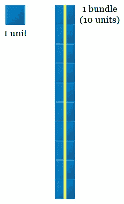
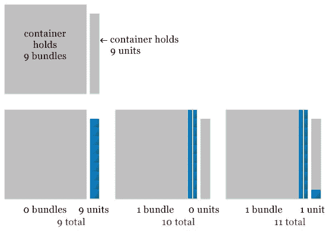
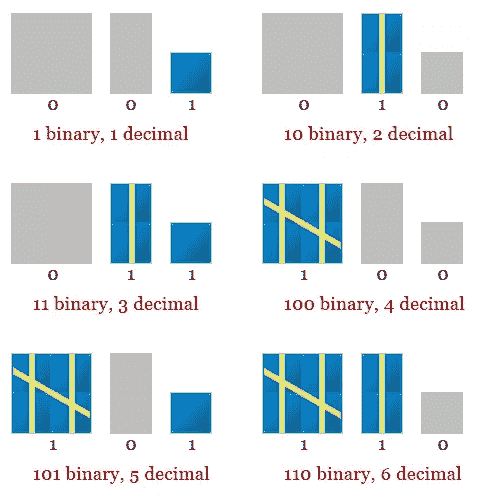
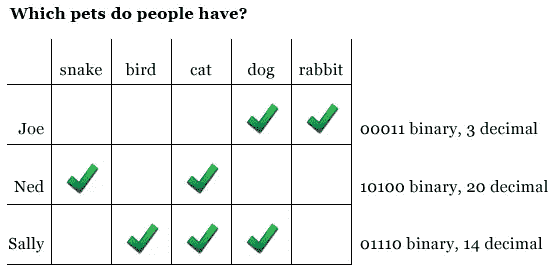
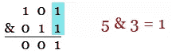
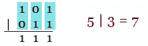
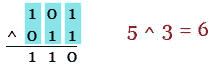
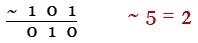

# 基数转换和二元运算符

> 原文：<https://www.sitepoint.com/base-converting-and-binary-operators/>

本文讨论了 PHP 的二进制运算符以及如何在不同的计数系统之间进行转换。大多数编程书籍和文章都只用一两页来介绍这些主题，尽管使用操作符非常简单，但是要正确使用它们，还需要大量的背景知识。

我将首先为您提供必要的数论背景，而不是像其他参考文献一样给出同样的基本内容。有了这些知识，你将能够理解二进制计数系统和基本转换…熟悉二进制数字是成功使用二进制运算符的关键！所以不要再拖延了，让我们开始吧！

## 数论

我们都熟悉的计数系统可以被认为是一系列的包装和容器。每个包裹价值一个单位，与其他包裹捆绑在一起，放在适当的容器中。每个集装箱只能容纳一定数量的单元，并且这些单元必须包装到适合该集装箱的包装中。

在我们以 10 为基数的计数系统中，单位以 10 的倍数绑定在一起。这意味着我们最多可以有 9 个单元，但是一旦添加了第 10 个单元，它们就必须打包在一起，形成一个单独的捆绑包。



这里没有惊喜，但神奇之处在于容器。让我们把一系列的桶并排放在一起，并限制自己只装最右边的容器。一旦一个桶满了，它的单元就被捆起来，并移动到邻近的集装箱。也就是说，最右边的容器只能容纳九个单个单元。第 10 个单元将与前 9 个单元捆绑在一起，整个捆绑被移动到其左侧的容器中。



每个集装箱只能装 9 个无论大小的包裹。在捆绑之前，最右边的容器只能容纳九个单元。它左边的容器只能装 9 捆。第 10 捆被重新捆在一起，并被移动到相邻的集装箱。随着容器不断被填满，循环不断重复；左边的容器总是能装 9 捆右边容器能装的东西。

我们最熟悉的十进制计数系统叫做十进制，但也存在其他计数系统。关键是每个容器的极限都比底座少一个。例如，在八进制计数系统(以 8 为基数)中，每个容器的极限是 7。在十六进制(16 进制)中，每个容器容纳 15 个单位。在十六进制中，字母 A 到 F 通常用来表示数量 10 到 15。

在二进制(二进制)中，每个容器限于一个单位或一个包。



由于每个容器被限制为一个单元或包，所以组成二进制数的值只能是 1 或 0。它要么是满的(值为 1)，要么是空的(值为零)。当写出容器值的字符串时，它可以类似于列表上的一系列复选标记:1 可以被认为是复选标记，0 是没有复选标记。



## 转换函数

根据值的大小，如果手动将值从一个基数转换到另一个基数会很繁琐。为了让生活更简单，PHP 有几个内置函数，可以用来将数字从一个基数转换到另一个基数:`decbin()`、`bindec()`、`decoct()`、`octdec()`、`dechex()`、`hexdec()`和`base_convert()`。

`decbin()`函数接受十进制格式的数字，并返回一个表示二进制等效值的字符串。对应函数`bindec()`接受一个表示二进制数的字符串，并返回十进制值。

`decoct()`函数接受十进制格式的数字，并返回一个表示其八进制等效值的字符串。它的对应物`octdec()`接受八进制值的字符串表示，并返回十进制数。

`dechex()`接受十进制值并返回十六进制值的字符串表示形式；`hexdec()`接受表示十六进制数的字符串，并返回等效的十进制数。

```
<?php
$num = 21;

echo "Decimal value: $numn";

echo "Binary value: " . decbin($num) . "n";
echo "Octal value: " . decoct($num) . "n";
echo "Hexadecimal value: " . dechex($num) . "n";
```

在上面的代码中，十进制值 21 存储在变量`$num`中。函数`decbin()`、`decoct()`和`dechex()`用于显示二进制、八进制和十六进制的等价物；二进制值是 10101，八进制值是 25，十六进制值是 15。

`base_convert()`函数用于任意基数之间的转换。它接受两个参数，第一个是原始基数，第二个是期望基数。让我们假设一个特定的程序需要转换基数为 7 和基数为 11 的值；没有方便的函数来执行这些任务，所以使用了`base_convert()`。

```
<?php
$num = 21;

echo "Decimal value: $numn";

echo "Base-7 value: " . base_convert($num, 10, 7) . "n";
echo "Base-11 value: " . base_convert($num, 10, 11) . "n";
```

十进制 21 的基数为 7 的值是 30，基数为 11 的值是 1A。

诚然，以 7 为基数和以 11 为基数看起来很奇怪，但它们确实说明了`base_convert()`是如何工作的。也许更实际的是，当没有方便的函数时，您会发现自己在使用`base_convert()`直接在二进制、八进制和十六进制值之间转换。

```
<?php
$octNum = 25;

echo "Octal value: $octNumn";
echo "Binary value: " . base_convert($octNum, 8, 2) . "n";
```

## 按位运算符

回到数论部分，你看到每个二进制容器可以是满的(值为 1)或空的(值为零)。我们称装满一个容器的每个包装为一个“比特”。

### 按位与

按位与运算符是一个与号(`&`)。它接受两个值，并对它们的二进制值进行逻辑与运算。考虑下面的例子:



按位 and 运算采用两个数字的二进制表示形式，并返回一个数字，该数字是基于哪些字段的值都为 1 而构造的。5 & 3 = 1，因为两个二进制表示在最右边的位置只有 1 值。

### 按位“或”

按位或运算符是一个管道(`|`)。它接受两个值，并对它们的二进制值进行逻辑或运算。



按位“或”运算采用两个数字的二进制表示形式，并返回一个数字，该数字是基于至少有一个字段的值为 1 而构造的。5 | 3 = 7，因为两个二进制表示之间的每个位置都有 1 值。

### 按位异或

按位异或运算符是一个插入符号(`^`)。与按位“或”相反，在“或”运算中，只要至少一个位被置位，特定位就返回 1，而在只有一个位被置位时，按位“异或”运算只返回 1。



如果只设置了其中一个位，则逐位异或运算将只返回 1。如果两个位都没有设置，或者两个位都设置了，将返回零。5 ^ 3 = 6.

### 逐位恭维

称赞运算符是一个波浪号(`~`)。它翻转一个值中的位，这样为 1 的位置将变为 0，为 0 的位置将变为 1。



由于补码在一个值的二进制表示中将位的值从 1 切换到 0 以及从 0 切换到 1，所以~5 = 2。

## 用二元运算符进行掩蔽

我们在前面也简要地看到了二进制数如何被用作一种检查表；PHP 的按位操作符可以通过处理每一位来帮助操作和屏蔽这些计数。

```
<?php
// people and values from previous chart
$people = array(
    "Joe" => 3,
    "Ned" => 20,
    "Sally" => 14
);

// mask values if person has certain animal
$mask = array(
    "rabbit" => bindec("00001"),
    "dog" => bindec("00010"),
    "cat" => bindec("00100"),
    "bird" => bindec("01000"),
    "snake" => bindec("10000")
);

foreach ($people as $person => $value) {
    // who has a pet dog?
    if (($value & $mask["dog"]) == $mask["dog"]) {
        echo "$person has a dog.n";
    }
    // who has a snake
    if (($value & $mask["snake"]) == $mask["snake"]) {
        echo "$person has a snake.n";
    }
    // who does NOT have a cat?
    if ((~$value & $mask["cat"] ) == $mask["cat"]) {
        echo "$person does not have a cat.n";
    }
    // who has both a cat and a bird?
    if (($value & $mask["cat"] + $mask["bird"]) == $mask["cat"] + $mask["bird"]) {
        echo "$person has both a cat and a bird.n";
    }
}
```

该示例将前面看到的 pet 调查图表中的数据分配到名为$people 的数组中。然后根据每只动物在测量图中的位置为其分配一个掩码值。使用`bindec()`将产生的二进制字符串转换成十进制数。这些值存储在数组$mask 中。

一个`foreach`循环遍历每个元素 person，并测试我们设置的各种条件。每个条件都使用二元运算符来屏蔽掉我们不想要的值。如果孤立值与掩码值相匹配，则意味着调查结果与我们正在寻找的标准相匹配。重要的是观察操作的顺序，并使用括号来确保操作符处理正确的数据。

## 摘要

这篇文章绝对涵盖了很多材料！我向你展示了计数系统是如何构成的，向你展示了如何在不同的数字系统之间转换，以及如何使用二进制运算符。本文以一个简单的位屏蔽示例总结了所有内容。希望现在您能够轻松地将这些看似棘手的概念成功地融入到您的脚本中！

<small>图片 via[Fotolia](http://us.fotolia.com/?utm_source=sitepoint&utm_medium=website_link&utm=campaign=sitepoint "Royalty Free Stock Photos at Fotolia.com")</small>

## 分享这篇文章