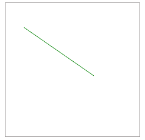
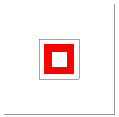
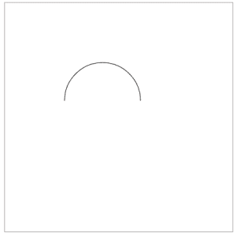
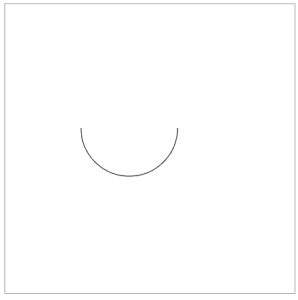
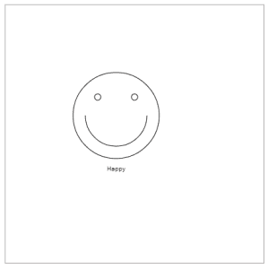

# 使用 JavaScript 的基本画布动画

> 原文：<https://www.sitepoint.com/basic-animation-with-canvas-and-javascript/>

HTML5 中引入的`<canvas>`元素允许开发人员使用 JavaScript 动态创建位图图形。在本教程中，您将了解到一些由`<canvas>`元素支持的基本操作，并使用 JavaScript 创建一个简单的动画。


Canvas 由苹果公司于 2004 年首次推出，用于 Mac OS X 和 Safari。现在已经被各大浏览器采用。Mozilla Firefox、Chrome、Opera、Safari 以及 IE 9 和 10 的当前版本都支持`<canvas>`元素。

# 如何使用画布

下面的代码添加了一个`<canvas>`元素。

```
<canvas id="canvasDemo" height="400" width="300">
Sorry, your browser does not support canvas.
</canvas>
```

使用了`id`属性，以便我们可以从 JavaScript 访问`<canvas>`元素。`height`和`width`属性用于调整画布的大小。如果浏览器不支持画布，你在`<canvas>`标签中写的任何东西都会出现。这可以作为旧浏览器的后备。从 JavaScript 中，我们可以访问如下所示的`<canvas>`元素。

```
var canvas=document.getElementById("canvasDemo");
var context=canvas.getContext("2d");
```

以下示例显示了如何在画布上绘制线条。代码从坐标(30，40)到(145，120)画一条直线，画布的左上角作为坐标(0，0)。应该注意的是，`<canvas>`元素不维护任何 DOM。因此，如果你想改变画布上的任何东西，你可能不得不重新绘制整个画面。

```
var canvas=document.getElementById("canvasDemo");
var context=canvas.getContext("2d");
context.strokeStyle="green";
context.moveTo(30,40);
context.lineTo(145,120);
context.stroke();
```

修改后的画布如下图所示。



# 绘制基本形状

在开始制作动画之前，您需要了解可以在画布上绘制的基本形状。每次我们想要创造东西的时候，我们都需要这些基本的形状。先从以下与矩形相关的操作说起。

*   `fillRect(x,y,width,height);`
*   `clearRect(x,y,width,height);`
*   `strokeRect(x,y,width,height);`

每个函数的前两个参数代表矩形左上角的坐标。接下来的两个参数指定矩形的宽度和高度。考虑下面的 JavaScript 代码片段:

```
var context=document.getElementById("canvasDemo").getContext("2d");
context.strokeStyle="green";
context.fillStyle="red";
context.strokeRect(70,70,80,80);
context.fillRect(80,80,60,60);
context.clearRect(95,95,30,30);
```

它产生以下输出:



如您所见，`fillRect()`方法创建了一个矩形，并用由`context.fillStyle`属性指定的颜色填充它。`clearRect()`从画布中清除一个矩形部分，`strokeRect()`绘制一个矩形轮廓，其颜色由`context.strokeStyle`属性决定。

## 画线

可以使用`lineTo()`功能画线。该方法采用两个表示端点坐标的参数。要画一条线，你需要首先调用`moveTo()`，它代表线的起点。本文中的第一个例子以这种方式画了一条线。

## 画弧线

使用`arc()`功能画出一条弧线，如下所示。

```
arc(x,y,radius,startAngle,endAngle,direction);
```

前两个参数表示中心的坐标。`startAngle`代表圆弧的起始角度。要创建一个圆，将其设置为零。`endAngle`决定圆弧结束的角度。当你画一个圆的时候，你要把它设置为 360 度。对于半圆，它应该是 180 度。请注意，角度应以弧度表示。因此，你应该使用数学。要从度数转换的 PI 常数。最后，`direction`参数表示圆弧应该顺时针画还是逆时针画。

考虑下面的片段:

```
var ctx = document.getElementById('canvasDemo').getContext('2d');
ctx.arc(180,180,70,0,Math.PI,true);
ctx.stroke();
```

它产生以下输出。



然而，如果您想将方向改为顺时针，那么您需要调用`arc()`，并将最后一个参数设置为`false`。这将产生以下输出。



# 绘制路径

通常一条路径由几个形状组成。每个路径在内部由一系列子路径表示，如矩形、直线或弧线。可以使用以下函数绘制路径。

*   `beginPath()`
*   `closePath()`
*   `stroke()`
*   `fill()`

每个路径都维护一个子路径列表。当`beginPath()`被调用时，这个列表被重置，我们可以开始为路径绘制不同的形状。下面的例子展示了路径函数的作用。

```
var ctx = document.getElementById("canvasDemo").getContext("2d");
ctx.beginPath();
ctx.arc(180,180,70,0,Math.PI*2,true);
ctx.moveTo(230,180);
ctx.arc(180,180,50,0,Math.PI,false);
ctx.moveTo(155,150);
ctx.arc(150,150,5,0,Math.PI*2,true);
ctx.moveTo(215,150);
ctx.arc(210,150,5,0,Math.PI*2,true);
ctx.fillText("Happy", 165, 270);
ctx.stroke();
```

生成的画布如下所示。



# 绘制图像

在画布上绘制图像非常容易。您可以创建一个`Image`对象并在画布上绘制它，如下所示。

```
var ctx = document.getElementById("canvasDemo").getContext("2d");
var img =new Image();
img.onload=function(){
  ctx.drawImage(img,15,25);
}
img.src="myImg.png";
```

另一种方法是在文档中添加图像，并使其不可见。在 JavaScript 中，我们可以通过`id`访问它，并绘制如下图。

```
var ctx = document.getElementById("canvasDemo").getContext("2d");
var img = document.getElementById("myimage");
ctx.drawImage(img,0,0);
```

关于绘制基本形状的完整教程，你可以参考 Mozilla 开发者网络文档。

# 创建弹跳球应用程序

这个例子将创建一个包含一个弹跳球的应用程序。当球到达屏幕底部时，你需要用球拍接住它。我们将使用`setTimeout()`函数来创建动画。我们已经知道，无论你在画布上画什么，它都会一直存在，直到你把它清除掉。因此，要让一个对象在画布上移动，你需要定期调用一个函数来清空画布并更新对象的位置。

在我们的例子中，每隔十毫秒就会调用一个定制的`draw()`函数。它将清除整个画布并更新球的`x`和`y`坐标。这给人一种球在不断运动的错觉。

将下面的 JavaScript 代码放在名为`bouncingball.js`的文件中。

```
var canvas;
var ctx;
var dx = 1;
var dy = 2;
var bar=new Bar(400,500);
var circle=new Circle(400,30,10);
var dxBar=6;
var timer;
var barImg;
function Bar(x,y){
  this.x=x;
  this.y=y;
}
function Circle(x,y,r){
  this.x=x;
  this.y=y;
  this.r=r;
}
function drawBall(c) {
  ctx.beginPath();
  ctx.arc(c.x, c.y, c.r, 0, Math.PI*2, true);
  ctx.fill();
}
function doKeyDown(e){
  if(e.keyCode==37){
    if(bar.x-dxBar>0)
      bar.x-=dxBar;
  }
  else if(e.keyCode==39){
    if(bar.x+dxBar<canvas.width)
      bar.x+=dxBar;
  }
}
function init() {
  window.addEventListener("keydown",doKeyDown,false);
  barImg=document.getElementById("bar");
  canvas = document.getElementById("canvas");
  ctx = canvas.getContext("2d");
  timer=setInterval(draw, 10);
  return timer;
}
function draw() {
  ctx.clearRect(0, 0, canvas.width, canvas.height);
  ctx.fillStyle = "#FAF7F8";
  ctx.fillRect(0,0,canvas.width,canvas.height);
  ctx.fillStyle = "#003300";
  drawBall(circle);
  if (circle.x +dx > canvas.width || circle.x +dx < 0)
    dx=-dx;
  if(circle.y+dy>bar.y && circle.x>bar.x && circle.x<bar.x+barImg.width)
    dy=-dy;
  if (circle.y +dy > canvas.height || circle.y +dy < 0)
    dy=-dy;
  circle.x += dx;
  circle.y += dy;
  ctx.drawImage(barImg,bar.x,bar.y);
  if(circle.y>bar.y){
    clearTimeout(timer);
    ctx.clearRect(0, 0, canvas.width, canvas.height);
    alert("Game Over");
  }
}
```

包含 JavaScript 代码的 HTML 文档如下所示。

```
<!doctype html>
<html>
  <head>
    <title>Canvas Demo</title>
    <script type="text/javascript" src="bouncingball.js"/>
  </head>
  <body onload="init();">
    <div>
      <canvas id="canvas" width="800" height="600">
      Sorry, browser does not support canvas.
      </canvas>
    </div>
    
  </body>
</html>
```

你可以通过[在线试玩](http://extremecss.com/demos/bouncing-ball/)来试玩游戏。注意，这个游戏可以做一些优化和改进。首先，我们开始定义两个对象，`ball`和`bar`。当球到达屏幕底部时，该条可以反射球。变量`dx`和`dy`分别决定球沿 x 轴和 y 轴移动的速度。`dxBar`表示条形沿 x 轴移动的速度。

加载主体时会调用`init()`函数。接下来，我们注册一个监听`keydown`事件的事件监听器。如果用户按向左箭头，我们将滚动条的`x`值向左移动`dxBar`个像素。如果用户按下右箭头，我们将滚动条向右移动。

然后我们初始化画布并获得一个初始化`ctx`变量的 2D 上下文。之后，我们向`setTimeout()`注册了`draw()`函数，这样它将每十毫秒被调用一次。

每次执行`draw()`时，我们清除画布并绘制更新的球和棒。在函数内部，我们检查球是否与横杆碰撞。如果是这样，球会反弹回来。如果球离开了屏幕，画布被清空，动画停止，游戏结束。

# 从这里去哪里

如果你对改进游戏感兴趣，请查看优化画布指南。您还可以使用 [requestAnimationFrame()](https://developer.mozilla.org/en-US/docs/DOM/window.requestAnimationFrame) 来执行动画。它指示浏览器安排窗口的重画，以便可以呈现下一个动画帧。不幸的是，这是一项实验性的技术，其规范还没有稳定下来。您还应该了解可以在画布上完成的各种变换，并查看 MDN 中的一些[动画](https://developer.mozilla.org/en-US/docs/HTML/Canvas/Tutorial/Basic_animations)。

## 分享这篇文章