# 在 Illustrator 和 Freehand 中创建仿 3D 图形

> 原文：<https://www.sitepoint.com/basic-imitation-3d-graphics/>

在我们矢量图形系列的第二篇文章中，我们将学习第一部分中的基础知识，并在矢量图形程序的一个有趣的应用中使用它们:仿 3D 图形。

有很多强大的程序可以创建“真正的”3D 图形，这些图形可以在表面应用光照和纹理，并且可以在空间中旋转。事实上，Adobe Illustrator 和 Macromedia Freehand 的更高版本具有 3D 功能，允许您“挤压”形状(例如，将一个 2D 矩形转换为 3D 框)，旋转它们，并应用不同的照明。有关 Illustrator 和 Freehand 的 3D 功能的更多信息，请参见本文末尾的链接。

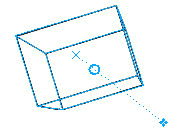

所以，如果 Illustrator 和 Freehand 都有 3D 图形功能，为什么会有人试图制作“看起来”是 3D 的矢量图形，但不是真正的 3D 图形呢？

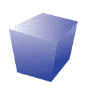

你相信吗？我们开始吧！当你按照这个教程学习时，你将会通过使用渐变来磨练你的技能，你甚至还会学到一些其他的技能。

***注意:我将使用 Adobe Illustrator 8 制作我的图表和命令。我还将为使用 Macromedia Fireworks 的人添加一些注释，以便于您理解。***

##### 仿 3D 圆形

创建仿 3D 圆形非常容易。

1.  使用椭圆工具从一个圆形开始。

*   我们当前的形状没有填充和黑色笔画。我们将改变这一点，没有中风(1)，然后选择填充广场点击它(2)，并选择梯度填充选项(3)。(如果你愿意，你可以跳过第二步，直接点击渐变填充方块。)

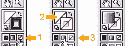

这将使用渐变填充形状:

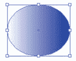

*   现在，打开渐变调色板，改变填充类型从线性到径向。

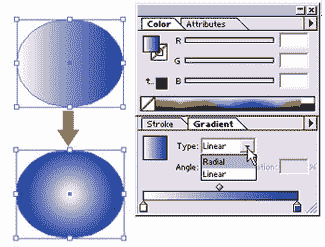

*   从工具栏中选择渐变工具，或者按“g”键获得快捷键。

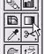

*   要使光源看起来像是从左上方来的，请单击圆形的左上方，按住并向下拖动到左下方，以更改径向渐变的中心。

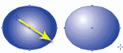

轻松点。现在，记住这些是模仿的 3D 形状。阴影和高光对于不是正圆的圆形来说并不完美。

##### 仿 3D 斜面形状

斜面形状可以用来制作按钮。在这里，我将演示如何制作一个圆形斜面按钮和一个矩形斜面按钮。

1.  从两个圆开始(参见[在 Illustrator 和 Freehand 中创建矢量图形](https://www.sitepoint.com/graphics-illustrator-freehand/)了解如何在彼此内部创建两个圆)。

*   选择圆形，设置描边为“无”，填充为线性渐变填充。

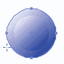

*   使用渐变工具在一个方向设置内圆的渐变，在相反的方向设置外圆的渐变。这使它看起来好像按钮的内部稍微缩进，有一个斜面边缘。

好吧，一个圆形斜面按钮很简单。但是创建带有“硬”边对象的斜面形状需要一些额外的步骤。在本演示中，我将创建一个基本的矩形斜面形状。

1.  让我们从两个矩形开始。

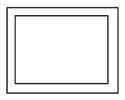

*   选择内部矩形，然后编辑>复制(Ctrl-C 或 Command-C)。然后转到编辑>粘贴到后面(Ctrl-B 或 Command-B)。

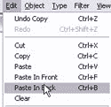

*   选择内部矩形后，转到“对象”>“隐藏选择”( Ctrl-3 或 Command-3)。这个现在隐藏的形状将最终成为我们的顶部“表面”

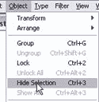

手绘边注:如果你使用手绘，你会想要把复制的内部矩形放在它自己的层上，然后隐藏这个层。

*   选择剪刀工具。

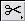

徒手画边注:你会想要选择刀具工具。

*   使用剪刀工具，点击两个矩形的每个角。

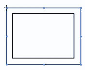

这将形状切割成八个单独的线段。它将仍然看起来像你有两个矩形，直到你尝试使用黑色箭头工具；现在，各个线段相互独立。

*   使用黑色箭头工具从形状的三边选择线段。在下图中，我们用橙色标记了要选择的线段，以便您可以清楚地看到它们。图表的右侧显示了它在 Illustrator 中的样子。

*   现在，转到对象>锁定(Ctrl-2 或 Command-2)。这会将线段固定在适当的位置，这样您就不会意外选择它们。

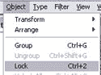

*   使用白色箭头工具选择顶部的一对端点。

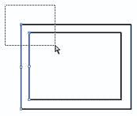

*   转到“对象”>“路径”>“连接”( Ctrl-J 或 Command-J)。

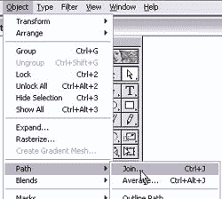

这将两个开放端点用一条线段连接起来。

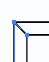

Freehand 注意:有时，在 Freehand 中使用 Join 命令不能按预期工作。如果你遇到的麻烦比你认为的要多，那就用钢笔工具把线段连接起来吧！

*   对底部端点重复相同的过程(使用白色箭头工具选择，然后使用“连接”命令)，然后将描边设置为“无”，将填充设置为渐变。第一个斜边完成了！

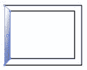

*   我们将重复这些步骤来创建其他斜面边。首先，通过转到对象>全部解锁(Ctrl-Alt-2 或 Command-Option-2)来解锁其他线段。

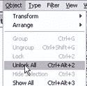

*   现在，选择除了两条想要处理的线段之外的所有内容并锁定它们(Ctrl-2 或 Command-2)。同样，在下图中，我将选中的物体涂成橙色。

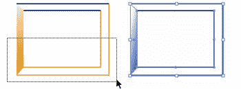

*   使用白色箭头工具选择端点，然后连接它们。

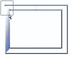

*   对另一侧重复上述步骤。然后，您可以更改描边和填充颜色。

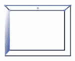

*   对另一侧继续“解锁>选择>锁定>选择点>连接>选择其他点>连接>更改描边和填充”的顺序。结果如下:

*   现在，让我们通过选择对象>显示全部(Ctrl-Alt-3 或 Command-Alt-3)将中间部分放回去。

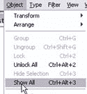

*   中间的矩形将重新出现。然后，您可以在中间区域添加渐变填充。

*   这是我们最后的斜角矩形。出于演示的目的，我将不同的形状分开:

到目前为止，对你模仿的 3D 形状感觉良好吗？让我们来看一些更复杂的东西…

##### 仿 3D 盒子形状

让我们试着创建一个“时髦的盒子形状”,你可以用它作为许多其他类型的 3D 物体的基础。

1.  使用钢笔工具创建三个不同的形状，排列在一起，形成一个盒子形状。

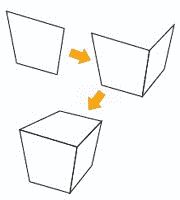

如果你想知道它们单独看起来是什么样子，以下是它们各自的形状:

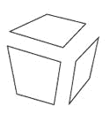

*   使用黑色箭头工具(选择工具)选择所有的形状。在工具调板中选择描边选项，然后单击“无”选项移除黑色描边。(您也可以使用键盘快捷键“/”来移除笔画。)然后，单击渐变选项，用渐变填充所有三个形状。(可以使用键盘快捷键“.”或“>”选择渐变选项。)

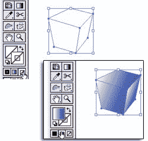

*   使用黑色箭头工具选择单个形状，然后使用渐变工具“修复”颜色。

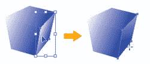

结果如下:

这个盒子对你来说是不是太无聊了？让我们看看你可以把这个“时髦的盒子”用于其他目的的几种方法…

1.  使用钢笔工具在盒子的正面创建一个扭曲的正方形(大致沿着那一面的线条)，并用灰白色渐变填充。你能看出这是怎么回事吗？

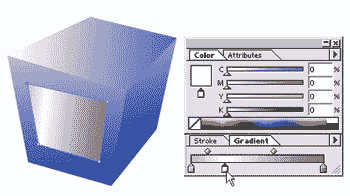

*   如有必要，使用渐变工具来固定渐变的方向。

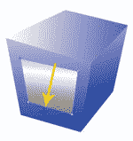

*   最后，使用钢笔工具创建两个细长的三角形来创建一个时髦的电视图形。正是你一直需要的！

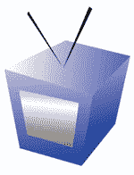

在下一个例子中，我们将在时髦的盒子上放置文本，在复古风格的网站目录中用作“没有可用的产品图片”占位符。

1.  首先，复制并粘贴到 Photoshop 框，并创建一个文本层。

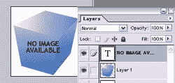

*   右键单击文本层，并选择栅格化层。

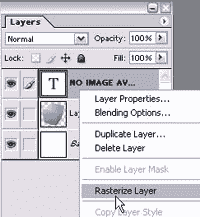

*   转到编辑>变换>扭曲。
*   使用光标拖动文本的角，使其与对象表面的线条一致。

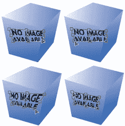

*   双击文本区域提交您的更改，然后保存为 Web 格式。在你当地的复古或有趣时髦的网站上使用它。

附注:如果您有 Illustrator 10+，您可以使用“信封扭曲”命令来调整文本以适应对象。本教程向你展示如何使用包络扭曲命令。

恭喜你！

现在，您已经知道如何创建常见的仿 3D 形状:

*   圆形
*   斜面形状
*   盒子形状和变化

你也已经意识到，创建这些 3D 外观的 2D 形状实际上是对渐变工具的巧妙使用。因此，为了更好地使用渐变工具，你需要花一些时间来观察照片或现实生活中的物体，看看光线是如何影响物体的阴影和明暗的。下面是一些资源的链接，可能有助于理解光和阴影。

*   一个很好的照明，形状和阴影的基本概述
*   [展示了在不同位置放置光源如何影响阴影](http://www.tiemdesign.com/howto/2004/May/Drawing_3DShapes/default.asp)
*   [向下滚动一点会给出一些有用的物体的基本 3D 渲染图](http://www.anticz.com/drawing1.htm)

此外，由于这些仿 3D 图形只是简单地组合了形状和渐变，因此您也可以使用相同的渐变工具技术在 Photoshop 或 Fireworks 中快速创建类似 3D 的图形(使用矢量工具或选区！).请记住，如果您希望能够方便地调整图形大小并在以后重用图形，那么您会希望使用矢量图形。

## 分享这篇文章