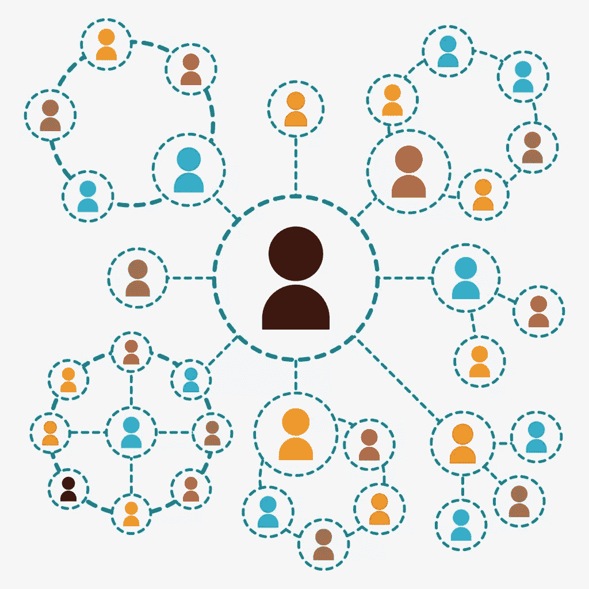
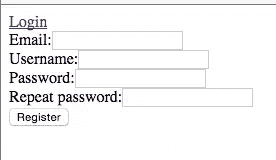

# Symfony2 中的基本用户管理和 FOSUserBundle

> 原文：<https://www.sitepoint.com/basic-user-management-in-symfony2-with-fosuserbundle/>

Symfony 有一个非常强大的认证和授权系统，可以满足我们的很多开箱即用的需求。FOSUserBundle 是一个建立在 Symfony 安全系统之上的库，提供注册、登录、密码重置等功能。它内置了对 MongoDB 的支持，以及诸如 Doctrine、Propel 等 ORM。



我们将使用[家园改进版](https://www.sitepoint.com/quick-tip-get-homestead-vagrant-vm-running/)进行演示。

让我们在`Homestead.yml`文件中添加一个新站点。

```
sites:
    - map: symfonylogin.app
      to: /home/vagrant/Code/SymfonyLogin/web
      type: symfony
databases:
    - symfony 
```

这将在虚拟机中建立一个指向 Symfony 应用程序的`web`文件夹的新站点。当指定了`type: symfony`时，它将选择一个专门为 Symfony 应用程序创建的 Nginx 配置。

我们还应该将`192.168.10.10 symfonylogin.app`添加到主操作系统的`/etc/hosts`文件中。现在我们可以用`vagrant up`来引导虚拟机了。

在我们开始之前，让我们使用 Symfony 的 installer 快速设置 Symfony 应用程序，这是一个用于安装 Symfony 项目的命令行工具。为了安装安装程序，我们使用`vagrant ssh`进入 VM 并运行以下命令。

```
curl -LsS http://symfony.com/installer > symfony
sudo mv symfony /usr/local/bin/symfony
chmod a+x /usr/local/bin/symfony 
```

第一个命令将安装程序从 Symfony 网站下载到当前目录。然后，我们将它移动到 bin 目录并使其可执行。

现在让我们在虚拟机内部创建一个 Symfony 应用程序。

```
cd Code
symfony new SymfonyLogin 
```

这将创建一个 Symfony 框架应用程序并安装来自 Packagist 的所有依赖项。完成后，我们可以转到`app/config`文件夹，用我们的数据库和电子邮件配置值更新`parameters.yml`。

我们现在可以在浏览器中打开`http://symfonylogin.app`来查看正在运行的框架应用程序。

*Symfony 限制开发环境对 IP `127.0.0.1`的访问。当使用 Vagrant 时，您可能需要更新`app_dev.php`文件来将您的主机 IP 添加到列表中。*

## 基本用法

FOSUserBundle 可以很容易地插入到 Symfony 项目中，只需很少的配置和代码更改。让我们看看如何在我们的产品中做到这一点。

### 安装捆绑包

首先，我们将安装软件包:

```
composer require friendsofsymfony/user-bundle "~2.0@dev" 
```

### 配置

在我们可以使用 FOSUserBundle 之前，我们应该在 AppKernel 中注册这个包。

```
class AppKernel extends Kernel
{
    public function registerBundles()
    {
        $bundles = array(
            ...
            new FOS\UserBundle\FOSUserBundle(),
        );
        ...
        return $bundles;
    } 
```

FOSUserBundle 使用 Symfony 翻译组件来显示表单标签和错误。默认情况下，在配置中是禁用的，我们需要在`config.yml`中做如下修改。

```
translator:      { fallbacks: ["%locale%"] } 
```

现在让我们在`security.yml`中配置安全性。

```
security:
    encoders:
        AppBundle\Entity\User: bcrypt

    role_hierarchy:
        ROLE_ADMIN:       ROLE_USER
        ROLE_SUPER_ADMIN: ROLE_ADMIN

    providers:
        fos_userbundle:
            id: fos_user.user_provider.username
    firewalls:
        main:
            pattern: ^/
            form_login:
                provider: fos_userbundle
                csrf_provider: security.csrf.token_manager
            logout:       true
            anonymous:    true
    access_control:
        - { path: ^/login$, role: IS_AUTHENTICATED_ANONYMOUSLY }
        - { path: ^/register, role: IS_AUTHENTICATED_ANONYMOUSLY }
        - { path: ^/resetting, role: IS_AUTHENTICATED_ANONYMOUSLY }
        - { path: ^/admin/, role: ROLE_ADMIN } 
```

Symfony 的安全组件提供了许多配置选项，这将让我们配置几乎每一个方面。在这里，我们已经指定了唯一需要更改的选项，并将其他所有内容保留为默认值。让我们看看我们改变了什么。

```
encoders:
    AppBundle\Entity\User: bcrypt 
```

`encoders`将告诉应用程序使用哪种算法对用户对象的密码进行编码。这是我们的用户实体类，我们将在下面的步骤中创建。

```
providers:
    fos_userbundle:
        id: fos_user.user_provider.username 
```

这将注册用户提供者，其中`fos_user.user_provider.username`是在 FOS 用户包中注册的服务`FOS\UserBundle\Security\UserProvider`的 ID。

Symfony 中的类似于我们熟悉的防火墙。我们创建了一个名为`main`的防火墙。`pattern`键指定了防火墙应该匹配的 url 模式。密钥`form_login`指定我们将使用一个登录表单来验证用户，并且我们希望使用我们的`fos_userbundle`作为用户提供者。

`access_control`根据用户角色限制对 URL 的访问。登录、注册和重置页面应该是可公开访问的，因此它们需要`IS_AUTHENTICATED_ANONYMOUSLY`角色，默认情况下，该角色授予任何访问任何页面的人。

### 用户类别

FOSUserBundle 要求我们创建一个需要持久化到数据库中的用户实体。这个包已经提供了一个抽象基类，包含了我们需要的大部分字段。我们只需要创建扩展这个基类的实体。

```
<?php
// src/AppBundle/Entity/User.php
namespace AppBundle\Entity;

use FOS\UserBundle\Model\User as BaseUser;
use Doctrine\ORM\Mapping as ORM;

/**
 * User
 *
 * @ORM\Table("fos_user")
 * @ORM\Entity
 */
class User extends BaseUser
{
    /**
     * @var integer
     *
     * @ORM\Column(name="id", type="integer")
     * @ORM\Id
     * @ORM\GeneratedValue(strategy="AUTO")
     */
    protected $id;

    /**
     * Get id
     *
     * @return integer 
     */
    public function getId()
    {
        return $this->id;
    }
} 
```

基类没有 ID 字段，所以在我们的实体中应该有 ID 字段以及我们的应用程序需要的任何其他字段。

创建实体后，我们需要告诉应用程序使用它作为用户类。FOSUserBundle 需要三个字段，我们应该在`config.yml`中指定。我们应该在`config.yml`的末尾添加以下设置。

```
fos_user:
    db_driver: orm 
    firewall_name: main
    user_class: AppBundle\Entity\User 
```

`db_driver : orm`会讲捆绑使用主义。

`firewall_name : main`指定要使用的防火墙的名称。

`user_class: AppBundle\Entity\User`告诉应用程序我们想要使用`AppBundle\Entity\User`作为用户类。

### 更新模式

一旦我们创建了实体，我们也可以使用 Symfony 的 CLI 生成用户表。

```
php app/console doctrine:schema:update --force 
```

这将在我们的数据库中创建一个名为 fos_user 的表，其中包含 FOSUserBundle 中的可用字段。如果需要任何附加字段，可以在生成模式之前在用户实体中指定它们。

### 导入路线

Symfony 本身不导入厂商路由。相反，我们需要在`app/config/routing.yml`中手工添加它们。

```
fos_user:
    resource: "@FOSUserBundle/Resources/config/routing/all.xml" 
```

这将导入`FOSUserBundle`中所有可用的路线。

既然我们已经设置了包并配置了一切，我们可以检查它是否工作。如果我们去`http://symfonylogin.app/register/`，应该会看到一个像这样的登记表。



## 自定义模板

我们现在有了一个工作的但基本的用户注册和登录系统。这种形式看起来太天真，不适合在任何实际项目中使用。接下来，我们将了解如何定制模板以使其看起来更好。

Symfony 强大的模板系统允许我们轻松地扩展和覆盖捆绑包中的模板。为了覆盖包模板，我们必须在`app/Resources`下创建一个目录，并给它包的名称。然后，我们创建一个`views`目录，并将所有覆盖的模板放在那里。

如果我们检查位置`vendor/friendsofsymfony/user-bundle/Resources/views`，我们将找到 FOSUserBundle 使用的所有模板。我们需要在`app/Resources/`下创建目录结构`FOSUserBundle/views/`，并将模板文件放在那里。让我们把`Registration`目录从`FOSUserBundle`复制到这个位置。现在，我们的`app/Resources`目录应该看起来像这样。

```
// ProjectRoot/app/Resources
├── FOSUserBundle
│   └── views
│       └── Registration
│           ├── checkEmail.html.twig
│           ├── confirmed.html.twig
│           ├── email.txt.twig
│           ├── register.html.twig
│           └── register_content.html.twig
└── views
    ├── base.html.twig
    └── default
        └── index.html.twig 
```

现在我们可以根据我们的需求更新`register.html.twig`。

```


    <div class="row">
        <div class="col s12 m8 offset-m2">
            <h4 class="card-panel teal lighten-2 white-head">Signup</h4>
        </div>
    </div>
    <div class="row">
        <div class="col s12 m8 offset-m2">
            
        </div>
    </div>
 
```

*这里，我假设您已经有了一个应用程序的布局文件 [base.html.twig](https://github.com/shameerc/SymfonyLogin/blob/custom_templates/app/Resources/views/base.html.twig) ，其中正文内容呈现在`body`块中。*

我们还将更改`register_content.html.twig`，这样我们就可以随心所欲地显示表单元素。

```

{{form_start(form, {'method': 'POST', 'attr':{'class': 'register'}})}}
  <div class="row">
    <div class="input-field col s12">
      {{ form_label(form.username) }}
      {{ form_widget(form.username) }}
    </div>
    {{ form_errors(form.username) }}
  </div>
  <div class="row no-padding">
    <div class="input-field col s12">
      {{ form_label(form.email) }}
      {{ form_widget(form.email) }}
    </div>
    {{ form_errors(form.email) }}
  </div>
  <div class="row no-padding">
    <div class="input-field col s12">
      {{ form_label(form.plainPassword.first) }}
      {{ form_widget(form.plainPassword.first) }}
    </div>
    {{ form_errors(form.plainPassword.first) }}
  </div>
  <div class="row no-padding">
    <div class="input-field col s12">
      {{ form_label(form.plainPassword.second) }}
      {{ form_widget(form.plainPassword.second) }}
    </div>
    {{ form_errors(form.plainPassword.second) }}
  </div>
  <div align="center" class="button-wrap">
    <button class="btn-large waves-effect waves-light" type="submit" name="action">
      {{ 'registration.submit'|trans }}
      <i class="material-icons">send</i>
    </button>
  </div>
{{ form_end(form) }} 
```

`form_start`将打开一个带有给定属性的表单标签，`form_end`将关闭该表单。如果我们检查实际的模板，我们将只看到`{{ form_widget(form) }}`，它将呈现整个表单。但是因为我们需要自己的表单元素样式，所以我们使用`form_label`和`form_widget`来呈现单个表单元素。提交表单时，如果有任何元素未通过验证，`form_errors`将显示相应字段的错误消息。


我们可以定制所有其他模板来匹配应用程序的其余部分。
同样，如果我们想要定制标签和其他消息，我们可以从 FOSUserBundle 复制`translations`目录，并将其放在我们的`app/Resources/FOSUserBundle`目录中。然后，我们编辑`FOSUserBundle.en.yml`，改变我们需要的任何值。

## 注册确认

在大多数情况下，我们需要用户在完成注册过程之前确认他们的电子邮件地址。这可以通过更新`config.yml`中的`fos_user`配置轻松完成。现在它应该看起来像这样。

```
fos_user:
    db_driver: orm
    firewall_name: main
    user_class: AppBundle\Entity\User
    from_email: 
        address:     admin@example.com
        sender_name:    Example.com
    registration:
        confirmation:
            enabled:    true 
            template:   FOSUserBundle:Registration:email.txt.twig 
```

注意我们在这里添加的新的`registration`键。用于`confirmation`的`enabled: true`将启用确认流程，我们将使用`FOSUserBundle:Registration:email.txt.twig`模板用于电子邮件内容。

还要注意我们添加的`from_email`键。它将告诉捆绑包使用此电子邮件作为我们发送的所有电子邮件的发件人地址。

现在，试图注册的用户将收到一封确认电子邮件，其中包含一个确认其电子邮件地址的链接。

*要从 Symfony 发送电子邮件，请确保在`parameters.yml`文件中有一个有效的 smtp 配置。*

## 注册

到目前为止，我们已经看到了如何设置注册表单和定制模板。登录不需要任何额外的设置，内置的功能足以满足任何应用程序。如果我们导航到`http://symfonylogin.app/login`，我们将看到登录表单。如果我们已经登录，我们还会在默认模板中看到一个注销链接。

Symfony 的安全系统拦截提交的登录表单，并尝试使用我们在安全配置中指定的身份验证提供者对用户进行身份验证。这大部分是由 Symfony 的安全组件本身完成的，在这里记录为。

## 忘记密码

FOSUserBundle 还提供了重置密码的功能。用户可以导航到`http://symfonylogin.app/resetting/request`并提供他们的用户名或电子邮件来重置他们的密码。如果该用户存在，应用程序将向注册的电子邮件地址发送一封电子邮件。

## 用户概要

FOSUserBundle 附带一个基本的个人资料页面。登录后，如果我们导航到`http://symfonylogin.app/profile/`，我们将看到默认的个人资料页面。当然，这个页面也需要定制，以便在任何非默认项目中使用。

```




    <div class="fos_user_user_show">
        <p>{{ 'profile.show.username'|trans }}: {{ user.username }}</p>
        <p>{{ 'profile.show.email'|trans }}: {{ user.email }}</p>
    </div>
    <a href="{{ path('fos_user_profile_edit') }}">Edit Profile</a>
 
```

`user`对象保存当前登录用户的详细信息。现在，我们在数据库中只有用户名和电子邮件可用。

我们也可以从个人资料编辑页面(`http://symfonylogin.app/profile/edit`)更新个人资料。为了增加安全性，用户应该提供当前密码来更新配置文件。

## 摘要

FOSUserBundle 是 Symfony 应用程序中用于用户注册和管理的插件。这个包建立在 Symfony 的安全系统之上，在实现用户注册和登录时，它处理了 Symfony 安全的大部分复杂性。

要了解更多信息，请查看大量的[文档](http://symfony.com/doc/current/bundles/FOSUserBundle/index.html)以了解关于这个包的更多信息。

本教程的代码可以在 Github 上找到。如果您有任何问题或意见，请告诉我们！

## 分享这篇文章