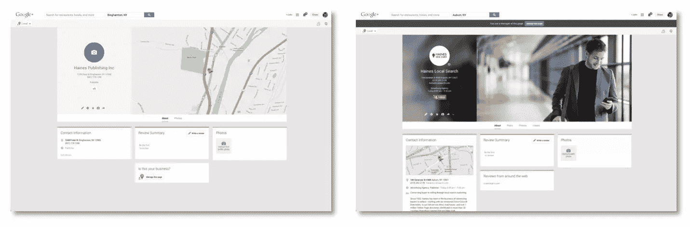

# 本地搜索引擎优化:基础

> 原文：<https://www.sitepoint.com/basics-local-seo/>

我在 2001 年获得了我的第一个 SEO 客户。当时，公司对有机会在全国范围内竞争感到兴奋。

“夫妻店”就不那么热情了:“我只在 20 英里范围内做生意。我要网站做什么？”

今天，一切都变了。

它始于 2007 年，当时苹果发布了第一款平价消费智能手机。四年之内，iPhone 的拥有量将从 100 多万部飙升至 7230 万部。在同一时期，本地搜索从每月 10 亿次增长到 34.5 亿次。巧合吗？我认为不是。

根据谷歌的数据，20%的桌面搜索有本地意图。但在移动设备上，这一比例上升至 50%。智能手机已经成为主流，导致了所谓的 T2 本地搜索的爆炸性增长。

## 什么是本地搜索？

本地搜索是你可以在电话簿上查到的任何东西的在线版本。当某人在特定地理区域内搜索一个企业、产品或服务时——比如曼哈顿上城的*披萨店*。

但正是本地搜索背后的购买意图让它对本地企业变得重要。本地搜索者是寻找卖家的[买家](http://www.haineslocalsearch.com/connecting-buyers-sellers)，而不是相反:

1.  60%的移动本地搜索者从他们在网上找到的商家购买商品(comScore，2011)
2.  78%的移动本地搜索者进行线下购物(comScore/Neustar Localeze，2013 年)
3.  70%的移动本地搜索者在一小时内打电话、拜访或在店内购物(移动营销人员，2012 年)

本地 SEO 有超过 [200 个排名因子](http://www.searchenginejournal.com/infographic-googles-200-ranking-factors/64316/)。但是这里有一个成功战略的关键组成部分。

## 页面优化

页面优化是国家和地方 SEO 的基础。然而，在本地 SEO 中，位置也是一个关键词。

产品/服务关键字加上城市和州应该放在标题、h1 标签、描述、URL 和页面内容中。这意味着你在你的标题标签中有更少的空间——特别是现在谷歌使用[像素而不是字符数](http://www.benmarshall.me/title-tag-length/)来决定文本何时被截断。

本地 SEO 的最佳实践是为每个产品或服务创建一个页面。例如:

**天沟安装**

网址:gutter-installation.html
标题标签:天沟安装—雨水天沟安装|林肯 NE

**天沟修复**

URL:gutter-repair.html
标题标签:天沟修复—雨水天沟修复|林肯 NE

**水槽清洁**

URL:gutter-cleaning.html
标题标签:天沟清洁—雨水天沟清洁|林肯 NE

**雨水桶**

URL:rain-barrels.html
标题标签:雨水桶|林肯 NE

当地的 SEO 专家也认为添加[模式标记](http://blog.kissmetrics.com/get-started-using-schema/)可以帮助提升你的排名。

## ~~Google Places~~~~Google+Local~~Google My Business

有更多的优化本地比有机排名。您还必须优化以出现在 SERP 的本地部分:

只有在当地有业务的公司才会出现在这一部分。这就是为什么一个适当优化的谷歌本地个人资料是本地搜索中最重要的排名因素之一。

不幸的是，谷歌已经多次改变和重新标记他们的本地列表，甚至连专家都感到沮丧和困惑。

### 获得谷歌列表的访问权限

~~Google Places~~~~Google+Local~~Google My Business 是世界上所有企业和组织的列表和个人资料页面。企业主可以[要求上市](http://mikemunter.com/guide/claim-optimize-google-places-for-business-page/)以获得访问权，或者创建一个新的。

一旦申请，你可以添加信息，如营业时间，业务类别，甚至封面照片。

在撰写本文时，谷歌正在将所有原始的 **Places** 页面合并到 Google+平台中。这增加了一个“社交层”,这是最初的本地页面所没有的——以类似脸书的方式发布更新和与人互动的能力。

对于优化谷歌个人资料的具体细节，菲尔·罗泽克的[本地搜索可见性指南](http://www.localvisibilitysystem.com/free-guide/)是一个无价的资源。

## 本地搜索目录上的引用

谷歌以近 68%的份额在整体搜索市场份额中遥遥领先。但是本地搜索就没那么多了。虽然仍然是一个主要的参与者，本地搜索空间更加分散，充满了来自本地目录和互联网黄页(IYP)的竞争。

此外，大约一半的移动本地搜索发生在应用程序中。虽然谷歌地图是最受欢迎的，但雅虎、Mapquest、必应、Yellowbook、Yelp、Superpages 和苹果地图拥有超过一半的应用市场份额。

这就是为什么在这些类型的网站上被列出来是很重要的。这是通过引用发生的。

引用是指在另一个网站上提及你的企业名称、地址和电话号码(NAP ),即使没有链接。这可能是 Yelp、YP.com 或商业改善局的企业列表。

引用是本地 SEO 的反向链接。搜索引擎关注像这样的权威目录上的列表。

据 Moz Local 称，“在其他因素相同的情况下，引用次数多的企业可能会比引用次数少的企业排名更高。”

你拥有的越多，谷歌和其他搜索引擎就越相信你的业务确实存在，他们提供的信息是准确的。

### 糟糕的引用与没有引用

唯一比没有引用更糟糕的是不一致的引用。重要的是，你的小睡在你的网站、社交媒体档案和在线目录中保持一致。

值得注意的是，这数百个本地目录不会创建自己的数据。他们从 Infogroup、Localeze 和 Acxiom 等主要数据供应商那里获取数据。手工建立引用的捷径是向这些提供商提交你的商业信息(当然是收费的)。

### 本地和利基目录

除了主要的在线目录，寻找机会在本地相关和行业相关的领域建立引用。

当地相关引用的一个例子是当地商会的列表。这是一个“信任”的信号。它告诉谷歌你的*商业地点*与搜索查询相关。

对于**行业相关的引用**，找出在特定类别或领域内被公认为权威的网站。像 avvo.com 和 justai.com 这样的网站就是律师希望上市的例子。

被列在同一类别的其他企业告诉搜索引擎，确实是一个水管工，律师，或庭院设计师。这告诉谷歌你的*业务类别*与搜索查询相关。

出于这个原因，你不应该忽视互联网黄页网站，在那里你可以获得当地相关和行业相关的引文。谷歌最近的“鸽子”更新为互联网黄页(IYPs)和目录网站提供了[流量上升。](http://searchengineland.com/optimizing-business-internet-yellow-pages-directories-202414)

## 移动的

移动网站不会帮助你在常规搜索结果中获得更高的排名。但是那些不支持移动设备或者配置不正确的网站在谷歌的移动搜索结果中不会排名靠前。

根据[搜索引擎圆桌](http://www.seroundtable.com/google-responsive-design-ranking-17536.html):

> 谷歌确实降低了非手机友好智能手机网站在手机上的排名。如果你弄乱了技巧，它们会伤害你。

即使你的非移动网站*在移动搜索中被找到，61% [也会放弃它](http://searchenginewatch.com/article/2208496/72-of-Consumers-Want-Mobile-Friendly-Sites-Google-Research)。*

 *### 移动网站开发

创建移动网站有两种方法:*响应式设计*和*并行移动*。

1.  **响应式设计**是一种灵活的布局，可以自动“响应”(即调整大小)正在使用的设备的屏幕尺寸。

2.  **平行移动**包括创建一个复制的移动网站。手机游客被重定向到 m.example.com 的 T4，而不是 www.example.com 的 T2。

从 SEO 的角度来看，使用哪种方法都没有区别。但是从发展的角度来看，两者都有各自的问题:

*   并行移动方法意味着必须更新多个站点；然而，响应式网站是一个单一的网站。

*   响应式网页设计需要更多的时间和更高水平的专业知识，这可能会增加成本。

*   对于现有非移动网站的公司来说，实施响应式设计意味着建立一个全新的网站。创建并行移动站点更快，对组织的破坏性更小。

*   谷歌可能会将平行移动网站视为重复内容，所以你需要在每个网页中插入一些 html 代码来防止这种情况发生。

不用说，一个手机友好的网站是至关重要的，因为本地搜索几乎等同于手机搜索。

## 这只是入场费

我认为上面列出的项目是“入门费”——就像一张名片。如果你没有，为什么还要做生意呢？

想要在竞争中占得先机的公司必须做的不仅仅是必需品。在第 2 部分，我将讨论成功的本地 SEO 策略的其他组成部分。

## 分享这篇文章*