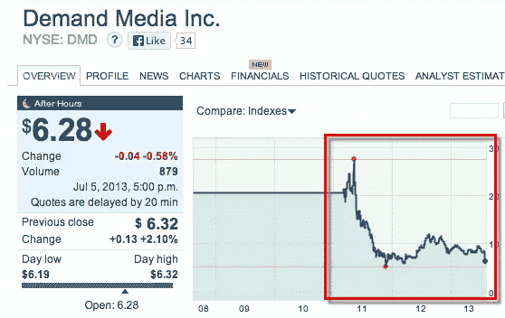
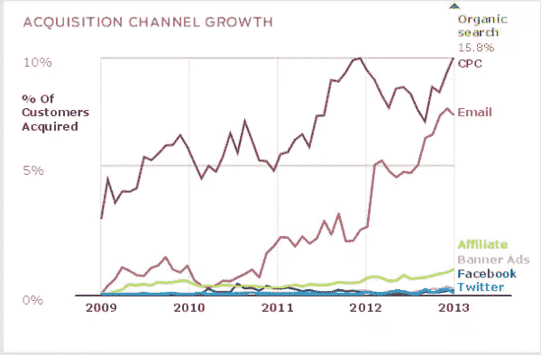

# 成为全栈营销者的初学者指南

> 原文：<https://www.sitepoint.com/beginners-guide-becoming-full-stack-marketer/>

*本文原载于[成长无处不在](http://growtheverywhere.com/growth/the-beginners-guide-to-becoming-a-full-stack-marketer/?utm_source=sitepoint&utm_medium=syndication&utm_content=full-stack-marketer&utm_campaign=sitepointsyndication)，感谢 Eric！*

* * *

> “硅谷最需要、最稀缺的技能既不是工程，也不是设计，而是互联网营销。”

戴夫·麦克卢尔(Dave McClure)[咆哮着说创业公司缺少什么。](http://www.webbroi.com/blog/dave-mcclure-startups-investors-are-incredibly-bad-at-intern.html)

很有道理，对吧？网络营销只有 15 年多一点的历史，而设计和工程已经存在很长时间了。考虑到互联网营销的相对初级阶段，仍然没有可靠的培训/教育。这并不是说外面没有很多信息——确实有。你只需要能够找到正确的资源，这通常意味着过滤掉网络上的大量噪音。

这篇博客文章旨在为初、中级互联网营销人员指出正确的方向。方法如下:

## 从哪里开始

做事最难的部分是开始。网络营销也不例外。这个领域的问题是，有很多人写内容是为了获得搜索引擎排名或快速联盟营销胜利。不相信外面有很多边缘内容？

只要看看这篇 eHow 文章，你就会知道为什么有时候很难找到最好的内容:

今天学习网络营销的最大收获是能够辨别信号和噪音。这意味着从正确的人那里获得正确的信息并采取行动。我将在下面介绍我认为在网络营销中最重要的领域，以及链接到一个博客，如果你想了解更多，你应该阅读它。

我只链接到每个类别的一个博客，这样你就可以专注于那个博客，而不会被太多的博客淹没。如果你对这个话题越来越感兴趣，请随意深入研究，拓宽你正在阅读的博客。

哦，如果你试图复制快速创建一堆边缘内容的需求媒体(eHow)模式，这种东西在今天并不奏效。这就是为什么他们的股票看起来像这样:

## 要阅读的博客

### 搜索引擎优化

[如今，在大多数情况下，有机搜索(SEO)仍然是最大的增长渠道](http://marketingland.com/study-email-lands-more-customers-than-social-but-not-as-many-as-organic-search-50430)。它需要花费最多的时间和精力，但是如果你能很好地执行，它会带来最长期的价值。

*这里是我推荐的一个 SEO 博客:* 

[Moz 博客](http://moz.com/blog)——除了有 SEO 初学者指南，Moz 博客还有许多高级 SEO 技巧，外加每周五一个名为[白板周五](http://moz.com/blog/category/whiteboard-friday)的有用视频系列。

### (法)离开(our prendre conge)

点击付费(PPC)已经从搜索结果中的文本链接广告发展了很多。现在有了社交广告、重定向、视频广告等等。这可能看起来势不可挡，但是如果你对 AdWords 有基本的了解，你应该能够过渡到其他形式的点击付费。

*这里是我为 PPC 推荐的博客:*

[PPC Hero](http://www.ppchero.com)——PPC Hero 有很棒的操作方法帖子，为读者提供了很多实用工具——他们的[热门帖子](http://www.ppchero.com/popular/)是一个很好的起点。他们还有一系列的[指南](http://www.ppchero.com/guides/)和[白皮书](http://www.ppchero.com/whitepapers/)可以帮助你。

额外收获:我还推荐[布拉德·盖德的《Google AdWords 高级指南》](http://www.advancedadwordsbook.com/)你可以拿起他的书或者视频培训。我个人用的是视频训练。

### 分析

如果你不看数字，你将一事无成。平均订单价值？跳出率？订婚？交通？转化率？都在你的分析中。

如果你在一家科技创业公司，你可能会关注终身价值、客户流失等等。

*博客阅读:* 

奥卡姆剃刀——阿维纳什·考希克是谷歌的数字营销传道者，他对数据分析了如指掌。他的博客上有很多有用的信息。其中大部分是与谷歌分析相关的，但对任何一个刚刚起步的人来说都很棒。

### 电子邮件

如今，电子邮件仍然是最好的获取渠道之一。想想看——它本质上是世界上最大的社交网络(回复:沟通渠道):

我推荐阅读[电子邮件学院](http://www.emailinstitute.com/)，因为它有大量的电子邮件营销最佳实践技巧。

### 文案

写好标题是获得更多点击率和最终更多转化率的最简单的方法之一。*我推荐阅读来提高你的文案技巧。*看看他们所有博客文章的标题，试着把它们塑造成你自己的标题。他们说标题价值 0.80 美元，因为如果人们不点击它，你的内容几乎一文不值。

### 社交媒体

归根结底，社交媒体就是与关心你的人联系。每年都有新的平台出现，很难跟上正在发生的事情，但社交媒体审查员 在提供有价值、可操作的社交媒体帖子方面做得很好。

### 内容营销

内容营销是一个新的时髦词，但这种做法已经存在很久了。简短的解释是，给你的读者带来效用的内容有助于建立品牌知名度、受欢迎程度、信任度等等。像搜索引擎优化一样，内容营销需要大量的时间、金钱和努力才能看到结果，但随着时间的推移，它会[复合](http://tomtunguz.com/compounding-blogging)。

*我推荐阅读[内容营销研究所](http://contentmarketinginstitute.com/)，了解有效进行内容营销的最新技巧和诀窍。* 

### 创业营销

创业营销是一种不同于典型营销的野兽。这是非常度量驱动的，需要通过不同的渠道进行大量的测试。这也是一种不同的思维方式，因为达到数字的时间是有限的(不像大公司有大量的跑道)。大多数创业公司都需要全栈营销人员(re: [growth hackers](http://thenextweb.com/insider/2013/05/05/the-actual-difference-between-growth-hacking-and-marketing-explained/) )来帮助增长，不幸的是，如今这种人并不多。你还将了解客户开发、产品市场适应性以及有时几乎没有预算的情况下推动增长。

肖恩·埃利斯的博客[创业营销](http://www.startup-marketing.com/)很好地涵盖了这些不同的话题。你可能还想注意到他现在正在 [Qualaroo 博客](http://blog.qualaroo.com/)(他的初创公司)上写博客，所以把这两个都加入书签吧。

### 联盟营销

联盟营销商有时被视为可疑的，不可信的营销商，但我倾向于认为这是不真实的。他们实际上是一些最有创造力的营销人员，因为他们倾向于通过做任何事情来完成工作。学习如何做联盟营销只是拼图的一部分。如果你正试图发展一家初创公司，并开始了一个联盟计划，你需要学习管理联盟计划的细节。

我强烈推荐阅读 Geno Prussakov 关于联盟营销的[博客。他被视为联盟营销领域的领导者，并撰写了一本](http://www.amnavigator.com/blog/)[评价极高的联盟项目管理书籍](http://www.amazon.com/Affiliate-Program-Management-Hour-Day/dp/0470651733)。顺便强烈推荐。

### 视频

让我们看看 YouTube 的一些数据，因为它是世界第二大搜索引擎:

*   每天有 6 亿次浏览来自移动设备
*   脸书每天都有 500 年的 YouTube 视频被观看。推特上每分钟分享 700 个 YouTube 视频。
*   YouTube 每月的独立访问量超过 8 亿次

随着人们将更多的注意力转移到网上，视频将继续增长。趁现在还是蛮荒的西部，进去是个好主意。

我推荐阅读 [ReelSEO](http://www.reelseo.com/) 的视频广告和 YouTube 技巧。

## 后续步骤

有很多渠道和大量的信息可以深入了解，所以下面是我对如何真正开始的建议:

### 从一个频道开始

我建议你选择你最感兴趣的话题，并投入时间。这样你就不会太累了。例如，我首先从 SEO 开始，创建了几个网站来测试不同的战略/战术。一旦我开始掌握它，我试着运行一些联盟营销活动。一件事接着一件事，我最终帮助大型出版网站和财富 500 强公司进行 SEO。

但这还不够。我决定，我需要扩展到其他在线营销领域，这样我就可以成为一名全面的营销人员。所以我拿起 PPC。我学到了更多关于分析的知识。然后我学会了如何有效地做社交媒体。然后我在文案等等上面层层叠加。

一个优秀的全栈营销人员明白，他们需要不断学习，因为互联网世界的变化如此之快。变得自满，你很快就会变得平庸。

### 不断学习

学习永远不会停止，因为技术领域的发展如此之快。继续测试，继续阅读，继续提问。

虽然我想保持推荐的博客数量为每个频道一个，但我觉得如果我分享一些我喜欢的其他网站会有所帮助:

David Skok 的创业博客——关于成长中的 SaaS 公司的精彩文章。他的度量帖子非常出色。

quick prout—kiss metrics 和疯狂彩蛋联合创始人尼尔·帕特尔的博客。他涉及的话题从创业到网络营销。他还创造了一些完全免费的优秀的“高级在线营销指南”。

KISSmetrics 博客 —被广泛认为是最好的全方位在线营销博客。

[Inbound.org](http://www.inbound.org/)—网络营销的黑客新闻。在这里你可以找到最新的网络营销新闻。

### 一篇要读的帖子

如果有一篇关于获得客户的文章你需要阅读，那就是保罗·格拉厄姆的文章《做不可扩展的事情来发展你的业务》。**这是任何营销人员的必读读物。**

## 结论

网上有很多关于网络营销的信息，很容易陷入想一次学会所有东西的陷阱。从小处着手，当你感觉舒适的时候再扩展到其他领域。不要害怕每隔一段时间就冒一次险，你会很快成为一名全面的营销人员。

对我来说，全栈营销是一个增长黑客。但这有待讨论，因为对于什么是增长型黑客，什么不是，有多种解释。你怎么想呢?

*本文最初发表于[成长无处不在](http://growtheverywhere.com/growth/the-beginners-guide-to-becoming-a-full-stack-marketer/?utm_source=sitepoint&utm_medium=syndication&utm_content=full-stack-marketer&utm_campaign=sitepointsyndication)。*

## 分享这篇文章