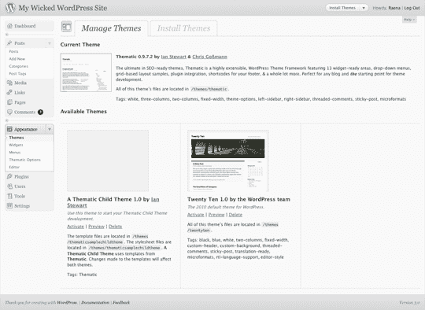
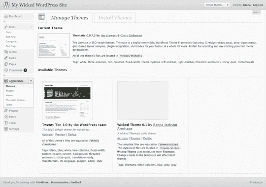
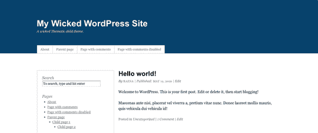
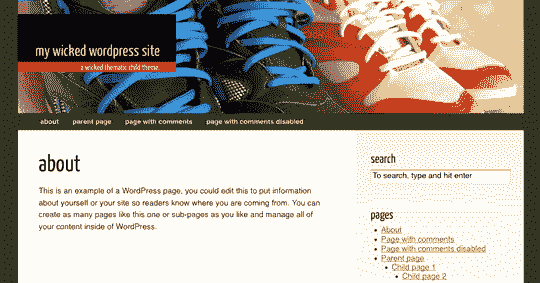

# WordPress 主题框架初学者指南

> 原文：<https://www.sitepoint.com/beginners-guide-to-the-thematic-framework-for-wordpress/>

SitePoint 最新发布的 *[构建你自己的邪恶主题](https://www.sitepoint.com/premium/library)* ，包含你需要知道的为世界上最流行的在线发布平台构建令人惊叹的主题的一切。为了让你体验一下里面的内容，我们把第 1、4 和 5 章作为[的免费样本 PDF](https://www.sitepoint.com/premium/library) 提供。本文是第 4 章的后半部分。在[的前半部分](https://www.sitepoint.com/article/5-wordpress-frameworks-to-jumpstart-your-theme-designs)，Raena 给了我们使用主题框架的理由，并调查了一些可用的最佳框架。现在，我们将看看如何开始定制主题框架。如果你想了解更多，你可以直接从 SitePoint 购买整本书，包括印刷版或数字版(包含 PDF、MOBI 和 EPUB 格式)。

## 准备你的画布

首先，我们假设你已经拿到了一份 WordPress 的拷贝，用于主题开发和测试。我们还将假设您已经用一些虚拟内容填充了您的开发博客。

**note:** What’s all this about dummy content?

用各种各样的内容来测试你的主题是很重要的。当然，如果你有自己的 WordPress 博客，你可以将你的博客内容导出为 WordPress 导出文件(从工具 > 导出)，并将其导入到你的 dev 博客中(通过导航到工具 > 导入，然后点击 WordPress 链接)。另一种选择是手工创建测试内容，确保您已经包含了许多不同的内容:大的和小的图像、有序的和无序的列表、块引用、分页的帖子等等。

但是最快的方法是抓取一些虚拟内容并导入。一个很好的方法是使用 WordPress 自己的主题单元测试文件，你可以从 Codex 中获取——它会用各种形状和大小的帖子、页面、标签、类别，甚至一些附件来填充你的博客。你也可以试试 [WP 虚拟内容插件](http://wordpress.org/extend/plugins/wp-dummy-content/)，它可以通过简单的按键添加和删除无数的帖子。

[从下载页面](http://themeshaper.com/thematic/)获取一份主题的拷贝，或者在你的 WordPress 安装中使用主题浏览器，并将其安装在你的 WordPress `wp-content/themes`目录中。现在就开始激活它作为你的主题吧——这是一个很好的机会来看看默认主题的外观和效果。

查看你的博客主页的源代码，你会发现是什么让 Thematic 的标记如此伟大:它塞满了有用的`class`名字、`id` s、微格式等等。以下是我的测试博客中的`body`元素:

```
<body class="wordpress y2010 m05 d01 h14 home blog not-singular   loggedin mac firefox ff3">
```

下面是页面上第一篇文章周围的`div`元素:

```
<div id="post-86" class="hentry p1 post publish author-raena  category-uncategorized untagged comments-open pings-open  y2008 m04 d01 h11 alt slug-test-post">
```

嘿，我们警告过你它被塞满了！我敢打赌，你一定想知道这些东西是干什么用的，我很高兴你问了这个问题。让主题的 HTML 输出对主题者如此有用的是，通常有一个`class`用于你能想到的任何目的，这意味着你可以实现许多很酷的效果，而不需要以任何方式修改模板。想象一下，每当你使用“爱”这个标签时，你都想用一颗小小的心来装饰你的文章标题。这很简单，因为 Thematic 为每个标签创建了一个`class`，并把它放在帖子的`div`上。

对于我们上面的示例帖子，我们有一个`untagged` `class`，因为帖子没有附加标签，但是对于有标签的帖子，您会看到看起来像`tag-tagname`的`class`。因此，我们正在寻找目标职位与`class` `tag-love`:

```
.post .tag-love .entry-title {  background: url(heart.gif) center left no-repeat}
```

你需要首页的第一篇文章有更大的文本吗？轻松点。主题给每篇文章一个文章编号`class`，当你浏览主页时`body`标签上有一个`home` `class`。所以我们想这样做:

```
body.home .p1 { font-size: 1.5em }
```

特定页面的页眉应该更高吗？主题显示了每个帖子或页面的 ID，所以很容易做到:

```
body.pageid-14 #header { height: 500px; }
```

患有严重的 IE6 忧郁症？扔掉那些不可靠的东西；主题的浏览器、版本和平台`class` es 你已经涵盖:

```
body.ie6 #branding {   /* do IE 6 specific stuff here */}
```

花些时间浏览一下 Thematic 的标记，了解一下它提供的一些有用的东西。有可能 Thematic 的动态`id` s 和`class` es 将允许你做一些非常具体的风格改变，而不需要修改标记。

在这一点上，也有必要查看一下`thematic`目录，看看是什么让它运行的。让我们来看看:我们看到许多 PHP 模板文件、一些目录、一个 readme 文件，当然还有这个主题的 CSS。大多数文件名应该是不言自明的:`header.php`文件负责标题逻辑，`post.php`与帖子的显示方式有关，等等。在`library`文件夹中，您会发现一组方便的助手——更多的 CSS、JavaScript 和 PHP 文件 Thematic 用它们来施展它的魔法。稍后我们会发现这些很有用，但是如果您是好奇型的，请随意查看一些驱动这个主题的代码。

嘿，底下是什么？Thematic 甚至提供了自己的示例子主题，方便地命名为`thematicsamplechildtheme`，让我们有个好的开始。里面有一个`style.css`文件、一个`functions.php`文件和一个方便的自述文件，邀请我们用这些文件启动我们的孩子主题。我想我们会做到的！

## 创建您的儿童主题

将`thematicsamplechildtheme`目录复制回`wp-content/themes`目录，并给它一个新名称。我打算给我的新孩子主题命名为“邪恶”，所以我给这个文件夹起了个合适的名字:`wicked`。

接下来，我们需要对主题信息进行一些更改，这些信息都存储在主题的`style.css`文件中。在您最喜欢的文本编辑器中打开它，看看里面有什么:

**例 1。`chapter_04/v1/wicked/style.css`(节选)**

```
/*   Theme Name: A Thematic Child ThemeTheme URI: Description: Use this theme to start your Thematic Child Theme development.Author: Ian StewartAuthor URI: http://themeshaper.com/Template: thematicVersion: 1.0Tags: Thematic.Thematic is © Ian Stewart http://themeshaper.com/.*/⋮
```

这里发生了什么事？文件最开始的大注释块完成了一项非常重要的工作:它定义了主题的标题、作者、URI、描述、标签和版本号。这些信息出现在你的 WordPress 安装的外观 > 主题面板中的每个主题旁边，如图[图 1 所示，“WordPress 3 中的管理主题面板，显示二十个十和主题”](#fig_manage_themes "Figure 1. The Manage Themes panel in WordPress 3, showing Twenty Ten and Thematic")。

但是，管理主题面板中缺少两个项目。以`Template:`开头的一行告诉 WordPress 主题是我们的父主题，所以它应该默认使用来自主题的模板。带有版权声明的另一行也被排除在 WordPress 管理部分之外；这是一个放置评论、说明甚至一个精彩的敲门笑话的地方——任何你喜欢的东西。

**图一。WordPress 3 中的管理主题面板，显示 Twenty Ten 和主题**



现在让我们个性化这个主题的信息。如果你还没有决定一个名字或者一个描述，那也没关系；我们可以随时返回并更改它，但是现在，至少定义一个名称是一个好的开始:

**例二。`chapter_04/v2/wicked/style.css`(节选)**

```
/*   Theme Name: Wicked ThemeTheme URI: http://example.com/themes/wickedDescription: A Thematic child theme that's just for kicks.Author: Raena Jackson ArmitageAuthor URI: http://example.com/themesTemplate: thematicVersion: 0.1Tags: Thematic, three-columns, blue, grey, gray.This theme is © 2010 Raena Jackson Armitage..*/⋮
```

**warning:** Keep It Compact!

换行对 WordPress 很重要，这些条目各占一行。如果你的描述太长，需要一个新的段落，你可能要考虑编辑它。

既然我们已经命名了我们的主题，让我们再一次处理管理主题面板。如果你已经正确地执行了这些步骤，你会看到你的主题和其他已安装的主题放在一起，带有你的名字、描述和附加信息，如图 2 所示，“嘿，那是我的主题！”。

**图二。嘿，那是我的主题！**



这里似乎一切正常。让我们激活我们的主题，并开始造型了！

## 看起来时尚

现在，我们将开始调整 CSS 以更好地适应我们的设计。主题有益地提供了一堆漂亮的重置样式、预打包的布局、排版和其他 CSS 助手；如果您进一步查看`styles.css`文件，您会看到它们已经被导入到我们的示例子主题中。下面是主题的其余部分`style.css`的样子:

**例 3。`chapter_04/v2/wicked/style.css`(节选)**

```
⋮/* Reset browser defaults */@import url('../thematic/library/styles/reset.css');/* Apply basic typography styles */@import url('../thematic/library/styles/typography.css');/* Apply a basic layout */@import url('../thematic/library/layouts/2c-r-fixed.css');/* Apply basic image styles */@import url('../thematic/library/styles/images.css');/* Apply default theme styles and colors *//* It's better to actually copy over default.css into this file(or link to a copy in your child theme) if you're going to doanything outrageous */@import url('../thematic/library/styles/default.css');/* Prepare theme for plugins */@import url('../thematic/library/styles/plugins.css');
```

**note:** Don’t Sweat the Style Sheet!

如何使用 CSS 的细节已经超出了本书的范围——我们认为如果你对 WordPress 主题感兴趣，你已经对如何使用 CSS 有了一些了解。对于一个关于样式表的介绍来说，很难忽略*使用 HTML 和 CSS* ，第二版(Melbourne: SitePoint，2008)和方便的在线参考文本 [SitePoint CSS Reference 以正确的方式构建自己的网站。](https://reference.sitepoint.com/css/)

虽然基本的设计主题提供的是…嗯，不错，它肯定是缺乏魅力的赌注。让我们对排版、颜色和布局做一些修改。

第一个变化很简单:目前这个主题在右边放置了一个侧边栏，但是我更喜欢它在左边。Thematic 的`library/layouts`文件夹提供了一系列我们可以应用到主题的布局:左(`2c-l-fixed.css`)或右(`2c-r-fixed.css`)两栏，在主要内容两侧各有一个侧边栏的三栏(`3c-fixed.css`)，或者两个侧边栏都在右边的三栏(`3c-r-fixed.css`和`3c-r-fixed-primary.css`，它们在侧边栏的顺序上有所不同)。

更改默认设置就像选择我们想要的一样简单，只需在我们的`style.css`文件中更改对它的引用。在这种情况下，我希望`2c-r-fixed.css`将我的侧边栏移到左边:

**例 4。`chapter_04/v3/wicked/style.css`(节选)**

```
/* Apply a basic layout */@import url('../thematic/library/layouts/2c-l-fixed.css');
```

**important:** Feeling kind of penned in?

当然，如果这些导入的样式都不符合您的想法，您可以删除`@import`语句，构建自己的布局、版式或默认重置样式表。记住，一切都在你的掌控之中！

接下来，我们来思考颜色。你注意到上面代码示例中关于`default.css`的有用的小注释了吗？它提醒我们，如果我们打算做什么出格的事情，就把`default.css`文件复制到我们自己的主题中。

我们将要做的事情很难令人吃惊，但是复制文件的建议是可靠的:让我们现在就这样做，并修改我们的`@import`语句以反映它的新位置。将`default.css`文件从`thematic`目录复制到你的子主题的目录中，然后相应地修改`@import`。随意改名字；你可能想给自己留个评论，提醒自己这是原作的副本。为了我邪恶的主题，我将文件重新命名为`newstyles.css`:

**例 5。`chapter_04/v3/wicked/style.css`(节选)**

```
/* Apply default theme styles and colors -- This is a copy of the Thematic default.css */@import url('newstyles.css');
```

**warning:** Thematic’s CSS and the GPL

主题 在通用公共许可证下发布；如果您复制其 CSS 用于您的子主题，您的 CSS 也将受本许可证条款的约束。虽然这对你来说没什么问题(许多成功的商业主题都是 GPL 许可的)，但是如果你打算发布你的主题，并且希望对你的客户有一个更严格的许可，你就需要从头开始编写你自己的样式表。

这个文件很大——太长了，无法在本书中复制——但这里有一段摘录。慢慢来，仔细看；您将看到选择器是根据用途分组的，并且您认为可能使用的任何元素都有一种样式。我们将开始在主题的标题上泼洒一些颜料；我们正在寻找标记为`=Header`的部分。这是我们在那里发现的:

```
#header {  z-index:2;}#branding {  padding:88px 0 44px 0;}#blog-title {  font-family:Arial,sans-serif;  font-size:34px;  font-weight:bold;  line-height:40px;}#blog-title a {  color:#000;  text-decoration:none;}#blog-title a:active,#blog-title a:hover {  color: #FF4B33;}#blog-description {  color:#666;  font-size:13px;  font-style:italic;}
```

改变颜色很简单:我选择了深蓝色作为背景，这意味着文本和链接的颜色也需要改变:

**例 6。`chapter_04/v3/wicked/newstyles.css`(节选)**

```
#header {  z-index:2;  *background: #07426c;*}⋮#blog-title a {  color:*#fff*;  text-decoration:none;}#blog-title a:active,#blog-title a:hover {  color: *#f47920*;}#blog-description {  color:*#eee*;  font-size:13px;  font-style:italic;}
```

看起来怎么样？我们来了解一下:结果如图[图 3，“看起来很犀利”](#fig_sharp "Figure 3. Looking sharp")。

**图 3。看起来很帅**



随着我添加和调整更多的样式，我的主题开始成形。我们将省略这本书里所有血淋淋的细节，但是如果你想知道我想出了什么，请随意进入代码档案库 <sup>[ [1](#ftn.id2333922) ]</sup> 并检查我的 CSS。

## 继续探索那些风格

看起来相当简单，对吧？这只是检查主题的标记，并找到一种方法，用你敏锐的 CSS 技巧将你的设计带入生活。通过一些敏锐的 CSS，以及几个小时的戳、刺激和刷新，您应该有一个看起来很清晰的模板。你可以在图 4 的[中看到我的成就，“邪恶！”](#fig_finished "Figure 4. Wicked!")仅使用 CSS 修改。你可以浏览我在本章代码档案的`v4`文件夹中使用的样式。<sup>[2](#ftn.id2824700)</sup>

**图 4。缺德！**



## 展开你的翅膀

许多主题者会发现，简单地修改 CSS 就可以创建一个漂亮的、原创的子主题。但是如果你想把翅膀伸得更远一点呢？在下一章，我们将探索如何给主题添加更多的功能。

关于如何使用主题框架构建令人惊叹的主题的更多信息，[下载*的免费示例 PDF 文件*。该示例包含完整的第 4 章(本文就是从这一章中得出的)和第 5 章(更深入地讨论了如何利用主题框架的力量)。你可以](https://www.sitepoint.com/premium/library)[从 SitePoint 直接](https://www.sitepoint.com/premium/library)购买整本书，既可以是印刷版，也可以是数字版(包含 PDF、MOBI 和 EPUB 格式)。

* * *

<sup>[[1](#id2333922)</sup>从 https://www.sitepoint.com/premium/library[那里抢档案](https://www.sitepoint.com/premium/library)

<sup>[ [2](#id2824700) ]</sup> 标题图片由 Flickr 用户 [Seo2 在](http://www.flickr.com/photos/seo2/)[知识共享](http://creativecommons.org/licenses/by-sa/2.0/)下授权。

## 分享这篇文章