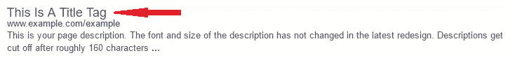
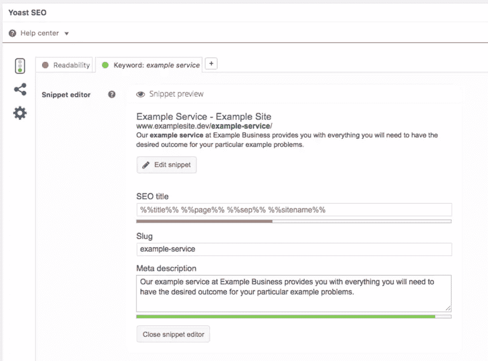
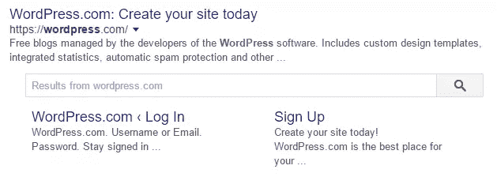
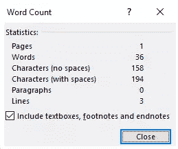
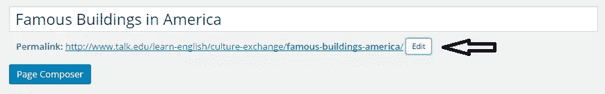
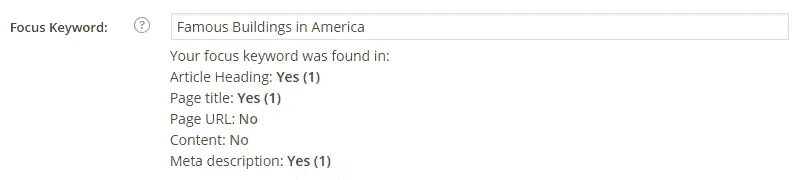
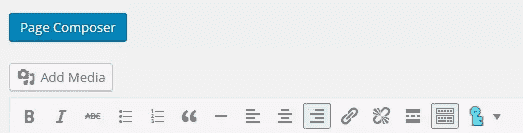
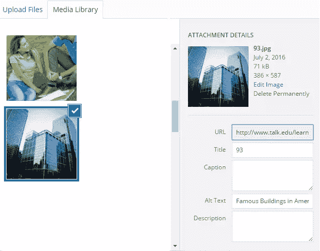
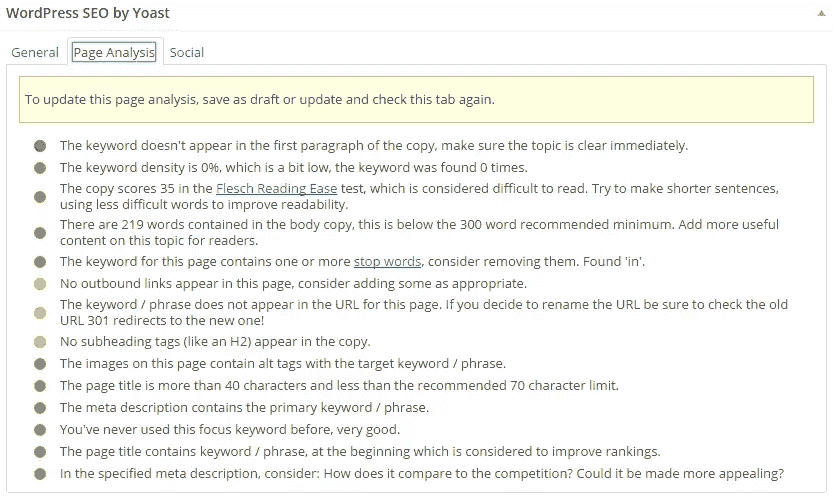
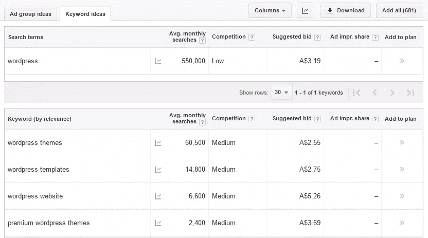

# WordPress SEO 初学者指南

> 原文：<https://www.sitepoint.com/beginners-guide-to-wordpress-seo/>

世界各地数百万人使用 WordPress 为各种应用程序建立网站。虽然它很受欢迎，因为它易于安装、运行和使用，但它仍然需要适当的优化，以便真正提高您的整体搜索引擎排名。

本指南将为 WordPress 初学者提供 WordPress SEO 的基本概述，以帮助你的网站在网上被找到。

本文将涵盖:

*   Title Tags
*   元描述
*   永久链接
*   关键词短语
*   Alt Text
*   内部链接
*   Yoast SEO 插件
*   基本关键词研究
*   WordPress 调整

所以让我们开始吧！

## 你的 WordPress 搜索引擎优化指南

### Title Tags

标题标签用在网页的头部，以便更好地向搜索引擎和访问者传达你的页面标题。

标题标签有助于提高搜索引擎优化的效果，反过来也有助于提高你的整体排名。标题标签会在访问者点击之前告诉他们文章的内容。title 标签通常出现在搜索引擎结果中，如下所示:

### 元描述

在 WordPress 中，如果你已经安装了 Yoast SEO 插件(我们将在后面介绍)，你会看到一个元描述和要实现的关键字的区域。为了优化 SEO，元描述应该包括将用于整个帖子的相关关键词。你的文章标题也应该突出相关的关键词，以获得最佳效果。重要的是让你的内容对用户清晰，而不仅仅是搜索引擎。

注意实现 meta 描述和 focus 关键字的区域，这有助于 Yoast 为您提供 SEO 建议和任何您可能错过的建议。

那么元描述有什么意义呢？元描述是你在搜索引擎结果中看到的。在您进入网站之前，它们会告诉您网站或页面的内容，如下图所示:

包含元描述可以让你的文章被搜索用户看到。如果你不指定一个元描述，搜索引擎通常会采用第一句话，这可能并不理想，并诱使用户访问你的网站。元描述本身并不影响搜索排名，但是它们对于在搜索结果页面中提供行动号召是很重要的。

一般来说，WordPress 会在你写元描述的时候为你倒数字数限制，但是如果你使用的是 Word 文档，你可以通过高亮显示并点击屏幕左下方的字数来找出元描述的字数限制。

### 永久链接

永久链接是你文章的网址。永久链接会在访问者真正点击之前告诉他们你的链接是关于什么的。当搜索与搜索查询相关时，永久链接中使用的单词也会在搜索引擎结果中突出显示(如标题和元描述)。要更改您的永久链接，您只需:

*   进入你的博客，点击永久链接上的编辑

*   当你觉得需要时，改变永久链接

*   更改永久链接后，刷新博客

永久链接是为你的内容提供一个清晰、相关的结构的好方法。

### 聚焦关键词短语

关键词短语是专门的短语，用来优化您的网页，以发送更多的流量给他们。关键短语被用作核心关键短语，您的页面将被搜索和排名。想想你希望你的网站被发现是为了什么。

关注这些领域的关键词和短语，并在 Yoast SEO Focus Keyword 部分实现它，可以帮助提升你的 WordPress 网站对用户和搜索引擎的整体可见性。关键词研究将在下面详细介绍。

## 图像替代文本(和文件名)

图像文件名和替代文本是增加图像含义的好方法，有助于使用屏幕阅读器和搜索引擎的相关关键字自然地描述和定义图像。上传图片时可以添加文件名和替换文字，步骤如下:

*   在“添加媒体”部分选择您希望用于您的博客文章的图像。您需要上传一张图片才能使用。在上传图像之前，请确保您已经在本地电脑上重命名了图像。

*   单击屏幕右侧显示 Alt 文本的栏。

*   添加您要使用的关键字，然后单击“插入帖子”。

现在，您的图像将与附加的关键字信息一起整合到您的内容中。

## 内部链接

内部链接是将你的 WordPress 站点上的一个页面链接到另一个页面的过程。内部链接有很多好处，包括:

*   为您提供页面搜索引擎优化的好处
*   它将链接从一个页面传递到下一个页面，以获得更多的帖子曝光
*   它支持更多的页面浏览量，降低了“高跳出率”的风险，提高了“每次浏览的页数”
*   它允许搜索引擎更有效地浏览和索引你的文章

要将一个页面(或帖子，过程是一样的)链接到下一个页面，您需要做的只是添加一个超链接或锚文本到与您链接到的页面相关的单词。要插入超链接，可以按照下列步骤操作:

1.转到你要链接的页面，复制这篇博文的 URL。

2.突出显示希望页面链接到的一个单词或一段文本。

3.点击 WordPress 编辑器顶部栏的链接按钮，将相关链接粘贴到链接字段，然后点击“添加链接”。

在你的 WordPress 内容中链接页面和帖子真的很容易，而且最重要的是它可以帮助你的用户，让你的 SEO 受益。

在 WordPress 中有很多方法可以达到同样的效果，探索一下内容编辑器，找到最适合你的。

## Yoast SEO

Yoast SEO 是最受欢迎的 WordPress SEO 插件之一，它是免费的，全球数百万用户每天都在使用。Yoast SEO 为用户提供页面分析、适当的社交优化和许多其他功能来帮助 SEO。Yoast SEO 如此受欢迎的原因是:

*   它确保您的标题和元描述针对您的相关关键字进行优化，以便在热门搜索引擎上获得更好的排名
*   它允许你的网站通过加入增强共享页面的特殊标记来变得对社交媒体友好
*   通过 rel=canonical 标记防止重复内容
*   它提供了一个可读性等级，有助于检查你的内容对于你的访问者来说是否容易阅读

## 基本关键词研究

关键词研究通常在项目开始时进行。关键词是人们用来在搜索引擎上搜索项目的关键字。当研究你的 WordPress 网站的关键词时，考虑以下建议是很重要的:

*   不要只使用 Google Keyword Planner(这是最流行的关键字研究工具之一)来进行关键字研究。有许多其他工具可以帮助这个过程，[点击这里查看一些替代方案](https://www.sitepoint.com/your-guide-to-keyword-research-for-seo/)。
*   不要仅仅根据受欢迎程度来选择最佳关键词或关键词短语，关键词越受欢迎，你的竞争就越激烈。取而代之的是，尝试使用具有低到中等竞争力的单词。虽然他们可能不那么受欢迎，但与高竞争范围内的人相比，你有更高的机会被人看到。
*   不要满足于一般的关键词。广泛匹配和长尾关键词也是很好的选择，因为它们给你更直接的搜索结果，让访问者找到你的网站。

三种不同类型的关键字包括:

*   通用:相机、手机、服装
*   广泛搭配:佳能相机，HTC 手机，红色服装
*   长尾关键词:NX5 系列佳能相机，HTC Desire 5 手机，2 号红孩儿连体衣。

使用最符合你的网页内容的关键词。如果你卖的是小男孩的衣服，那么尝试使用“男装”这个词是没有意义的。总是为适当的页面使用适当的关键字。

除了 Google Keyword Planner，你还可以使用 Google 搜索控制台[中的搜索分析报告来更好地评估人们在搜索结果中找到你的网站或点击进入你的网站时使用的关键词。搜索分析为您提供了丰富的关键字数据，可以用来进一步增强您的页面。](https://www.google.com/webmasters/tools/)

## WordPress SEO 调整

为了帮助提高你的 WordPress 网站的搜索引擎优化，你可以对你多年前发布的旧内容做一些调整。一些需要调整的地方包括:

### 形象

提高你的博客文章的整体图像质量，包括上面建议的替代文本，可以提高你的网站的搜索引擎优化。上传图片时，需要免费使用。可以获得高质量图片的网站包括 Pixabay、ShutterStock、Fotolia 和 Stock Photo Secrets 等。有些可以免费使用，而其他的你可能需要为图片付费。这里有一篇[关于在 Flickr](https://www.sitepoint.com/how-to-find-cool-quirky-copyright-free-photos-on-flickr/) 上寻找无版权图片的好文章，值得收藏。

### 标题更改

改变你的旧页面和文章的标题，加入关键词，有助于提高你的整体搜索引擎优化。标题也应该改变，变得更吸引人，与读者更相关。标题越吸引人，就会有越多的访问者来到你的网站。当内容在社交媒体上分享时，标题也很重要，因为它通常是人们看到的唯一东西。花额外的时间了解什么适合你的网站。

### 页面速度

如果一个页面在 2-3 秒内没有加载，很多人会放弃你的网站。为了确保您的页面加载速度达到最高效率，您可以:

*   限制张贴在帖子上的视频或其他动态图片的数量
*   选择一个好的网络主机，它在可靠的加载速度上有很好的声誉
*   使用内容交付网络(CDN)
*   根据需要调整图像大小，优化图像
*   通过删除不必要的共享插件，删除不活跃的插件，保持设计的最小化，显示摘要而不是整篇文章，减少页面文章的数量来优化你的主页

网站性能和优化是一个巨大的领域，我们在 SitePoint 上有一篇更深入的文章:

*   [在 WordPress 中掌握图像优化](https://www.sitepoint.com/mastering-image-optimization-in-wordpress/)
*   加速你的 WordPress 站点
*   [12 种加速你的 WordPress 网站的方法](https://www.sitepoint.com/12-ways-to-speed-up-your-wordpress-website/)

## 结论

在建立网站时，WordPress 是一个很好的选择。通过了解 WordPress 的基础知识，你有更大的机会创建一个为用户优化的网站，并且在搜索引擎中排名也很好。如果你想分享你的 WordPress SEO 技巧，我们很乐意收到你的来信。

SitePoint 企业家频道也有大量关于 SEO 和其他营销策略的信息。你可以[在这里](https://www.sitepoint.com/entrepreneur/)查看。

## 分享这篇文章