# WebGL 初学者指南

> 原文：<https://www.sitepoint.com/beginners-guide-webgl/>

本文是微软网站开发系列的一部分。感谢您对使 SitePoint 成为可能的合作伙伴的支持。

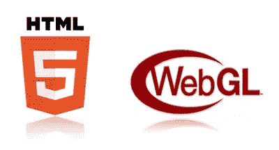

**[加入 Reddit 上的讨论。](https://www.reddit.com/r/webdev/comments/3t0fnx/a_beginners_guide_to_webgl/)**

WebGL (Web Graphics Library)是一个 JavaScript API，用于在任何兼容的 Web 浏览器中渲染交互式 3D 计算机图形和 2D 图形，而无需使用插件。你会经常发现开发者在游戏中使用它，但它最终在网络上获得了广泛的关注，现在正被用于地图可视化、图表数据、甚至演示。

在 2011 年初首次推出，这是类似的 OpenGL ES，OpenGL 的移动版本，但内置于浏览器中。桌面浏览器最近才真正开始支持它，移动浏览器也是如此。我在这里写了它的当前状态(截至 2014 年 11 月)。

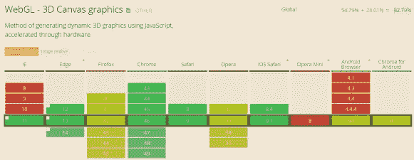

## 有多少人在用 WebGL？

reddit 上的用户 *pyalot* 给我指出了一个跟踪 WebGL 使用和统计的优秀网站:https://webglstats.com/. web GL 统计使用嵌入在其他网站中的跟踪器框架来收集数据。您也可以提供帮助，只需将下面的代码嵌入到您的页面中。

```
 <script src="//cdn.webglstats.com" defer="defer" async="async"></script> 
```

## WebGL 在做什么，我为什么要关心？

与编写简单操作 DOM 的代码相比，WebGL 有三个明显的优势:

*   任务。绘制反光材料或复杂的灯光会产生大量的开销，鉴于 JavaScript 是单线程的且受 CPU 限制，为什么不将其中一些卸载到设备中的 GPU 上，让它来完成繁重的工作呢？
*   性能。利用硬件加速(设备内置的 GPU)，WebGL 非常适合游戏或复杂的可视化。
*   着色器。复杂的视觉效果可以用称为“着色器”的小程序来制作。这可能是简单的产生一个棕褐色的颜色效果，或更复杂的模拟，如水或火焰。请访问 [Shadertoy](https://www.shadertoy.com/) 查看一些真正突出这一点的例子。

## Asm.js 和 Emscripten


Unity 和 Epic 的虚幻引擎，游戏开发人员经常使用的流行中间件工具并不局限于创建作为可执行文件运行的编译应用程序。

Unity 之前有一个[网络播放器](https://unity3d.com/webplayer)，这是一个使用 ActiveX 的可下载插件。Chrome 终止了对 NPAP(网景插件 API)的支持，但是[在一年前就宣布了](https://blog.chromium.org/2014/11/the-final-countdown-for-npapi.html)。

4 月，随着 Chrome 42 stable 的发布，[他们终于把斧子砍向了它](https://arstechnica.com/information-technology/2015/04/chrome-starts-pushing-java-off-the-web-by-disabling-plugins/)。原因有很多，但最明显的是他们说*“挂起、崩溃、安全事件和代码复杂性。”* Google 建议使用 web 标准，比如 WebGL，我将在下面解释。

微软也紧随其后，弃用 ActiveX、VBScript、attachEvent 和其他传统技术，转而支持网络标准。HTML5 时代的功能大大减少了对 ActiveX 控件的需求，这也产生了跨浏览器的可互操作代码。

随着 WebGL 和现在的 asm.js 的出现，开发人员现在可以在浏览器中利用他们计算设备的大部分功能，并进入以前无法进入的市场。

JavaScript 是唯一适用于所有网络浏览器的语言。虽然只有 JavaScript 可以在浏览器中运行，但是你仍然可以用其他语言编写，并且仍然可以编译成 JavaScript，从而允许它也可以在浏览器中运行。这是由一种被称为 [emscripten](https://kripken.github.io/emscripten-site/) 的技术实现的。

Emscripten 是一个基于 LLVM 的项目，它将 C 和 C++编译成 asm.js 格式的高性能 JavaScript。简而言之:在浏览器内部，使用 C 和 C++，接近本地速度。更好的是，emscripten 将 OpenGL(一种桌面图形 API)转换为 WebGL，这是该 API 的 web 变体。

我有关于如何使用 emscripten 的深入教程，以及对 asm.js 是什么的清晰解释。

## 使用 Asm.js 将 Unity 游戏导出到 WebGL

<video class="wp-video-shortcode" id="video-120402-1" width="650" height="400" preload="metadata" controls=""><source type="video/mp4" src="https://sec.ch9.ms/ch9/8c0c/3cbf2afd-1e1b-4978-9923-19d4f7318c0c/EnEdgeExport_high.mp4?_=1">[https://sec.ch9.ms/ch9/8c0c/3cbf2afd-1e1b-4978-9923-19d4f7318c0c/EnEdgeExport_high.mp4](https://sec.ch9.ms/ch9/8c0c/3cbf2afd-1e1b-4978-9923-19d4f7318c0c/EnEdgeExport_high.mp4)</video>

[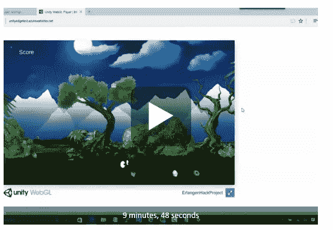](https://channel9.msdn.com/Blogs/2p-start/Host-your-Unity-Games-on-Azure-without-Plugins-step-by-step/player)

## WebGL 展示

### [得分高峰](https://ga.me/games/scorerush)–[Xona Games](https://xona.com/scorerush/extended.html)

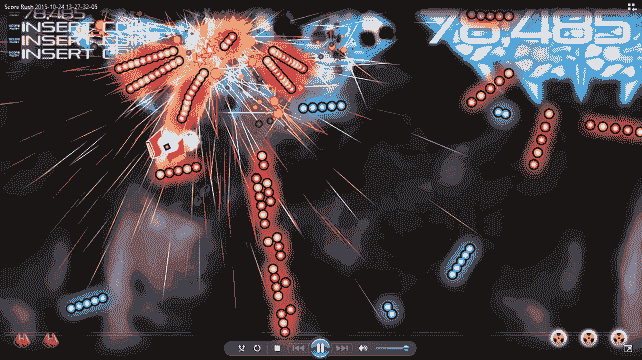

这款 2D 自上而下的射击游戏[正走向 Playstation 4](https://xona.com/scorerush/extended.html) ，但这并没有阻止它首先通过 [Turbulenz](https://biz.turbulenz.com/) 的 WebGL 框架出现在 Xbox 360 上，甚至出现在浏览器中。这款 [Xona Games](https://xona.com/scorerush/extended.html) 游戏每秒运行 60 帧，可以一次在屏幕上绘制数万个粒子。此外，4 人同时合作是可用的，你可以在任何时候下降。谁说浏览器里没有主机级的游戏？

### [杜比音频室](https://dev.windows.com/pt-br/microsoft-edge/testdrive/demos/dolbyaudioexperience/?utm_source=SitePoint&utm_medium=article74&utm_campaign=SitePoint)

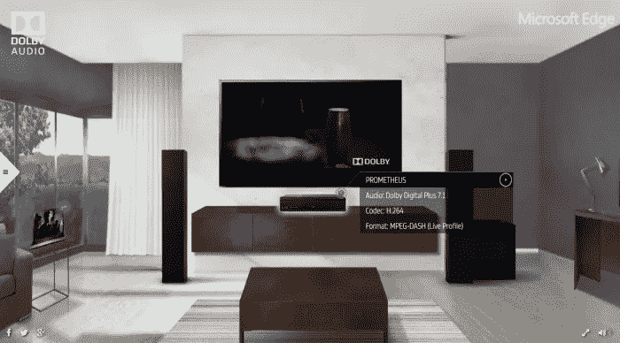

Dolby Audio Room 是使用 WebGL 构建的，旨在提供一个交互式环境，用户可以在其中探索和播放各种媒体设备(媒体 PC、台式机、笔记本电脑和平板电脑)上的内容。每台设备都通过不同的流视频(MPEG DASH H.264 或 HLS)演示杜比音频。该演示目前需要 Microsoft Edge，因为它是第一个包含杜比音频原生支持的浏览器。

### [世界航班](https://www.senchalabs.org/philogl/PhiloGL/examples/worldFlights/)

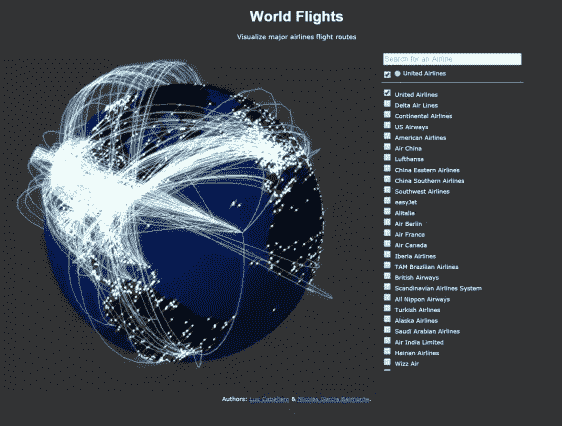

这个演示是由 Sencha Labs 提供的，用来展示 PhiloGL，是一个很好的展示如何使用 WebGL 来可视化数据的例子。在这种情况下，它是活跃在世界各地的航班。

### [垄断——play canvas](https://playcanv.as/p/PCoex5Tt)

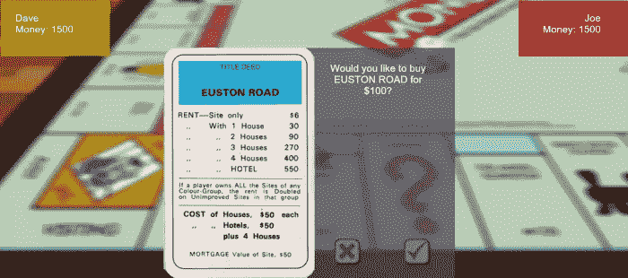

如果你发现有人不喜欢垄断，你让我知道，因为他们是异常。

### [WebGlSamples.org](https://webglsamples.org/)


这个网站有一些很棒的收藏可以玩。我不确定是谁把这个页面放在一起的，但他们是一些整洁的演示，如[书(布料模拟)](https://webglsamples.org/book/book.html)和[电花](https://webglsamples.org/electricflower/electricflower.html)。

## 我如何开始？

以下是创建第一个 WebGL 项目的基本步骤:

1.  创建<*画布* >元素
2.  获取绘图上下文
3.  Initialize viewport
4.  创建缓冲区
5.  创建矩阵
6.  创建着色器
7.  初始化着色器
8.  绘制图元

我知道你在想什么:*“这听起来工作量很大。肯定有更好的办法"*，而且有！看看下面的一些引擎。

## 引擎和框架

### [BabylonJS](https://www.babylonjs.com/?WT.mc_id=16538-DEV-sitepoint-article74)

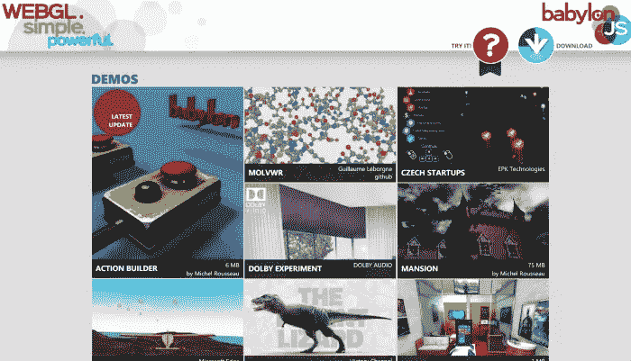

Babylon 是一个开源的免费框架，由微软的几个人创建，作为一个有趣的附带项目。这几乎每天都在更新，甚至提供了一个[沙箱](https://www.babylonjs-playground.com/?WT.mc_id=16538-DEV-sitepoint-article74)来运行和测试你的代码。[这里有一个视频课程](https://mva.microsoft.com/en-US/training-courses/introduction-to-webgl-3d-with-html5-and-babylon-js-8421?l=PjfDpUKz_4304984382/?WT.mc_id=16538-DEV-sitepoint-article74)，分成几个部分，让你开始学习 BabylonJS 和 WebGL。

### [播放画布](https://playcanvas.com/)

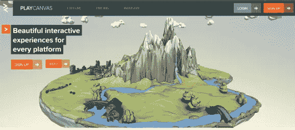

PlayCanvas 是一个开源引擎，它包括一系列选项，包括一个编辑器，可以帮助您可视化所做的更改。他们强调的一些有用的体验包括观看高性能汽车的品牌体验，以及可以注入应用程序的可播放广告。这也是有史以来最大的太空入侵者游戏！

### 湍流

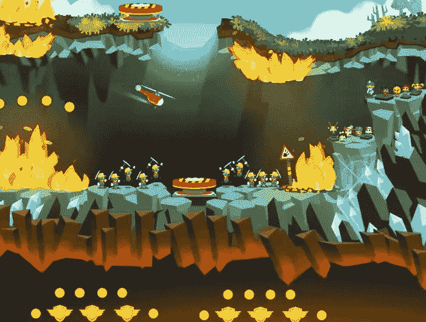

Turbulenz 为开发人员提供了一个 2D 和 3D 引擎，以便在他们的平台上构建、发布和货币化游戏。该工具由电子艺界的前开发人员创建，在 MIT 许可下也是开源的。直接从 Github 公共库下载并构建最新的 [Turbulenz 引擎。这包括从渲染效果和粒子，到物理，动画，音频，输入和网络的一切。他们的](https://github.com/turbulenz/turbulenz_engine)[开发者页面](https://biz.turbulenz.com/developers)为你提供了大量的入门信息。

Turbulenz 的首席执行官詹姆斯·奥斯汀在 Gamasutra 上写了一篇关于引擎[的精彩文章。](https://www.gamasutra.com/blogs/JamesAustin/20130502/191591/Turbulenz_Engine_goes_open_source.php)

### [Pixi.js](https://www.pixijs.com/)

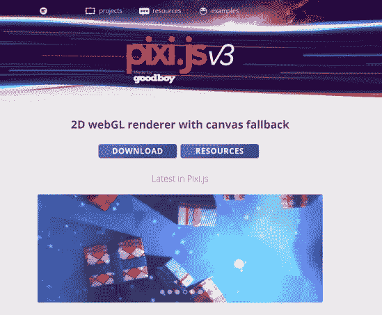

Pixi.js 是一个专注的渲染引擎。还有许多其他引擎，包括游戏、声音和物理等。而且都和 Pixi 配合的很漂亮。它还有许多额外的好处，包括渲染自动检测以在必要时退回到画布，通过位图(sprites)或 webfont 的文本支持，以及资产加载器。

### [Phaser.io](https://phaser.io/)

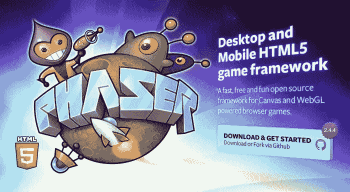

Phaser 也是开源的( [fork it on GitHub](https://phaser.io/download) )，甚至提供了 TypeScript 支持，这是 JavaScript 的强类型版本。我发现这在与熟悉 C 风格语言的开发人员一起工作时非常有用。它也有一些深入的指南，和一个展示 [Phaser 制作的游戏](https://phaser.io/news/category/game)。

### [构造 2](https://www.scirra.com/construct2)

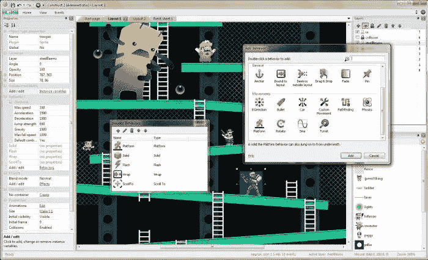

这是我在与高中或大学年龄的学生一起工作时最常使用的框架，他们以前从未编程过游戏，这主要归功于优秀的编辑器。开发人员可以轻松地将其所有资产拖放到场景中，并在一个易于查看的窗格中查看属性。更好的是，它附带了大量的模板和示例来开始使用。Ashley Gullen 也有一篇关于 WebGL 如何与这个程序一起工作的文章。

### [Three.js](https://threejs.org/)

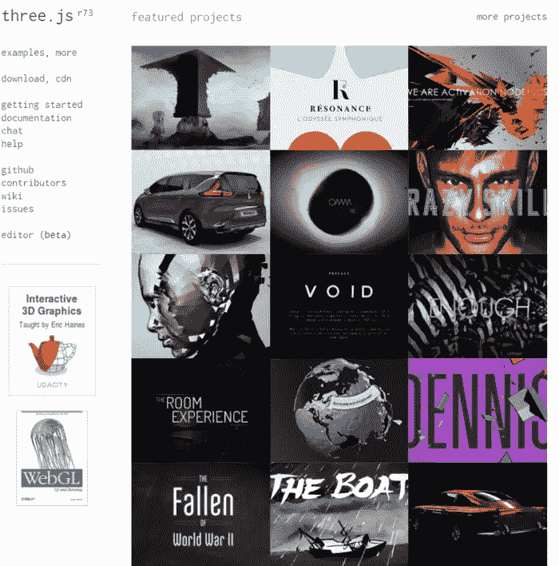

ThreeJS 是一个比较流行的框架，它包含了你运行所需要的一切:渲染、场景、摄像机、动画和灯光。虽然这对大多数事情来说都很棒，但它缺少一个物理引擎，这在创建游戏时会派上用场。Three.js 在麻省理工学院许可下可用。它甚至有一个[编辑器(测试版)](https://threejs.org/editor/)，你可以在里面玩！

### [菲洛格尔](https://www.senchalabs.org/philogl/)

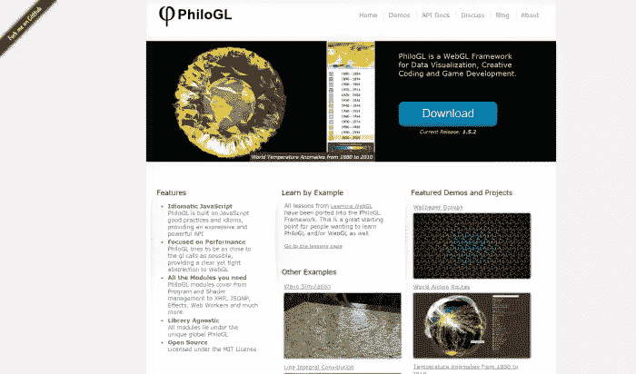

PhiloGL 是一个 WebGL 框架，由 Sencha 实验室的人开发，用于数据可视化、创造性编码和游戏开发。。学习 WebGL 的所有经验都被移植到了 PhiloGL 框架中。对于想学习 PhiloGL 和/或 WebGL 的人来说，这是一个很好的起点。这也是在麻省理工学院许可下授权的。

## 它能在游戏机上工作吗？

[https://www.youtube.com/embed/vz3OZzOP2J4?feature=oembed](https://www.youtube.com/embed/vz3OZzOP2J4?feature=oembed)

与 Edge、[合作的微软项目经理 David Rousset(](https://blogs.msdn.com/b/davrous/archive/2015/11/13/debugging-your-html5-on-xbox-one-ms-edge-with-the-xbox-windows-store-app-and-vorlon-js.aspx?WT.mc_id=16538-DEV-sitepoint-article74)[@ dav rouss](https://twitter.com/davrous?ref_src=twsrc%5Egoogle%7Ctwcamp%5Eserp%7Ctwgr%5Eauthor))本周发表了一篇很棒的博文，展示了 BabylonJS 在 Xbox One 上的运行。

截至 11 月 12 日，[Xbox One](https://news.xbox.com/2015/11/12/new-xbox-one-experience-begins-today/?WT.mc_id=16538-DEV-sitepoint-article74)上有了新的更新。作为一名 web 开发人员，我非常高兴现在有**微软 Edge 在我的控制台**上运行！这意味着您现在可以在 Xbox One 浏览器中运行非常现代的内容！

您还可以使用 VorlonJS 远程调试应用程序。Vorlon.js 是一款开源的跨平台远程调试工具，可以轻松地远程调试任何设备上运行的任何网页。

[https://www.youtube.com/embed/zdiuEwMi8_8?feature=oembed](https://www.youtube.com/embed/zdiuEwMi8_8?feature=oembed)

WebGL 也适用于 Playstation 4。事实上，他们的 [UX 很大程度上是由 WebGL](https://news.ycombinator.com/item?id=6741442) 驱动的。来自索尼首席架构师之一唐·奥姆斯特德:

> 当你登录 PS4 时，你正在运行 [#WebGL](https://plus.google.com/s/%23WebGL) 代码。PlayStation Store、音乐和视频应用，以及 UX 的大部分内容都在浏览器中呈现。
> 
> 我花了很多时间来调整我们的 WebGL 渲染引擎，我将在+ [SFHTML5](https://plus.google.com/102145663597321079477) 上谈论如何在这项工作的背景下优化 WebGL 的使用。将会有很多关于如何加速你自己的 WebGL 应用程序的技巧，所以现在就开始吧。

[https://www.youtube.com/embed/QVvHtWePQdA?feature=oembed](https://www.youtube.com/embed/QVvHtWePQdA?feature=oembed)

来自 Google 开发者的这个演讲很好地概述了它是如何在他们的平台上工作的。[硅角](https://siliconangle.com/blog/2013/11/20/webgl-graphics-technology-powers-sony-playstation-4-ui/)也有很棒的话题文章。

## 播客


如果你喜欢播客，我之前也和几个开发者讨论过 WebGL。

我在芝加哥的同行大卫·贾德(David Giard)有一个视频播客，名为“技术和朋友”。几个月前在费城举行的 MVP 开放日活动期间，我有机会跳上去谈论 WebGL，除此之外，我们还讨论了 asm.js，以及 Unity 和 Unreal Engine 等中间件工具如何使用 asm 来允许他们的应用程序在浏览器中运行。

在我自己的播客上，**独立开发播客，我采访了我的同事大卫·卡图赫([@德尔塔科什](https://twitter.com/deltakosh))，他是微软在雷蒙德的 TED 团队的主要项目经理。他是 BabylonJS WebGL 框架背后的智囊之一，**

## 想了解更多信息吗？

以下是我在互联网上找到的一些学习 WebGL 的较好资源:

*   WebGL 学院
*   [WebGL 基础知识](https://webglfundamentals.org/)
*   LearningWebGL.com

## 更多的 Web 开发实践

这篇文章是微软布道者和工程师关于实用 JavaScript 学习、开源项目和互操作性最佳实践的 web 开发系列的一部分，包括[微软 Edge](https://blogs.windows.com/msedgedev/2015/05/06/a-break-from-the-past-part-2-saying-goodbye-to-activex-vbscript-attachevent/?WT.mc_id=16538-DEV-sitepoint-article74) 浏览器和新的 [EdgeHTML 渲染引擎](https://blogs.windows.com/msedgedev/2015/02/26/a-break-from-the-past-the-birth-of-microsofts-new-web-rendering-engine/?WT.mc_id=16538-DEV-sitepoint-article74)。

我们鼓励您在 dev.microsoftedge.com 使用免费工具进行跨浏览器和设备测试，包括 Windows 10 的默认浏览器 Microsoft Edge:

*   [扫描你的网站，寻找过时的库、布局问题和可访问性](https://dev.modern.ie/tools/staticscan/?utm_source=SitePoint&utm_medium=article74&utm_campaign=SitePoint)
*   [下载适用于 Mac、Linux 和 Windows 的免费虚拟机](https://dev.modern.ie/tools/vms/windows/?utm_source=SitePoint&utm_medium=article74&utm_campaign=SitePoint)
*   [跨浏览器检查网络平台状态，包括微软 Edge 路线图](https://dev.modern.ie/platform/status/?utm_source=SitePoint&utm_medium=article74&utm_campaign=SitePoint)
*   [在您自己的设备上远程测试 Microsoft Edge](https://remote.modern.ie/?utm_source=SitePoint&utm_medium=article74&utm_campaign=SitePoint)

**向我们的工程师和传道者进行更深入的学习:**

*   **互操作性最佳实践** ( [系列](https://channel9.msdn.com/Blogs/BeLux-Developer/Riding-the-Modern-Web-5-things-to-consider-as-a-web-developer/?WT.mc_id=16538-DEV-sitepoint-article74)):

*   [如何避免浏览器检测](https://channel9.msdn.com/Blogs/BeLux-Developer/Riding-the-Modern-Web-Avoiding-Browser-Detection/?WT.mc_id=16538-DEV-sitepoint-article74)
*   [使用 CSS 前缀的最佳实践](https://channel9.msdn.com/Blogs/BeLux-Developer/Riding-the-Modern-Web-CSS-Vendor-Prefixes/?WT.mc_id=16538-DEV-sitepoint-article74)
*   [保持你的 JS 框架&库更新](https://channel9.msdn.com/Blogs/BeLux-Developer/Riding-the-Modern-Web-Dealing-with-JavaScript-Libraries/?WT.mc_id=16538-DEV-sitepoint-article74)
*   [构建插件免费网络体验](https://channel9.msdn.com/Blogs/BeLux-Developer/Riding-the-Modern-Web-Dealing-with-Plugins/?WT.mc_id=16538-DEV-sitepoint-article74)
*   [GitHub 编码实验室:跨浏览器测试和最佳实践](https://github.com/deltakosh/interoperable-web-development/?WT.mc_id=16538-DEV-sitepoint-article74)
*   哇，我可以在 Mac 电脑上测试 Edge & IE 浏览器& Linux！(来自雷伊·班戈)
*   [在不破坏网络的情况下推进 JavaScript】(来自 Christian Heilmann)](https://channel9.msdn.com/Events/WebPlatformSummit/2015/Advancing-JavaScript-without-breaking-the-web/?WT.mc_id=16538-DEV-sitepoint-article74)
*   [用 WebGL 释放 3D 渲染](https://channel9.msdn.com/Events/WebPlatformSummit/2015/Unleash-3D-rendering-with-WebGL-and-Microsoft-Edge/?WT.mc_id=16538-DEV-sitepoint-article74)(来自 David Catuhe)
*   托管网络应用和网络平台创新

**我们的社区开源项目:**

*   伏龙。JS (跨设备远程 JavaScript 测试)
*   [manifoldJS](https://manifoldjs.com/?WT.mc_id=16538-DEV-sitepoint-article74) (部署跨平台托管的 web 应用)
*   [babylonJS](https://babylonjs.com/?WT.mc_id=16538-DEV-sitepoint-article74) (轻松制作 3D 图形)

**更多免费工具和后端 web 开发工具:**

*   [Visual Studio 代码](https://code.visualstudio.com/?WT.mc_id=16538-DEV-sitepoint-article74)(用于 Mac、Linux 或 Windows 的轻量级代码编辑器)
*   [Visual Studio 开发基础知识](https://www.visualstudio.com/en-us/products/visual-studio-dev-essentials-vs.aspx/?WT.mc_id=16538-DEV-sitepoint-article74)(基于订阅的免费培训和云优势)

[用节点编码。JS](https://www.microsoftvirtualacademy.com/en-US/training-courses/building-apps-with-node-js-jump-start-8422/?WT.mc_id=16538-DEV-sitepoint-article74) 与[在蔚蓝云上试用](https://azure.microsoft.com/en-us/pricing/free-trial/?WT.mc_id=16538-DEV-sitepoint-article74)

## 分享这篇文章