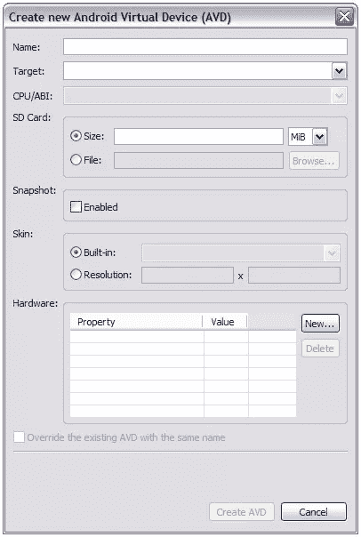
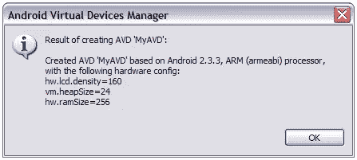
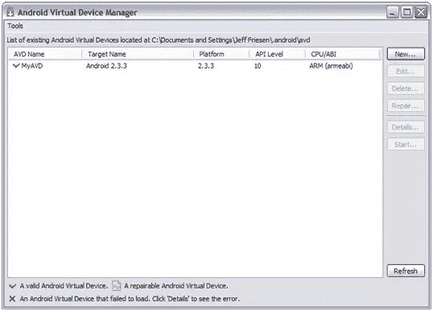

# 开始 Android:创建一个 Android 虚拟设备

> 原文：<https://www.sitepoint.com/beginning-andoid-create-an-android-virtual-device/>

第 4 课:创建 Android 虚拟设备

一个 *Android 虚拟设备* (AVD)是一个使用 Android 模拟器运行的设备配置。它与模拟器一起工作，提供一个特定于虚拟设备的环境来安装和运行 Android 应用程序。第 4 课通过向您介绍 Android SDK 的 AVD 管理器工具，向您展示如何创建 AVD。

### 使用 AVD 管理器创建 AVD

Android SDK 提供了用于创建和管理 AVD 的 AVD 管理器工具。您可以直接运行该工具，或者运行 SDK 管理器并从**工具**菜单中选择**管理 AVDs** 。无论哪种情况，你都会看到如图 8 所示的 **Android 虚拟设备管理器**窗口。

图 8: Android 虚拟设备管理器按照名称、目标名称和其他标准列出了现有的 AVD 条目。

Android 虚拟设备管理器允许你创建、更新、删除、修复和启动 avd。点击**新建**按钮创建一个新的 AVD。这个应用程序通过显示创建新的 **Android 虚拟设备(AVD)** 对话框来响应，如图 9 所示。

图 9:“创建新的 Android 虚拟设备(AVD)”界面让您输入描述 AVD 的名称和标准。

图 9 向您展示了 AVD 有一个名称，针对一个特定的 Android 平台，并具有其他特性。输入 **MyAVD** 作为名称，选择**Android 2 . 3 . 3–API Level 10**作为目标平台，选择 **100** (兆)大小的安全数字(SD)卡。应用程序将它们的数据存储在这张卡的分层结构中。

* * *

**注意:**如果您想要在仿真器执行之间保持仿真器的状态，请选中**快照**部分中的【T2 启用】复选框。这样做可以让您在首次启动后快速启动模拟器。

* * *

图 9 还揭示了您可以选择虚拟设备的*皮肤*(外观)。当您选择**Android 2 . 3 . 3–API Level 10**作为目标平台时，皮肤默认为内置 **WVGA800** 值。此外，它还提供了以下硬件属性:

*   **提取 LCD 密度**，设置为**每英寸 240** 点
*   **最大虚拟机应用堆大小**，设置为 **24** 兆字节
*   **设备 RAM 大小**，设置为 **256** 兆字节

* * *

**提示:**如果你计划在屏幕尺寸设置为 1024 x 768 的平台上运行虚拟设备，你会发现如果不滚动屏幕，你就无法看到虚拟设备的整个屏幕。在这种情况下，你应该将皮肤设置为较低的值，如 **HVGA** (这也将**抽象的 LCD 密度**更改为 **160** )。

* * *

完成这些更改后，点击**创建 AVD** 按钮。您应该会看到如图 10 所示的确认对话框。

图 10: Android 虚拟设备管理器确认您的选择。

点击 **OK** 按钮，关闭该对话框，返回 **Android 虚拟设备管理器**的主窗口。您应该会看到新的 AVD 列表，如图 11 所示。

图 11: Android 虚拟设备管理器展示了新创建的 AVD。

如果你想改变这个 AVD 的特性，在列表中高亮显示它的条目，点击**编辑**按钮。您也可以通过点击**详情**获得 AVD 的描述，通过点击**删除**可以删除 AVD。

### 回顾

以下复习问题有助于测试您对第 4 课材料的掌握程度:

*   你用什么工具来创建一个 AVD？
*   在
    **创建新 Android 虚拟设备** (AVD)对话框的**快照**部分勾选**启用**复选框有什么好处？

## 分享这篇文章