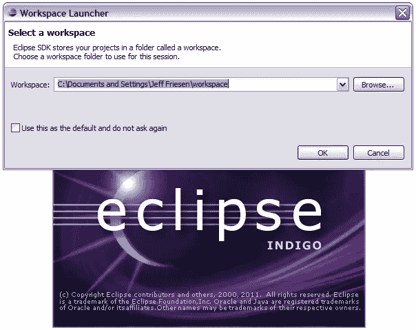
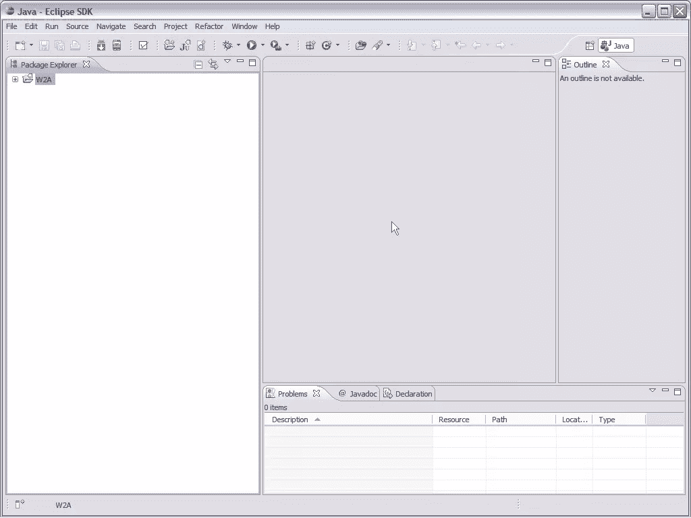
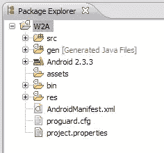
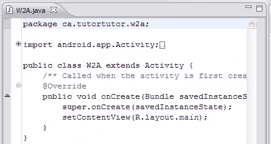
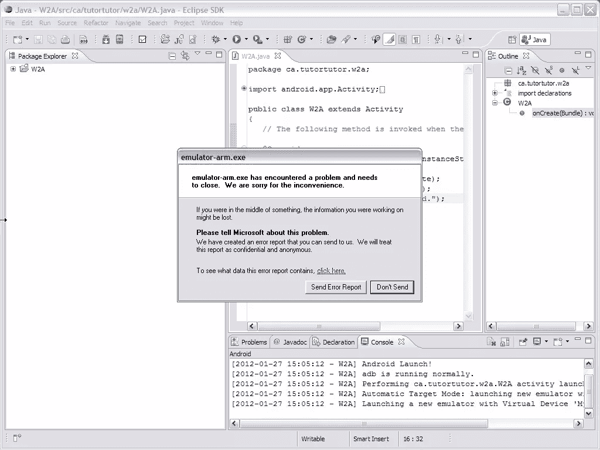
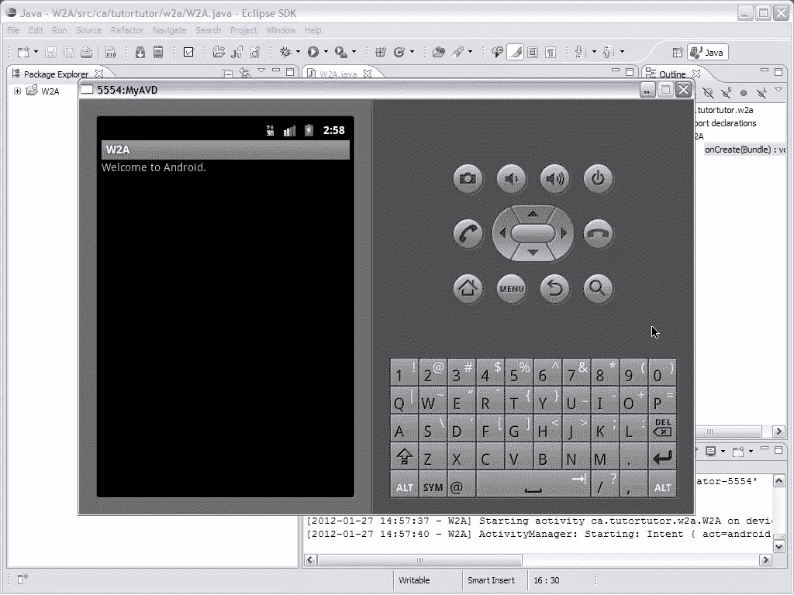

# Android 入门:用 Eclipse 开发应用程序

> 原文：<https://www.sitepoint.com/beginning-android-developing-apps-with-eclipse/>

第 7 课:用 Eclipse 开发应用程序

虽然在命令行开发简单的 Android 应用程序(例如第三课的 W2A 应用程序)并不太难，但你可能会发现在这种环境下开发更复杂的应用程序很乏味。出于这个原因，您可能更喜欢使用 Eclipse 集成开发环境(IDE)。

第 7 课通过教您如何使用 Eclipse 开发 W2A 来完成本课程。首先，您学习如何安装这个 IDE，然后学习如何安装 ADT 插件，它简化了 Android 应用程序的开发和测试。然后，您可以学习如何在这个环境中创建和运行 W2A。

### 安装 Eclipse

根据[谷歌的系统需求](http://developer.android.com/sdk/requirements.html)，你必须安装一个包含 Java 开发工具(JDT)插件的 Eclipse 3.6 (Helios)或更高版本的软件包。Google 建议您安装以下软件包之一:

*   面向 Java 开发人员的 Eclipse IDE
*   月蚀经典
*   面向 Java EE 开发人员的 Eclipse IDE

eclipse.org 网站提供了几个满足不同需求的 IDE 包供下载。我选择下载适用于 Windows XP 平台的 Eclipse Classic 3.7.1。

假设您也在运行 Windows，将浏览器指向 Eclipse Classic 3.7.1 web 页面([http://www . Eclipse . org/downloads/packages/Eclipse-Classic-371/indigos R1](http://www.eclipse.org/downloads/packages/eclipse-classic-371/indigosr1))，然后执行以下步骤来下载并安装这个包:

1.  通过单击本页右侧下载链接框中的链接之一，为您的平台选择合适的分发文件。比如我点了 Windows 32 位。
2.  单击一个下载链接，选择一个下载镜像，并将分发文件保存到您的硬盘上。例如，我将 eclipse-SDK-3.7.1-win32.zip 保存到我的硬盘上。
3.  解压缩发行版文件，并将 eclipse 主目录移动到一个方便的位置。例如，我将 eclipse 移到了我的 C:Program Files 目录中。
4.  在 eclipse 主目录中创建 eclipse 应用程序的桌面快捷方式。这个快捷方式可以方便地启动 Eclipse IDE。

启动 Eclipse。图 20 显示了标识该 IDE 的闪屏。此外，它显示了 Workspace Launcher 对话框，允许您选择一个工作区文件夹来存储当前会话的 Eclipse 项目。

* * *

**注意:**Eclipse 工作区是与工作台实例相关联的磁盘位置，其中工作台是 Eclipse IDE 的运行时实例。工作区包含构成项目的文件、文件夹和其他资源。

* * *

图 20:选中复选框以避免每次启动 Eclipse 时都被提示。

点击**确定**关闭**工作区启动器**。Eclipse 通过执行一些初始化来作出响应，然后显示它的主窗口，如图 21 所示。

图 The Eclipse 3.7.1 IDE 主窗口最初显示一个欢迎选项卡。

主窗口分为一个菜单栏、一个工具栏、一个工作台区域(最初显示一个**欢迎**标签)和一个状态栏。

### 安装 ADT 插件

Android 开发工具(ADT)插件是一个特殊的 Eclipse 插件，方便了应用程序的开发。尽管你可以不用 ADT 插件开发 Android 应用，但你必须直接使用 Android 的命令行工具。你会发现这个插件使得创建、调试和开发这些应用程序变得更快更容易。

ADT 插件具有以下优势:

*   它让您可以从 Eclipse IDE 内部访问其他 Android 开发工具。例如，ADT 允许您访问 Dalvik Debug Monitor Server (DDMS)工具的许多功能，该工具允许您截取屏幕截图、设置断点、管理端口转发，以及直接从 Eclipse 查看进程和线程信息。
*   它的**新项目向导**帮助你快速创建和设置新 Android 应用程序所需的所有基础文件。
*   它自动化并简化了应用程序构建任务。
*   它的 Android 代码编辑器帮助您为 Android 清单和资源文件编写有效的 XML。
*   它有助于将您的项目导出为签名的 APK，然后可以分发给用户。

假设 Eclipse IDE 正在运行，完成以下步骤来安装最新的 ADT 插件版本:

1.  从**帮助**菜单中选择**安装新软件**。
2.  在出现的**安装**对话框的**可用软件**窗格中点击**添加**按钮。
3.  在随后出现的**添加存储库**对话框中，在**名称**文本框中输入 **Android 插件**，在**位置**文本框中输入。点击**确定**按钮。
4.  过了一会儿，你应该在靠近**安装**对话框中间的树状列表中看到**开发者工具**。展开此节点并选中其左侧的复选框。你会发现 **Android DDMS** 、 **Android 开发工具**、 **Android Hierarchy Viewer** 和 **Android Traceview** 子节点也被选中。点击**下一个**按钮。
5.  过了一会儿，一个**安装细节**窗格出现，表示这四个项目将被安装。点击**下一步**，出现**查看许可证**窗格。阅读并接受这些许可协议的条款，然后单击**完成**按钮。
6.  出现一个**安装软件**对话框，让您选择在后台安装这些项目。如果遇到**安全警告**对话框，点击**确定**按钮关闭该对话框并继续。
7.  Eclipse 会显示一个**软件更新**对话框，提示您重启这个 IDE。点击**现在重启**按钮。Eclipse 重启后，您可能会看到一个 **Android SDK 验证**对话框，提示 Eclipse 找不到 C:android-sdk-windows 文件夹。这并不奇怪，因为该文件夹被命名为 C:android-sdk(正如本课程前面安装 sdk 时所指定的)。忽略此错误；你很快就能修好它。点击**确定**按钮关闭该对话框。
8.  从**窗口**菜单中选择**首选项**，打开**首选项**对话框。对于 Mac OS X，从 **Eclipse** 菜单中选择**首选项**。
9.  在该对话框的左侧面板中选择 **Android** 节点。
10.  点击 **SDK 位置**文本框旁边的**浏览**按钮，然后通过弹出的**浏览文件夹**对话框定位你下载的 SDK 的主目录(如 C:android-sdk)。
11.  关闭**后，浏览到文件夹**，在**首选项**对话框中点击**应用**，然后点击**确定**，完成安装。

### 用 Eclipse/ADT 开发和运行 W2A

现在您已经安装了 Eclipse 和 ADT 插件，让我们通过在这个新环境中开发这个应用程序来重温 W2A。我们将从创建一个 W2A 项目开始，该项目通过执行以下步骤来完成:

1.  如果没有运行，启动 Eclipse。
2.  从**文件**菜单中选择**新建**，从弹出的菜单中选择**项目**。
3.  在弹出的**新建项目**对话框中，展开向导树中的 **Android** 节点(如果没有展开)，选择该节点下的 **Android 项目**分支，点击**下一步**按钮。
4.  在出现的**新 Android 项目**对话框中，将 **W2A** 输入到**项目名称**文本字段中——输入的名称标识了存储该项目的当前工作区目录。继续，选择**在工作空间中创建新项目**单选按钮(如果未选择)，并点击**下一个**按钮。
5.  在出现的**选择构建目标**窗格中，确保在**构建目标**下勾选 **Android 2.3.3** ，并点击**下一步**。
6.  在出现的**应用信息**窗格中，在**应用名称**文本字段中输入**欢迎使用 Android** ，替换默认的 **W2A** 值。这个人类可读的标题作为应用程序图标的标题出现在 Android 设备的应用程序启动器屏幕上。(如果愿意，你可以不去管 W2A。)接下来，在**包名**文本框中输入 **ca.tutortutor.w2a** ，选中**创建活动**复选框(如果未选中)，在该复选框旁边的文本框中输入 **W2A** 作为应用程序的启动活动名称，并确保 **10 (Android 2.3.3)** 在**最低 SDK** 下拉列表框中是当前版本——可能是点击**完成**按钮。

Eclipse 在其工作区目录中创建了一个 W2A 目录。W2A 包含以下子目录和文件:

*   。设置:这个目录包含 org.eclipse.jdt.core.prefs，这个文件记录了特定于项目的设置。
*   资产:这个目录存储一个非结构化的文件层次结构。放在这个目录中的任何东西都可以被应用程序通过原始字节流检索到。
*   bin:这个目录存储了创建的 APK 文件。
*   gen:这个目录将生成的 R.java 文件存储在反映包层次结构的子目录结构中(catutortutorw2a)。
*   res:这个目录在各个子目录中存储 app 资源。
*   src:这个目录根据包的层次结构存储应用程序源代码。
*   。类路径:该文件存储项目的类路径信息，以便可以找到项目所依赖的外部库。
*   。project:这个文件包含面向项目的信息，比如项目的名称和它包含的构建者。
*   AndroidManifest.xml:这个文件包含 W2A 的清单信息。
*   proguard.cfg:这个文件包含 proguard 混淆工具的配置数据。
*   该文件包含项目设置。

关闭**欢迎**标签。Eclipse 通过展示图 22 的工作台做出响应。

图 22:工作台展示了孤独的 W2A 项目。

工作台是围绕一个菜单栏、一个工具栏、几个窗口如**包浏览器**和**大纲**、一个为编辑器窗口保留的空白区域和一个状态栏组织的。

**Package Explorer** 出现在左侧，并显示一个可展开的节点列表，标识当前工作区的项目。要了解 Eclipse 如何组织 W2A 项目，请单击位于 **W2A** 节点左侧的“**+”**图标。图 23 展示了一个扩展的项目层次结构。

图 23: W2A 的层次结构被组织成 src、gen、Android 2.3.3、assets、bin 和 res 目录；以及 AndroidManifest.xml 和两个配置文件。

展开 **src** 节点，然后展开生成的 **ca.tutortutor.w2a** 节点。双击产生的 W2A.java 节点**，您将看到图 24 所示的编辑器窗口。**

图 24:W2A.java 源文件的编辑器显示了框架源代码。

用清单 1 的内容替换图 24 的框架源代码(参见[第 3 课](https://www.sitepoint.com/beginning-android-explore-and-build-your-first-app/#fbid=Kwea3E8x1h-))。然后从菜单栏的**运行**菜单中选择**运行**或**运行上次启动**(如果项目之前没有运行过，则显示**运行**而不是**运行上次启动**)。在出现的**运行方式**对话框(第一次运行项目时出现)中，选择 **Android 应用**并点击**确定**。W2A 项目在运行之前就已建成。

图 25 显示了您可能会看到的内容，特别是如果您运行的是 Windows XP。

图 25:试图运行 W2A 可能会产生意外的崩溃。

不幸的是，软件经常写得很差，导致程序崩溃。在这种情况下，罪魁祸首可能是一个有缺陷的 ADT 插件。

经过一些研究和实验，我能够解决这个问题。我必须将 android 主目录的名称从 android-sdk 更改为 Android，更新我的 PATH 环境变量以反映这一更改，并禁用 MyAVD 中的快照设置。我通过使用 AVD 管理器删除 myvd，在不启用快照的情况下重新创建 myvd，并启动 myvd(确保选中**启动选项**对话框上的**擦除用户数据**复选框)来完成最后一项任务。然后，我关闭模拟器，启动 Eclipse，并尝试运行 W2A。这一次，我看到了如图 26 所示的内容。

图 26: W2A 成功安装并运行在 Eclipse 环境中的模拟器上。

### 回顾

以下复习问题有助于测试您对第 7 课材料的掌握程度:

*   Google 推荐哪些开发 Android 应用的 Eclipse 包？
*   ADT 插件提供了什么好处？

## 分享这篇文章