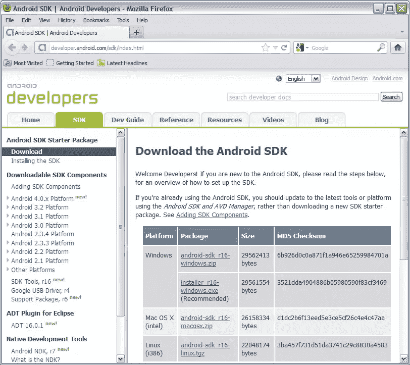

# 开始 Android

> 原文：<https://www.sitepoint.com/beginning-android/>

《Android 入门》是一个由七部分组成的系列，向您介绍 Android 应用程序开发。您将学习如何安装必要的开发软件，以及如何构建和运行您的第一个应用程序。尽管理论保持在最低限度，但你会在适当的时候学到基本的概念。每节课都以一系列问题结束，这些问题旨在加强你对课程内容的理解。

* * *

注对于 Android 的定义和这项技术的概述，我建议您查看“[什么是 Android？](http://developer.android.com/guide/basics/what-is-android.html)[谷歌安卓开发者指南](http://developer.android.com/guide/index.html)中的主题。此外，本课程是在 Windows XP 平台上开发的，但通常也适用于 Mac OS X 和 Linux，只需稍加修改。

* * *

## 安装 Android SDK

Google 提供了 Android SDK 来帮助你开始应用开发。Android SDK 提供了组织各种组件的目录框架，还提供了基本工具和其他项目。第 1 课向您展示了如何通过首先评估系统需求来安装 Android SDK。然后重点下载并运行基于 Windows 的 Android 安装程序可执行文件。

## 评估系统需求

在安装 Android SDK 之前，您必须了解您的操作系统是否受支持，必须安装哪些附加软件，以及需要多少可用磁盘空间。

SDK 支持以下操作系统:

*   Windows XP (32 位)、Vista (32 位或 64 位)或 Windows 7 (32 位或 64 位)
*   Mac OS X 10.5.8 或更高版本(仅限 x86)
*   Linux(在 Ubuntu Linux，Lucid Lynx 上测试):需要 GNU C 库(glibc) 2.7 或更高版本。在 Ubuntu Linux 上，需要 8.04 版或更高版本。64 位发行版必须能够运行 32 位应用程序。有关如何添加对 32 位应用程序的支持的信息，请参见 [Ubuntu Linux 安装说明](http://developer.android.com/sdk/installing.html#troubleshooting)。

SDK 要求安装 Java 开发工具包(JDK) 5 或 JDK 6——您不能使用 Gnu 编译器 Java 版(gcj ),它不受支持。如果你已经安装或计划安装 JDK 7，请记住你不能使用 try-with-resources 语言功能，因为该功能依赖于 Android 不支持的`java.lang.AutoCloseable`界面。您还必须安装 Apache Ant 1.8 或更高版本。该软件用于构建 Android 项目。

Windows 版本的 SDK (release 16)需要大约 50MB 的可用磁盘空间用于其 SDK 管理和基本工具。因为您将使用这些管理工具之一向 SDK 添加更多组件，并且因为这些组件有自己的磁盘空间要求，所以您必须确保有足够的磁盘空间可用。下表列出了这些组件及其磁盘空间要求:

*   Android 平台:描述 Android 特定版本的文件集合。根据谷歌的说法，每个平台需要 150MB 的磁盘空间——新平台可能需要更多空间。必须至少安装一个平台
*   平台工具:构建定期更新的工具，以支持新的 Android 平台特性。因此，它们与 SDK 的基本工具是分开的。Windows 平台需要大约 25MB 的磁盘空间
*   附加组件:Google 或扩展 Android 平台的第三方库。据谷歌称，每个可选的 SDK 插件需要 100MB
*   用于 Windows 的 USB 驱动程序:用于在开发平台和各种硬件设备(例如 Verizon Droid)之间传输文件的可选组件，并且(根据 Google)需要 10MB
*   Samples:包含示例代码的可选组件，并且(根据 Google)需要 10MB
*   文档:一个可选组件，包含用于离线探索的 Android 文档，并且(根据 Google)需要 250MB

## 下载并运行 Windows Android SDK 安装程序

谷歌 T2 安卓开发者网站 T3 上的安卓 SDK 下载页面 T1 提供了对 SDK 的访问。参见图 1。

图一。从 Android 开发者网站的下载页面下载 Android SDK。


你可以为你的 Windows、基于英特尔的 Mac OS X 或基于 i386 的 Linux 平台下载 SDK。如果您的平台是 Windows，您可能会发现下载基于 EXE 的安装程序更容易。我为我的 Windows XP SP3 平台下载了`installer_r16-windows.exe`。运行这个安装程序会显示一个对话框，初始欢迎使用 Android SDK 工具安装向导窗格。

以下步骤完成 SDK 安装:

1.  单击“下一步”按钮，转到 Java SE 开发工具包窗格。
2.  查看将用于 Android 的已找到的 JDK 后，单击“下一步”按钮转到“选择安装位置”窗格。
3.  选择一个合适的目标文件夹或者保持默认的`C:Program FilesAndroidandroid-sdk`——为了方便起见，我把文件夹改成了 C:android- sdk。单击“下一步”按钮移至“选择开始菜单文件夹”窗格。
4.  选择一个适当的 Windows 开始菜单文件夹或保持 Android SDK 工具的默认设置，然后单击安装按钮移动到安装窗格。
5.  安装窗格显示安装进度。安装完成后，此窗格会变成安装完成。单击“下一步”按钮，转到“完成 Android SDK 工具安装向导”窗格。
6.  取消选中或保留选中“完成 Android SDK 工具安装向导”窗格上的“启动 SDK 管理器”复选框。单击完成。

SDK 安装完成后，android-sdk 主目录包含以下目录和文件:

*   附加组件:这个最初为空的目录存储 Google APIs 和来自 Google 和其他供应商的其他附加组件。
*   AVD Manager.exe:该工具用于管理 Android 虚拟设备(使用 Android 模拟器运行的设备配置)。
*   平台:这个最初为空的目录将 Android 平台存储在单独的子目录中。例如，Android 2.2 将存储在一个子目录中，而 Android 3.2 将存储在另一个子目录中。
*   SDK Manager.exe:该工具用于管理 Android SDK(例如，添加新平台或其他组件)。
*   SDK Readme.txt 向您介绍 Android SDK，并告诉您，为了开始开发应用程序，您需要使用 SDK Manager 安装平台工具和至少一个 Android 平台版本。
*   工具:这个目录存储独立于平台的工具。例如，tools 存储了 emulator.exe，这是一个使用特定设备配置启动 Android 模拟器的应用程序。
*   uninstall.exe:该工具用于卸载 Android SDK。

除了`emulator.exe`，您还会发现`sqlite3`(管理由 Android 应用程序创建的 SQLite 数据库)`zipalign`(优化 Android 包【APK】归档对齐)，以及其他`tools`目录工具非常有用。

安装 Android SDK 后，考虑将 android-sdk 的绝对路径和 android-sdktools 的绝对路径添加到您平台的 path 环境变量中。这样，你可以在你的文件系统中的任何地方方便地执行 AVD 管理器、SDK 管理器和其他基本工具，如果你想在命令行开发 Android 应用程序，这尤其有用。

## 复习问题

以下复习问题有助于测试您对第 1 课材料的掌握程度:

*   Android SDK 是什么？
*   SDK 支持哪些操作系统？
*   支持哪些 JDK 版本？
*   编写应用程序时，不能使用 Java 7 的 try-with-resources 语言特性。为什么？
*   确定可以添加到 SDK 中的各种组件。
*   SDK 安装后，Android 的 home
    目录的默认名称是什么？这个目录中存储了哪些目录和文件？

## 分享这篇文章