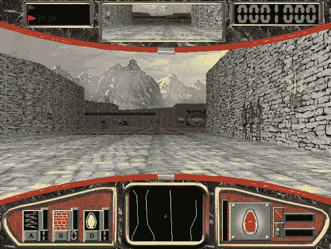
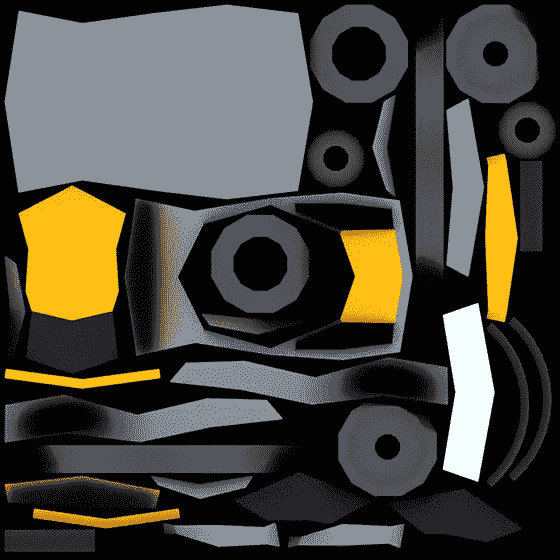
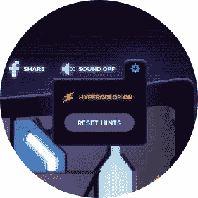
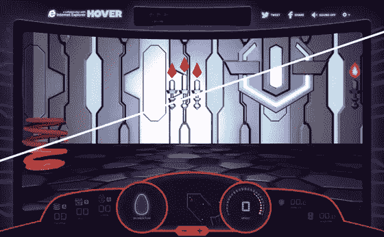

# Hover 和 WebGL 的幕后

> 原文：<https://www.sitepoint.com/behind-scenes-hover-webgl/>

如果你记得 Windows 95 的推出，那么你可能会记得[悬停](http://en.wikipedia.org/wiki/Hover!)。如果你那时有空闲时间，你可能会像[这个家伙](http://www.youtube.com/watch?v=HKj4afxzANg "Hover is Back")一样擅长这个！这一切都是从最初的 Windows 95 安装光盘上的一个免费游戏开始的，作为一种方式来展示在装有 Windows Games SDK 的 PC 上可能发生的事情，即尖端的多媒体和 3D 图形。

因此，有什么比带回一点怀旧情绪更好的方式来展示像 Internet Explorer 11 这样的现代浏览器中的 3D 图形的新功能——使用 [WebGL](https://www.khronos.org/registry/webgl/specs/1.0/) 和 html 5——呢？

你可以下载我们的 [WebGL 样板项目](https://modernie.blob.core.windows.net/assets/webgl-boilerplate-project_2013-10-02.zip "WebGL boilerplate project")并创建你自己的 3D 着色器。游戏开始。

## 使用 HTML5 和 WebGL 将悬停带到浏览器

Hover 是首批在 Windows 上运行的 3D 游戏之一。尽管它的多媒体功能在当时是复杂的，但以现代标准来看，这是一款相当简单的游戏。这使得它成为一个完美的例子，帮助您学习 WebGL 的基础知识，甚至发现您的项目的一些实际应用。3D 思维也可能与编写 2D 游戏大相径庭。如果你对 3D 图形和尖端场景感兴趣，那么这种想法会很有趣。

虽然 WebGL 是一个通用图形库，但它最出名的是其 3D 功能，并且在引入之前，如果不使用插件，就无法在浏览器中渲染真实的 3D 场景。除了游戏，3D 还可以以多种方式用于增强网页和应用程序中的学习和理解。

WebGL 让开发人员直接从 JavaScript 访问现代图形硬件(您计算机的 GPU)的复杂 2D 和 3D 功能。这使得各种令人兴奋的网络体验不需要插件，包括像悬停游戏！更重要的是，WebGL 正在成为主流，随着它在 Internet Explorer 11 中的[引入，它已经在所有主流浏览器](http://msdn.microsoft.com/en-us/library/ie/bg182648(v=vs.85).aspx)中得到[某种程度的支持。使用](http://caniuse.com/webgl)[特征检测](http://msdn.microsoft.com/en-us/hh561717)来检查你的用户是否有支持 WebGL 的浏览器仍然很重要——在 modern 上的[扫描。IE](http://www.modern.ie/report) 将帮助你检查你的网站是否使用了浏览器检测。

## 我们开始吧

### 创造世界

在最初的悬停游戏中，大部分 3D 是以墙壁和地板的形式出现的——应用了透视的扁平物体。物体、工艺品本身、旗帜和其他“拾音器”,如弹簧或刹车灯，在 3D 世界上被渲染为普通的 2D 图像。这些 2D 图形被缩放和定位以匹配 3D 游戏，但没有真正的 3D 处理应用于它们。

现代 3D 场景，包括新的 Hover，由模型、纹理和灯光组成——当你将虚拟“相机”对准它们时，它们就会被渲染出来。以下是每一项的细目分类:

**模型**是场景中物理对象的定义。例如，在 Hover 中，我们为每个飞行器和所有的皮卡创建了模型。这是我们应用纹理或灯光之前这些模型的样子:

常规 2D 图形的基本单位是像素，而 3D 模型的基本单位是多边形，通常是 3D 空间中的三角形。当你把足够多的多边形一个接一个地放在一起时，一个三维物体就出现了(就像许多像素组合在一起形成一幅 2D 图像)。三角形之间的接缝被称为顶点(或单数的“顶点”)，我们稍后将再次提到这些。

**纹理**是“包裹”模特的图像或颜色。他们在模型上画出栩栩如生的画面，让它看起来更真实。这里有一个我们在游戏中渲染一个工艺品时使用的纹理的例子:

如果你仔细观察，你可以看到纹理图像是如何与游戏中“芝加哥”飞船的几何图形相对应的。你可能还会注意到，纹理包含了工艺的颜色，但也包含了一些细节，比如阴影，在某些情况下，颜色的变化会给工艺一种更柔和的“沙”的感觉。

最后，在将模型放置到场景中并应用其相应的纹理后，通过将灯光放置到场景中来完成 3D 效果。一些照明是非常基本的。例如，环境光将以大致均匀的方式照亮整个场景。也可以创建聚光灯、平行光和点光源，所有这些都可以以不同的方式照亮场景中的对象。

### 渲染和着色器

现在您已经定义了场景，您需要渲染它，将 3D 场景定义转换为构成您在屏幕上看到的 2D 图像的像素。这是一个数学密集型操作，但现代 GPU 非常擅长！事实上，像 Hover 这样的游戏中的高帧率动画意味着场景每秒钟被渲染和重新渲染高达 60 次。

因为这些代码需要非常快，所以其中一些直接在 GPU 上执行。这些代码被称为着色器。添加到 3D 场景中的所有对象最终都由两个特殊的着色器处理:顶点着色器和片段着色器。

**顶点着色器**对场景中的每个顶点进行操作，并将顶点从 3D 空间转换到 2D 空间，以便渲染到屏幕上。请记住，顶点定义了模型中两个三角形之间的边界。自定义顶点着色器可以改变 boundaray 在上的外观，可能会使其变形以平滑曲面或创建逼真的效果，如水波纹或波浪。

然后，**片段着色器**(有时称为**像素着色器**)对场景中的每个像素进行操作，并可以执行最终的颜色转换，以增强灯光效果或创建其他效果。片段着色器最终决定了单个片段或像素的颜色！

着色器在浏览器中是独特的，因为它们直接在 GPU 上执行，而不是由浏览器的 JavaScript 引擎执行。这给他们带来了很多乐趣，也给了你很多力量。在 Hover 中，当您在选项下拉列表中启用 Hypercolor 时，您可以看到高级着色器的效果。

**选项下拉列表:**

**超彩色开/关:**

### 创建自己的着色器！

开始使用 WebGL 可能会有点吓人，像许多事情一样，一旦你很好地融入了这个过程，一些真正的乐趣就开始了。为了帮助您加入这个聚会，我们已经创建了一个样板悬停 3D 项目，其中一个场景已经设置好，我们还包括了一个自定义着色器的示例，因此您可以直接跳到有趣的部分！所以[下载它](https://modernie.blob.core.windows.net/assets/webgl-boilerplate-project_2013-10-02.zip "boilerplate Hover 3D project")并且当你告诉你的朋友你花了一下午写自定义着色器代码时，给他们留下深刻印象！

一个注意事项:由于 WebGL 应用程序的某些部分直接在 GPU 上执行，它有一些安全敏感性，因此你只能从与网站其余部分相同的域中加载 WebGL 资源(即，它受 [CORS](http://en.wikipedia.org/wiki/Cross-Origin_Resource_Sharing) 的保护)。您可以在本地运行这段代码，但是您需要设置一个本地 web 服务器。不好意思！原来写着色器终究是要有点骨气的。

### 了解更多关于 WebGL 的信息

网上有很多学习 WebGL 的资源，下面是我们最喜欢的几个:

*   BabylonJS——一个新的框架，有助于使 WebGL 更简单+—一组为展示跨浏览器支持而编写的实验
*   three js-一个受欢迎的 3D 图书馆和收藏
*   learning web GL——可供学习的 101 个项目
*   [MSDN 上的 web GL](http://msdn.microsoft.com/en-us/library/ie/bg182648(v=vs.85).aspx)——Internet Explorer 11 的新功能
*   [WebGL 规范](http://www.khronos.org/registry/webgl/specs/latest/1.0/ "WebGL Specification")
*   [WebGL 工作组](http://www.khronos.org/webgl/ "WebGL - OpenGL ES 2.0 for the Web")

## 分享这篇文章