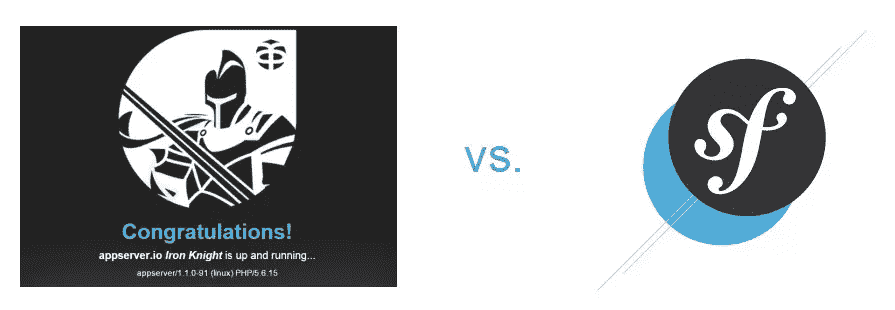
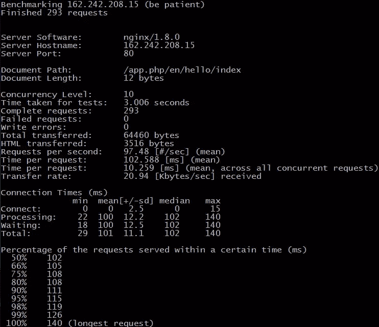
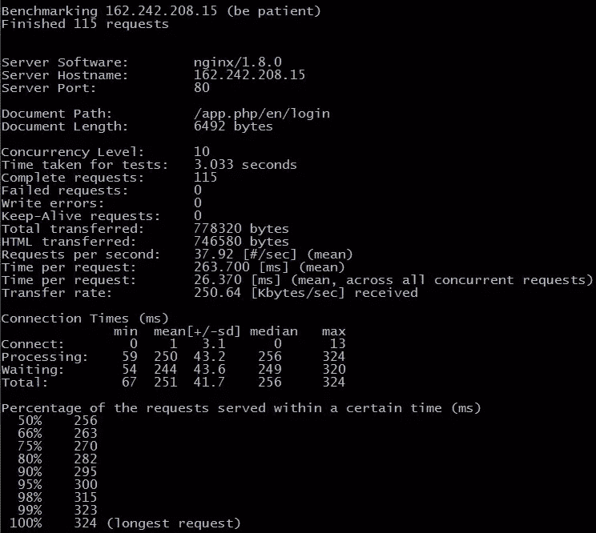
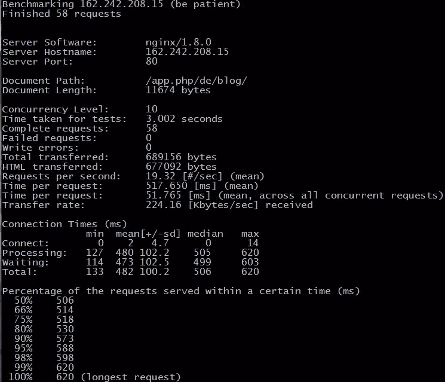
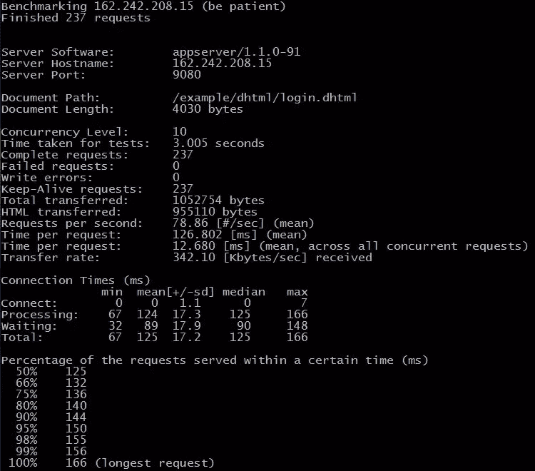
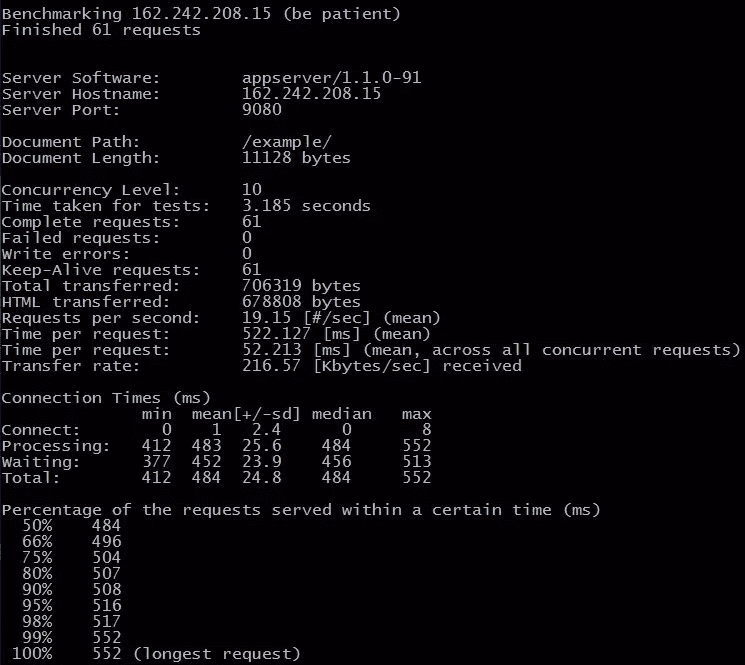

# 基准测试:AppServer 能打败 Symfony 的性能吗？

> 原文：<https://www.sitepoint.com/benchmarking-can-appserver-beat-symfonys-performance/>

在我们的 Appserver 系列第一部分发布之后，通过随后在 [SitePoint](https://www.sitepoint.com/appserver-a-production-ready-php-based-server/) 和 [Reddit](https://www.reddit.com/r/PHP/comments/3gfuh8/a_php_application_webserver_with_inmemory_storage/) 上的讨论，很明显我们已经触动了 PHP 频道大量忠实读者的神经。我也很快意识到这项新的(PHP)技术有很多严重的怀疑者。讨论中最深刻的反应之一是，

> “按照 pthreads 在 PHP 内部工作的方式，appserver 永远不可能像普通的 LEMP 甚至 LAMP 堆栈那样快。”

## 挑战

不用说，那些怀疑和批评的评论听起来像一个真正的挑战。我也很想知道 appserver 将会在哪里登陆，如果它是以另一个著名的 PHP 框架为基准的话。

我决定使用我最喜欢的框架 Symfony 来进行比较。这是因为 appserver 作为一个普通的 PHP 应用服务器，也提供了很多类似于 Symfony 的重要应用功能。这些功能包括依赖注入容器、请求和响应对象、持久化方法等。换句话说，它为开发人员提供了构建 MVC 应用程序的基础，就像 Symfony 一样。

对于那些想知道 pthreads 是什么的人来说，[它是在 appserver 的核心中使用的 PHP 扩展](http://php.net/manual/en/book.pthreads.php)，它允许 PHP 构建多线程的 PHP 服务器环境。如果你不确定那是什么意思，或者为什么它是相关的，请阅读[之前的帖子](https://www.sitepoint.com/appserver-a-production-ready-php-based-server/)。

LEMP 或 LAMP 栈是 PHP 应用程序与 Linux 一起服务的通常方式。

*   **L** inux，Nginx ( **E** ngineX)， **M** ySql 和 **P** HP - > LEMP

*   **L** inux， **A** pache， **M** ySQL 和 **P** HP - >灯

## 方法

这篇文章的基本思想是试图消除对 appserver 性能差的批评，或者至少比 Symfony 这样的框架差得多。

测试是用简单的程序运行的，所以我们可以看到在一个更大的框架之上构建的标准程序的开销。我认为这是任何企业级专业 PHP 应用程序的典型开销。

我们将测试 3 种类型的回答。

1.  直接的“你好，世界”回应。(你好世界页面)
2.  一个没有数据库访问，但是有动态模板(登录页面)的响应(注:为了测试公平，我把 Symfony 演示登录页面的登录页面的所有内容都拿出来了，所以文档长度会差不多。
3.  一个带有数据库访问和模板的页面(内容页面)——注意:为了公平比较，我将 Symfony 博客列表第一页的内容添加到了 appserver 演示应用的项目列表中。

与 Symfony 相比相对容易，因为 Symfony 也可以安装演示应用程序。appserver 演示应用程序不像 Symfony 的博客，而是一种待办事项列表类应用程序。同样，我将 Symfony 博客文章索引页面中的相同内容添加到“待办事项”列表索引页面中，因此页面大小大致相同。

虽然我读到过不应该使用 Symfony 演示进行基准测试，但在这种情况下，我看不出有什么真正的理由不这样做。这两个“演示”都不是为基准测试而设计的，所以它们都有相同的缺点。在这个小练习中，我们想看看 appserver 与类似类型的响应相比如何，无论是动态内容、hello world 还是登录页面。

有趣的是，他们都使用 Sqlite 作为数据库，并在他们的演示应用程序中使用数据库抽象原则。所以，作为系统，它们在这方面也非常相似。

## 设置

我在 Rackspace 上的 1GB 标准虚拟机上运行测试，因此测试将尽可能保持中立。

VM 是通过 [Puphpet](https://puphpet.com/) 创建的，用来构建 Debian Wheezy LESP 堆栈(LESP，因为我们使用的是 SQLite)。我后来手动安装了 Symfony 和 appserver。因为 appserver 的 web 服务器最初通过端口 9080 接受请求，所以并行运行两个系统很容易。Symfony 使用的是 php-fpm 版本 5.6.16，appserver 使用的是自己安装的 php-fpm 版本 5.6.15。我在 Symfony 上使用 PHP5.6，而不是 PHP7，以保持两个系统之间的比较公平，并进行适当的比较。Appserver 目前只附带 PHP5.6PHP7 的 1.2.0 版本将在今年年中到年底的某个时候发布。

为了测试这两个系统，我使用了 Apache Bench，类似于在这个 [PHP 框架基准库](https://github.com/kenjis/php-framework-benchmark)中进行的测试。我还对 10 个并发用户进行了一个三秒钟的测试，只有一点不同。我使用了“-k”keepalive 选项，这是所有 web 浏览器中用于 HTTP 连接的标准。

测试的主要目标是获得每秒的请求数。

我没有测量内存使用情况，因为这种测量在 Symfony 的标准 PHP“无共享”和 appserver 的线程环境之间没有可比性。那将是苹果和橘子的比较。

我为这两个系统所做的唯一优化就是执行部署到生产环境的正式步骤。

## 结果呢

如上所述，我已经将结果分成了三组回答。

### Symfony 的 Hello World 页面

### Symfony 的登录页面

### Symfony 的内容页面

### appserver 的 Hello World 页面

### appserver 的登录页面

### appserver 的内容页面

### 结果图表

### 应用服务器上的 Symfony

为了看看会发生什么，我还在 appserver 上安装了 Symfony。以下是与 LESP(图中的 LEMP)堆栈进行比较的结果。

## 结论

看看 appserver/Symfony 与 LEMP/Symfony 的比较结果，我会说 appserver 中的 PHP webserver 与 Nginx 相比有额外的开销。这是可以理解的。不过说实话，我也猜到基于 PHP 的 web 服务器会比 Nginx 差很多。因此，有了这些结果，我会对开发团队的纯 PHP web 服务器实现的出色工作表示赞赏。

正如您所看到的，一旦 SQLite 数据库出现，它肯定会成为瓶颈。当对 SQLite 的数据库请求出现时，这两种方法都大大降低了速度。

对于登录页面，appserver 胜出。为了呈现页面，它使用 dhtml 模板。我认为这可能显示了 Twig 给 Symfony 带来的开销，尽管 Twig 缓存了模板。

我还敢说，appserver 的 hello world 结果稍差，这是因为 PHP web 服务器的开销，尽管结果实际上非常相似，Symfony 只快了大约 16%。通过与 Symfony 在 appserver 上的对比，结果显示 appserver 的 web 服务器和应用服务器组合在整体上做得很好，加快了处理速度。

我希望这篇短文能消除一些人对 appserver 应用程序性能的不信任。这项技术相当新，但仍然非常有趣，正如我们所看到的，就性能而言，并没有那么差。

重要说明:通过这些测试，我们并没有测试 appserver 的真正优势或长处。一旦应用程序变得越来越大，需要在标准 PHP 环境中不断加载大量的类/服务，我相信 appserver 会比 Symfony 做得更好。我将在以后测试这方面，因为这实际上是线程 PHP 环境的真正卖点。

希望你们中的一些人至少会尝试一下 appserver。上面的结果应该消除了任何糟糕的性能问题，appserver 平台只会随着时间的推移而改进，特别是如果有大量开发人员使用它并测试它的话。

在接下来的两篇文章中，我们将开始动手开发一个 appsever 应用程序。敬请关注更多内容！

## 分享这篇文章