# 14 个最好的 WordPress 主题和插件

> 原文：<https://www.sitepoint.com/best-coming-soon-wordpress-themes-and-plugins/>

注册一个新域名后，你要做的第一件事就是打开一个“即将推出”或“正在建设”的页面。这不仅看起来很专业，而且可以让你开始建立自己的社交追随者或时事通讯订阅者名单。

结合对发布日期的实时倒计时，这是你最终确定新网站时为潜在访问者预热的第一步。只要记得在倒计时中输入一个现实的数字([不像我](http://www.buildyourownwebstore.com/)！).幸运的是，这些计数器不计算负天数，但是你当然不能永远延长它。

下面你会发现 14 个最漂亮、有趣或实用的 WordPress 主题和插件。我编译了一个免费和低价主题和插件的组合，如果可以的话还有一个演示链接。其中一些可以和 WordPress 一起使用，还有一些我认为值得加入的独立模板。

## 再见

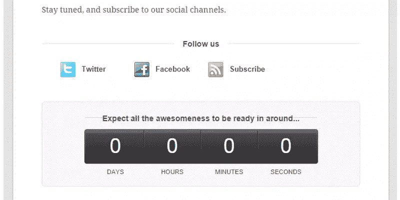

试玩:[buildyouownwebstore 试玩](http://www.buildyourownwebstore.com/)
下载链接: [WooThemes](http://www.woothemes.com/products/see-you-later/)
价格:$39

**描述**
回头见是非常著名的(以前是免费的) [WooThemes 占位符主题](http://docs.woothemes.com/document/placeholder/)的替代品，这是我在自己的一个网站上使用的。WooThemes 把它变成了一个付费的“即将推出”插件，增加了三个额外的主题以及他们质量框架的一部分。你可以链接到你的 Twitter 和脸书账户，以及你的 RSS 源和电子邮件地址。

## 发射者

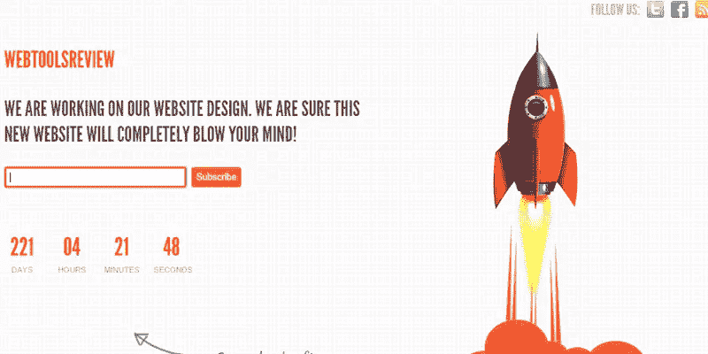

下载链接: [MyThemeShop](https://mythemeshop.com/themes/launcher/)
价格:免费

**描述**
在我看来，Launcher 是最酷的“即将到来”主题。为什么？它有一个移动的火箭！只要把你的鼠标移到演示上，你就成功了。你可以加入你的脸书和推特账户，点击“订阅”按钮，人们就可以订阅 FeedBurner 账户(但你也可以禁用它)。我非常喜欢它，把它放在了我自己的网站上。

## 我的帐户

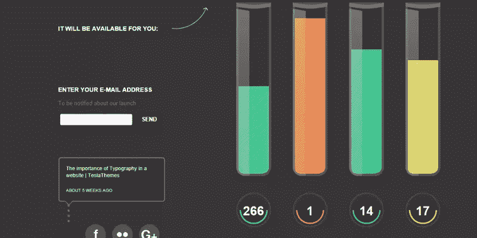

Demo:[TeslaThemes Demo](http://teslathemes.com/live/?item=mycountdown)
下载链接: [TeslaThemes](http://teslathemes.com/wp-themes/mycountdown/)
售价:$29

**描述**
如果你想放一些真正有趣的东西，MyCountDown 是一个很好的主题。我无法在一张截图中捕捉到完整的效果，所以请务必查看演示。它有一个最有创意的倒计时器。它也有一个联系表单，你可以使用流行的 WordPress 小工具，并链接到所有流行的社交账户。这有点贵，但是如果你正在建立一个技术网站，你的访问者会喜欢这个网站的。

## 灵活性

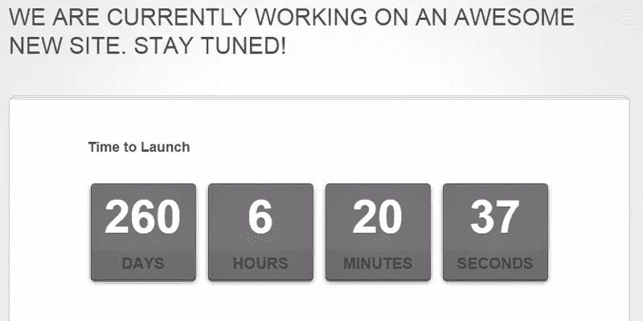

试玩:[主题王国试玩](http://www.themeskingdom.com/demo/lexiity/)
下载链接:[主题王国](http://www.themeskingdom.com/wordpress-themes/lexiity-free-responsive-under-construction-coming-soon-landing-template)
价格:免费

**Description**
lexity 是一个富有动感的主题，采用现代时尚的设计，有不同的颜色可供选择。你可以链接到你的脸书、Twitter、Google+和 Pinterest 账户，但你可能需要戴上眼镜才能找到图标。它还允许一个时事通讯订阅表单，该表单与 MailChimp 集成在一起。您还可以包括一些可点击的按钮。

## 菲利斯

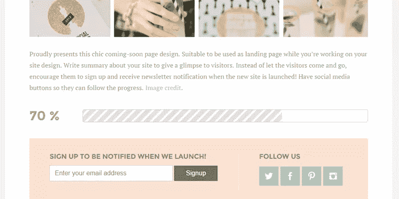

试玩: [Bluchic 试玩](http://demo.bluchic.com/themes/felice/)
下载链接: [Bluchic](http://www.bluchic.com/shop/freebies/felice-theme)
价格:免费

当你在建立一个时尚相关的网站时，Felice 是一个完美的“正在建设中”的主题。它在演示中使用柔和的颜色，但是你可以在后台改变这些颜色。这个主题是响应性的，带有一个漂亮的进度条，而不是一个计数器。你可以链接到你的脸书、推特、Pinterest 和 Instagram 账户。

## 触地得分

Demo(全图背景):[blu chic Demo 1](http://www.11-76.com/themes/touchdown/image-background/)
Demo(Youtube 背景): [Bluchic Demo 2](http://www.11-76.com/themes/touchdown/video-background/)
下载链接: [ThemeForest](http://themeforest.net/item/touchdown-responsive-coming-soon-page/4660002?WT)
价格:$4

**描述**
达阵是一个非 WordPress 的‘即将到来’主题，我不得不把它放在这个列表中。仅售 4 美元(！)您可以拥有这个漂亮的“即将推出”页面。仅仅因为你运行 WordPress，并不意味着你不能把它放在旁边。你可以使用一整页的图片作为背景，甚至是 YouTube 视频。它使用一个计数器，你可以显示 14 个不同的社交账户。使用 YouTube 视频作为背景真的很独特，给你最好的“哇！”所有这些主题的效果。它的底部还有一些信息部分。

## 午餐时间

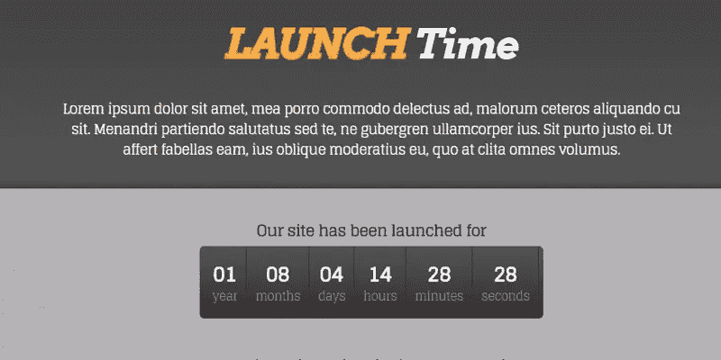

试玩: [ThemeWarrior 试玩](http://demo.themewarrior.com/launchtime/)
下载链接: [ThemeWarrior](http://www.themewarrior.com/theme/launchtime/)
价格:免费

**描述**
用 LaunchTime 恢复正常。如果你打算在你的网站上工作几年，这是一个有相当详细的计数器的主题。它有一个突出的电子邮件注册框，以及一个所有流行社交媒体账户的链接(如果你称 MySpace 为流行的话)。

## 快门

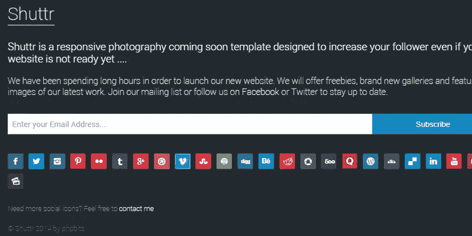

Demo: [PHPBits Demo](http://phpbitsplugins.com/shuttr/)
下载链接: [ThemeForest](http://themeforest.net/item/shuttr-photography-coming-soon-template/7024218?WT)
价格:$6

**描述**
如果你是社交之王，这就是你的首选主题。您可以包含到 24(！idspnonenote)的链接。)社交媒体账号。这是一个独立的布局(不是 WordPress 主题),并且有一个漂亮的方式让你显示一些图片。只需查看演示，并点击“预览画廊”按钮，以了解我的意思。

## 发射台

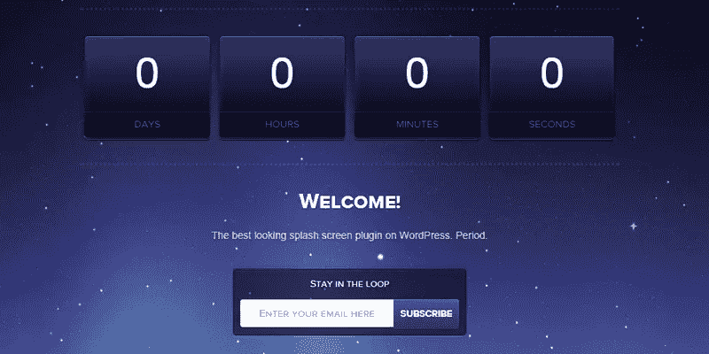

演示: [Oboxthemes 演示](http://oboxthemes.com/product/demo/launchpad)
下载链接:[Oboxthemes](http://oboxthemes.com/plugin/launchpad)价格:免费

**描述**
Launchpad 实际上是一个插件，而不是一个“正在建设中”的主题，但它的工作方式是一样的。这是一个有反应的主题，可以添加你的 Twitter，脸书，WordPress 和 Tumblr 账户。你也可以添加一个时事通讯注册框。您可以配置各种背景、颜色和字体。同样令人欣慰的是，即使是主题开发者也偶尔会忘记延长他的计数器。

## 蒂梅维尔

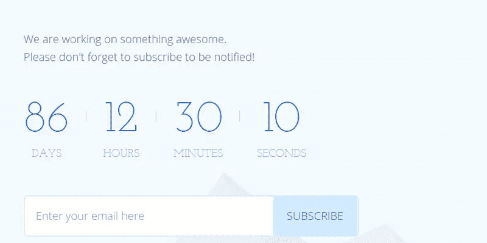

试玩:[多种颜色试玩](http://multifour.com/projects/timeville/countdown/index.html)
下载链接:[主题森林](http://themeforest.net/item/timeville-coming-soon-page/7706925?WT)
价格:$6

**描述**
TimeVille 是最好的基于“建设中”主题的漫画之一。由于这种卡通风格，它的预期观众可能有点有限，但如果你喜欢它，这是最好的主题。这是一个非 WordPress 主题，并带有连接五个社交账户和你的电子邮件地址的选项(除非你是垃圾邮件的忠实粉丝，否则我不会推荐)。这是一个响应式的主题(做得非常好),如果你等待的时间足够长，还会有一些隐藏的噱头。

## 种子产品

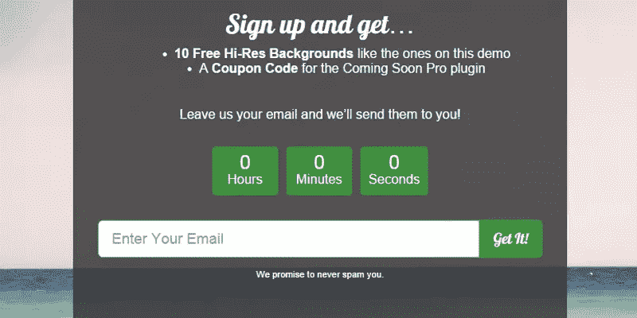

演示: [SeedProd 演示](http://demo.seedprod.com/coming-soon-pro/)
下载链接: [SeedProd](https://www.seedprod.com/)
价格:29 美元一年

描述
SeedProd 是目前为止最专业的“即将推出”的插件，同时看起来也非常惊艳。它有多个时事通讯注册集成(准确地说是 11 个)和一个为客户提供的旁路链接(这样他们就可以看到你实际上正在做的主题)。你不仅可以链接到所有流行的社交媒体账户，还可以显示它们各自的计数器。它还带有大量的设计设置。当你建立了明确的主题后，你可以继续用它来制作登陆页面。

## 马上

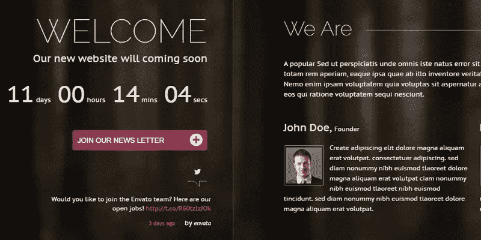

Demo: [Fmedias Demo](http://fmedias.com/straightway/index_dark.html)
下载链接: [ThemeForest](http://themeforest.net/item/straightway-coming-soon-unique-creative-page/6778665?WT)
价格:$6

这是一个非常棒的非 WordPress 主题，仅售 6 美元。不仅仅是当你什么都不做的时候看起来很华丽，等到你点击右边的导航。第一印象怎么样？设置好这一切可能需要一点时间，但是谁会在乎最终的结果有多好呢？

## 及时

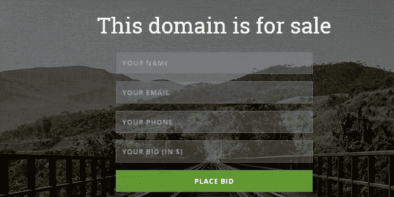

试玩: [WPPrime 试玩](http://demo.wpprime.com/intime/)
下载链接: [CodeCanyon](http://codecanyon.net/item/intime-domain-sale-coming-soon-wordpressplugin/7066355?)
价格:$19

银泰是一个简单而有效的 WordPress“即将推出”插件。在演示中，它被用作“待售域名”页面，非常聪明。你可以链接到脸书、Twitter、Google+、Instagram 和 Vimeo(这是一个有点奇怪的选择)。如果你愿意，你也可以加入一个 YouTube 视频作为背景，还可以选择加入一些信息(底部的小+号)。

## 时间

试玩: [11-76 试玩](http://www.11-76.com/themes/time/video-background/index.html)
下载链接: [ThemeForest](http://themeforest.net/item/time-responsive-coming-soon-page/6510695?WT)
价格:$6

我将用另一个激动人心的非 WordPress 主题来结束这个列表。这不是最用户友好的主题(所有元素都太分散了)，但看起来很棒。你可以使用完整的图像背景或 YouTube 视频，尤其是演示中的视频值得一看(耐心点)。这个主题也有一个覆盖图(右导航),你可以用它来告诉人们更多关于即将到来的事情。总而言之，一个美丽的主题来结束这个列表。

## 结论

当你在你的网站上工作的时候，我总是推荐使用一个“即将到来”的页面。有了这些主题和插件，你可以从卡通到绝对令人惊叹的华丽。并非所有这些主题都是 WordPress 主题和插件，这意味着有些需要一些时间来设置。但是不要让这阻止你使用它们(在你的 WordPress 安装程序旁边运行它们很简单)，或者至少检查它们以获得灵感。

## 分享这篇文章