# 最佳排版 jQuery 插件

> 原文：<https://www.sitepoint.com/best-jquery-plugins-for-typography/>

对于那些利用 jQuery 来增强网站的图形设计人员来说，这个插件集合是专门用于字体增强工具的。如果你还在犹豫是否要实现 jQuery，看看我们的指南“面向设计者的 jQuery 简介”让你从一些小步骤开始。jQuery 为设计者创造了一些独特的机会，让你可以通过排版获得一些令人难以置信的有趣效果——这是任何网站的关键设计元素。

在查看这些插件时，我问的最重要的问题之一是“jQuery 如何处理文本？”我想确保文本没有被修改或以搜索引擎无法理解页面内容的方式处理。如果它看起来很棒，但在搜索引擎方面影响了我的客户，那么我需要用不同的技术来处理这个设计。

考虑到这些因素，这里有一些很棒的 jQuery 插件，可以让你的排版发挥最大作用。让我知道你用的是哪个，恨，爱，还是我错过了一个好的！

* * *

### Lettering.js

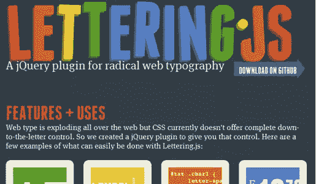

我知道我在[之前的帖子](https://www.sitepoint.com/an-introduction-to-jquery-for-designers/)中推广了这个插件，但是它值得放在这个列表中。注意:Letteringjs 不是一个你可以实现并抛弃的插件。它只是通过将你的文本分成可以在 CSS 中进行样式化的块，使得创建基于 CSS 的令人惊奇的排版更加容易。您可以逐个字母、逐个单词或逐行地设置样式。因此，一旦你创造了效果，对文本块进行惊人的处理就会变得很快。

[来源](http://letteringjs.com/) | [下载链接](http://github.com/davatron5000/Lettering.js)

* * *

### 幽灵类型

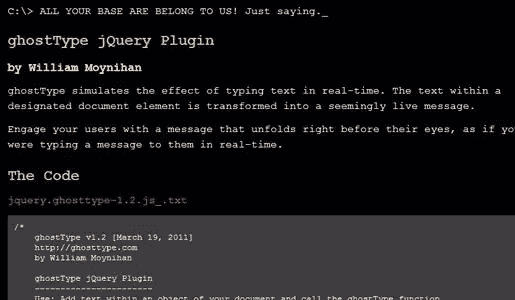

这是一种经典效果，使文本看起来像是在屏幕上输入的。这是引起对页面特定区域注意的好方法，它只是一个类中的一段文本。这意味着文本是完全可读的搜索引擎。

[来源](http://ghosttype.com/) | [下载链接](http://ghosttype.com/js/jquery.ghosttype-1.2.js_.txt)

* * *

### jFontSize

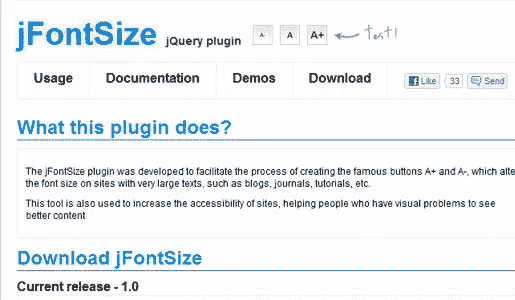

我喜欢这个插件，因为我喜欢提高可访问性。使用这段代码，您可以将文本大小调整按钮添加到您的站点中，以便您的用户可以快速更改您指定的类中任何文本的字体大小。您还可以自定义每次点击时字体大小增加的速度。

[来源](http://www.jfontsize.com/) | [下载链接](http://www.jfontsize.com/files/jquery.jfontsize-1.0.js)

* * *

### 打乱字母

这是一个看起来很酷的文本效果，也可以给你的页面增加一些动感。在下面的源代码链接中，您可以看到该插件的详细介绍，同时也是创建自己的 jQuery 插件的一个很好的例子。您想要混排的文本只放在任何支持“id”属性的标签中(

、、

等)。默认设置很容易实现，但是调整外观也很容易。 

[来源](http://tutorialzine.com/2011/09/shuffle-letters-effect-jquery/) | [下载链接](http://demo.tutorialzine.com/2011/09/shuffle-letters-effect-jquery/jquery.shuffleLetters.zip)

* * *

### jQuery 发光

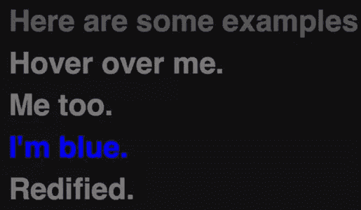

一个很好的翻转效果，字母过渡到你选择的各种颜色。这对于导航条或者你希望用户与之交互的其他元素来说是很好的。它很轻，可以被淡化成一个整洁，微妙的效果。

[来源](http://ajaxian.com/archives/jquery-glow) | [下载链接](https://github.com/nakajima/jquery-glow)

* * *

### jqISOtext

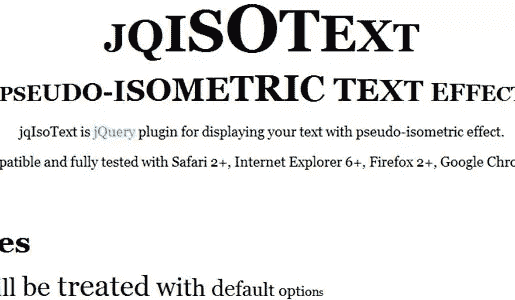

这个插件增加了一个等距效果，使你的文本从一个字母到下一个字母扭曲。如果需要，您可以逐个字母地控制它。这对于标题或者仅仅是有趣的文本样式来说是一个极好的效果。

[来源](#) | [下载链接](#)

* * *

### jQuery 方法

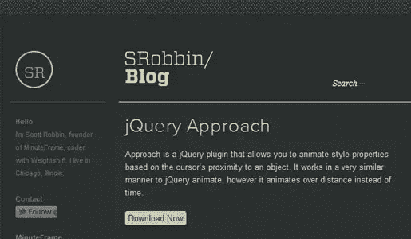

虽然不仅仅是一个排版插件，但是你可以使用 jQuery 方法创建一系列有趣的翻转效果。您可以控制标签中任何基于字符的元素如何增长/收缩和/或改变颜色。这可能是一个很好的导航栏效果。

[来源](http://srobbin.com/blog/jquery-plugins/jquery-approach/) | [下载链接](http://cloud.github.com/downloads/srobbin/jquery-approach/jquery-approach-1.01.zip)

* * *

### 适当的

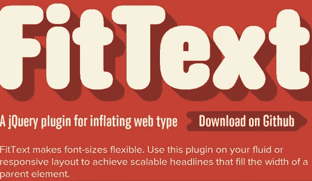

这里我们有一个自动调整文本大小以适应用户屏幕大小的巧妙效果。这是为标题和页眉设计的，它会将文本缩放到父元素的大小。这使得你的标题和头动态和流畅。但是，不要试图将它用于段落文本。它将缩放文本，如果用于大块文本，可能会产生意想不到的结果。

[来源](http://fittextjs.com/) | [下载链接](https://github.com/davatron5000/FitText.js)

* * *

### 新闻播报员

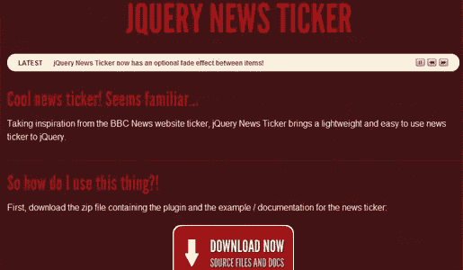

这是一个很好的老式新闻收报机，可以用来提供最新的信息。我喜欢这是非常轻巧，易于使用。另外，内容是搜索引擎可读的。

[来源](http://www.jquerynewsticker.com/)

* * *

### 样式表切换器

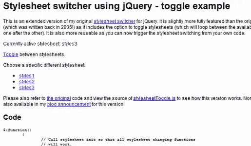

让您的用户能够在各种样式表之间切换！如果你的网站有低对比度的背景和网页副本，这可能是一个可访问性套件的一部分。快速点击一个按钮，背景颜色会改变，字体颜色也会改变。你也可以提供极端的差异。另一个应用是使移动版本和桌面版本可用。总之，这是一个非常简单但强大的工具。

[来源](http://www.kelvinluck.com/assets/jquery/styleswitch/toggle.html) | [下载链接](http://www.kelvinluck.com/assets/jquery/styleswitch/stylesheetToggle.js)

* * *

### Runloop Plugin

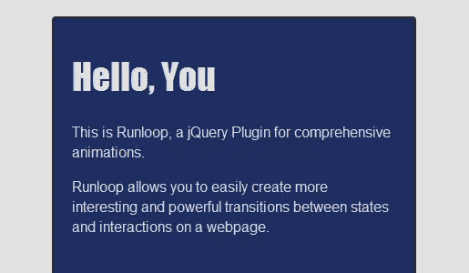

这是一个看似强大的插件，它所做的远比表面上看起来要多。您可以链接多个文本效果，并指定您想要效果开始运行的时间。我会把它归类为高级插件，因为它需要一些代码知识才能正常工作。但是一旦就位，你就可以按照一定的顺序实现许多惊人的效果。

[来源](http://farukat.es/journal/2011/02/514-new-creation-jquery-runloop-plugin) | [下载链接](https://github.com/KuraFire/runloop/)

* * *

### 视差(滚动)

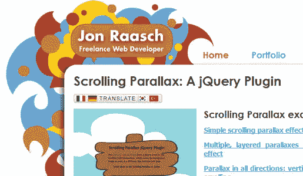

我意识到这不是一个排版专用的插件，但是它对于戏剧性的文本效果非常有用，所以它必须被包括在这个列表中。你可能已经看过那些当你滚动浏览内容时有惊人的 3D 效果的网站。这是一个简单的，轻量级的方法来实现你自己的效果。你可以使用图像和文本来实现它。

[来源](http://jonraasch.com/blog/scrolling-parallax-jquery-plugin) | [下载链接](http://dev.jonraasch.com/scrolling-parallax/download)

* * *

### 视差(悬停)

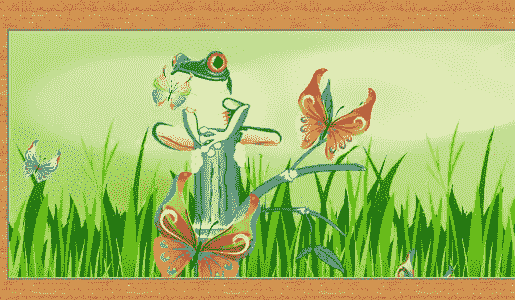

这是另一个视差插件，但它只适用于鼠标悬停，而不是滚动。所以当鼠标移动到应用它的部分时，图像或文本会以戏剧性的方式移动。对于页面的较小部分，您可以应用这种效果来获得漂亮的交互式外观。

[来源](http://www.jquery4u.com/animation/jquery-parallax-tutorial/)

* * *

检查这些插件，并在您的站点上实现一些很酷的 jQuery，祝您玩得愉快！

## 分享这篇文章