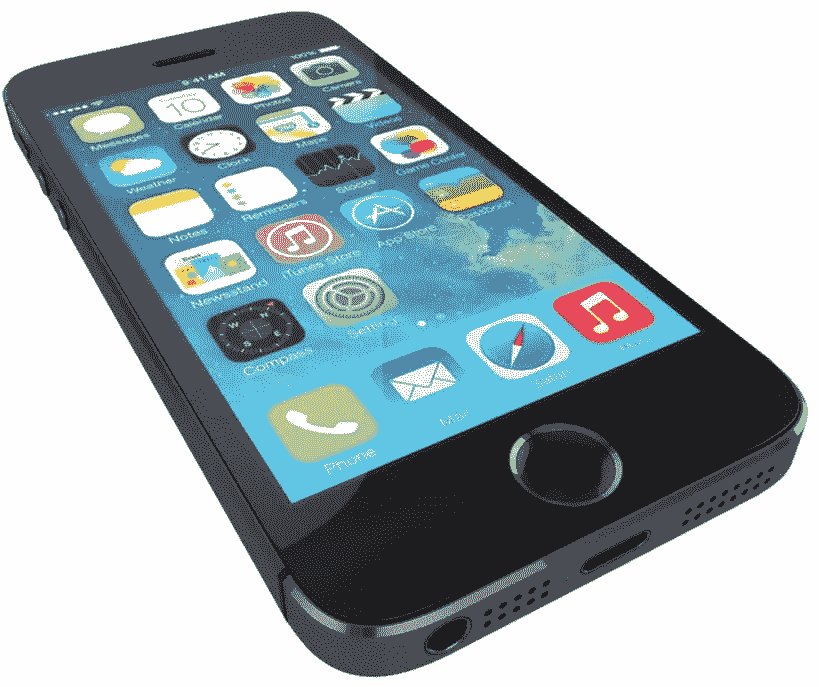
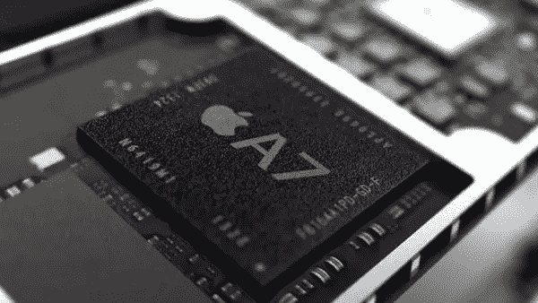
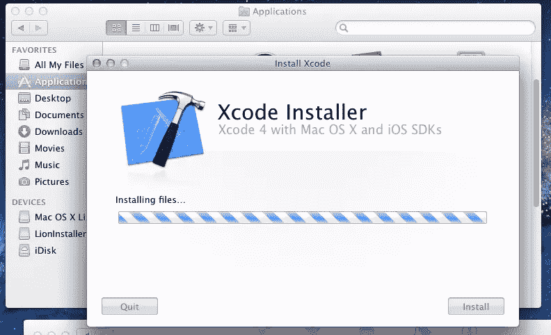
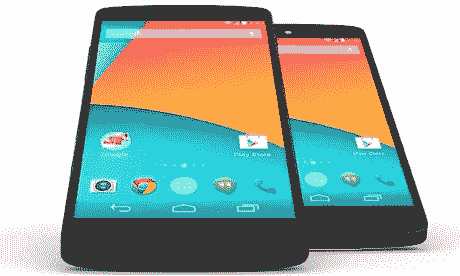
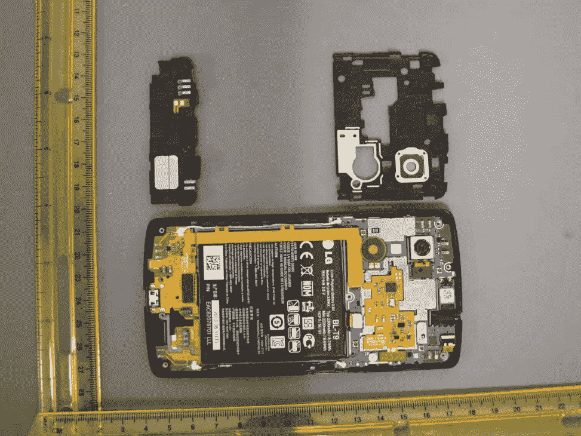
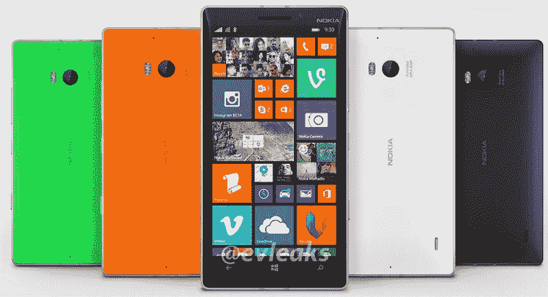
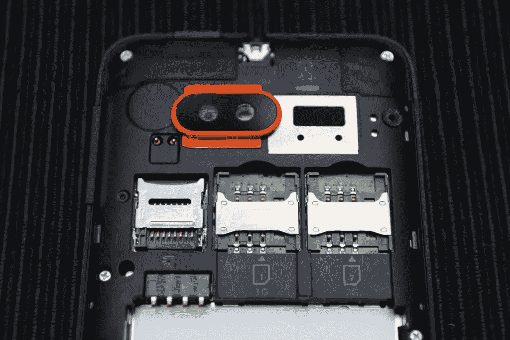

# 最佳移动开发参考设备

> 原文：<https://www.sitepoint.com/best-mobile-development-reference-devices/>

我们都知道，在应用程序开发过程中的某个时候，我们应该开始在真实的硬件上进行测试。模拟器很好地展示了一个应用程序的外观和感觉，但没有什么能胜过真实的东西。对于小开发商来说，购买手机进行测试可能是一项成本高昂的业务。每个操作系统都有一个标准或“参考”设备，你的应用至少应该在这个设备上运行。这些设备是什么？下面我们展示了 iOS、Android、Windows Phone 和 Firefox OS 的设备和有用的硬件规格，这样你就知道如何开始了。

## iOS——iPhone 5s

你可能会想，“为什么不是 iPhone 6？”答案很简单。直到最近，iPhone 6 还没有 5s 那样庞大的用户群。

显示器是一个 4' 1136 x 640 的视网膜，分辨率为 326ppi。它不是市场上最好的面板，但颜色饱和度、对比度、亮度和视角是你会发现的最好的。

5s 上的主摄像头有一个 800 万像素的传感器，具有 f/2.2 的光圈和一项名为 Flash True Tone 的新技术。这项技术是两个 LED 闪光灯，具有不同的光温度，从而产生更自然的图片。它可以录制 120 fps 的视频，最大分辨率为 720p。对于开发下一个自拍应用程序的人来说，前置摄像头有一个 120 万像素的传感器和 1.9 微米的光圈。

iPhone 5s 有四个硬件按钮——电源、音量、静音和一个 Home 按钮，该按钮兼作触控 ID 传感器，用于身份验证。

对于那些开发非常低级应用程序的人来说，iPhone 5s 运行在 1.3 GHz 的 A7 ARM 双核处理器上。它是第一款基于 64 位技术并采用 ARMv8 架构的手机处理器。它有一个 M7 协处理器来处理来自运动传感器的数据。

iPhone 5s 只有 1GB 的 RAM，最多支持 LTE 频段。iPhone 5s 无论如何都不能扩展。

它的电池是集成的，不可拆卸，1570 毫安时。平均使用 8 小时左右。

当然，即使有了物理 iPhone，你仍然需要一台 Mac 来运行 Xcode。如果你想在 Windows 或 Linux 上开发，有一些苹果官方不支持的替代软件，比如 Windows 端的蜻蜓 SDK，或者 Linux 端的 Forge。

随着 iPhone 6 的发布，你可能会发现越来越多的 iPhone 5s 型号以好价格出售。

## Android——Nexus 5

Android 的本质使得挑选一款参考手机相当困难，但通常 Nexus 系列的最后一款是“官方”设备，将提供最“真实”的 Android 体验。

显示器是无边框的 4.95 英寸 LCD IPS 面板，全高清，445 ppi。显示器的整体清晰度和亮度令人印象深刻，但感觉不像 AMOLED 面板那样“饱满”。

该相机是一个 800 万像素的相机，以 3264×2448 的分辨率拍摄照片，并配备了自动对焦和稳定器。前置摄像头 130 万像素。

对于任何硬件开发人员来说，Nexus 5 的主摄像头周围有一个磁环，可以让你连接额外的小工具，比如那些由 [Photojojo](http://photojojo.com/store/) 制造的小工具。

Nexus 5 有两个硬件按钮——音量和电源按钮，其他都是软按钮。

它的处理器是极客的梦想，一个主频为 2.3 GHz 的 Snapdragon 800 四核处理器，再加上伟大的 Adreno 330 GPU。

Nexus 5 配备了 2 GB 的内存和完整的 LTE 频段支持。这为许多高要求的应用带来了令人印象深刻的性能和流畅的感觉。然而，这可能会让你认为你的应用程序比它实际的架构更好。Nexus 5 无法以任何方式扩展。

它的电池是一个集成的不可拆卸的 2300 毫安时电池，平均使用时间约为 12 小时，并支持无线充电。

Nexus 5 目前的价格约为 300 美元，但随着 Nexus 6 的即将推出，它很可能很快就会大幅打折。

## windows Phone–诺基亚 Lumia 930

Lumia 930 是诺基亚被微软收购后推出的第一款手机，也是第一款运行 Windows Phone 8.1 的智能手机。

诺基亚采取了不同的方法来制造 930，在我看来，这是迄今为止最好的 Lumia。

显示屏为 5 英寸 AMOLED 全高清显示屏，分辨率为 441 ppi。该显示器质量高，即使在阳光充足的情况下也能保持高可见度。

Lumia 930 拥有与 Nexus 5 类似的规格，采用主频为 2.2 GHz 的 Snapdragon 800 四核处理器，Adreno 330 GPU，2 GB 内存和全频段支持。无论如何都不能扩大。

摄影一直是诺基亚的强项，Lumia 930 也不例外。它有一个采用 PureView 技术的 Carls Zeiss 光学相机，2000 万像素 4992×3744 pic 分辨率，2.4 微米光圈和机械稳定功能，加上双闪光灯系统和 120 万像素前置摄像头。

Lumia 930 有三个硬件按钮——电源、音量和一个专用的相机按钮，所有其他按钮都是软按钮。

2420 mAh 不可拆卸电池平均使用约 12 小时，并具有无线充电功能。

定价约为 450 美元。

## 火狐操作系统——火焰

Mozilla 将其视为未来中端产品的参考手机，Flame 的规格似乎比这一轮中的其他手机低得多，但其目标受众和开发方法非常不同。

它由阿尔卡特生产，主要由塑料制成，但似乎并不太便宜。

显示屏是一个 4.5 英寸的 FWVGA 多点触摸显示屏，分辨率为 854×480。即使它听起来没有什么特别，但它反应灵敏，色彩饱满，充满活力。

主摄像头是 500 万像素，配备自动对焦和单闪光灯。正面是 120 万像素。

flame 有三个硬件按钮——电源、音量和一个 Home 键。

Flame 运行在双核骁龙 MSM8210 上，主频为 1.2 GHz，内存为 1 GB。它包括 8 GB 的内部存储器，并可以通过 microSD 卡扩展到最大 32 GB。这款手机支持双卡，第一个支持 3G，第二个支持 2G。

1800 毫安时的电池，结合轻便的系统，将提供超过一天的平均使用量。

火焰售价 170 美元。

## 分享这篇文章