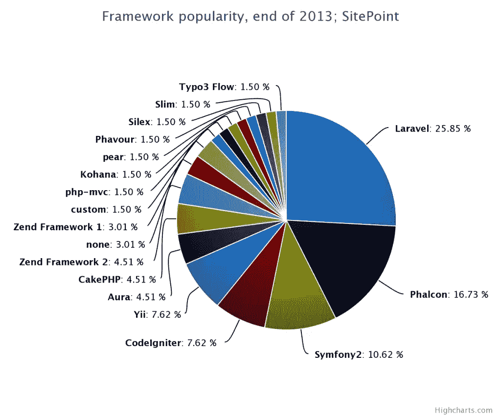

# 2014 年最佳 PHP 框架

> 原文：<https://www.sitepoint.com/best-php-frameworks-2014/>

*更新:如果你想参加 SitePoint 的下一次高收益调查，请在这里为你最喜欢的 IDE [投票。该调查的目的是评估 PHP 社区，并根据性别、位置、技能水平等找到当今最流行的 IDE。](https://www.sitepoint.com/best-php-ide-2014-survey?ref=b5mgijprkc)*

年底即将来临。在过去的 365 天里，PHP 世界发生了很多变化，PHP 框架场景比以往任何时候都更加密集。每个人和他们的狗似乎都有一个好框架应该是什么样子的想法，但是最后，我们甚至知道哪些框架实际上最终被用于生产项目吗？有多少人超越了成千上万人在其中做一个演示应用的阶段？

在过去一周左右的时间里，我们进行了一项小型调查(PHP 周刊也提到了这一点)，我们提出了这些问题，以决定哪些框架在 2014 年最值得我们关注。参与的先决条件仅仅是在一个以上的框架中有经验，因为如果一个人只在一个地方喝过酒，问他最喜欢的酒吧是什么是没有意义的。

不幸的是，很大一部分答案不得不被丢弃，因为人们要么拒绝 WordPress 和类似的套件不是框架的概念，要么仅仅是因为公然无视说明——许多回答是由只在一个框架中工作过的人写的。虽然他们对这种选择框架的热情值得关注和钦佩，但最终结果可能会因这种方法而扭曲，很难称之为客观。

## 结果摘要

在丢弃无效回答并手动验证每个参与者后，我们得到了以下数据:

根据调查结果，2014 年最有希望的**框架似乎是:**

*   拉勒韦尔
*   法尔孔
*   symphony 2

Yii 和 CodeIgniter 似乎并列第四。

在剔除了明显的垃圾邮件之后，Laravel 的结果必须被过滤得最多。超过一半的投票给 Laravel 的人没有熟练程度的证明，或者只有 Laravel 的经验，不得不被抛弃——尽管如此，它仍然占了上风。

从答案来看，平均而言，Laravel 社区似乎更倾向于容易进入——几乎没有学习曲线。这是好是坏是另一个时间的讨论，因为我们最终陷入“PHP 是坏的”混乱，主要是因为一大群新手认为它很容易进入市场，但优秀的文档，大规模的社区支持和开发速度肯定对它有利。另一个经常提到的优势似乎是一个活跃的、令人印象深刻的 IRC 频道，在那里可以立即得到帮助。

一个有趣的误解似乎是 Laravel 负责作曲。许多投票者，不管是被抛弃的还是有效的，都提到 Composer 是 Laravel 的主要优势，还有雄辩的 ORM 和刀片模板引擎，这完全是奇怪的，因为 Composer 是一个完全不知道它所使用的框架(如果有的话)的包管理器。要了解更多信息，我强烈建议有疑问的参与者阅读一些我们的作曲家文章，比如[这篇](https://www.sitepoint.com/re-introducing-composer/)。尽管如此，我只在演示项目中尝试过 Laravel，这次调查的结果激起了我足够的兴趣来构建我的下一个 it 生产项目，由 HHVM 提供支持。

Phalcon 的主要优势是性能优于其他框架，并且该框架是一个如此全面的包(ORM、模板引擎、PHQL 等等——都在一个包中——很少甚至不需要第三方库，这意味着所有东西都在内存中，基于 C，速度超快)。一些回答者指出，它作为一个扩展安装是一个优势，因为安装过程从严肃的开发者中剔除了业余爱好者，我个人倾向于同意这一观点。当提到缺点时，Phalcon 最大的缺点也是它最大的优势——用 C 语言编写，几乎不可能在引擎盖下检查。

Symfony2 被吹捧为该系列中最模块化和可扩展的，并且功能最完整，主要是因为它包含了 Doctrine2。然而，它的投票者似乎能够承认，由于这种丰富的特性，它有时相当臃肿和缓慢。

有趣的是，两个 ZF1 回答说，由于工作情况，他们被困在上述框架中——他们的团队或 CTO 拒绝切换到更现代的东西。

## 值得注意的答案

在有效的答案中，以下是一些足够详细的值得转贴的答案:

[纳瓦尔](https://github.com/navarr?tab=repositories)说道:

> Yii 内置的 ActiveRecord 和迁移系统使数据库的版本控制变得容易，使用对象的开发变得快速而轻松。这需要花很少的时间来学习，但之后会变得超级简单——变得物有所值

[@amitgupta](http://twitter.com/amitgupta) 说:

> 我已经使用 CodeIgniter 很多年了，但最终还是没有提供我需要的东西。我需要一个有点全栈的框架(所以像 Slim，Silex 这样的微框架被淘汰了)，很少或没有学习曲线(就像 CI 一样)，它有一个整洁直观的 API，在成熟的设计模式上编写的可靠代码，它不会将我束缚在一个思维模式中，它很快，有很好的文档，它允许 TDD 而不大惊小怪，并且有一个很好的社区和资源可用。这也是一个允许我很容易地偷看引擎盖下，所以我可以看到什么地方发生了什么(这排除了 Phalcon，因为它的来源是在 C)。Laravel & Symfony 非常接近，但我最终选择了 Laravel，因为我更喜欢它的工作方式。

[panique](http://twitter.com/simplephplogin) 没有使用列出的任何一个，并说:

> 大多数框架只是太先进了，使得非专业开发人员或前端人员很难快速构建好的东西，所以我总是在寻找一个赤裸裸的、完全精简的 PHP 准系统应用程序。php-mvc 解决了这个问题，将学习曲线减少到总时间不到 30 分钟，同时仍然非常专业和自我解释。

[+Jream](http://google.com/+Jream) 这样说费尔康:

> 提供了我需要的所有核心组件，让我的 ORM 变得又快又漂亮。它功能丰富，速度惊人，并有惊人的文档。

克里斯·汤普森在谈到他对 ZF2 的选择时证明了曝光度和名字在 PHP 世界中的重要性:

> 我已经从以前的项目中熟悉了 ZF1。ZF2 似乎是我们下一个项目最合理的选择。我们对大多数其他框架没有任何经验或了解。我们所知道的比 ZF2 有更少的文档、例子和在线帮助。

[彼得·奈森](http://twitter.com/ptnijssen)解释道:

> 在 CodeIgniter 工作了 4 年。总是很适合我，我写了一些火花。总是一个很好的快速框架。好用。由于 CodeIgniter 不再继续，当 PHP 取得一些重大进展时，我联系了 Laravel。立刻就喜欢上了它，并且一直爱到现在。一个工作出色并且对开发者非常友好的框架。在我的日常工作中，我们将一切从 CodeIgniter 迁移到 Symfony。在我的个人生活中，我会选择拉弗尔，而在职业生活中，我会选择 symfony。Laravel 对开发人员更加友好，开发起来轻而易举。Symfony 给了我更多的信任，因为他们已经证明了自己多年。当然，两者都包含了 Laravel 使用 Symfony 部件的相似之处。

[Thiago Colares](http://facebook.com/thicolares) 选择 TYPO3 流量:

> 架构-适用于领域驱动设计。依赖注入。使用条令 2 ORM。高级模板引擎(流体)。强大、活跃、技能娴熟且乐于助人的社区

Rob Keplin 这样描述费尔康:

> 它利用了其他流行框架的特性，如事件管理，一个易于使用的 ORM，同时提升了 DI 并利用了新的 PHP 特性，如本地名称空间。因为它是作为扩展构建的，所以框架的开销很小。更不用说文档有助于轻松学习。唯一的缺点是可移植性，我不能在开发时挖掘库代码。但我真的很兴奋看到它成长并变得更受欢迎。

…然后[肖恩·M](https://plus.google.com/109405554110864141449/posts)补充道

> Phalcon 使正确设计现代 web 应用程序变得容易，并使错误设计变得困难。使用直接注入，创建完全端到端测试的软件非常容易。一个 ORM，它做出明智的默认选择，具有很强的可扩展性和可配置性，多种缓存策略，以及内置的 DB 库，用于大量的帮助程序，以实现简单的水平可伸缩性。通过为所有请求使用用 C 编写的共享库，实现了巨大的速度提升和微不足道的内存使用，您将获得一个真正令人愉快的工作环境和绝对的生产主力。

[@DwightConrad](http://twitter.com/dwightconrad) 关于 Laravel:

> Laravel 使用 Symfony 框架的可靠、经过测试的组件以及其他流行的包来提供一个现代框架，该框架提供了简单的约定，利用了现代编程模式，并使开发变得轻而易举。令人耳目一新的是，PHP 被用作一种现代编程语言，其框架从 PHP 社区之外的一些知名人士那里获得了启示。

Stanlemon 偏爱 Symfony2:

> 在建筑上，我更喜欢 Symfony 2。我认为它在组件化方面的尝试是令人钦佩的，捆绑包的整体方法也很出色。有时它会让人觉得臃肿，有时我希望它更固执己见，但总的来说，它是唯一的全栈框架，只能让我以自己想要的方式完成工作。教条 2、Twig 和 Monolog 以及功能测试的强大方法的使用只是进一步鼓励使用它。

## 编辑的选择

众所周知我是费尔康的粉丝。我已经在大型企业项目中使用 Zend 1 和 2 很多年了，我也曾使用过 CodeIginter。在测试了(没有商业经验)列表中的所有框架后，我得出的结论是，在内心深处，它们都非常相似(除了 Zend，它就像一个疼痛的拇指一样突出)。正是在这种认识的基础上，我将所有的注意力转移到了性能/健壮性比率上，并找到了 Phalcon。Phalcon 在之前的文章中已经有足够的介绍了——可以说，在内存中预装这样一个速度极快的框架会为你的云账单带来奇迹(无论你使用 AWS、Azure 还是任何其他软件——实例时间被愉快地砍掉了——在未来的文章中会有更多的介绍)。

事实上，它比其他的更难安装(在共享环境中几乎不可能)，这也确保了这个社区是一个核心社区，充满了对它真正感兴趣的人，他们不会被基础知识所束缚。这意味着一个组织更紧密，但知识更丰富的团体。

## 结论

那么，2014 年哪种框架最有希望呢？新的一年你该换哪个？值得吗？这完全取决于你——一如既往，取决于你的舒适程度、项目要求以及你学习新事物的时间。

唯一错误的选择是将自己局限于单一的框架。多样化，尝试，贡献。走出你的舒适区，尝试新事物——没有其他的成长方式。也许明年，你会投不同的票！

我想亲自感谢您参与调查，并成为我们的读者。我们希望在 2014 年为您带来越来越多的精彩文章，并期待与您分享我们优秀作者的知识。SitePoint 的整个团队祝您新年快乐，节日愉快！最困难的时候见！

有兴趣让你的 PHP 技能更上一层楼吗？[可学会员资格](https://learnable.com/join?utm_source=sitepoint&utm_medium=referral&utm_content=best-php-frameworks-2014&utm_campaign=top20articles)可以无限制访问 SitePoint 书籍和课程，涵盖 [PHP 主题](https://learnable.com/topics/php?utm_source=sitepoint&utm_medium=referral&utm_content=best-php-frameworks-2014&utm_campaign=top20articles)从 MySQL 到面向对象编程。

## 分享这篇文章