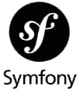

# 2023 年最佳 PHP 框架

> 原文：<https://www.sitepoint.com/best-php-frameworks/>

在本文中，我们将回顾 2023 年将使用的最佳 PHP 框架。作为其中的一部分，我们将看看什么是 PHP 框架，什么时候应该考虑使用它，以及使用 PHP 框架的主要好处是什么。我们还将考虑适合初学者的最佳 PHP 框架，以及适合 web 开发的最佳框架。

**内容**

1.  [什么是 PHP 框架？](#whatisaphpframework)
2.  [何时使用 PHP 框架](#whentouseaphpframework)
3.  [不使用 PHP 框架的理由](#reasonsnottouseaphpframework)
    *   [执行速度变慢](#slowerexecution)
    *   [特定问题的一般解决方案](#generalsolutionsforspecificproblems)
    *   [学习曲线](#learningcurve)
    *   [有限控制](#limitedcontrol)
4.  [PHP 框架的主要优势](#topbenefitsofphpframeworks)
    *   [更快的开发时间](#quickerdevelopmenttimes)
    *   [更严格的安全措施](#tightersecurity)
    *   [更轻松的协作](#easiercollaboration)
5.  [最好使用的 PHP 框架](#bestphpframeworkstouse)
    *   拉勒维尔
    *   [symphony](#symfony)
    *   [CakePHP](#cakephp)
    *   [CodeIgniter](#codeigniter)
    *   [燃料马力](#fuelphp)
6.  初学者的最佳 PHP 框架
    *   拉勒维尔
    *   【T0 年 2 月 1 日】
    *   [symphony](#symfony_)
    *   [关于微框架的快速说明](#aquicknoteonmicroframeworks)
7.  Web 开发的最佳 PHP 框架
8.  [结论](#conclusion)

## 什么是 PHP 框架？

在我们了解使用 PHP 开发框架的好处以及哪些是最好的 PHP 开发框架之前，我们需要先了解什么是 PHP 开发框架。

PHP 是世界上使用最广泛的服务器端语言，PHP 框架已经存在很长时间了，这些年来已经采用了不同的形式和范例。从简单的网站到管理数百万注册和日访问量的大型复杂网络应用程序，它们无所不包。

PHP 框架已经使用了几十年(Phplib，第一个 PHP 框架，[可以追溯到 2000 年](https://github.com/pmjones/php-history)以前)，它们采取了不同的形式，但是它们的主要目的基本上是相同的。目的是:*通过提供常用函数集，以及常用功能的库来帮助 PHP 开发人员，并强制使用最佳编码实践。*

把 PHP 框架想象成一个骨架，它已经提供了一个运行系统，你可以在其中嵌入你的代码，而不必从头开始检查每一个细节。需要安全认证？已经搞定了！路由？是啊！依赖注入？你打赌！

通过使用 PHP 框架，我们可以极大地减少需要编写的代码量并提高效率，同时由于使用了代码标准和最佳实践，还可以确保高水平的质量。随着你开发技能的增长，探索 PHP 框架如何工作也是一个很好的方式来增加你的 PHP 知识。

## 何时使用 PHP 框架

尽管现在对于一个 PHP 程序员来说，在几乎每个项目中使用 PHP 框架似乎是一件很容易的事情，但是在很多情况下，使用一个框架可能并不是最好的主意。这完全取决于项目。大多数时候，讨论都集中在使用什么框架上，而实际上很多时候讨论应该集中在我们是否应该使用一个框架上。

为了澄清这一点，让我们快速地看一下使用 PHP 开发框架的利与弊。

## 不使用 PHP 框架的理由

在一篇关于最佳 PHP 开发框架的文章中谈论 PHP 开发框架的缺点可能有点奇怪，但是理解什么时候使用 PHP 开发框架可能不是最好的主意是很重要的。

### 较慢的执行

PHP 框架总是会增加 PHP 脚本的复杂性和开销。你必须考虑到，甚至在运行一个简单的脚本之前，PHP 框架在运行之前总是会加载一些类和库。

因此，在选择 PHP 框架之前，请考虑您的应用程序的需求。有时候，最好的解决方案可能是在最低的抽象层次编写一些定制代码，这比使用框架更快、更简单。

### 特定问题的一般解决方案

正如我们之前提到的，框架提供了一个现成的库和功能的框架，可以解决开发人员发现的最常见的问题。然而，正如 PHP 的创造者拉斯马斯·勒德尔夫所说:

> 没有人有普遍的问题。每个人都有一个他们试图解决的非常具体的问题。一个通用的框架，虽然它可以解决这个问题，但它通常以这样一种方式解决这个问题，你会得到很多其他你不需要的东西，最终在每个请求中都被完成。

这就是为什么当我们选择一个框架时，我们应该仔细了解它是否能解决我们的问题，只有在这之后，我们才应该检查它是否符合我们的其他需求。

### 学习曲线

框架将我们引向良好的、结构化的代码和最佳实践。但是这些需要时间和努力去学习和掌握。如果有人在没有扎实的知识和概念的情况下选择了一个框架，很有可能，我们最终会得到一大堆混乱而不是结构化的代码。

### 有限控制

当我们决定使用一个 PHP 框架时，我们必须明白的一件事是我们正在引入一个外部依赖。有了这个，我们就接受了负责框架的人可能会在任何时候停止支持它，或者将它的开发转移到不同的方向。我们还必须考虑将框架升级到新版本所需的时间，以及必须处理升级可能带来的所有代码更新。

实际的框架也在我们的代码中引入了一个新的抽象层。虽然框架的许多部分都是定制的，但是框架的核心通常是一个不能碰的黑匣子。如果我们修改它，那么我们就不能指望得到任何支持，并且如果没有大量的返工，所有未来的更新都将是不可能的。

这些是使用 PHP 框架的一些缺点。所以，如果我们很急或者我们的项目很小，最好不要使用框架。相反，我们应该考虑使用一个[微框架](https://en.wikipedia.org/wiki/Microframework)(一个功能被剥离到最基本的框架)，或者甚至考虑使用一些我们熟悉的库从头开始。

## PHP 框架的最大好处

虽然在某些情况下，使用 PHP 开发框架并不是解决特定问题的最佳方案，但是使用 PHP 开发框架也有很多好处。让我们仔细看看好处。

### 更快的开发时间

一个精心选择的 PHP 框架已经包含了内置的最常见问题的实现。不仅如此，它通常提供一个结构良好的应用程序架构——模型-视图-控制器(MVC)是最常见的——来指导我们的开发。

这样，通过使用框架，我们不必花费时间和精力规划应用程序架构、评估各种可用的库并从头开始实现架构，而是可以获得一个功能完整的模板，并且只需专注于构建特定于我们项目的特性。

除此之外，许多 PHP 框架还包括命令行工具，帮助生成自动代码模板，从而进一步加快开发速度。

### 更严格的安全措施

开发 PHP 应用程序的最大问题之一是安全性。大多数开发人员不具备创建安全 PHP 应用程序所需的所有工具或技能。通过使用 PHP 框架，我们正在使用由 PHP 社区持续测试、审查和审查的解决方案。因为大多数都是开源的，所以安全问题通常会很快被注意到并修复。

### 更轻松的协作

作为开发人员，我们应该熟记我们的解决方案和实现。但是当我们在一个团队中工作时，事情就变了。如果不了解设计决策和代码库的完整文档，团队成员会发现很难使用，有时甚至很难理解我们的应用程序代码。

使用 PHP 框架使得新开发人员更容易开始这个项目。即使他们还不熟悉这个框架，他们也有可能获得它的完整文档，以及关于如何在网络上使用它的多个视频和教程。这样，开发人员可以专注于开发功能，而不是在整个项目中不断指导新的团队成员。

## 最好使用的 PHP 框架

PHP 开发框架的世界在过去的十年中迅速发展。框架来了又去，在过去的几年里，我们看到了一些稳定。因此，一些框架已经成为大多数项目的首选。

看着不断增长的 PHP 开发框架列表，很难选出最好的五个。有些会更适合特定情况，有些会有更快的学习曲线或更好/更差的社区支持。当创建这样一个列表时，我们会考虑所有这些因素，并从中挑选出总体表现更好的因素。先不说这个，让我们来看看 2023 年要用的五大 PHP 框架。

注意:这里的重点是功能全面的通用框架，而不是特定领域的框架或微框架。

### 拉勒韦尔

来自 [Laravel 网站](https://laravel.com/docs/4.2/introduction):

> Laravel 试图通过简化大多数 web 项目中使用的常见任务(如认证、路由、会话和缓存)来减轻开发的痛苦……Laravel 的目标是在不牺牲应用程序功能的情况下，使开发过程成为令开发人员满意的过程。

在这一点上，Laravel 可能是最常用和推荐的 PHP 框架。它最初是由 Taylor Otwell 在 2011 年发布的，旨在为 CodeIgniter 创建一个更高级的替代品，当时 CodeIgniter 不提供身份验证和授权等功能。

Laravel 是一个非常广泛且功能丰富的框架，遵循 MVC 模式，并提供开箱即用的功能，例如:

*   证明
*   批准
*   电子邮件验证
*   加密
*   散列法
*   密码重置

谈到模板，Laravel 使用模板引擎[刀片](https://laravel.com/docs/9.x/blade)，数据库交互由[雄辩的 ORM](https://laravel.com/docs/9.x/eloquent) 覆盖。Laravel 还使用 [Artisan](https://laravel.com/docs/9.x/artisan) 命令行工具来帮助加速开发。

注意:ORM 代表对象关系映射器。ORM 是一种机制，它可以寻址、访问和操作数据库对象，而不必考虑这些对象如何与它们的数据源相关联。它本质上是一个关于如何与数据库进行交互的黑匣子。

Laravel 也很容易通过 Composer 安装，或者像 [Homestead](https://laravel.com/docs/9.x/homestead) ，vagger box 或者 [Laravel Valet](https://laravel.com/docs/9.x/valet) 这样的解决方案。

最后，Laravel 基准测试是大多数用例中最快的 PHP 框架。总之，这使得 Laravel 成为顶级的通用框架，在为您的下一个项目选择 PHP 框架时，应该将它考虑在内。

如果你想了解更多关于 Laravel 的信息，你可以查看 SitePoint 上的 [Laravel 资源，或者直接进入](https://www.sitepoint.com/php/laravel-php/)[使用 Laravel](https://www.sitepoint.com/premium/courses/build-a-blog-with-laravel-2930/) 建立博客。

**规格**

*   *发布日期:【2011 年 6 月*
*   *当前版本:* 9，2022 年 1 月发布。
*   *技术要求:* PHP > = 8(或使用 Laravel Homestead)
*   *安装:* `composer create-project laravel/laravel your-app-name`
*   *网址:*【laravel.com 
*   *文档:* [拉里韦尔文档](https://laravel.com/docs/9.x/installation)

### symphony

Symfony 可以从两个不同的角度来看。它是一个 PHP 框架，也是用于构建 web 应用程序的 PHP 组件的集合。由于这种多功能性，Symfony 是高度可扩展的。您可以使用整个框架，也可以只选择几个适合您的用例的组件。它可以是简单的，也可以是复杂的，证明 Symfony 确实是一个伟大的软件的证据是，大多数其他 PHP 框架在后台使用 Symfony 组件。

Symfony 使用[教条 ORM](https://www.doctrine-project.org/) 进行数据库交互，使用 [Twig](https://twig.symfony.com/) 作为模板引擎。它也有自己的[CLI](https://github.com/symfony-cli/symfony-cli)工具来帮助开发。

SitePoint 有一个很好的 Symfony 文章集，可以让你快速了解这里的内容。

**规格**

*   *发射日期:* 2005
*   当前版本: 6.1.5，2022 年 5 月发布
*   技术要求: PHP > = 8
*   *安装:* `composer create-project symfony/skeleton:"6.1.*" my_project_directory`
*   *网址:*【symfony.com 
*   *文档:* [Symfony 文档](https://symfony.com/doc/current/index.html)

另一件要考虑的事情是，Laravel 和 Symfony 都有庞大的开发者社区，他们积极地使用它们并为它们开发。这两种语言的培训随处可见，关于这两种语言的文档也非常丰富。

### CakePHP

CakePHP 背后的想法是拥有一个专注于快速开发的 web 开发框架，使构建 web 应用程序更简单、更快速，并且需要更少的代码。这个想法是使用约定而不是配置来实现快速工作，而不需要预先做很多决定。这意味着没有 XML 或 YAML 文件。

CakePHP 有其[内置的 ORM](https://book.cakephp.org/3/en/orm.html) ，在模板方面，它使用自己的文件格式(`.ctp`)，该格式使用一种替代的 PHP 语法来控制其结构和输出。

就像其他框架一样，CakePHP 实现了安全特性，比如加密、密码散列、表单数据保护和 CSRF 保护。

尽管它的社区不像 Laravel 社区那样大和有活力，但 CakePHP 开发人员仍然有大量的资源和活动。

**规格**

*   *发射日期:* 2005
*   当前版本: 4.4，发布于 2022 年 8 月
*   *技术要求:* PHP > = 7.4
*   *安装:* `composer create-project --prefer-dist cakephp/app:~4.0 my_app_name`
*   *网址:*【cakephp.org 
*   *文档:* [CakePHP 文档](https://book.cakephp.org/4/en/index.html)

### 代码点火器

就像 CakePHP 一样，CodeIgniter 被创建为一个快速开发的 MVC 框架，只需要很少的配置。但是它的创造者把它带到了一个新的高度。

CodeIgniter 的占用空间非常小(下载量只有 1.2MB)，这意味着它几乎没有膨胀，而且速度非常快。

尽管 CodeIgniter 没有与 ORM 捆绑在一起，但它有一个功能全面且非常快速的抽象数据库类，支持传统的结构和查询构建器模式。模板也是如此:即使我们可以使用外部模板引擎或普通 PHP，CodeIgniter 也有一个可以使用的`Template`类。

**规格**

*   2006 年
*   当前版本: 4.1，发布于 2022 年 2 月
*   *技术要求:* PHP > = 7.4
*   *安装:* `composer create-project codeigniter4/appstarter your-app-name`
*   *网址:*【codeigniter.com 
*   *文档:* [CodeIgniter 文档](https://www.codeigniter.com/userguide3/)

### 燃料电池

FuelPHP 是这个列表中最年轻的框架。它的[引入了](https://fuelphp.com/)以下命题:

> Fuel PHP 框架是一个快速、简单、灵活的 PHP 5.4+框架，诞生于其他框架的最佳理念，有一个全新的开始！

FuelPHP 充满了“新”的概念和范例——比如使用 [HMVC(层次模型视图控制器)](https://en.wikipedia.org/wiki/Hierarchical_model%E2%80%93view%E2%80%93controller)而不仅仅是 MVC。HMVC 提供了更好的代码组织、更大的模块化、更好的可扩展性，并鼓励代码重用。

FuelPHP 提供了自己的 ORM 和命令行工具，并有一个小但非常热情的社区。尽管 FuelPHP 是目前最年轻的框架，但它绝对是一个值得考虑的选择。

**规格**

*   *发布日期:* 2014 年
*   当前版本: 1.9，2021 年 12 月发布
*   技术要求: PHP > = 5.3
*   *安装:* `composer create-project fuel/fuel --prefer-dist .`
*   *网址:*【fuelphp.com 
*   *文档:* [燃料惠普文档](https://fuelphp.com/docs/)

## 初学者的最佳 PHP 框架

即使你刚开始学习 PHP，你也可以学习使用框架。对于希望开始使用 PHP 框架的初学者来说，选择 PHP 框架的标准与成熟开发人员的标准略有不同。尽管有些主题可能会重叠，但在尝试这个主题时，初学者需要了解以下内容:

*   框架的简单性和安装
*   证明文件
*   灵活性
*   最佳实践(MVC、PSR 兼容性)
*   流行

考虑到这一点，我们编制了前三个框架，它们不仅易于安装，有很好的文档和社区，而且给初学者提供了最好的学习和成长机会。

### 拉勒韦尔

得益于其优秀的社区和文档，Laravel 可能是入门的最佳框架。它足够灵活，即使在简单的用例中也易于使用，对于大型和复杂的应用程序也是如此。它还将使每个开发人员根据编码和测试的最佳实践走上编程的道路。

### Yii2

一个我们还没看的框架是 [Yii2](https://www.yiiframework.com/) 框架。对于那些刚刚起步的人来说，这是一个很好的选择。它有一个[相当简单的说明手册](https://www.yiiframework.com/doc/guide/2.0/pt-br/start-prerequisites)，可以让开发者很快上手并运行。

尽管 Yii2 是一个相当大的框架，但它具有非常好的性能，并且在安装时提供了两种程序框架选项:基本和高级。

两者之间的主要区别(除了文件夹结构)是高级模板有一个有效的用户认证系统，而基本模板将用户硬编码在用户模型中。

首先，开发人员可以从较少的代码膨胀开始，以掌握框架的诀窍，之后，他们可以使用两个版本进行比较，并有希望了解如何构建一个合适的身份验证系统。

我们没有将 Yii2 添加到上面的列表中，因为我们想挑选 2023 年的前五个框架选择。Yii2 是一个顶级竞争者，与 CakePHP 或 CodeIgniter 等其他框架不相上下。

### symphony

Symfony 是一个相当大且复杂的框架。那么，为什么我们把它列在初学者的最佳框架中呢？

Symfony 是关于模块化的。多亏了 Symfony 中所有的独立构建模块，我们可以把它做得小而简单，或者大而复杂。

另外，要知道很多现代 PHP 框架在后台使用 Symfony 组件。通过学习 Symfony 中的这些组件，我们确保我们也在学习其他框架。

感谢 Symfony 网站上的[这个教程](https://symfony.com/doc/current/create_framework/index.html)，我们可以学习如何通过使用不同的 Symfony 组件来构建一个 PHP 框架。对于初学者来说，这是一个很好的练习，因为它可以让你正确理解大多数 PHP 开发框架的背景。

### 关于微框架的简要说明

微框架——比如 [Fat Free Framework](https://fatfreeframework.com/3.8/home) 或者[Slim](https://www.slimframework.com/)——对于初学者来说也是非常好的起点。他们仍然使用与他们的兄弟姐妹相同的编程和架构范例，但是他们将功能性减少到最低限度。

通过使用它们，我们可以在进入更具体的概念之前，学习一些基本知识(MVC、前端控制器、路由器、依赖注入等等)。

微框架的唯一问题是，因为它们提供的功能非常有限，我们可能会发现自己需要非常快速地安装新组件或切换框架。

## Web 开发的最佳 PHP 框架

正如我们所看到的，对于 web 开发来说，没有最好的框架。现有的是特定用例的最佳框架*。考虑三个最常见的使用案例:*

*   大型企业平台
*   快速原型
*   REST APIs

我们可以说，对于拥有大量功能和大型团队的大型企业项目，像 Laravel 和 Symfony 这样的框架是最适合的，因为它们提供了大量现成的功能、大型用户社区、顶级培训和可靠的支持。

在快速原型开发的情况下，像 CakePHP 和 CodeIgniter 这样的框架是最好的选择，因为它们就是为此目的而创建的。原型和较小的 web 平台受益于这些框架的易用性和直接方法。

最后，就 REST APIs 而言，像 [Slim](https://www.slimframework.com/) 这样的微框架更适合，因为它们已经是轻量级的，非常快速，易于使用和理解。最终，路由组件、中间件和依赖注入是我们让 REST API 运行的全部所需。

考虑到这一点，我们需要在选择 PHP 框架之前确定我们的项目是关于什么的，因为每个框架都有自己的优点和缺点。

## 结论

我希望你喜欢这篇深入探讨 2023 年最佳 PHP 框架的文章。在我结束之前，我想留给您一些在使用 PHP 框架时需要记住的快速想法:

*   对于所有项目来说，没有最好的框架这种东西。框架只有解决了你的问题才是好的。

*   当选择一个框架时，在做决定之前，确保这个框架得到支持，定期更新，并且有一个好的社区支持。

*   实验！确保你对使用你选择的框架感到舒适和愉快。如果你不喜欢使用“最好”的框架，那么使用它是没有意义的。

*   永远不要停止学习！你对框架的试验越多，对 PHP 的了解就越多。为此，看看[的 SitePoint Premium](https://www.sitepoint.com/premium/) ，它有大量的学习资源和[一系列完全免费的计划](https://www.sitepoint.com/premium/pricing/)！

## 分享这篇文章