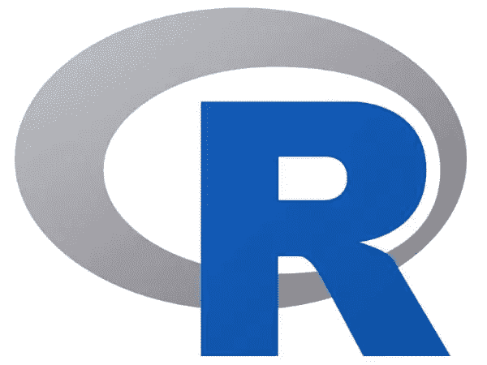
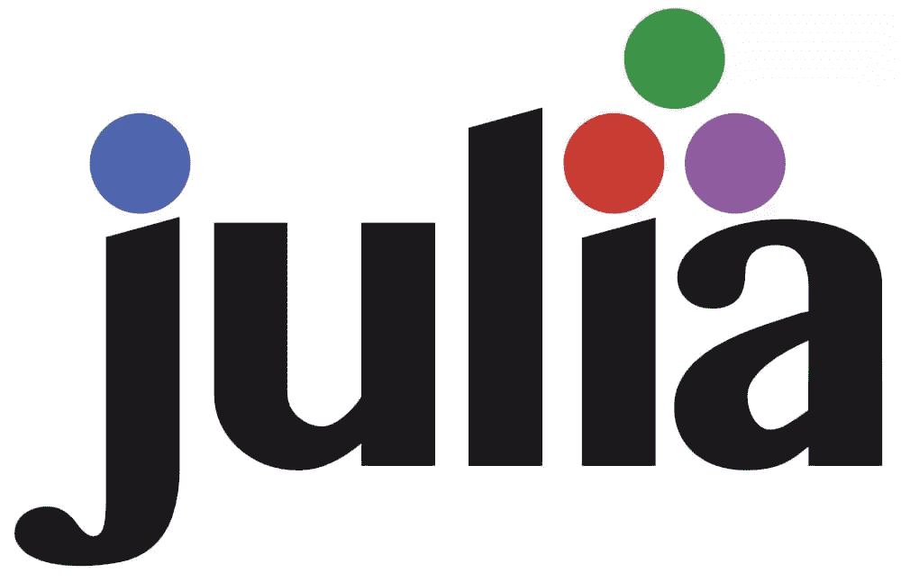

# 最佳人工智能编程语言

> 原文：<https://www.sitepoint.com/best-programming-language-for-ai/>

如果你对从事人工智能职业感兴趣，你需要知道如何编码。但是你从哪里开始呢？AI 最好的编程语言是什么？你应该从什么平台开始？本文将为您提供最佳人工智能编程语言和平台的高层次概述，以及它们的关键特性。

事实证明，只有少量的人工智能编程语言是常用的。

1.  [什么是人工智能？](#whatisartificialintelligence)
    *   人工智能的(非常)简史
    *   [今天和明天的 AI](#todaysandtomorrowsai)
2.  用于人工智能开发的最佳编程语言
    *   [Python](#python)
    *   [R](#r)
    *   朱莉娅
    *   [C++和 C#](#candc)
    *   [Java](#java)
    *   [荣誉提名:Lisp 和 Prolog](#honorarymentionslispandprolog)
    *   [人工智能开发中避免使用的编程语言](#programminglanguagestoavoidinaidevelopment)
3.  [常见问题解答](#faqs)
    *   [c++比 Python 更适合 AI 吗？](#iscbetterthanpythonforai)
    *   [Java 和 C++哪个更适合 AI？](#isjavaorcbetterforai)
    *   最好的人工智能开发语言有什么共同点？
    *   [游戏用什么编程语言做 AI？](#whatprogramminglanguagedogamesuseforai)
    *   [想进入 AI 编程，应该从哪里开始？](#whereshouldistartifiwanttogetintoaiprogramming)
4.  [结论](#conclusion)

## 什么是人工智能？

人工智能是计算机科学中最迷人和发展最快的领域之一。就在我们说话的时候，它已经在改变我们周围的世界。这是你能找到的最热门的就业市场(见 [Gartner 预测](https://www.gartner.com/en/newsroom/press-releases/2021-11-22-gartner-forecasts-worldwide-artificial-intelligence-software-market-to-reach-62-billion-in-2022))。

人工智能旨在创造智能计算机系统。它本质上是制造一个可以自己学习和工作的计算机系统的过程。

[另一方面，机器学习](https://en.wikipedia.org/wiki/Machine_learning) (ML)处理所使用的方法和技术，以便计算机系统可以“学习”如何执行某些任务，甚至预测某些结果，而无需为其显式编程。

### 人工智能的(非常)简史

“人工智能”一词最早是由计算机科学家约翰·麦卡锡在 1956 年创造的，当时人工智能研究领域是作为一门学术学科建立的。在此后的几年里，人工智能经历了几波乐观情绪，随后是失望和资金损失(被称为“[人工智能冬天](https://en.wikipedia.org/wiki/AI_winter)”)，随后是新的方法、成功和重新获得的资金。

在其历史的大部分时间里，人工智能研究一直被分成多个子领域，这些子领域之间往往无法沟通。这些子领域基于技术考虑，例如特定的目标、应用领域(例如医学和机器人学)，和/或特定的实现方法(例如[符号计算](https://en.wikipedia.org/wiki/Computer_algebra)和[连接主义](https://en.wikipedia.org/wiki/Connectionism))。

人工智能研究的传统问题(或目标)包括:

*   [推理](https://en.wikipedia.org/wiki/Reasoning_system)
*   [知识表示](https://en.wikipedia.org/wiki/Knowledge_representation_and_reasoning)
*   [策划](https://en.wikipedia.org/wiki/Automated_planning_and_scheduling)
*   [学习](https://en.wikipedia.org/wiki/Machine_learning)
*   [自然语言处理](https://en.wikipedia.org/wiki/Natural_language_processing)
*   感知([计算机视觉](https://en.wikipedia.org/wiki/Computer_vision))
*   移动和操纵物体([机器人](https://en.wikipedia.org/wiki/Robotics)

### 今天和明天的人工智能

如今，人工智能的应用方式多种多样，从为 Siri 和 Alexa 等虚拟助手提供动力，到自动驾驶汽车和预测分析等更复杂的应用。

在可预见的未来，[人工通用智能](https://en.wikipedia.org/wiki/Artificial_general_intelligence) (AGI，也称为强人工智能、全人工智能或通用智能动作)仍然是该领域的长期目标之一——常见的方法包括统计方法、计算智能和传统的符号人工智能。

## 人工智能开发的最佳编程语言

以下是人工智能开发中最常用的语言，以及它们的主要特性。

### 计算机编程语言

[Python](https://www.python.org/) 是**最受人工智能**欢迎的编程语言，它是[最热门的语言之一](https://www.sitepoint.com/python-trends-whats-hot/)，也很容易学习！

Python 是一种具有动态语义的解释型高级通用编程语言。它的高级内置数据结构与动态类型和动态绑定相结合，使其对于快速应用程序开发以及作为脚本或粘合语言将现有组件连接在一起非常有吸引力。

**Python 的主要特性**:

*   它有简单、易学的语法，强调可读性(因此降低了程序维护的成本)。
*   它支持模块和包(这鼓励程序模块化和代码重用)。
*   它有一个广泛的[标准库](https://docs.python.org/library/)(在所有主要平台上都可以免费获得源代码或二进制形式)。

**是什么让 Python 适合 AI** :

*   它有一套丰富的用于数据分析和操作的库，比如 [Pandas](https://pandas.pydata.org/) ，使得处理数据变得容易。
*   它有很多专门针对机器学习的库，比如 [TensorFlow](https://www.tensorflow.org/) 和 [Keras](https://keras.io/) 。
*   它拥有坚实的科学和计算库，如 [scikit-learn](https://scikit-learn.org/) 和 [NumPy](https://numpy.org/) 。
*   它甚至可以用来对微控制器进行编程，如 [MicroPython](https://micropython.org/) 、 [CircuitPython](https://circuitpython.org/) 和 [Raspberry Pi](https://www.raspberrypi.org/) 等项目。

如果你是从 Python 开始的，那么值得去看看 Austin Bingham 和 Robert Smallshire 的书*[《Python 学徒](https://www.sitepoint.com/premium/books/the-python-apprentice/)* ，以及 SitePoint 上的其他 [Python 书籍和课程。](https://www.sitepoint.com/premium/library/all/python/)

### 稀有

[R](https://www.r-project.org/) 是由 [R 统计计算基金会](https://www.r-project.org/foundation/)支持的用于统计计算和图形的编程语言和免费软件环境。

R 语言在统计学家中是一种通用语言，因为它广泛用于官方统计(见 [uRos2020](https://ec.europa.eu/eurostat/cros/content/use-r-official-statistics-uros2020_en) 和 [uRos2022](http://r-project.ro/conference2022.html) )，也用于数据挖掘以及开发统计软件和数据分析。民意测验、数据挖掘者调查和学术文献数据库研究显示，R 拥有活跃的用户群，全球约有 200 万人。

**R**的主要特点:

*   它有一套完整的软件设施，用于数据处理、计算和图形显示。
*   它有一个有效的数据处理和存储设备，为数组、列表、向量和矩阵的计算提供了各种各样的操作符。
*   它为数据分析和显示提供了广泛的图形设施，要么直接在计算机上，要么在硬拷贝设备上——包括基于网络的交互式界面，如 [Shiny](https://shiny.rstudio.com/) 。
*   它是一种开发良好、简单且一致的编程语言，包括条件、循环、用户定义的递归函数和输入/输出工具(包括到关系数据库的连接)。

**是什么让 R 对 AI 有利**:

*   它是专门为统计学家设计的(不像 Python，它是作为通用语言设计的)。
*   它有许多对人工智能开发有用的特性，例如线性和非线性建模、时间序列分析、分类和聚类。

### 朱莉娅

[Julia](https://julialang.org/) 是一种相对较新的(2012 年推出)高级高性能技术计算动态编程语言，其语法为其他技术计算环境的用户所熟悉。

**朱莉娅的主要特征**:

*   它专为高性能数值和科学计算而设计。
*   它很容易使用和学习。
*   它可以直接调用 C 和 Fortran 库(无需编写包装器或接口代码)。
*   它可用于并行和分布式计算。
*   它带有一个广泛的标准库，包括微分方程，优化和机器学习。

**是什么让茱莉亚对 AI 好**:

*   除了速度快，Julia 还非常灵活(这使得快速试验不同的模型很容易)。
*   它拥有一批发展成熟的机器学习库，如 [Flux](https://fluxml.ai/) 、 [MLJ](https://github.com/alan-turing-institute/MLJ.jl) 、 [KNet](https://github.com/denizyuret/Knet.jl) 。

### C++和 C

[C++](https://isocpp.org/) 是一种偏向于系统编程的通用编程语言，在设计时考虑了[可移植性](https://en.wikipedia.org/wiki/Portable_programming)、[使用效率和灵活性](https://en.wikipedia.org/wiki/C%2B%2B#Efficiency)。C++的主要竞争对手是微软的 [C#](https://docs.microsoft.com/en-us/dotnet/csharp/) ，它在语法上非常相似，但提供了一些额外的功能和好处，如更受管理的内存模型以及开箱即用的 [LINQ](https://en.wikipedia.org/wiki/Language_Integrated_Query) (语言集成查询)支持，等等。

C++在广泛的领域也很有用，比如计算机图形学、[图像处理](https://opencv.org/)和[科学计算](http://www.netlib.org/blas/)。类似地，C#已经被用于开发 3D 和 2D 游戏，以及工业应用。

**c++和 C#的主要特性**:

*   它们都是面向对象的，支持使用类、对象和继承的数据抽象。
*   C++是一种[编译的](https://en.wikipedia.org/wiki/Compiler)语言，这意味着它被直接转换成可以在计算机上运行的机器代码。C#是一种[托管的](https://docs.microsoft.com/en-us/dotnet/standard/garbage-collection/)语言，运行在虚拟机之上，这使得它可以跨不同平台移植。
*   C++比 C#对内存管理提供了更多的控制，但这也意味着出错的空间更大。

**是什么让 C++和 C#对 AI 有好处**:

*   这两种语言都广泛应用于游戏开发，许多游戏都利用了 AI。
*   它们都是高性能的，因为它们是编译语言，并在必要时提供低级控制。
*   C#拥有来自 Visual Studio 的大量可用库和工具支持。

### Java 语言(一种计算机语言，尤用于创建网站)

Java 是一种多功能的强大的编程语言，它使开发者能够创建健壮的、高性能的应用。

**Java 的主要特性**:

*   它是面向对象的(支持封装、继承和多态)。
*   它是平台无关的([字节码](https://en.wikipedia.org/wiki/Bytecode)可以在任何有 Java 虚拟机的平台上运行)。
*   它是静态类型的(确保编译时的类型安全)。
*   它有一个很大的标准库。
*   它支持[异常处理](https://docs.oracle.com/javase/tutorial/essential/exceptions/)(有助于优雅地管理错误和异常情况)和[多线程](https://docs.oracle.com/javase/tutorial/essential/concurrency/)(支持程序多个部分的并发执行)。

**什么让 Java 对人工智能有利**:

*   它快速、可靠，并具有强大的工具支持(使快速高效地开发复杂的 AI 应用程序变得容易)。
*   它用于许多任务关键型应用程序，因此经过了实战考验。
*   它可以用于桌面和移动应用程序(使用 [Android Studio](https://developer.android.com/studio) )。

### 荣誉提名:Lisp 和 Prolog

Lisp 和 Prolog 不像上面提到的语言那样被广泛使用，但是它们仍然值得一提。

**[Lisp](https://lisp-lang.org/)** (也是由约翰·麦卡锡在 1958 年引入的)是一个具有悠久历史和独特的基于括号的语法的编程语言家族。它最初是为人工智能研究而创建的。今天，Lisp 被用于各种应用程序，包括脚本和系统管理。

**Prolog** ( [通用内核](https://www.iso.org/standard/21413.html)、[模块](https://www.iso.org/standard/20775.html))是一种来自 70 年代早期的[逻辑编程](https://en.wikipedia.org/wiki/Logic_programming)语言，特别适合人工智能应用。它的声明性使得表达数据之间的复杂关系变得容易。Prolog 也用于自然语言处理和知识表示。

### 人工智能开发中应避免的编程语言

虽然这些语言可能有它们的位置，但它们并没有给人工智能世界提供太多东西。

*   COBOL 是一门古老的语言，创建于 20 世纪 50 年代和 60 年代。它是为商业应用程序设计的，并不真正适合其他任何东西。
*   FORTRAN 是另一种古老的语言，可以追溯到 1957 年。它是为科学和工程应用而设计的，像 COBOL 一样，并不真正适合其他任何东西。
*   Pascal 是一种创建于 20 世纪 70 年代的语言，在学术界之外已经很少使用了。
*   Basic 是一种为初学者设计的语言，已经被其他语言如 Python 所取代。

也就是说，你可能会认为一种完全脱离领域的语言，比如主要用于 web 开发的 **JavaScript** ，也不会给 AI 提供太多东西，对吗？然而，有相当有趣的活跃项目——如 [TensorFlow.js](https://www.tensorflow.org/js) (由谷歌支持)——用 JavaScript 开发机器学习模型，这些模型可以直接在浏览器或 [Node.js](https://nodejs.org/en/) 中使用。谁知道呢。！

## 常见问题

现在，为了快速获取信息，我将提供一组快速的自以为是的答案。

### C++比 Python 更适合 AI 吗？

不，C++在 AI 方面并不比 Python 好。事实上，Python 被普遍认为是 AI 最好的编程语言。但如果需要用低级语言编码，或者开发高性能例程，C++可以用于 AI 开发。

### AI 用 Java 还是 C++好？

虽然 Python 仍然是普遍的首选，但 Java 和 C++在某些用例及场景中都有优势。例如，C++可以用来编写高性能的例程，而 Java 可以用来开发更多的产品级软件。

### 最好的 AI 开发语言有什么共同点？

用于人工智能开发的最佳编程语言有几个共同点:

*   它们都是高级语言，这意味着它们很容易学习和编码。
*   它们都有大型的库和框架生态系统，你可以用它们来开发人工智能。
*   它们在人工智能社区中被广泛使用，所以你可以在网上找到大量的资源和帮助。

### 游戏用什么编程语言做 AI？

好了，这就是 C++可以大放异彩的地方，因为大部分游戏都是用 C++进行 AI 开发的。这是因为它是一种快速的语言，可以用来编写高性能的应用程序。不过也有游戏使用其他语言进行 AI 开发，比如 Java。

### 想进入 AI 编程，应该从哪里开始？

如果你刚刚开始，我建议你从 Python 开始。它是人工智能开发中最流行的语言，而且相当容易学习。一旦你学会了 Python，如果需要的话，你可以继续学习其他语言。

查看补充文章[机器学习的 5 种入门方式](https://www.sitepoint.com/5-ways-get-started-machine-learning/)！

也看看这些书:

*   *[《数据科学:简介](https://www.sitepoint.com/premium/books/data-science-an-introduction/)* ，莫纳·哈利勒等人著。
*   *[《成为数据头:如何思考、说话和理解数据科学、统计学和机器学习](https://www.sitepoint.com/premium/books/becoming-a-data-head/)* ，作者亚历克斯·j·古特曼和乔丹·戈德迈尔

## 结论

AI 在这里；已经发生了。它正在改变我们的生活方式，改变我们与世界和彼此互动的方式，同时也为企业和个人创造了新的机遇。

与其中的所有内容一样，没有灵丹妙药或一刀切的解决方案。当选择人工智能的编程语言时，你必须进行测试，可能会根据手头的任务、你和你的团队使用的平台以及你自己的偏好和专业知识等因素来切换语言。

也就是说，Python 通常被认为是人工智能开发的最佳编程语言，这要归功于它的易用性、庞大的库和活跃的社区。对于人工智能开发来说，r 也是一个不错的选择，特别是如果你想开发统计模型的话。Julia 是一种较新的语言，因其速度和效率而越来越受欢迎。如果你想开发低层次的系统或者有严格性能限制的应用程序，那么 C++或者 C#可能是你最好的选择。

**延伸阅读:**

*   [构建人工智能的五种简单方法](https://www.sitepoint.com/simple-ways-to-build-artificial-intelligence/)
*   [什么是 GitHub Copilot？一个人人 AI 结对程序员](https://www.sitepoint.com/github-copilot-ai-pair-programming/)

## 分享这篇文章