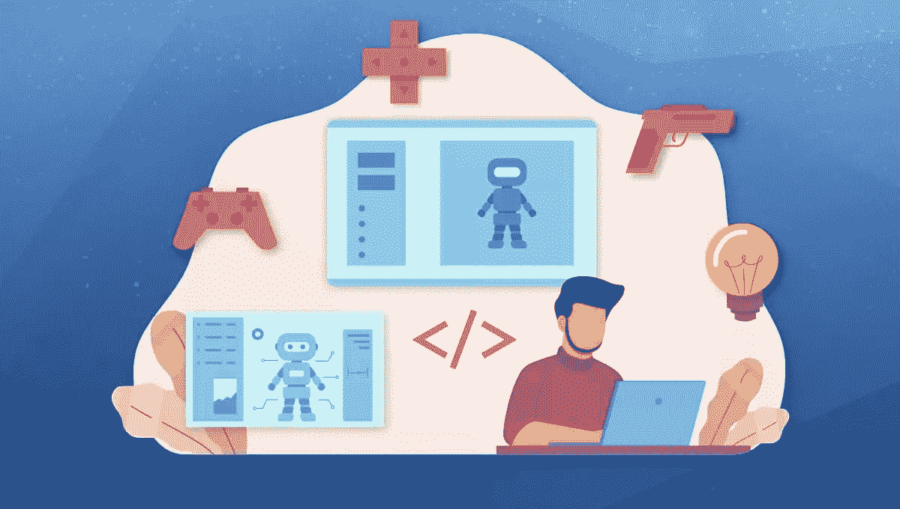
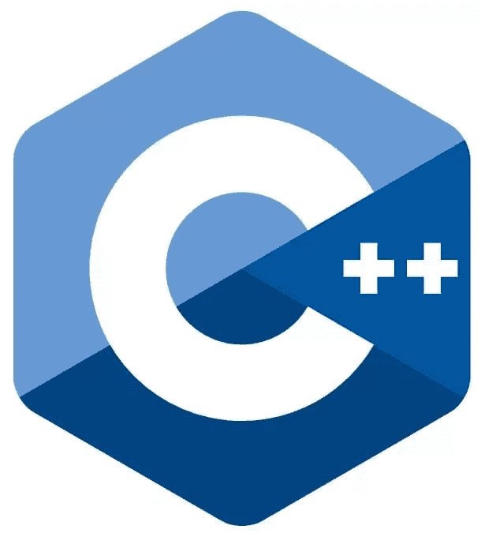
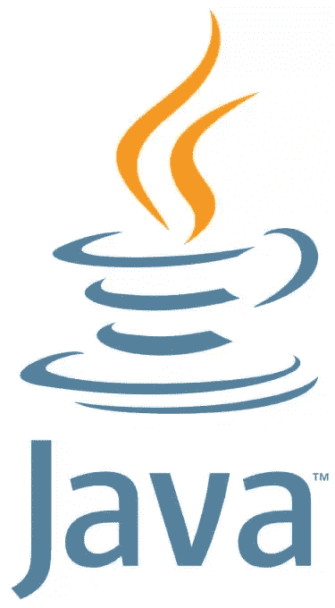
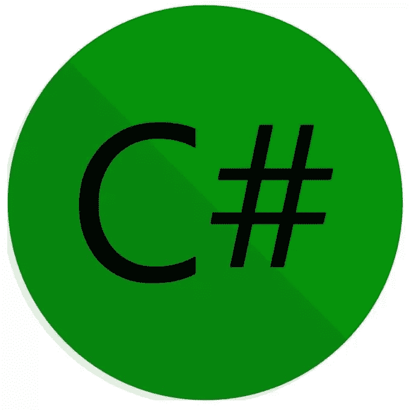
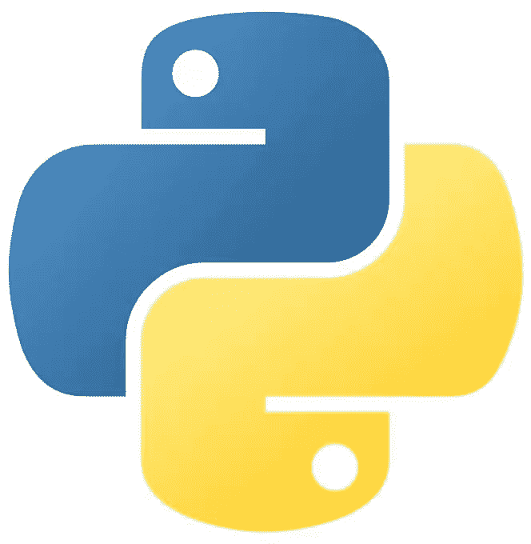

# 游戏开发:构建游戏的最佳编程语言

> 原文：<https://www.sitepoint.com/best-programming-language-for-game-development/>

随着视频游戏世界的持续增长，对天才程序员的需求也在增长。游戏开发是一个复杂的过程，需要使用特定的编程语言来创建使游戏运行的代码。

那么，哪些编程语言最适合游戏开发呢？这取决于你想开发的游戏类型。例如，如果你想开发一个 2D 平台，你可能想使用像 Lua 甚至 JavaScript 这样的语言。但如果你想开发一个 3D 第一人称射击游戏，你可能想使用 C++或 C#这样的语言。

在本文中，我们将看看游戏开发的最佳编程语言，并讨论可以使用每种语言开发的不同类型的游戏。

1.  [什么是游戏开发？](#whatisgamingdevelopment)
2.  [关于游戏引擎](#aboutgameengines)
3.  游戏开发的最佳编程语言
    *   [C++](#c)
    *   [Java](#java)
    *   [JavaScript(带 HTML 和 CSS)](#javascriptwithhtmlandcss)
    *   [C#](#csharp)
    *   月球
4.  [新手做游戏开发应该从哪种编程语言开始？](#whichprogramminglanguageshouldabeginnerstartwithforgamedevelopment)
    *   [作为游戏开发语言的 Python](#pythonasagamedevelopmentlanguage)
5.  [简单游戏的最佳编程语言](#bestprogramminglanguageforsimplegames)
6.  复杂游戏的最佳编程语言
7.  [结论](#conclusion)

## 什么是游戏开发？

**游戏开发**是设计、创作和编码游戏的过程。根据游戏的类型和开发团队的规模，这个过程可以通过多种方式完成。

有许多不同类型的游戏:

*   基于文本、2D、3D 和实时
*   单人和多人游戏
*   专注于图形设计、故事线或游戏机制

…但你肯定知道所有这些，所以让我们看看如何实际开发游戏！

## 关于游戏引擎

我们将在本文中多次提到游戏引擎，所以让我们假设一个**游戏引擎**是一个为人们构建视频游戏而设计的软件开发环境。它为游戏开发者提供了一个工作框架，可以用来创建 2D 和 3D 游戏。

太多了，无法一一列举，但这里有一些我们会提到的:

| 发动机 | 热门游戏 | 许可证 | 语言 | 评论 |
| --- | --- | --- | --- | --- |
| [亚马逊木材场](https://aws.amazon.com/lumberyard/) | 新世界 42 中队的明星公民 | 所有人 | C++，Lua(脚本) | 对 Amazon Web Services 的原生支持，这使得在线部署游戏变得容易 |
| [构建框](https://www.buildbox.com/) | 颜色开关和线条禅 | 所有人 | C++ | 专门针对 2D 奥运会 |
| [点击团队融合](https://www.clickteam.com/clickteam-fusion-2-5) | 弗雷迪的五个晚上，逃避者，爸爸就是你 | 所有人 |  |  |
| [低温引擎](https://www.cryengine.com/) | 孤岛危机，远哭，王国来了:解脱 | 所有人 | C++ |  |
| [Cocos2d](http://www.cocos2d.org/) | 大鱼赌场，荒地，王国拉什 | 自由的 | HTML 和 JavaScript，Objective-C，Python | 专门针对 2D 的游戏，现在有点过时了。 |
| [Cocos2d-x](https://www.cocos.com/en/cocos2dx) | 法姆维尔，几何破折号，荒地 | 自由的 | C++、月球、JavaScript | 升级版，支持 2D 和 3D |
| [Cocos 创建者](https://www.cocos.com/en/creator) | 顶级战争，离开，主啊！，走钢丝 | 自由的 | C#、C++、JavaScript、TypeScript | Cocos 系列最强大的引擎 |
| [构造](https://www.construct.net/) | 送货任务，催眠空间不法分子 | 所有人 | C++ |  |
| [去折叠](https://www.defold.com/) | 糖果粉碎传奇，泡沫女巫传奇，农场英雄传奇 | 自由的 | 左上臂 |  |
| [GameMaker 工作室](https://www.yoyogames.com/gamemaker) | 洞穴探险，迈阿密热线，地下 | 所有人 | 生长调节血清三肽 |  |
| [吉德罗斯](https://www.giderosmobile.com/) |  | 自由的 | 左上臂 |  |
| [戈多](https://godotengine.org/) | 残酷小队，精装，垃圾场的王国，指挥官热衷于热衷的梦想 | 自由的 | C++ |  |
| [Java 3D](https://en.wikipedia.org/wiki/Java_3D) |  | 自由的 | Java 语言(一种计算机语言，尤用于创建网站) |  |
| [jMonkeyEngine](https://jmonkeyengine.org/) |  | 自由的 | Java 语言(一种计算机语言，尤用于创建网站) |  |
| [LibGDX](https://libgdx.info/) | 入口，杀死塔尖 | 自由的 | Java 语言(一种计算机语言，尤用于创建网站) |  |
| [勒夫](https://love2d.org/) | 马里欧，前往霍克索恩中心，要么行动，要么死亡 | 自由的 | C++，Lua(脚本) |  |
| 相位器 | 吸血鬼幸存者 | 自由的 | Java Script 语言 |  |
| [像素](https://www.pixijs.com/) | 怪诞和像素化 | 自由的 | Java Script 语言 |  |
| [RPG 制作商](https://www.rpgmakerweb.com/) | 阿尔法 Kimori，Ao Oni，Aveyond 系列，尸体党，永恒伊甸园，拉修斯力量，一夜三部曲，超级科伦拜恩大屠杀 RPG！去月球，Yume Nikki | 所有人 |  | 它可以用来创建角色扮演游戏(RPG) |
| [Solar2D](https://solar2d.com/) |  | 自由的 | 左上臂 |  |
| [来源](https://www.valvesoftware.com/en/source-engine) | 半条命，反恐精英，团队堡垒 | 所有人 | C++，Lua(脚本) |  |
| [麻绳](https://twinery.org/) | 抑郁症的追求，类比:一个仇恨的故事，西贝利 | 自由的 | JavaScript，CSS |  |
| [统一](https://unity3d.com/) | Pokémon Go，Cuphead，纪念碑谷 | 所有人 | C++ | 流行引擎 |
| [虚幻引擎](https://www.unrealengine.com/) | 堡垒之夜，战争机器，边境 | 所有人 | C++ | 流行的引擎，相对容易上手，感谢它的蓝图可视化脚本系统 |

[https://www.youtube.com/embed/rVu-q7LFnIw?rel=0](https://www.youtube.com/embed/rVu-q7LFnIw?rel=0)

 

你也可以看看 D. M. Moore 的《The Verge》中的 11 个工具，让你开始制作视频游戏。

## 游戏开发的最佳编程语言

这些语言都是游戏开发的热门选择，各有优缺点。让我们详细了解一下每种语言。

### C++

C++ 是一种很好的游戏开发编程语言，因为它快速而高效。游戏开发者使用 C++来创建高性能的游戏，它还拥有丰富的调试工具，这对游戏开发至关重要。

其他语言，比如 Python，是为了可读性和简单性而设计的。这使得 Python 成为游戏创意原型的绝佳选择，但它不适合开发最终产品。

作为一种编译语言，C++在计算机上运行之前被转换成机器代码。这使得 C++程序比 Python 等解释型语言运行速度更快。C++还提供了多种编程范例，比如面向对象和数据驱动编程。

许多最流行的游戏引擎都支持 C++，这意味着开发人员可以使用各种工具和库来创建他们的游戏。

**使用 C++的流行游戏引擎**:

*   虚幻引擎
*   一致
*   CRYENGINE
*   亚马逊贮木场

**c++的一般缺点**:

*   很难学
*   这是一种内存管理语言
*   它不是跨平台的*

**从技术上来说，你可以编写能够在不同平台上编译的 C++代码。但是，编译后的二进制文件不能跨平台。此外，许多特性和库是特定于平台的；编写真正的跨平台 C++代码需要非常小心，在开发游戏时可能会受到很大限制。*

### Java 语言(一种计算机语言，尤用于创建网站)

Java 是一种通用且强大的编程语言，广泛应用于许多不同的行业。对于游戏开发来说，它也是一个不错的选择，因为它具有 C++的许多优点，而且可以在各种平台上运行。

作为一种独立于平台的语言——多亏了 [Java 虚拟机](https://en.wikipedia.org/wiki/Java_virtual_machine)(JVM)——Java 游戏可以在任何操作系统上运行，包括 Windows、macOS 和 Linux。这使得 Java 成为开发手机游戏的另一个热门选择，因为它可以在 iOS 设备和 Android 上运行。事实上，Java 是使用 Android Studio 开发本地应用的语言。

虽然一些游戏引擎支持 Java，但它没有 C++快，这对于某些类型的游戏来说是一个缺点。

**使用 Java 的游戏引擎**:

*   jMonkeyEngine
*   libGDX
*   Java 3D

**Java 的一般缺点**:

*   没那么好学
*   这可能会很慢，尤其是在传统设备中
*   它不像 C++那样广泛使用

### JavaScript(带 HTML 和 CSS)

JavaScript (JS)是另一种用于游戏开发的通用编程语言，它的优点是相对容易学习。虽然 JavaScript 没有 C++或 Java 快，但它仍然适合开发 2D 游戏。

虽然 HTML 和 CSS 不是严格意义上的编程语言，但它们可能是游戏开发的重要技术。HTML 用于创建游戏的结构，而 CSS 用于设计游戏的风格。

JavaScript 游戏可以在任何网络浏览器上运行，这使得它们易于分发。然而，JavaScript 游戏不像用其他语言开发的游戏那样被广泛使用。

**使用 JavaScript 的流行游戏引擎**:

*   相位器
*   小鬼
*   Cocos2d-x

**JavaScript 的一般缺点**:

*   没有其他语言快
*   不像游戏那样广泛使用
*   仅限于浏览器

查阅书籍 *[HTML5 Games:新手到忍者](https://www.sitepoint.com/premium/books/html5-games-novice-to-ninja/)* ，Earle Castledine 著， *[学习用 JavaScript 编码](https://www.sitepoint.com/premium/books/learn-to-code-with-javascript/)* ，Darren Jones 著，[如何用 Vue.js 构建游戏](https://www.sitepoint.com/premium/books/how-to-build-a-game-with-vue-js/read/1/jzah88rk/)。

### C#

[C#](https://docs.microsoft.com/en-us/dotnet/csharp/) 是微软创造的。它有许多与 C++相同的优点，是开发 2D 和 3D 游戏的特别好的选择。

C#相对于 C++的一个优势是它更容易学习。C#也是一种跨平台语言，这意味着用 C#开发的游戏可以在 Windows、macOS、Linux 上运行。

C#和 Visual Studio(同样由微软创建)之间的集成非常出色，调试和测试工具也是如此。

**使用 C#的流行游戏引擎**:

*   一致
*   虚幻引擎
*   戈多

**c#的一般缺点**:

*   没有被广泛使用
*   仅限于微软生态系统

### 左上臂

Lua 是一种轻量级脚本语言，被用于许多不同的行业，包括游戏开发。易学易用，速度也快(这是个不一般的连击！).

Lua 通常用于开发游戏逻辑，它可以嵌入到其他编程语言中。这使得它成为开发具有复杂机制的游戏的好选择。

虽然一些游戏引擎支持 Lua，但它不像其他语言那样被广泛使用，但它仍然是制作 2D 游戏的一个很好的选择。

**使用 Lua 的流行游戏引擎**:

*   Solar2D
*   勒夫
*   吉德罗斯

**一般 Lua 的缺点**:

*   没有被广泛使用
*   仅限于游戏开发行业

## 新手做游戏开发应该从哪种编程语言开始？

当然是 Lua 啦！正如我们已经提到的，Lua 是一种易于学习和使用的轻量级编程语言。因此，如果你是编程新手，Lua 会给你一个很好的基础来构建更复杂的游戏，这是一个显而易见的事情。

此外，Lua 已经在许多流行的游戏中使用，所以有大量的资源可以帮助您入门。最重要的是，它是一种语言，你以后可以用它在许多游戏引擎上编写脚本，同时用 C++编写更复杂的项目！

### 作为游戏开发语言的 Python

虽然我们没有提到它，但是 [Python](https://www.python.org/) 是另一种在初级开发人员中流行的语言。就像 Lua 一样，非常好学；而且不像 Lua，它是一种通用语言，可以打开游戏开发行业之外的大门，比如数据科学和人工智能。

它不像 Lua 那么轻量级，但对于想要开发简单游戏的初学者来说，它仍然是一个不错的选择。除了是一种被许多引擎支持的脚本语言(Delta3D，Godot ( [和一些黑客](https://www.youtube.com/watch?v=IafLArxKVjY))，Source)，它还有一些引擎:

*   [Pygame](https://www.pygame.org/) (游戏)
*   [Ren'Py](https://www.renpy.org/) (互动故事)
*   Kivy (你也可以用 GUIs】写游戏

然而，预计功能少于其他成熟的游戏引擎。

请查看奥斯汀·宾汉姆和罗伯特·斯莫尔希尔所著的《Python 学徒 》一书，了解更多信息。

## 简单游戏的最佳编程语言

如果你想开发一个简单的游戏，比如 2D 平台游戏或益智游戏，你可以使用任何你熟悉的编程语言。

同样，Lua 和 Python 可以成为原型开发的良好起点；但是，即使是 JavaScript 也可以成为一个很好的 2D 射手，可以非常快速地创建(T0)，特别是在使用辅助编程时，例如(T2)open ai 的 Codex(T3)。

[https://www.youtube.com/embed/SGUCcjHTmGY?rel=0](https://www.youtube.com/embed/SGUCcjHTmGY?rel=0)

 

看看 Olivia Gibson 的文章《构建你自己的数字世界:数字世界》( Numble )( T1 ),或者 Madars Biss 的书《从零开始用 React(T4)构建石头剪刀布游戏》( T3)。

## 复杂游戏的最佳编程语言

现在，如果你想开发一个 3D 第一人称射击游戏或开放世界 RPG，你需要使用一种更强大的编程语言。

C++可能是你开发复杂游戏的最佳选择。这是一种[低级](https://en.wikipedia.org/wiki/Low-level_programming_language)语言，这意味着它给了程序员对游戏内部工作的更多控制。这可能是好的也可能是坏的:好的，因为你对游戏如何运行有更多的控制权；但是不好，因为用 C++写代码更难，调试也更难。

Java 是开发复杂游戏的另一个好选择。它是一种[高级](https://en.wikipedia.org/wiki/High-level_programming_language)语言，意思是用 Java 写代码比用 C++更容易；但这也意味着你对游戏内部运作的控制更少。

## 结论

随着每隔几年就有新的技术和平台出现，游戏开发的格局也在不断变化。因此，用于开发游戏的编程语言也必须改变。

如果您是编程新手，我们建议您从 Lua 或 Python 开始。这些语言易于学习和使用，它们将为你构建更复杂的游戏打下良好的基础。

如果你想开发一个更复杂的游戏，你需要使用更强大的编程语言。C++、C#甚至 Java 都可以成为开发复杂游戏的最佳选择。

特别是 C++作为一种低级语言，将会给程序员更多的对游戏内部工作的控制……但是当然，这是以更多的编码和调试时间为代价的。😅

## 分享这篇文章