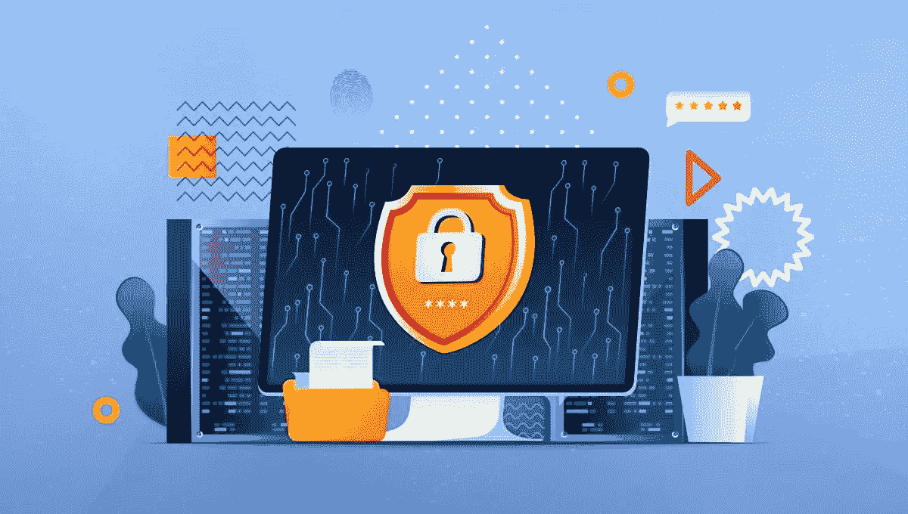
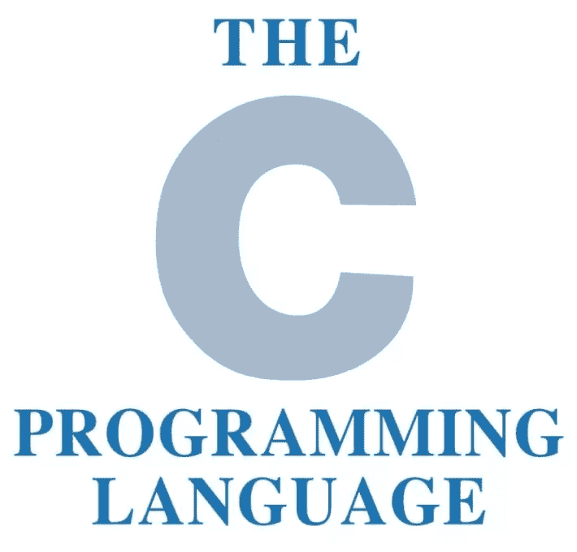
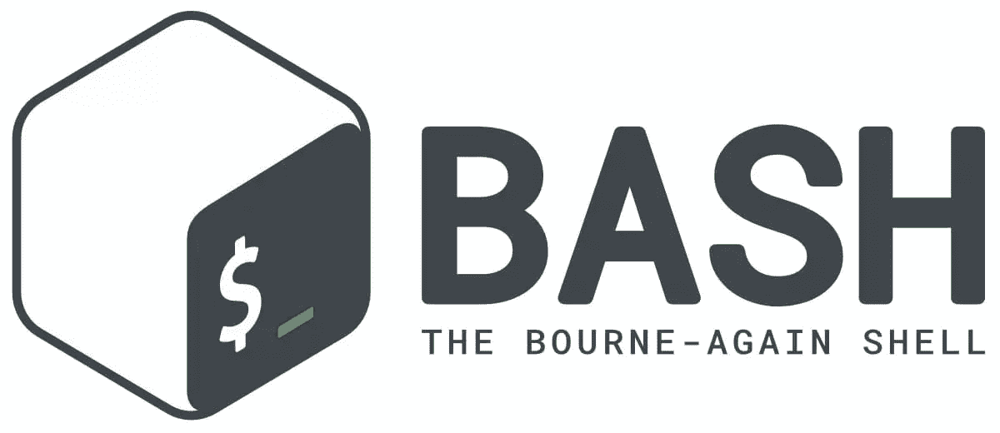

# 道德黑客最有效的编程语言

> 原文：<https://www.sitepoint.com/best-programming-language-for-hacking/>

道德或“白帽”黑客攻击是指识别计算机系统和网络中的漏洞，然后使用这些信息来保护它们的过程。随着新技术的发展，开发新技术的新方法也在发展；随着技术在我们日常生活中的无处不在(想想[物联网](https://en.wikipedia.org/wiki/Internet_of_things)，道德黑客成为一种流行的谋生方式也就不足为奇了。

为了保持领先，有道德的黑客需要能够快速适应和学习新的编程语言。但是对于道德黑客来说，什么是最有效的编程语言呢？在本文中，我们将看看最常被有道德的黑客使用的前三种语言。我们还将提供一些资源来帮助您开始学习每种语言。

1.  [什么是编程语言？](#whatisaprogramminglanguage)
2.  [为什么黑客需要编程技能？](#whydohackersneedprogrammingskills)
3.  [黑客的顶级编程语言](#topprogramminglanguagesforhackers)
    *   [C 和 C++](#candc)
    *   [组装](#assembly)
    *   [Python](#python)
    *   [痛击](#bash)
    *   [SQL](#sql)
    *   [汇总表](#summarytable)
4.  初学者的最佳编程语言
5.  [常见问题解答](#faqs)
    *   [c++比 Python 更适合黑客攻击吗？](#iscbetterthanpythonforhacking)
    *   [黑客用 Python 吗？](#dohackersusepython)
    *   [黑客用 JavaScript 吗？](#dohackersusejavascript)
    *   [有道德的黑客需要深入了解 C 语言吗？](#doethicalhackersneedtoknowtheclanguageindepth)
    *   [要成为一名优秀的道德黑客，你还需要哪些技能？](#whatotherskillsdoyouneedtobeagreatethicalhacker)
    *   [有道德的黑客如何谋生？](#howcanethicalhackersmakealiving)
    *   [一个有道德的黑客能有多少收入？](#howmuchincomecananethicalhackermake)
6.  [结论](#conclusion)

## 什么是编程语言？

编程语言是一组计算机可以理解和执行的指令。有许多不同的编程语言，每一种都有自己的语法和语义。一些编程语言是为特定任务设计的(比如数据库的 SQL)，而另一些则更通用(比如 C 或 Python)。

三种最常见的编程语言是:

*   **[机器代码](https://en.wikipedia.org/wiki/Machine_code)** 。这是计算机可以理解和执行的本机代码。它通常特定于某种类型的处理器或硬件架构。

*   **[汇编代码](https://en.wikipedia.org/wiki/Assembly_language)** 。这是一个[低级](https://en.wikipedia.org/wiki/Low-level_programming_language)代码，特定于某种类型的处理器或硬件架构。它通常以助记符的形式书写，便于人类阅读和书写。

*   **[高级语言](https://en.wikipedia.org/wiki/High-level_programming_language)** 。这些代码比机器码或汇编代码更抽象，它们不依赖于任何特定的硬件架构。这使得它们更便携，更容易读写。

## 为什么黑客需要编程技能？

编程技能对于道德黑客来说至关重要，因为它们允许黑客自动执行任务，创建自己的工具来测试系统的漏洞，并了解系统如何工作。如果没有这些技能，黑客将只能使用他们可以使用的工具。

此外，编程语言提供了一种公共语言，有道德的黑客可以用它来相互交流。通过学习一些通用语言，有道德的黑客可以快速地相互分享信息和想法，这有助于他们保持领先地位。

因此，如果你有兴趣成为一名职业黑客，或者如果你已经是一名职业黑客，并且想保持领先，那么学习一些编程语言是一个很好的起点。

## 黑客的顶级编程语言

最适合你的语言将取决于你的经验水平、你感兴趣的黑客类型以及你使用的操作系统。

也就是说，有些语言在道德黑客中比其他语言更受欢迎。以下是五种最流行的黑客编程语言，以及对每种语言的简要描述。

### C 和 C++

C 和 C++是道德黑客中最流行的两种编程语言。它们都是强大的语言，可以用来创建各种各样的黑客工具。

C ( [ISO 标准](https://www.iso.org/standard/74528.html)，[维基百科](https://en.wikipedia.org/wiki/C_(programming_language)))是一种低级语言，这意味着它比 Python 这样的高级语言更接近机器代码。这使得 C 成为编写系统级软件的好选择，比如操作系统和网络驱动。如果你有另一种编程语言的背景，学习起来也相对容易。

C++ ( [官方网站](https://isocpp.org/)，[维基百科](https://en.wikipedia.org/wiki/C++))是 C 编程语言的扩展。它旨在提供面向对象的编程特性，如类和继承。C++是一种复杂的语言，但它可以用来编写非常高效的代码。

因此，C 和 C++是每个黑客都应该学习的两种基本语言。它们将让你很好地理解计算机是如何工作的，并为构建更具体的黑客工具提供坚实的基础。

### 装配

汇编( [Wikipedia](https://en.wikipedia.org/wiki/Assembly_language) )是一种低级编程语言，用于为特定类型的处理器编写代码。汇编代码被转换成机器码，机器码可以在任何有兼容处理器的计算机上运行。

不同的处理器有自己特定的汇编语言，这使得编写可以在多个处理器上运行的代码变得很困难。

汇编语言很难学，但它非常强大。它通常用于编写漏洞、逆向工程工具和低级系统软件。

如果你对学习汇编感兴趣，我们推荐阅读 Randall Hyde 的《汇编语言编程的艺术》 ,这本书被认为是学习这种复杂语言的最佳资源之一。

### 计算机编程语言

Python ( [官方网站](https://www.python.org/)、[维基百科](https://en.wikipedia.org/wiki/Python_(programming_language)、 [SitePoint](https://www.sitepoint.com/web/python/) )是一种在黑客社区中广泛使用的高级编程语言。它很容易学习，并且有大量的库，可用于网络分析、web 抓取和数据库操作等任务。

对于需要自动化的编写工具，Python 也是一个不错的选择。例如，您可以编写一个脚本来自动登录网站并填写表单。

与 C 或汇编不同，Python 也是可移植的，这意味着您可以在一个平台上编写代码，然后在另一个平台上运行它，而不必重新编译。这使得 Python 成为编写跨平台工具的好选择。

简而言之，Python 是一种多功能语言，可以用于广泛的任务，对于刚刚起步的有道德的黑客来说，这是一个很好的选择。

奥斯汀·宾汉姆和罗伯特·斯莫尔夏尔写的《蟒蛇学徒 这本书值得一读。

### 尝试

Bash ( [官方网站](https://www.gnu.org/software/bash/)，[维基百科](https://en.wikipedia.org/wiki/Bash_(Unix_shell)))是一个 Unix shell，这是一种为运行其他程序提供接口的程序。Bash 通常用作命令行解释器(CLI)，这意味着它可以用来执行用户输入的命令。

类似于 [Window 的 PowerShell](https://learn.microsoft.com/en-us/powershell/) ，Bash 可以用来启动程序，比如 Shell 命令，也可以用来执行其他 Bash 脚本。

它还内置了一种编程语言，具有循环和条件等特性，可用于编写脚本。这些脚本可以自动执行任务，比如设置开发环境或部署 web 应用程序。

因为 Bash 可以在所有基于 Unix 的系统上使用——比如 Linux 和 MAC OS——所以它是编写跨平台工具的好选择。它也很容易学习，是许多有道德的黑客工具箱的基本部分。

请阅读伊恩·米尔的书，学习核心原则和高级 shell 脚本。还可以看看 Christopher Negus 的 *[Linux 圣经，第 10 版](https://www.sitepoint.com/premium/books/linux-bible-10th-edition/)* ，进一步深入研究基于 Unix 的系统。

### 结构化查询语言

SQL，或结构化查询语言( [ISO 标准](https://www.iso.org/standard/63555.html)，[维基百科](https://en.wikipedia.org/wiki/SQL))，是一种数据库查询语言，用于操作存储在数据库中的数据。SQL 可用于添加、删除和更新数据库中的数据。它还可以用于从数据库中查询数据，这对于数据分析等任务非常有用。

虽然 SQL 可能不是您想到黑客时想到的第一种语言，但它可以用来对 web 和移动应用程序发起攻击。例如，攻击者可以使用 SQL 注入将恶意代码插入到数据库中，然后应用程序在从数据库中检索数据时执行这些代码。

SQL 对于道德黑客任务也很有用，比如数据库安全测试和性能测试。例如，一个有道德的黑客可以使用 SQL 生成对数据库的大量查询，以便测试它在负载下的性能。

因此，SQL 是一个强大的工具，每个有道德的黑客都应该学习，它不像列表中的其他语言那样难学。

开始学习 SQL 的一个好地方是通过鲁迪·利姆贝克的 *[简单地说就是 SQL](https://www.sitepoint.com/premium/books/simply-sql/)* 。

### 一览表

| 语言 | 有用 | 难度水平 |
| --- | --- | --- |
| C/C++ | 每个黑客都应该学习的基础语言。对写系统级软件和黑客工具有用。 | 相对容易(C)，相对困难(C++) |
| 装配 | 这是一种难懂的语言，对编写漏洞、逆向工程工具和低级系统软件很有用。汇编代码是特定于某一类处理器的，这就限制了它的可移植性。 | 非常困难 |
| 计算机编程语言 | 一种简单易学、用途广泛的语言，适用于多种任务。Python 有各种各样的库可用于网络分析、web 抓取和数据库操作等任务。它也是可移植的，这使它成为编写跨平台工具的一个很好的选择。 | 容易的 |
| 尝试 | Bash 是一个 Unix shell，可用于启动程序和执行其他 Bash 脚本。它还内置了一种编程语言，可用于编写自动化任务的脚本。因为 Bash 可以在所有基于 Unix 的系统上使用，所以它是编写跨平台工具的好选择。 | 很容易 |
| 结构化查询语言 | SQL 是一种数据库查询语言，用于操作存储在数据库中的数据。SQL 还可以用于从数据库中查询数据，这对于数据分析等任务非常有用。虽然 SQL 可能不是您想到黑客时想到的第一种语言，但它可以用来发起针对 web 应用程序的攻击，并且它对于道德黑客任务(如数据库安全测试和性能测试)也很有用。 | 容易的 |

## 初学者的最佳编程语言

如果你已经读到这里，你可能已经猜到了，开始道德黑客的最佳编程语言是 Python。

*   这是一种通用的脚本语言。
*   它在安全社区中被广泛使用。
*   很好学。
*   它有各种各样的库和工具可用于安全目的。

如果您是道德黑客的新手，我们建议您从 Python 开始。这是职业黑客中最流行的语言，它将为你建立技能打下良好的基础。

稍后，当你升级你的黑客游戏时，你可能会学习 C 和 C++来更接近金属，理解系统如何在引擎盖下工作。你甚至可以学习汇编语言来真正理解底层发生的事情。

当然，随着你在职业道德黑客生涯中的进步，你会希望根据你想要完成的特定任务来学习不同的语言。

查看书籍 *[黑客对假人](https://www.sitepoint.com/premium/books/hacking-for-dummies/)* 和 *[黑客对黑客](https://www.sitepoint.com/premium/books/hacking-the-hacker/)* 作为一个很好的开端对话题。

## 常见问题

好了，是时候发表一下自己的看法，快速回答一些常见问题了！

### C++比 Python 更适合黑客吗？

在黑客方面，C++不一定比 Python 更好。但是，虽然 Python 通常被认为更加用户友好，更容易学习，但 C++将让您对内存管理和低级操作有更多的控制。

一天结束时，如果你想从事黑客工作，你可能会想学习两种语言。

### 黑客用 Python 吗？

是的，很多黑客都用 Python。从我们在这里讨论的语言来看，Python 无疑是最通用的，因为它可以用于从 web 开发到数据分析的广泛任务。

### 黑客用 JavaScript 吗？

这个不错！是的，黑客确实使用 JavaScript。虽然它不像 Python 或 C++那样被广泛使用，但它仍然是道德黑客的有用工具，尤其是在涉及 web 应用程序安全时。

### 有道德的黑客需要深入了解 C 语言吗？

不，有道德的黑客不需要深入了解 C 语言。然而，对 C 的基本理解将是有帮助的，尤其是在开发和逆向工程方面。

此外，道德黑客中使用的许多工具和框架都是用 C 语言编写的，因此了解这种语言将更容易理解它们是如何工作的，并使它们适应您的需求。毕竟你想成为一名黑客，对吗？

### 要成为一名优秀的道德黑客，你还需要哪些技能？

除了精通一种或多种编程语言，道德黑客还需要对计算机系统和网络有很强的理解。他们还需要能够像攻击者一样思考，这意味着要有创造力和足智多谋。

最后，道德黑客不需要成为一项单独的活动。能够与他人合作很重要，因为很多时候你需要与他人合作来发现和利用漏洞，并帮助保护系统。

### 有道德的黑客如何谋生？

道德黑客可以通过多种方式谋生。一些人担任顾问，帮助公司保护他们的系统。其他人是公司或组织安全团队的一员。还有一些独立工作，将他们的服务承包给任何需要的人。

一些有道德的黑客通过参与 bug 赏金项目谋生，比如那些由 [HackerOne](https://www.hackerone.com/) 主持的项目。这些程序是由希望提高安全性的公司运行的，他们愿意为发现系统中的漏洞付费。

### 一个有道德的黑客能有多少收入？

这是一个很难回答的问题，因为它取决于许多因素，如经验、技能、地点，以及你是独立工作还是为公司工作。

也就是说，有道德的黑客可以过上相当不错的生活。有些人赚了六位数甚至更多。开始研究薪水的一个好地方是玻璃门。

## 结论

道德黑客可能是一种有趣且有益的谋生方式。这也是学习新编程语言和磨练技能的好方法。

但是请注意:你可能认为是“道德”的黑客行为实际上可能并不合法。无论系统是属于你还是其他人的，在入侵系统之前都要获得许可。而且*即使你得到了许可*，也要检查当地的管辖范围，确保你是在法律的正确一边。(提示: [DDoS 攻击即使是出于测试目的也可能是非法的](https://www.nimbusddos.com/blog-article-is-it-legal-to-perform-ddos-attack-tests.htm)。)

最适合你的语言将取决于你的经验水平、你感兴趣的黑客类型以及你使用的操作系统。也就是说，对于初学者来说，Python 可能是一个很好的起点，而 C 和汇编只是自然而然的下一步。

## 分享这篇文章