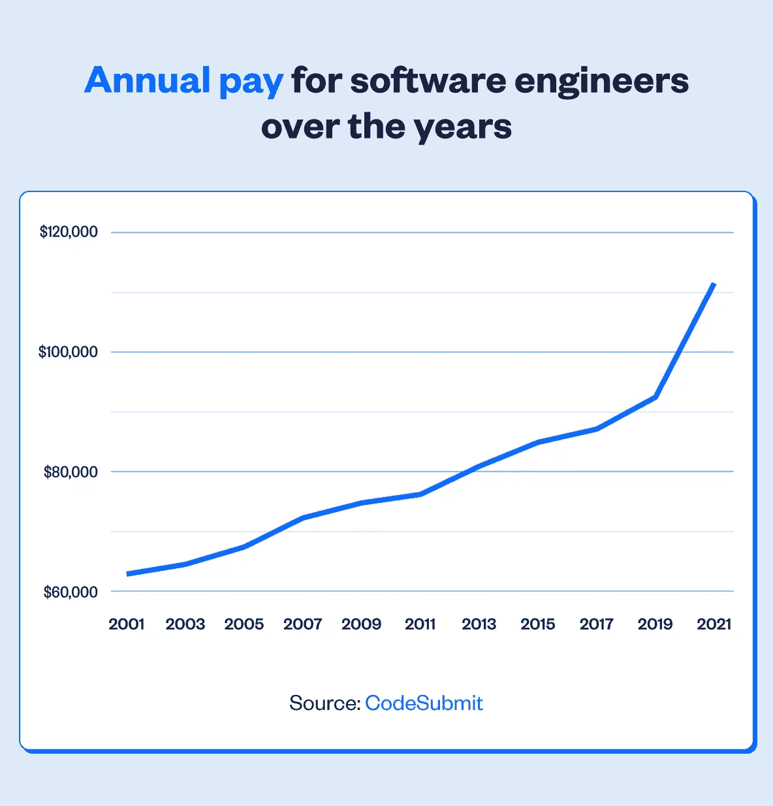
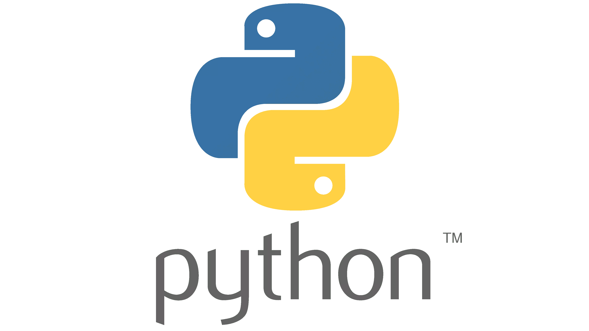
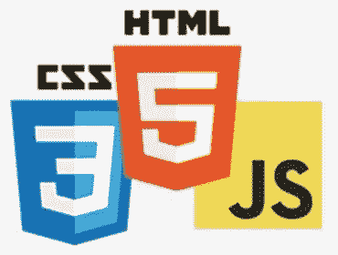
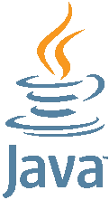
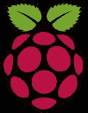
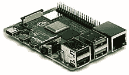

# 儿童最佳编程语言

> 原文：<https://www.sitepoint.com/best-programming-language-for-kids-to-learn/>

任何年轻人都可以从学习如何编码中获益。然而，为孩子选择最好的编程语言是很棘手的。在本文中，我们将探索向儿童介绍编程的最佳选择以及如何开始学习。

1.  [为什么你的孩子应该学习编程](#whyyourkidsshouldlearntocode)
2.  [最值得推荐的儿童编程语言](#toprecommendedprogramminglanguagesforkids)
    *   [划痕](#scratch)
    *   [Python](#python)
    *   [红宝石](#ruby)
    *   [HTML，CSS & JavaScript](#htmlcssjavascript)
    *   [Java](#java)
    *   哈斯克尔
3.  [建筑灵感](#buildinginspiration)
4.  [如何为孩子选择最好的编程语言](#howtochoosethebestprogramminglanguageforyourkid)
5.  [常见问题解答](#faqs)
6.  [结论](#conclusion)

## 为什么你的孩子应该学习编码

帮助孩子学习编码可能是你能做的最好的事情之一。学习编码是一项有价值的技能，在一个依赖计算的日益互联的世界里，这项技能只会变得更加重要。如今，随着编程作为一门有价值的学科的地位继续上升，学校里教授编程的频率越来越高。但是，如果你能尽早向孩子介绍编程，给他们一个良好的开端，你就能帮他们一个大忙。而且，像几乎所有其他事情一样，当你还年轻，大脑还在发育和建立联系的时候，学习编码更容易。一旦你的孩子学会了用一种语言编程，学习下一种语言就容易多了。

### 培养解决问题和批判性思维的技能

学习编码有助于[发展问题解决和批判性思维技能](https://www.scholarcy.com/how-coding-helps-children-become-creative-problem-solvers/)，这对课程的所有领域都有好处。通过将问题分解成更小、更易管理的任务，并以逻辑的方式解决它们，编写代码有助于孩子开发解决问题的结构化方法。它还以实用的方式向他们介绍了抽象和递归等概念。

编程有助于培养他们的创造力以及完成任务的韧性和决心。它也给孩子们一个机会去设计和建造一些东西，甚至可能发展成为一个成熟的项目，给他们一个自信的大提升。在一个项目中工作可能还包括与其他孩子一起工作，帮助发展他们的协作技能。

### 编程技能很受欢迎

大卫·道奇给出了孩子们应该学习编码的 10 个令人信服的理由，以及另外 5 个 T2 认为编码比你想象的更重要的理由。关键的一点是，随着工业世界变得更加自动化，计算机科学毕业生将变得越来越受欢迎，而其他行业却在裁员。

现在越来越多的大学课程都需要编程，而不仅仅是那些专门基于计算机科学的课程。计算机科学毕业生需求量很大，而且起薪几乎比其他任何学位都高。

由于各行各业对技术的使用越来越多，估计计算机专业的毕业生将来会有更好的就业前景和更大的职业灵活性。由于这个原因，越来越多的学生选择学习计算机科学，2020 年英国的[增长了 7.6%。随着几乎每个行业对计算机工作者需求的增长，这种趋势将会持续下去。](https://www.computerweekly.com/news/252493740/Number-of-students-taking-computer-science-degrees-rises-76-in-2020)

对计算机专业毕业生的大量需求也对薪水产生了积极影响。从下图中可以看出，它们一直在逐年增长，并且预计将继续增长。

<small>来源:CodeSubmit</small>

总之，教你的孩子编码在任何意义上都为他们提供了有价值的技能！

## 最值得推荐的儿童编程语言

当有这么多语言可供选择时，很难确定哪种编程语言最适合孩子们。对于更小的孩子来说，使用基于块的语言可能更有意义。这些包括拖放代码逻辑的“块”,然后将它们挤在一起创建一个程序。有点像编程用的乐高。

Scratch 是基于块的编码的鼻祖，但是还有许多其他的选择，它们都提供了稍微不同的体验。一个例子是谷歌的[块状](https://developers.google.com/blockly/)。

使用基于块的语言的好处是，你的孩子不必担心学习语法，而是能够专注于构建他们的程序。这意味着他们可以习惯关键的编程原则，如变量、流控制和循环。它还有助于避免语法错误带来的挫败感，这种错误会困扰任何初学编码的人(甚至会困扰有经验的编码人员！).

一旦孩子们掌握了这些关键概念，他们就可以学习需要输入命令的语言，并开始专注于学习特定语言的语法。

### 擦

Scratch 由麻省理工学院开发，用来教孩子们如何编码。这是一种基于块的编程语言，有助于教孩子关于变量、条件语句和事件的知识。它还包括许多资源，如精灵背景和声音，以便孩子们可以在学习基本编码的同时，组装出具有专业外观的最终产品。

Scratch 可以用来制作游戏、带有动画的故事以及孩子们能想到的任何东西。唯一的限制是他们的想象力。官方在线教程或[凯文·布里格斯的这个视频](https://www.youtube.com/watch?v=VIpmkeqJhmQ)将帮助学习者入门，但许多其他教程和书籍也可以在网上找到。还有 [Scratch Jr](https://www.scratchjr.org) 供更小的孩子开始使用。

[https://www.youtube.com/embed/VIpmkeqJhmQ?rel=0](https://www.youtube.com/embed/VIpmkeqJhmQ?rel=0)

 

### 计算机编程语言

Python 最初发布于 90 年代，现在是第 3 版。在那个时候，它已经发展成为学校和大学教授学生编程的事实语言。它是一种通用语言，支持多种范例，如命令式、函数式和面向对象的编程风格。

它受欢迎的原因之一是它的语法非常接近英语，因此初学者很容易掌握。它也没有使用任何括号或大括号来分隔代码，尽管它对缩进的使用可能会让一些初学者感到困惑。也有大量的资源可用，而且语言本身有许多内置特性。它也很容易获得，并且很容易安装在大多数机器上。Python 也是大学数据科学中最受欢迎的语言，这使得它成为许多课程和职业中非常有用的语言。这些都是认为 Python 是最适合孩子的编程语言的好理由。

Neha Praveen 的这个视频是孩子们开始学习 Python 的最佳场所。

[https://www.youtube.com/embed/uzyiCpsS0qQ?rel=0](https://www.youtube.com/embed/uzyiCpsS0qQ?rel=0)

 

### 红宝石

[Ruby](https://ruby-lang.org) 是由日本的松本幸弘(Yukihiro“Matz ”)于 90 年代开发的。它被描述为“程序员最好的朋友”，是一种通用编程语言，与 Python 有很多相似之处。

Ruby 有一个非常有表现力的语法，通常很容易阅读和理解。它也不使用括号或大括号，也不依赖缩进来分隔代码块。由于 Ruby on Rails 框架的广泛流行，它的使用在 21 世纪初迅速增长。

Ruby 比 Python 更关注面向对象编程(OOP ),因为 Ruby 中的几乎所有东西都是对象。它是我学习编程的第一门语言(不包括 BASIC 语言),并且有这本由克里斯·派恩为初学者写的优秀的[在线书籍。](https://pine.fm/LearnToProgram/)[Roman Pushkin 的《Ruby Is For Fun》](https://www.sitepoint.com/premium/books/ruby-is-for-fun/read/1/kkg4ugqh/)也可以在 SitePoint 上找到，还有[我几年前制作的这个视频系列](https://www.sitepoint.com/premium/courses/hands-on-programming-concepts-with-ruby-2-0-2906/)。(它使用的是 Ruby 的旧版本，但作为该语言的介绍还是不错的。)

### HTML、CSS 和 JavaScript

学习 HTML、CSS 和 JavaScript 的网络开发三驾马车可能是你孩子网络开发生涯的开始。这些语言的最大优势是它们不需要安装，并且可以在任何带有网络浏览器的设备上使用。这是 JavaScript 成为地球上[最受欢迎的语言](https://www.sitepoint.com/learn-to-code-with-javascript-the-most-popular-programming-language-on-earth/)的主要原因之一，也是 JavaScript 可能被认为是孩子最好的编程语言的一个很好的原因。

与其他编程语言相比，Web 开发还提供了更多的交互性，因为 HTML 有许多内置的交互元素，如表单和按钮，这些元素在其他语言中可能需要很大的努力才能制作出来。能够建立自己的网站对孩子们来说也是一个巨大的激励，因为他们可以在编程时看到自己的进步。

网上也有成千上万的教程和资源唾手可得。SitePoint 定期提供 HTML[HTML、CSS](https://www.sitepoint.com/html-css/) 和 [JavaScript](https://www.sitepoint.com/javascript/) 的初学者教程，通常适合孩子们学习。

在学习 web 开发方面，SitePoint 确实是你的后盾。它充满了新内容不断出现的文章和教程。初学者 HTML 和[初学者 CSS](https://www.sitepoint.com/premium/books/beginner-css/) 是初学者开始学习 HTML 和 CSS 的好地方，此外还增加了一些僵尸的乐趣。你真正写了[这本书，现在可以在 SitePoint](https://www.sitepoint.com/premium/books/learn-to-code-with-javascript/read/1/) 上免费获得，并且从一开始就用 JavaScript 教编码——包括[如何快速学习 JavaScript](https://www.sitepoint.com/how-to-learn-javascript-fast/)。

### Java 语言(一种计算机语言，尤用于创建网站)

Java 是世界上最流行的语言之一，它驱动着大量的企业级软件。它是由 Sun Microsystems 在 90 年代开发的，目的是成为一种可以在任何运行 Java 虚拟机的平台上运行的语言。

Java 有更多的学习障碍，这可能会让孩子们更难掌握，尤其是更小的孩子。比如需要编译，然后在虚拟机上运行，这些都需要设置。Java 将是孩子们学习一种功能全面的、基于类的语言和 OOP 原则的好选择——尽管它的面向对象的语法对于初学者来说不是最容易掌握的。事实上，与 Python 和 Ruby 相比，Java 的语法一开始就很难掌握，这使得它对孩子来说是一种很难开始的语言，因此也不是最好的编程语言。

学习 Java 将给孩子们一个开发移动和后端应用程序的机会。如果他们想开始 Android 应用程序开发，[j . f . DiMarizio](https://www.sitepoint.com/premium/books/beginning-android-programming-with-android-studio/)的这个教程会给他们一个很好的介绍。一旦他们学会了用 Java 编程，就很容易转向 C++、C#或 Swift 等语言，这些语言在语法和风格上都非常相似。

Karthik Kosireddi 制作的这个视频是对孩子们学习 Java 的一个很好的介绍。

[https://www.youtube.com/embed/E4uxL4-Iee8?rel=0](https://www.youtube.com/embed/E4uxL4-Iee8?rel=0)

 

### 哈斯克尔

Haskell 是 90 年代开发的纯函数式编程语言。许多人会认为这是一门难学的语言，但这通常是在他们先学习了其他语言之后。Haskell 的语法与其他使用命令式方法(命令用于改变程序状态)的语言有很大不同。但是如果这是一个孩子学习的第一种语言，情况就不一样了。

Haskell 也非常适合学习数学概念，因为整个语言都是基于数学函数的。事实上，下面的视频展示了一位老师如何使用它成功地向所有年龄的孩子教授编码和数学。

[https://www.youtube.com/embed/7CGuI9HcfqQ?rel=0](https://www.youtube.com/embed/7CGuI9HcfqQ?rel=0)

 

Haskell 是一种不确定的语言，但肯定是一种我希望早点学会的语言。[这篇关于 Beanz](https://kidscodecs.com/haskell/) 的文章很好地介绍了面向儿童的 Haskell。如果他们喜欢，他们可以在这里尝试用 Haskell 进行[编程。](https://tryhaskell.org/)

## 建筑灵感

除了学习如何编码，向孩子们介绍计算机如何工作也是有益的。一个很好的方法是让他们玩一些类似树莓派或 T2 BBC 微生物的东西。

这些是口袋大小的微型计算机，包括输入按钮和传感器以及视频和声音输出。它们可以使用 Scratch、JavaScript 或 Python 进行编程，Raspberry Pi 网站上有使用所有三种语言入门的教程。它也有一个[非常有用的父母指南](https://www.raspberrypi.org/blog/digital-making-at-home-parents-guide/)关于如何让孩子开始在家里用技术制作东西。

[https://www.youtube.com/embed/-iX9Qz0jGIg?rel=0](https://www.youtube.com/embed/-iX9Qz0jGIg?rel=0)

 

这两个网站都包括[项目](https://microbit.org/projects/)的[创意](https://projects.raspberrypi.org/en/projects)，这些创意包括从光传感器到激光绊线的所有东西以及大量实用的游戏创意。如果你的孩子喜欢动手制作东西，其中一个项目是很好的选择。

对于喜欢制作东西的孩子来说，另一个选择是给他们一个 [Arduino](https://www.arduino.cc) ，这是一个开源的电子套件，可以用来与各种家用电子设备接口，以创建各种各样的交互式项目。

马西莫·班迪在下面的 TED 演讲是关于 Arduino 是如何开源充满灵感的想象力的。

[https://www.youtube.com/embed/UoBUXOOdLXY?rel=0](https://www.youtube.com/embed/UoBUXOOdLXY?rel=0)

 

## 如何为你的孩子选择最好的编程语言

一旦你向你的孩子介绍了编码，最好的办法是找出他们喜欢什么，而不是强迫他们学习不适合他们的东西，然后温和地引导他们走向正确的选择。

如果他们喜欢游戏，也许从《我的世界》开始是一个好的选择，但是如果他们想建造机器人或其他现实世界的互动项目，那么也许一个带有一些 Python 代码的 Arduino 可能是一个更好的选择。

他们的年龄也会影响这个决定。对于年龄较小的孩子来说，Scratch 等基于块的语言可能是更好的起点，但如果他们年龄较大，Python 将是一个明智的选择。

## 常见问题

我将通过回答一些常见问题来结束这篇文章。

### 7 个孩子的编码语言是什么？

的确，在足够的帮助和支持下，孩子们可以学习任何编程语言。但是以下七种是孩子们学习的最佳编程语言的精选:

*   擦
*   计算机编程语言
*   红宝石
*   Java Script 语言
*   Java 语言(一种计算机语言，尤用于创建网站)
*   哈斯克尔
*   《我的世界》

对于更小的孩子来说，从零开始是最好的地方。Python 或 Ruby 将是他们首选的书面语言。如果他们想参与 web 开发，JavaScript 很有用。一旦掌握了其他语言的基础知识，Java 和 Haskell 都更适合学习，但它们都提供了学习一些更高级的编码概念的机会。《我的世界》模块是一个很好的方式来介绍给孩子们基本的编程，同时让他们发挥创造力。在[铁拳大学](https://tekkieuni.com/blog/minecraft-modding/)和[科技时代儿童](https://www.techagekids.com/2017/05/minecraft-coding-and-mod-creation.html)上有一些关于《我的世界》改装的精彩介绍。

### 应该多早教孩子编码？

开始永远不会太早或太晚！你可以从孩子开始玩的时候就开始教授编码原则——通过给他们排序和安排要做的挑战。

一旦他们能够操作计算机，你就可以让孩子们开始学习基于块的编码系统，同时继续给他们提供基于编码的问题，比如那些在 [Bebras](https://www.bebras.uk) 网站上看到的问题。这也提供了对海龟语言的访问，这是孩子们学习编码原则的好方法。

随着他们的进步，当孩子们准备好从基于块的编码转移到实际的类型化编码时，应该会变得很清楚(尽管如果他们愿意，继续使用基于块的或可视化的编码对他们来说是完全好的)。

### Python 和 Java 哪个更适合孩子？

Python 可能是孩子们更明显的选择，尤其是作为第一语言来学习。它的语法更加简单易懂，代码不需要在虚拟机上编译和运行。话虽如此，对于已经有一些其他语言编程经验的年龄较大的孩子来说，Java 将是一个不错的选择，因为它会给他们一些使用强类型、基于类的语言的经验。这也给他们一个机会去体验一种用来创建企业级软件的语言。

### C++对孩子好吗？

我不建议孩子们开始学习 C++编程，原因和我不建议他们学习 Java 的原因类似(如上所述)。然而，一旦他们掌握了编程基础，他们可能会想继续学习更接近硬件的低级语言，此时他们可能会想学习 C++，尽管还有许多其他选择，如 Rust、Go 或 C#。

### 我在哪里可以找到帮助我孩子的信息/课程？

现在很多学校都把编程作为课程的一部分来教，但是如果你孩子的学校不提供编程也不用担心。你可以在网上找到很多其他的选择。

[Jet Learn](https://www.jet-learn.com) 为 5-14 岁的儿童提供大量课程，[exercisem](https://exercism.org)提供超过 60 种不同编码语言的编程挑战，还包括经验丰富的程序员的免费指导。

对于更小的孩子来说，Tynker 提供了一整套结构化的课程。它从基于块的编码开始，介绍重要的概念，并随着孩子的长大继续使用 Python。 [CodeMonkey](https://www.codemonkey.com) 还提供许多有趣的编码活动，有鲜艳多彩的角色，以及一个孩子们可以在手机或平板电脑上使用的应用程序。 [Code Spark](https://codespark.com) 是一个面向年轻程序员的在线学院，提供大量游戏和挑战来帮助他们学习编程。

对于年龄较大的孩子(或成年人)，有哈佛大学的 CS50 计算机科学入门在线课程，该课程介绍了一些编程语言和计算机科学概念。还有 [Codecademy](https://www.codecademy.com) ，提供从网页开发到机器学习的众多课程。

像 [CodeWars](https://www.codewars.com) 、[code game](https://www.codingame.com)、 [CodeCombat](https://codecombat.com) 这样的网站将学习编码变成了一个游戏——通过将编码挑战游戏化，让大多数孩子觉得既有趣又有教育意义。

还有许多教授编程概念或想法的在线游戏，如 [Cargo-Bot](https://www.sitepoint.com/learn-basic-programming-concepts-while-you-play-with-cargo-bot-for-ios/) 、[电梯传奇](https://play.elevatorsaga.com)、 [SQL 谋杀之谜](https://mystery.knightlab.com)、 [CSS Diner](https://flukeout.github.io) 和 [Lightbot](https://lightbot.com) 。

最后，不要忘记好的老式书籍学习！当地图书馆应该有一些编程书籍，孩子们可以在学习的同时通过他们的方式工作。如果没有，那么你会在 [SitePoint Premium](https://www.sitepoint.com/premium/library/) 上找到一个巨大的图书馆。

## 结论

在本文中，我介绍了我认为最适合孩子的编程语言。学习编码是一项无价的技能，在大数据和人工智能的世界里只会变得更加重要。帮助你的孩子学习编程将会给他们的生活一个巨大的开端。这将给他们一个挑战，帮助他们解决问题并获得创造力。开始教他们编程永远不会太早。

从逻辑问题入手，然后引入 Scratch 等基于块的编程语言。当他们准备好进行实际的编码时，向他们介绍 Python 和一些使用 JavaScript 的 web 开发。

一旦他们掌握了这些语言，他们就可以继续学习更高级的语言，比如 Java 或 Haskell，但是到那时，他们可能已经知道下一步想学什么了，这取决于他们的兴趣。

总的来说，关键是要确保他们继续建造东西并从中获得乐趣！

**相关阅读:**

*   [应该先学哪种编程语言？](https://www.sitepoint.com/which-programming-language-should-i-learn-first/)
*   [学习用 JavaScript 编程:世界上最流行的编程语言](https://www.sitepoint.com/learn-to-code-with-javascript-the-most-popular-programming-language-on-earth/)

## 分享这篇文章