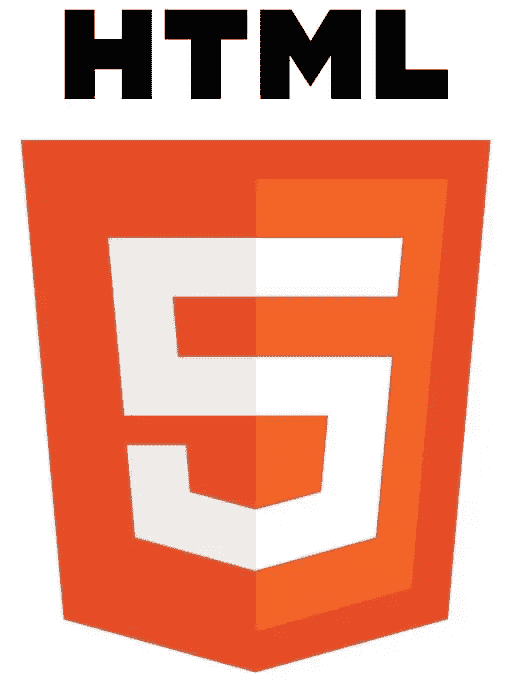
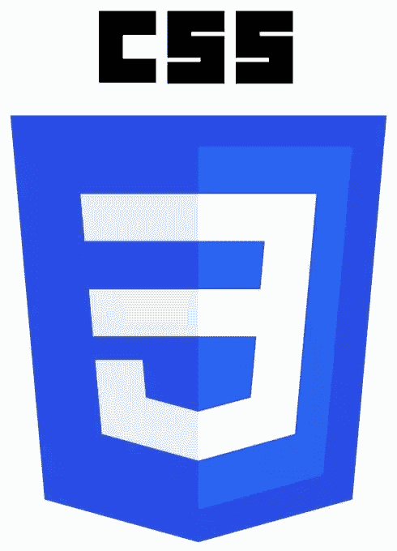
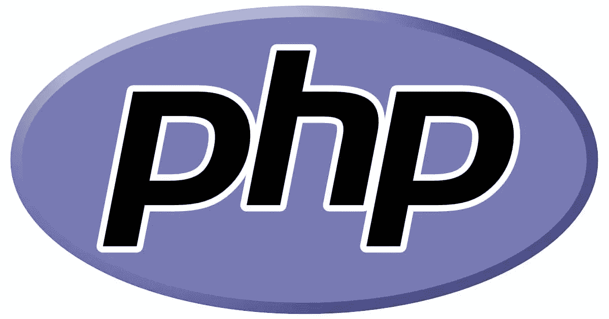
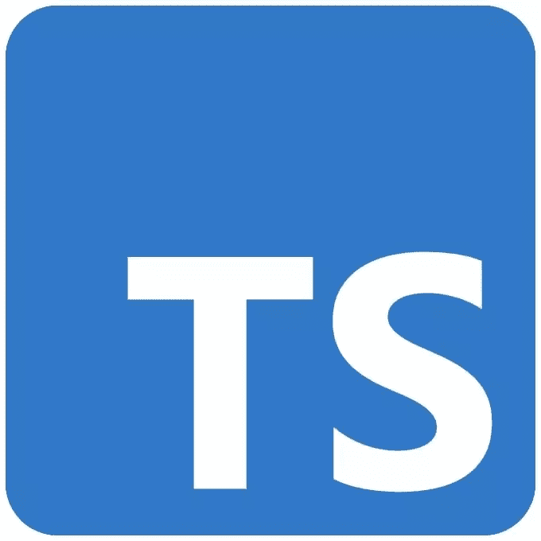
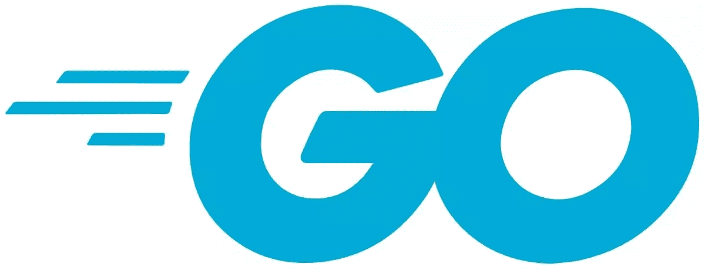

# 你可以用于网络开发的最佳编程语言(2023)

> 原文：<https://www.sitepoint.com/best-programming-language-for-web-development/>

在本文中，我们将探索 web 开发的最佳编程语言。Web 开发是一个充满机遇的广阔领域。它在不断发展，为职业发展提供了很大的潜力。为了成为一名网络开发人员，你需要很好地理解至少一种编程语言。

然而，开发人员将使用的编程语言的类型通常取决于开发的类型和项目的具体方面，并且还取决于开发人员的偏好。让我们来看看在决定学习什么语言进行 web 开发时需要考虑的一些因素。

1.  [什么是编程语言？](#whatareprogramminglanguages)
2.  [不同类型的编程语言](#differenttypesofprogramminglanguages)
    *   [通用语言](#generalpurposelanguages)
    *   [特定领域语言](#domainspecificlanguages)
    *   [标记语言](#markuplanguages)
    *   [编译和解释语言](#compiledandinterpretedlanguages)
    *   [脚本语言](#scriptinglanguages)
    *   [编程语言类型表汇总](#tablesummaryofprogramminglanguagetypes)
3.  [不同的需求需要不同的语言](#differentneedsrequiredifferentlanguages)
    *   [全栈](#thefullstack)
    *   [jam stack](#thejamstack)
4.  【2023 年的 8 种最佳编程语言
    *   [HMTL](#html)
    *   [CSS](#css)
    *   [JavaScript](#javascript)
    *   [PHP](#php)
    *   [C#](#c)
    *   [打字稿](#typescript)
    *   [Python](#python)
    *   [出发](#go)
5.  哪些编程语言最适合初学者使用？
    *   [超越基础的编程语言](#programminglanguagesbeyondthebasics)
6.  [结论](#conclusion)

## 什么是编程语言？

编程语言是为计算机编程提供结构的一组规则。它们用于创建可以由机器执行的特定指令，通常是计算机。编程语言可以用来创建解决特定问题的程序，或者用来表达算法。

一些编程语言是为特定的任务而设计的，而另一些则更加通用。例如，SQL 是一种用于查询数据库的特定领域语言，而 Python 是一种通用语言，可用于多种任务。

## 不同类型的编程语言

出于上下文的考虑，假设编程语言可以根据它们的目的、抽象层次和语法分为许多不同的类型。然而，当谈到现代 web 编程时，我们对其中的大部分并不感兴趣，例如[低级编程](https://en.wikipedia.org/wiki/Low-level_programming_language)和[过程编程](https://en.wikipedia.org/wiki/Procedural_programming)，所以我们将只关注某些特定的群体。

编程语言的主要类型如下。

### 通用语言

通用语言被设计用于广泛的任务。通用编程语言的例子包括 C++、Java、Python，现在越来越多的甚至包括 JavaScript。

### 特定领域语言

特定领域语言被设计用于特定的任务。例如，SQL 是用于查询数据库的特定领域语言，而 HTML 是用于创建网页的特定领域语言。

### 标记语言

[标记语言](https://en.wikipedia.org/wiki/Markup_language)用于创建包含结构化数据的文档。标记语言本身是不可执行的，但是它们可以用来创建可以被其他程序执行的文档。标记语言的例子包括 HTML、XML 和 JSON(请注意，但是让我们按照那个分类)。

### 编译和解释语言

此外，编程语言可以分为**编译的**或**解释的**。

[编译语言](https://en.wikipedia.org/wiki/Compiled_language)转换成计算机可以直接执行的机器代码。编译语言的例子包括 C++和 Java。

解释语言不被转换成机器代码，但是它们被解释器执行。解释语言的例子包括 JavaScript 和 Python。

### 脚本语言

作为一个额外的有用的类别，脚本语言被设计成自动化任务。它们通常用于编写与其他软件程序交互的代码。例如，可以使用脚本来自动执行在 web 应用程序中创建新用户帐户的过程。

脚本语言的例子包括 Bash、PERL 和 PowerShell。

### 编程语言类型表摘要

| 类型 | 通用 | 特定领域 | 置标语言 | 编辑 | 解释 |
| --- | --- | --- | --- | --- | --- |
| 尝试 | 是 | 不 | 不 | 不 | 是 |
| 半铸钢ˌ钢性铸铁(Cast Semi-Steel) | 不 | 不 | 不 | 不 | 是 |
| C++ | 是 | 不 | 不 | 是 | 不 |
| 去 | 是 | 不 | 不 | 是 | 不 |
| 超文本标记语言 | 不 | 不 | 是 | 不 | 是 |
| JSON | 不 | 不 | 是 | 不 | 是 |
| Java Script 语言 | 是 | 不 | 不 | 不 | 是 |
| 服务器端编程语言（Professional Hypertext Preprocessor 的缩写） | 是 | 不 | 不 | 不 | 是 |
| 计算机编程语言 | 是 | 不 | 不 | 不 | 是 |
| 以打字打的文件 | 是 | 不 | 不 | 不 | 是 |
| 结构化查询语言 | 不 | 是 | 不 | 不 | 是 |
| 可扩展标记语言 | 不 | 不 | 是 | 不 | 是 |

## 不同的需求需要不同的语言

没有一种最好的编程语言可以满足所有的需求。不同的编程语言更适合不同的任务。开发人员需要评估手头的任务，以便做出最佳决策。

例如，像 PHP 或 Python 这样的语言非常适合开发服务器支持的动态网页，而 JavaScript 最初是为开发网站或 web 应用程序的客户端代码而构建的。但是正如我们将会看到的，事情已经发生了一些变化。

### 整个堆栈

直到不久前，一个杀手组合是将 PHP 用于服务器端代码，将 JavaScript 用于客户端代码，因为这将使您两全其美:PHP 用于服务器端代码的动态特性和 JavaScript 用于客户端代码的灵活性和[事件驱动](https://en.wikipedia.org/wiki/Event-driven_architecture)特性。

然而，如今更常见的方法是对服务器端和客户端代码都使用 JavaScript 或 TypeScript(所谓的“JavaScript 无处不在”范例)，这可以简化代码库和维护，因为您主要是在处理一种语言。像 Node.js 这样的框架和像 [React](https://reactjs.org/) 、 [Angular](https://angular.io/) 和 [Vue.js](https://vuejs.org/) 这样的库使这成为可能。

明确地说，所谓的“完整”堆栈包括后端(服务器端)和前端(客户端)的组合。

### Jamstack

一个更先进的方法是去[无服务器](https://en.wikipedia.org/wiki/Serverless_computing)。这实质上包括编写不需要任何服务器端代码的 JavaScript 网站，并依赖 API 来实现进一步的交互性——如身份验证、实时数据库等等。

这种方法被称为“[jam stack](https://jamstack.org/)”:JavaScript+API+标记。

其中，Jamstack 执行以下操作:

*   It **简化管理**。几乎不需要升级、修补、维护，甚至支付服务器费用。
*   它**提高了可用性**。这是因为你基本上是在使用老式网络技术的现代版本(HTML、CSS 和 JavaScript)，这使得网站加载速度超快，非常适合缓存，同时也使其非常容易部署和分发到全球的[内容交付网络](https://en.wikipedia.org/wiki/Content_delivery_network)。

有关这方面的更多信息，请参见:

*   [jam stack 简介:构建安全、高性能的网站](https://www.sitepoint.com/learn-jamstack/)
*   [100 个 Jamstack 工具、API&服务为您的站点提供动力](https://www.sitepoint.com/jamstack-tools-services-apis/)

最后，重要的是要注意，编程没有放之四海而皆准的方法，所以即使你没有成为一个万事通，你最终也一定会学习和使用一点这个和一点那个。

## 2023 年的 8 种最佳编程语言

编程语言的世界是广阔的，并且一直在发展。跟上最新最棒的可能很难，尤其是当你刚刚开始的时候。以下是 2023 年最值得学习的八种编程语言。

考虑到每种语言都有自己的优势和劣势。例如，如果您需要创建一个复杂的 web 应用程序，您会希望使用一种易于扩展的语言，并且拥有一个大型的库和框架生态系统。

另一方面，如果你只是创建一个简单的网站，你也许可以使用不太复杂的语言。如果可能的话，试着选择一种你长期来看能适应的语言，这会让你的生活更轻松。

### 超文本标记语言

超文本标记语言(HTML)是创建网页的标准标记语言。与 CSS 和 JavaScript 一起，它是万维网的三大核心技术之一。HTML 简单易学，应用广泛。对于初学者和有经验的开发人员来说，这都是一个不错的选择。

HTML 用于结构化内容，对于创建网页来说是必不可少的，包括动态网页(当与 PHP、ASP、Python 结合使用时)或其他网页(对于只使用 CSS 和 JavaScript 的静态网站)。

**优点**:

*   简单易学
*   广泛的应用
*   W3C 标准

**缺点**:

*   它[不完全是一种编程语言](https://css-tricks.com/html-is-not-a-programming-language/)
*   它可能很难扩展(随着项目变大，由于缺乏模块化，管理代码库可能变得很麻烦；虽然这在使用 [web 组件](https://en.wikipedia.org/wiki/Web_Components)时得到了部分解决

**资源**:

*   [站点点的 HTML](https://www.sitepoint.com/html-css/html/)
*   真实世界的 CSS3，第二版 T3，作者亚历克西斯·戈尔茨坦、路易斯·拉扎勒斯和埃斯特尔·维尔
*   [Mozilla Developer next work 上的 HTML](https://developer.mozilla.org/en-US/docs/Web/HTML)

### 半铸钢ˌ钢性铸铁(Cast Semi-Steel)

[层叠样式表](https://www.w3.org/TR/CSS/#css) (CSS)是一种样式表语言，用于描述以 HTML 或 XML 编写的文档的表示。CSS 用于设计所有 HTML 元素的样式，包括文档的布局、颜色和字体。

CSS 简单易学，应用广泛。对于初学者和有经验的开发人员来说，这都是一个不错的选择。

优点和缺点和 HTML 差不多。

**资源**:

*   [站点点的 CSS](https://www.sitepoint.com/html-css/css/)
*   *[CSS 大师，第三版](https://www.sitepoint.com/premium/books/css-master-3rd-edition/)* ，作者蒂芙尼·布朗
*   [Mozilla Developer next work 的 CSS](https://developer.mozilla.org/en-US/docs/Web/CSS)

### Java Script 语言

[JavaScript](https://www.ecma-international.org/publications-and-standards/standards/ecma-262/) (通常缩写为 JS)是一种高级的、解释型的编程语言。它被用来创建交互式网页。

JavaScript 是由 Brendan Eich 在 1995 年发明的，自此成为网络上使用最广泛的编程语言之一。

**优点**:

*   广泛的应用
*   甚至可以用 [Node.js](https://nodejs.org/en/) 来编写后端应用程序
*   动态灵活
*   W3C 标准

**缺点**:

*   浏览器兼容性问题
*   虽然语言本身可能并不难学，但至少可以说，*现代* JavaScript 加上适当的 Node.js 工具、 [transpilers](https://en.wikipedia.org/wiki/Source-to-source_compiler) 等等可以让事情变得复杂(被称为“ [JavaScript 疲劳](https://www.google.com/search?q=javascript+fatigue)”)

**资源**:

*   [位于站点点的 JavaScript](https://www.sitepoint.com/javascript/)
*   Mozilla Developer Nextwork 上的 JavaScript

**书籍**:

*   JavaScript 编程入门，作者约翰·雷亚
*   *[JavaScript:忍者新手，第二版](https://www.sitepoint.com/premium/books/javascript-novice-to-ninja-2nd-edition/)* ，作者达伦·琼斯
*   *[学习用 JavaScript 编码](https://www.sitepoint.com/premium/books/learn-to-code-with-javascript/)* ，作者达伦·琼斯

### 服务器端编程语言（Professional Hypertext Preprocessor 的缩写）

[PHP:超文本预处理器](https://www.php.net/) (PHP)是一种服务器端脚本语言。它被用来创建动态网页。PHP 代码在服务器上执行，然后结果被发送到浏览器。

PHP 是在 PHP 许可下发布的免费开源软件，也是在 1995 年首次发布。从那以后，PHP 发展成为最流行的服务器端脚本语言之一，被数百万网站使用，包括维基百科和脸书。

**优点**:

*   简单易学
*   广泛的应用
*   良好的性能

**缺点**:

*   它的受欢迎程度一直在下降
*   它严格限于 web 开发

**资源**:

*   [PHP 在站点点](https://www.sitepoint.com/php/)
*   *[PHP & MySQL:新手到忍者，第 7 版](https://www.sitepoint.com/premium/books/php-mysql-novice-to-ninja-7th-edition/)* ，作者汤姆·巴特勒
*   [正式文件](https://www.php.net/docs.php)

### C#

[C#](https://learn.microsoft.com/en-us/dotnet/csharp/) (读作“C sharp”)是微软创造的通用、高级、多范例编程语言。它用于创建桌面和网络应用程序。C#类似于 C++，但它有一些独特的功能和微软提供的工具集(如 [Visual Studio](https://visualstudio.microsoft.com/) )，这有助于更好的开发人员体验。

C#于 2000 年首次发布，是一种非常流行的编程语言，尤其是在。NET 开发人员。而且作为一种多用途、面向对象的编程(OOP)语言，它甚至可以用来开发游戏！因此，如果你不想限制自己的网络开发，C#可能是一个很好的选择。

**优点**:

*   相对容易学习，因为它简化且完全集中的工具(与 JavaScript 相比)
*   良好的性能
*   广泛的应用

**缺点**:

*   编译可能会减慢您的工作流程
*   不如其他语言流行

**资源**:

*   *[以 C#和开始。NET，2021 版](https://www.sitepoint.com/premium/books/beginning-c-and-net-2021-edition/)* ，作者本杰明·帕金斯和乔恩·d·里德
*   [微软文档中的 C#](https://docs.microsoft.com/en-us/dotnet/csharp/)

### 以打字打的文件

[TypeScript](https://www.typescriptlang.org/) 是 JavaScript 的超集，增加了静态类型检查。TypeScript 被编译成 JavaScript，因此它可以在任何浏览器或 JavaScript 环境中运行。

但这是一种过于简化的做法，并没有真正公平对待 TypeScript。TypeScript 极大地改善了开发 web 应用程序和管理项目的工作流程。

TypeScript 也是由微软创建的，并于 2012 年首次发布。近几年在前端开发者(尤其是使用 Angular、React 和 Vue.js 的开发者)中越来越受欢迎。

**优点**:

*   提高代码质量
*   可以与 JavaScript 库一起使用

**缺点**:

*   需要一个构建步骤(可以自动化到管道中)
*   开始时可能有点难以理解

**资源**:

*   [在 SitePoint 上打字稿](https://www.sitepoint.com/tag/typescript/)
*   *[TypeScript 4 设计模式和最佳实践](https://www.sitepoint.com/premium/books/typescript-4-design-patterns-and-best-practices/)* ，作者 Theo Despoudis
*   [正式文件](https://www.typescriptlang.org/docs/)

### 计算机编程语言

Python 是一种广泛使用的高级解释编程语言，由吉多·范·罗苏姆于 1991 年创建。Python 以其简单的语法和可读性而闻名。它用于创建网络应用程序、科学计算、[人工智能](https://www.sitepoint.com/best-programming-language-for-ai/) (AI)等等。

此外，像 C#一样，Python 是一种多用途语言，可以打开比 web 开发更远的大门，尤其是进入数据科学和人工智能领域。

**优点**:

*   简单易学
*   可读和可维护的代码
*   广泛的应用

**缺点**:

*   可能会很慢
*   不像其他语言那样受 web 开发的欢迎

**资源**:

*   [位于站点点的 Python](https://www.sitepoint.com/web/python/)
*   *[《蟒蛇学徒》](https://www.sitepoint.com/premium/books/the-python-apprentice/)* ，奥斯汀·宾汉姆和罗伯特·斯莫尔夏尔著
*   [正式文件](https://docs.python.org/)

### 去

[Go](https://go.dev/) (通常被称为“Golang”)是谷歌在 2009 年创建的一种免费开源编程语言。Go 是一种静态类型的编译语言，感觉像是一种动态语言。它用于创建 web 应用程序、分布式系统等等。

Go 是一种相对较新的语言，但它在最近几年变得非常流行。它在来自 Unix 或 Linux 背景的开发人员中特别受欢迎。

**优点**:

*   快速编译时间
*   良好的性能
*   简单易学

**缺点**:

*   不如其他语言流行
*   有限的工具

**资源**:

*   [前往站点点](https://www.sitepoint.com/programming/go-programming/)
*   *[实用 Go:构建可扩展的网络和非网络应用](https://www.sitepoint.com/premium/books/practical-go-building-scalable-network-and-non-network-applications/)* ，作者 Amit Saha
*   [正式文件](https://golang.org/doc/)

## 哪些编程语言最适合初学者使用？

好了，你已经对 web 开发的主要编程语言有了一个大致的了解。但是[作为初学者应该选择哪一个](https://www.sitepoint.com/which-programming-language-should-i-learn-first/)？

在做出决定之前，有几件事需要考虑:

*   想学的语言就业市场怎么样？
*   这种语言好学吗？
*   你将从事什么类型的项目？
*   你需要知道一种以上的编程语言吗？

如果你刚刚开始，HTML、CSS 和 JavaScript 是一个基本的起点，因为这三种语言对于任何 web 开发人员来说都是必不可少的，而且它们相对容易学习。正如我们所见，HTML 用于构建网页内容，而 CSS 用于设计内容样式，JavaScript 用于增加交互性。

### 超越基础的编程语言

一旦你对这三种语言感到舒适，并想深入研究后端，你就可以开始学习更专业的语言，如 PHP、Python 和 Go，甚至 C#。这些语言将让你更好地控制你的网站或应用程序的功能和外观。

此外，如果你想让你的前景超越 web 开发，学习 Python 是一个好主意，因为它不仅是最流行的语言之一，也是最容易学习的语言之一。此外，Python 还被用于各种领域，如数据科学、机器学习等等；所以你可以在许多不同的方面运用你的技能。

或者，话说回来，你还不如干脆[到处运行*JavaScript*T3！](https://nodejs.dev/en/)

要获得所有这些语言的大量资源，包括访问大型图书馆和书籍、每周新鲜内容，可以考虑订阅[SitePoint Premium Library](https://www.sitepoint.com/premium/)([定价](https://www.sitepoint.com/premium/pricing/))。这里有一些让[更快学习编程语言的技巧](https://www.sitepoint.com/how-to-learn-programming-languages-faster/)。

## 结论

当谈到决定哪种编程语言是 web 开发的最佳语言时，没有简单的答案。不同的语言更适合不同的目的，因此最适合您的语言将取决于您的特定需求。然而，2023 年 web 开发的一些最佳编程语言包括 HTML、CSS、JavaScript 和 TypeScript、PHP 和 Python。如果你刚刚开始，先学习其中一种语言是个好主意。

如上所述，学习多种语言很重要，这样你就可以为任何情况做好准备。你知道的语言越多，你就能更好地处理任何事情。

无论你选择学习哪种语言，最重要的是不断练习和拓展你的技能。web 开发的世界是不断变化的，所以保持好奇心和跟上时代是很重要的。你知道的越多，你就能更好地建立人们会喜欢的令人惊叹的网站。

## 分享这篇文章