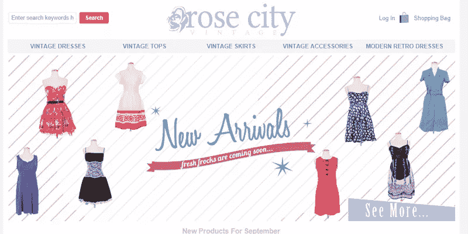
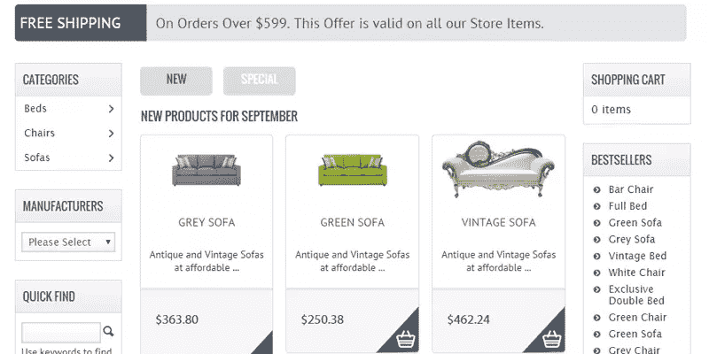
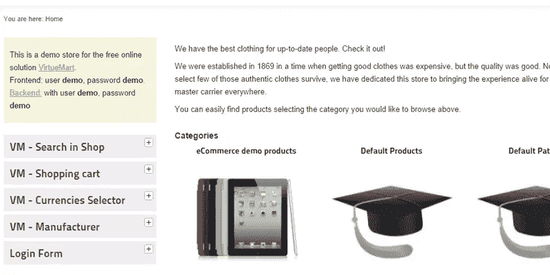
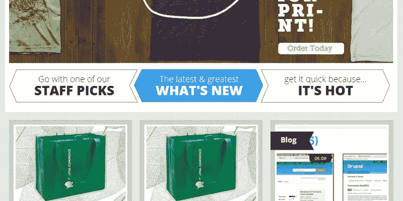

# 最佳自主电子商务解决方案

> 原文：<https://www.sitepoint.com/best-self-hosted-ecommerce-solutions/>

看了 10 个[最佳在线电子商务解决方案](https://www.sitepoint.com/10-best-ecommerce-platforms/)，现在让我们探索一下它们的自主托管解决方案。在编辑这份名单时，我考虑了产品质量、功能、社区支持、使用(通过 BuiltWith.com 的[)和普遍受欢迎程度。](http://builtwith.com)

我考虑过小企业和大公司的电子商务工具，并为每种工具提供了一个例子。所有的工具都是免费的，所以我们欢迎并鼓励您亲自尝试。

## [1。Magento](http://www.magento.com)

让我们从电子商务平台无可争议的领导者 Magento 开始。Magento 社区版 1.9 于 2014 年 5 月发布，越来越受欢迎，社区热切期待 Magento 2.0。自从易贝公司在 2011 年收购 Magento 以来，发展已经严重放缓，但没有其他解决方案可以夸耀其目前 11%的市场份额。

### 利益

当搭配高质量的主题时，Magento 可以帮助你建立你梦想中的网络商店。你可以花几个小时简单地配置你想要的产品列表外观(以一种好的方式)。拥有一个共享产品库的不同店面可以轻松设置，专业登录页面易于构建，您可以连接几乎任何工具或服务。很少有电子商务工具能与 Magento 相媲美，至少在没有安装大量插件的情况下是如此。

### 值得注意的特征

*   特色！有大量的特性和产品属性可以使用。为了自己看，你可以看看我的 [Magento vs. X-Cart](http://youtu.be/qGvTme1lMjg?t=7m55s) 八分钟的截屏。
*   数百个专业和高质量的模板可用。
*   未来无需升级到更好的解决方案，Magento 的可扩展性超乎你的想象。

Magento 是一个资源野兽。它将很快超越共享主机，它有一整套主机需求(比如建议你在一个单独的服务器上托管你的后端)。

我以前在与 WooCommerce 的比较中报道过 Magento，正如上面提到的在《T2》的截屏中报道过 X-Cart。

Magento(社区版)可以在[Magento.com](http://www.magentocommerce.com/download/)免费下载。

## [2。WooCommerce](http://www.woothemes.com/woocommerce/)

根据 built with 的调查，WooCommerce 仅次于 Magento，占据了所有电子商务商店的 7.4%。考虑到 WooCommerce 只有三年的历史，这是相当令人印象深刻的。有帮助的是，它运行在 WordPress 上，只需要几分钟就可以熟悉。

WooCommerce 是我个人的最爱之一，我之前已经为 SitePoint 写了很多关于它的文章。

### 利益

WooCommerce 是一个非常轻量级的应用程序，不会像 Magento 那样对服务器资源造成压力。它的基本功能高于平均水平，有数百个高质量插件可以进一步增强它。

如果你已经熟悉 WordPress，那么学习 WooCommerce 是轻而易举的事情，因为它结合了 WordPress 的最佳实践可用性。你可以用你习惯的方式使用小工具，如果你使用 [WooCommerce 优化主题](https://www.sitepoint.com/10-of-the-best-woocommerce-themes/)你的常规网站和 WooCommerce 商店将会有相同的外观和感觉。

### 值得注意的特征

*   利用大多数免费和付费的 WordPress 插件。
*   易于设置和配置。
*   数百个美丽的主题，价格合理。

WooCommerce 可以在[WooThemes.com](http://www.woothemes.com/woocommerce/)免费下载。

## [3。禅宗车](http://www.zen-cart.com/)

举例:[玫瑰之城年份酒](http://rosecityvintage.com/)

Zen Cart 最初是 osCommerce 的衍生产品，是该榜单中最古老的购物车之一，但它仍有 3%的使用率，不过这一比例正在下降。你会在各种自由职业者网站上发现数百名 Zen Cart 专业程序员，他们喜欢 Zen Cart 基于 PHP/MySQL 的基础。

### 利益

虽然不是最漂亮的脸，禅车肯定有一个更友好的灵魂。看看演示商店的源代码，并将其与其他购物车进行比较——它的功能与大多数其他购物车相当，但 Zen Cart 主要侧重于支持。

Zen Cart 仍然受欢迎的原因之一是，它允许非程序员在需要时调整代码中的一些设置。它还拥有数百个开发良好的插件，以及你能找到的最活跃的论坛之一。Zen Cart 的文档非常详细——它甚至有一个广泛的 wiki。

### 值得注意的特征

*   文档:论坛、维基、指南，应有尽有！
*   近 2000 个专业插件可用，其中大部分是免费的。
*   新手友好的代码库。

Zen Cart 是开源的，可以在 Zen-Cart.com 免费下载。

## [4。osCommerce](http://www.oscommerce.com/)

示例:[欧司玛主题](http://mobilewebs.net/mojoomla/demo/oscommerce/osmart/)

第二个最受欢迎的电子商务解决方案是 osCommerce。对我来说，osCommerce 是一次回忆之旅，因为我用它建立了我的第一个网上商店。

osCommerce 的使用相当稳定，偶尔会出现上升。与 Zen Cart 一样，它很容易使用，你可以找到许多低价程序员来为你的商店工作。你会在许多大型主机公司的推荐列表中找到 osCommerce。

### 利益

osCommerce 有一个简单的界面，您可以很快熟悉它。它的设置相当详细，但是在为您的客户构建网络商店时，目录管理的可用性是一大优势。

osCommerce 拥有比 Zen Cart 更大的支持基础，在他们的社区中有超过 150 万个论坛帖子。资源库中有 7，000 个插件，在官方网站之外的开发者页面上还有更多可用的插件，你很少会没有功能。如果你有一些经验，构建你自己的插件是相当简单的，或者你可以以每小时不到 10 美元的价格雇佣熟练的程序员。

osCommerce 拥有所需的所有基本特性，但真正的强大之处在于它有数以千计的可用插件来扩展其功能。我已经包括了一个专业的主题，就像上面的例子一样，因为官方的 [osCommerce demo](http://demo.oscommerce.com/) 让我想哭。

### 值得注意的特征

*   他们 28 万(！)论坛成员和许多本地化的支持站点。
*   7000 个插件，几乎无限的可扩展性。
*   速度——osCommerce 商店非常轻便。

osCommerce 可以在[osCommerce.com](http://www.oscommerce.com/)免费下载。

## [5。开放式购物车](http://www.opencart.com/)

OpenCart 目前在使用数字上仍落后于 Zen Cart 和 osCommerce，但正在稳步上升。它甚至有潜力在 OpenCart 2.0 发布时超过这两家。OpenCart 拥有所有默认主题中最干净的店面设计之一。

### 利益

我以前讨论过 OpenCart，在 SitePoint 的一个 [Prezi](https://prezi.com/apddmszjvxzx/prestashop-vs-opencart-sitepointcom-comparison/) 中将它与 PrestaShop 进行了比较。

OpenCart 易于使用，并提供了从管理中编辑 CSS 的能力，这使得快速更改布局更加容易。OpenCart 也有许多集成的支付和运输选项。

有数百个专业模板可用，但是很少有免费的主题。OpenCart 有大量的插件，售价 13000 英镑，其中大部分是付费的。提供的是一个广泛的合作伙伴网络，如果你不想使用社区论坛，他们将提供付费支持，社区论坛不如 osCommerce 或 Zen Cart 的规模大。

### 值得注意的特征

*   13，000 个专业插件可用。
*   足够的内置集成让您立即上手。
*   积极开发，OpenCart 2.0 即将发布。

OpenCart 可以在[OpenCart.com](http://www.opencart.com/)免费下载。

## [6。预铺](http://www.prestashop.com/)

PrestaShop 是目前在[构建的](http://builtwith.com/ecommerce/)电子商务列表中最后一个使用的电子商务工具，但正在上升。我曾经[比较过 PrestaShop 和 OpenCart](https://www.sitepoint.com/self-hosted-shopping-carts-prestashop-vs-opencart/) ，我仍然觉得它是一个有趣的工具。

### 利益

PrestaShop 由一家商业公司运营，该公司专注于顶级竞争。他们的内置功能集已经令人印象深刻，涵盖了所有必要的销售工具，如交叉销售、优惠券等。他们也有许多高质量的低价或免费插件以及价格合理的专业主题。

PrestaShop 营销和支持其产品方式令人印象深刻。大约有十个本地化的网站，甚至有一个是针对我自己的小国荷兰的。许多插件描述被很好地翻译成多种语言，它们提供了一个流行的论坛和非常广泛的文档。

PrestaShop 与合作伙伴密切合作，尽最大努力推荐客户。鉴于他们出色的产品和奉献精神，如果他们很快开始在这个名单上攀升，我不会感到惊讶。

### 值得注意的特征

*   功能集堪比 Magento。
*   广泛的文档和支持选项，包括价格合理的付费支持。
*   大量免费或低价的高质量插件和主题。

PrestaShop 可以在[PrestaShop.com](http://www.prestashop.com/download/)免费下载。

## [7。X-Cart](http://www.x-cart.com/)

X-Cart 还不在建造名单上，但它肯定有潜力到达那里。我以前讨论过 X-Cart([vs . Magento](https://www.sitepoint.com/magento-vs-x-cart-screencast/))，我也在[最受欢迎的在线电子商务解决方案](https://www.sitepoint.com/10-best-ecommerce-platforms/)综述中看过他们的在线版本。X-Cart 以其快速的开发周期和对开发者的关怀而闻名。X-Cart 最近改变了定价结构，现在甚至提供免费许可证。

### 利益

X-Cart 在其发展过程中确保了对移动的高度重视——他们是首批拥有专业响应基础模板的公司之一。他们的功能集很丰富，并配有一个简单的管理系统。您可以从 X-Cart 免费或低价下载额外的模块，以及由独立开发人员制作的扩展。

X-Cart 喜欢和使用他们产品的开发者一起工作。作为开发人员，您将收到大量的文档，例如创建模板的设计指南。有一个活跃的社区提供帮助，以及付费支持(可能有点贵)。当你注册成为模板设计者或扩展开发者时，甚至有赚钱的选择，这是积极鼓励的。用 X-Cart 开发不会被蒙在鼓里。

### 值得注意的特征

*   丰富的文档和支持选项。
*   免费产品和免费模块中的功能已经够多了。
*   X-Cart 为开发者友好赋予了新的含义。

X-Cart 最近改变了他们的定价，将他们 99 美元的许可证变成了免费许可证。由于这个许可证还附带了几十个免费的流行模块，所以它真的是一个很好的产品。

X-Cart 可以在[X-Cart.com](http://www.x-cart.com/)免费下载。

## [8 .sprecommerce〔t1〕](http://spreecommerce.com/)

示例:[限时演示](https://best-boutique-1862.spree.mx/)

Spree Commerce 在这份名单中并不是最熟悉的名字，然而它目前为 Bonobos.com 等大型在线零售商提供支持。虽然最终用户可以下载和使用 Spree，但它更多的是针对开发者，将它作为一个新的网络商店的框架。没有公开的演示，但是你可以为自己建立一个，然后[在管理员](http://spreecommerce.com/demo)里面查看。

### 利益

狂欢式商业不是你在几分钟内就能学会的。它们提供了一些高级过滤选项，但是使用了非常混乱的术语。一个类别叫做分类法，一个子类叫做分类单元。但也有税类，和导航无关。

税收类别是一个很好的例子来说明狂欢可以有多详细——你可以根据你的项目创建不同的税收组。Spree 细节的另一个例子是设置库存位置的能力，这表明 Spree 打算用于更大的网络商店。

当你第一次创业时，你不会使用狂欢式商务。这是一个非常先进的平台，符合 Magento 可以为您提供的企业功能。虽然它还不是一个受欢迎的平台，但目前使用 Spree 的开发者绝对喜欢它，这是其潜力的一个很好的标志。

### 值得注意的特征

*   适合较大的网上商店。
*   用 Ruby on Rails 构建。
*   面向大公司的专业功能集。

大礼包商务可以在[SpreeCommerce.com](http://spreecommerce.com/)免费下载。

## [9。虚拟市场](http://virtuemart.net/)

示例: [VirtueMart 演示](http://demo.virtuemart.net/)

VirtueMart 是 Joomla！WooCommerce 和 Drupal Commerce 的对应物。虽然他们的主页是我见过的最疯狂的主页之一，但他们有一个独立的为开发者服务的网站。

### 利益

VirtueMart 在功能上当然可以和 PrestaShop 竞争。与 Drupal Commerce 不同，VirtueMart 更像是一个独立的产品，而不仅仅是一个 Joomla！扩展。内置了一些高级功能，如带有几十个价格规则的折扣计算器和评级系统。有数以百计的扩展可用，虽然其中大多数是付费的。

正如我提到的，有一个完全专用的开发者网站，由一大群开发者维护。还有一个非常详细的[文档网站](http://docs.virtuemart.net/)和一个[社区论坛](http://forum.virtuemart.net/)，有将近 30 万个帖子。请记住，这仅适用于 VirtueMart 令人印象深刻。

如果你想坚持 Joomla！那么 VirtueMart 就是一个极好的选择。

### 值得注意的特征

*   建立在 Joomla 上！这为那些已经熟悉 Joomla 的人提供了一个简单的学习曲线！。
*   专业和高级功能集。
*   强大的支持和文档。

VirtueMart 可以在[VirtueMart.net](http://virtuemart.net/index.php)免费下载。

## 10。Drupal 商务

示例: [CommerceGuys 演示](http://demo.commerceguys.com/ck/)

Drupal Commerce 之于 Drupal 就像 WooCommerce 之于 WordPress 一样。对于 Drupal 来说，这是一个非常受欢迎并且可以说是最好的电子商务插件。Drupal Commerce 建立在 Drupal 7 之上，由一家电子商务顾问和开发公司( [CommerceGuys](https://commerceguys.com/) )与志愿程序员共同开发。

### 利益

Drupal Commerce 强调尽可能保持与 Drupal 架构的接近。它拥有所有必要的电子商务功能，但不像 WooCommerce 那样功能齐全。相反，Drupal Commerce 为您提供了增强购物车所需的所有灵活性。可用文档的数量令人印象深刻，他们有社区和问答部分。

不需要做太多修改就可以立即开始的一个好方法是通过发行版。发行版以包含 Drupal 核心、贡献模块、主题和预定义配置的单一下载的形式为特定类型的站点提供站点特性和功能 Commerce Kickstart 是一个很好的分发例子，当然你可以随心所欲地微调。总而言之，Drupal Commerce 是一个非常专业的 Drupal 电子商务扩展，当然，如果这是你的常规网站的首选平台的话。

### 值得注意的特征

*   使用最佳实践构建于 Drupal 7 之上。
*   面向开发人员的大量文档。
*   由一家 Drupal 专家公司管理。

Drupal Commerce 可以在 DrupalCommerce.org 免费下载。

## 结论

无论你是建立一个只有几个产品的商店还是一个大型企业网上商店，至少有一个列出的自托管电子商务解决方案可以完成这项工作。你可以在 WordPress，Drupal，Joomla 之上构建！或者使用独立的应用程序。永远记住，切换平台是一场噩梦，所以确保你的决定考虑到了你未来的方向。

虽然这些是最受欢迎的电子商务解决方案，但还有更多。欢迎在下面分享你最喜欢的工具是什么。

## 分享这篇文章