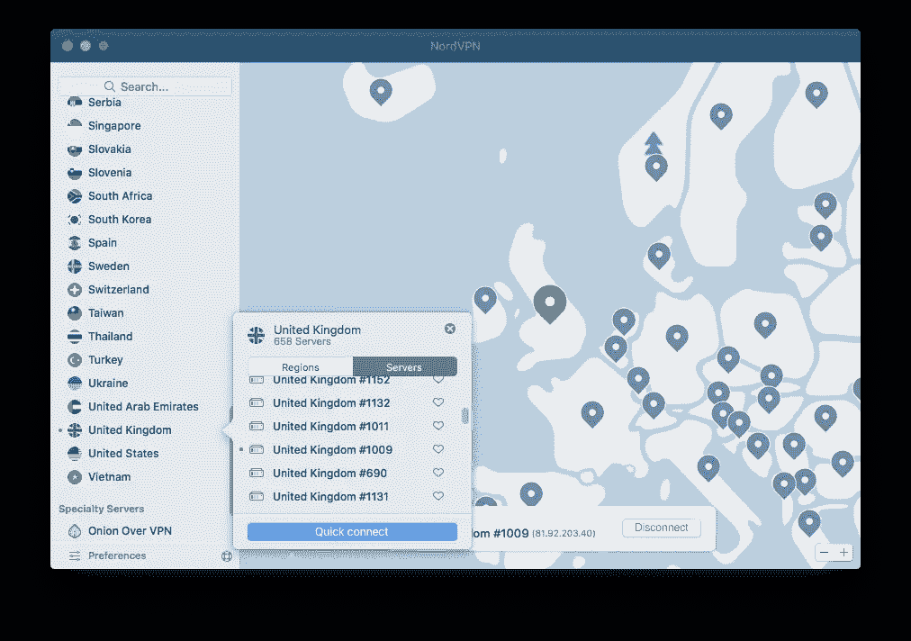
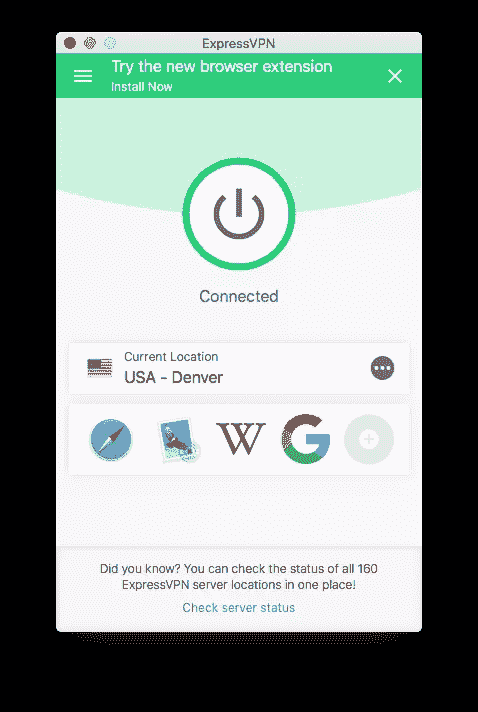
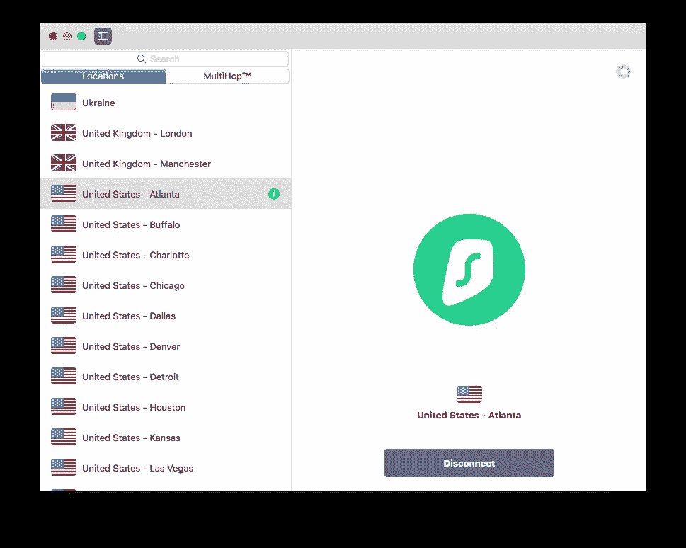
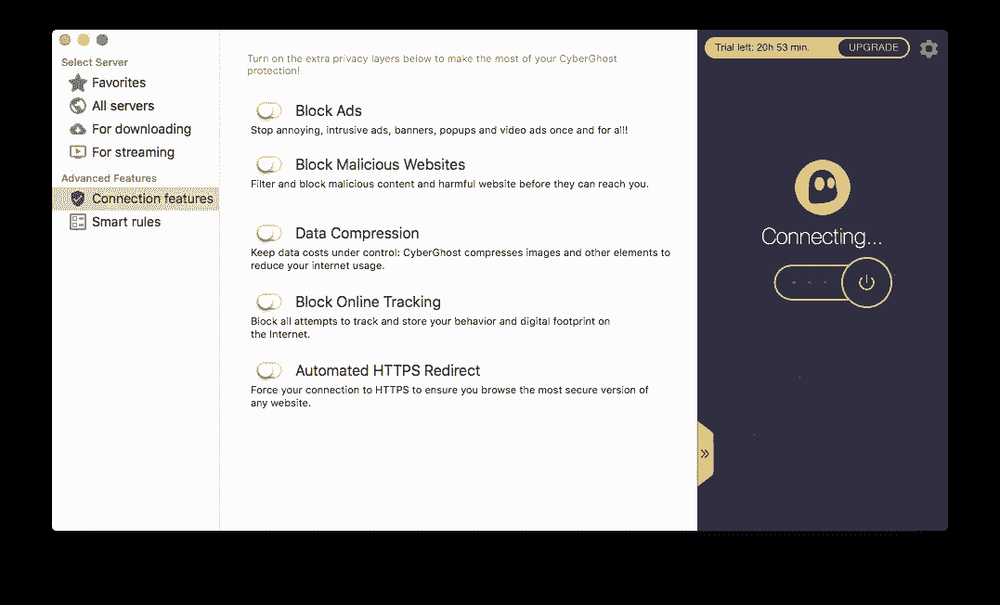
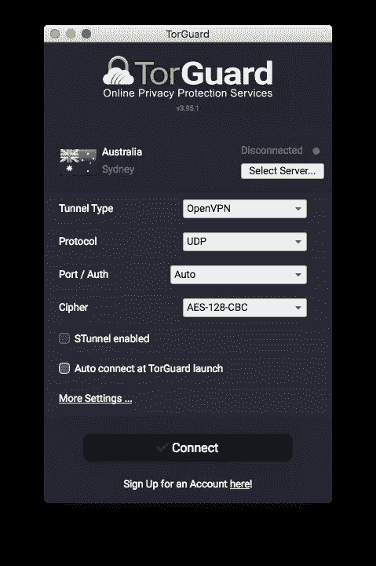
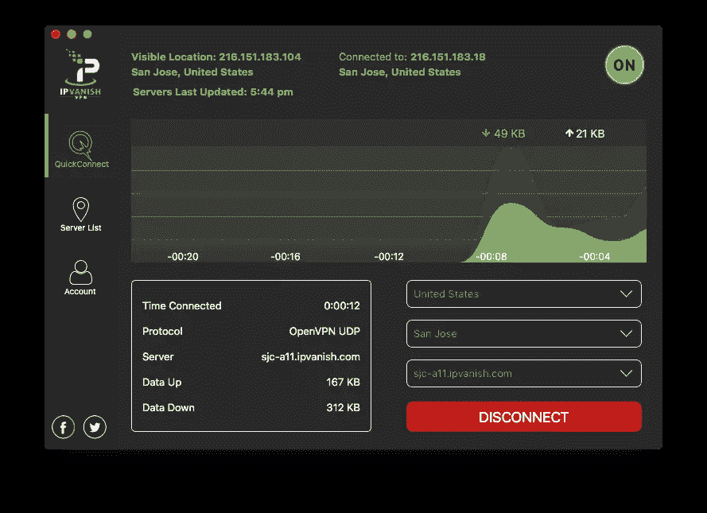
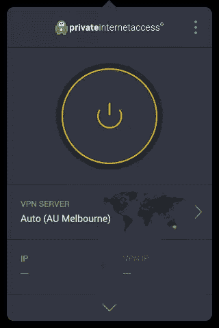
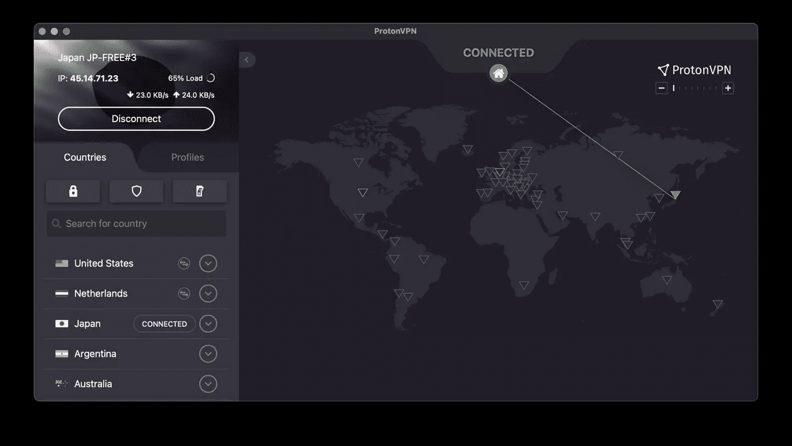

# 开发者的最佳 VPN

> 原文：<https://www.sitepoint.com/best-vpns-for-developers/>

**网络隐私存在吗？我在咖啡店的公共 Wi-Fi 上工作安全吗？我应该如何关注广告跟踪？我的私人代码安全吗？如果你觉得有人在监视你，那你就是在监视。这篇文章将解释使用 VPN 服务如何使你更安全，更不容易在网上被看到，我们将通过比较领先的服务来为开发者确定最好的 VPN。**

你可能已经意识到在一个开放的网络连接中你是多么的脆弱。不过，还是让我给你解释一下吧。

您的 ISP 会记录您访问的每个网站，您的工作或学校网络可能也是如此。这些网站看到并记录你的 IP 地址和系统信息，广告商跟踪你的在线活动。你的政府也是如此，在一些国家，他们也限制你可以访问的网站。在公共 Wi-Fi 上，你容易受到数据包嗅探软件和中间人攻击。

VPN 消除了这些漏洞。通过加密隧道连接到远程服务器会对您的 ISP、本地网络和公共 Wi-Fi 隐藏您的活动。连接另一端的网站和跟踪器看到的是 VPN 服务器的 IP 地址，而不是您自己的 IP 地址。你已经迈出了重要的一步来恢复你的隐私。

除了一个主要问题:你的 VPN 提供商可以看到这一切。这使得选择正确的服务成为您最重要的决策。在本文中，我们将指导您完成这个过程，并提出一些建议。

## 为什么开发者应该使用 VPN

每个人都可以从 VPN 中受益，但他们特别适合开发人员，因为你要花大量的时间在线，并经常处理敏感数据。这里有十种方法可以让你安心:

1.  这是保护您的知识产权的有效方法，包括专有代码、定制设计和框架、应用程序和资源，以免被黑客窃取、使用或出售。
2.  它限制了您托管的任何客户数据被泄露的风险，包括他们的财务数据、联系信息、图表、专利等。
3.  它有助于防止新产品发布、广告活动、收购等的数据泄露。
4.  你可以使用不同的 IP 地址秘密地搜索竞争对手的网站和产品，这样他们就不知道你访问过了。
5.  您可以通过连接到其他国家的服务器来检查您的应用程序和网站在国际上是否正常工作。例如，您可以检查您的网站是否运行缓慢，确认本地语言和货币已被正确识别，并查看您的任何资源是否已被地理屏蔽。
6.  您可以确保远程团队成员能够访问 web 开发所必需的所有资源和参考。例如，在没有 VPN 的国家/地区，可能无法访问新工具和技术的 YouTube 教程。
7.  在办公室外工作时，您可以放心地连接到公共 Wi-Fi 热点。
8.  当您或远程工作人员在办公室外访问您的服务器时，黑客无法使用网络流量来了解登录细节。它还可以防止他们拦截您正在检索的数据。
9.  许多 VPN 服务都内置了反恶意软件，这将保护您和您的团队免受网络钓鱼攻击和其他威胁。
10.  它提高了您的整体在线隐私和安全性。这总是一件好事。

## 你需要 VPN 提供什么

以下是选择 VPN 时需要注意的一些事项。在为开发者寻找最佳 VPN 时，我们会将这些视为合格特性。

### 良好的连接速度

加密你的流量并通过服务器传递需要时间。因此，期待看到你的上传和下载速度下降。

减少多少取决于几个因素，包括服务器离您的距离、当前连接的其他用户的数量以及硬件的质量。此外，我还遇到过不同提供商之间速度差异很大的情况，有些提供商提供的服务器与服务器之间的速度相当一致，而其他提供商则没有。

这些因素使得解释速度测试变得困难。从世界的一个地方连接到服务器与从另一个地方连接到服务器是不同的。当您遇到速度慢的情况时，很难确定是 VPN 速度慢、服务器负载不正常还是您的 ISP 今天过得不好。

这些年来，我在许多 VPN 服务的多台服务器上进行了速度测试。下面是每个 VPN 达到的最大速度与我通常的无保护速度的百分比比较:

*   网络幽灵:91%
*   质子 VPN(免费):76%
*   冲浪者:73%
*   NordVPN: 70%
*   快速虚拟专用网:56%
*   TorGuard: 49%
*   百分之四十八
*   IPVanish: 41%
*   私人互联网接入:38%

当在下面讨论每一个 VPN 时，我也将包括来自其他评测者的速度测试结果，以给出一个更广阔的视角。

### 世界各地的大量服务器

VPN 通常在全球范围内提供成千上万的服务器。更多的服务器有助于分散负载，并提供对其他国家内容的访问。

*   cyber ghost:60 多个国家的 6900 台
*   PureVPN:在 140 多个国家有 6500 多个
*   nord VPN:59 个国家的 5500 个
*   私人互联网接入:37 个地点的 3 252 个
*   surfshark:65 个国家的 3200 多名用户
*   express VPN:94 个国家的 3，000 多个
*   TorGuard:在 50 个国家有 3000 人
*   IPVanish:60 个国家的 1，600 多个
*   ProtonVPN:在 55 个国家有 1，237 个

尽管他们没有最多的服务器，PureVPN 和 ExpressVPN 比其他服务覆盖更多的国家。

### 隐私政策和功能

你所有的流量都要通过 VPN，所以公司如何处理这些数据至关重要。许多人有一个“无日志”的政策，并声称不会保留你的任何活动记录。

不幸的是，“没有日志”并不总是意味着*没有*日志。如果您的计划有设备或带宽限制，他们需要保留一些记录，以确保您不会超支。通常，这些日志会定期删除，通常是在 24 小时或 20 次后续连接之后。PureVPN 和 IPVanish 在他们的历史上有重大的隐私失误:两家公司都在法庭案件中提供了他们声称没有记录的信息。

幸运的是，一些提供商对不保存日志特别严格，法院案例已经证明了他们的政策。例如， [Restore Privacy](https://restoreprivacy.com/vpn/no-logs/#h-turkish-authorities-try-to-collect-logs-then-seize-expressvpn-server-but-still-no-data) 报道称，2017 年 12 月，土耳其警方试图强迫 ExpressVPN 提供客户数据，以进行刑事调查。但是，ExpressVPN 没有任何日志可以提供给授权机构。PureVPN 和 PIA 也有类似的故事。此外，一些公司定期接受第三方审计，以验证无日志声明，包括 ExpressVPN、NordVPN、Surfshark 和 PureVPN。

有些，如 ExpressVPN 和 Surfshark，甚至有只使用 RAM 的服务器。一旦它们被关闭或重启，任何数据都不会被保留。[inVPN.com](https://invpn.com/ram-only-vpn-servers/)有一篇有趣的文章探讨了这一点，并期望在未来看到更多的 VPN 服务效仿。

大多数 VPN 服务存储您的个人信息用于记账目的，而其他服务只需要一个电子邮件地址，并且很乐意让您使用临时地址。银行交易是将你与特定 VPN 账户联系起来的另一种方式，具有隐私意识的服务允许你匿名支付，例如使用加密货币或礼券。在这篇评论中，只有 PureVPN 和 IPVanish 不提供任何形式的匿名支付。

您还应该注意服务的所在地，因为有些国家要求公司保留某些记录。比如，美国《爱国者法案》允许联邦调查局在没有法官批准的情况下获取个人信息，一些国家与美国有情报共享协议。尽管如此，法院案件已经测试了一些美国虚拟专用网的隐私政策，在那里证实他们没有保留任何日志。

最后，一些服务提供类似双 VPN 和 TOR over VPN 的功能。这些显著增加了你的匿名性，但通常是以牺牲性能为代价的。当然，你很少需要这种级别的匿名，但这里有一些服务提供额外的隐私:

*   NordVPN:双 VPN
*   ExpressVPN: TOR over VPN
*   Surfshark:双 VPN，TOR over VPN
*   TorGuard:隐形代理
*   ProtonVPN:安全核心 VPN，TOR over VPN

### 安全功能

VPN 有几种加密协议，理想情况下，您可以选择。一些提供最强大的加密，而另一些提供更快的速度。

*   PPTP 已经存在了几十年。它速度快，受到广泛支持，但存在严重的安全问题。
*   L2TP 和 IPSec 是两种速度更快、应用更广泛的协议(一种用于隧道传输，另一种用于加密)。然而，它们很容易被防火墙阻止，比如网飞使用的防火墙。
*   OpenVPN 是开源的，非常安全。它比较慢，但对于日常使用来说足够快了。
*   SSTP 是由微软开发的一种快速且受支持的协议。
*   IKEv2 是由微软和思科开发的一种快速隧道协议，通常与 IPSec 配对使用。它用在移动设备上。
*   Wireguard 是一种新协议，速度大约是 OpenVPN 的两倍，但有一些隐私问题。因此，它还不能在所有的 VPN 服务上使用。

kill switch 是许多服务提供的重要安全功能。如果您与服务器断开连接，通常会很容易受到攻击。在您重新连接之前，关闭开关将会阻止所有互联网流量。

最后，许多 VPN 提供商提供针对恶意软件、广告软件和网络钓鱼方案的集成防护。下面，只有 ExpressVPN、IPVanish 和 TorGuard 不提供任何类型的恶意软件防护。

### 访问流媒体

网飞和许多其他流媒体服务试图阻止来自 VPN 的流量。这是因为媒体许可证通常在某些国家提供节目的独家发行权，所以网飞可能无权向该国居民提供电影或节目。

无论你是在积极尝试从其他国家传输媒体，还是在完成工作后只想观看当地的网飞节目，如果你必须断开 VPN 才能访问，那会令人沮丧。

一些 VPN 服务绕过网飞防火墙的成功率极高，而其他服务似乎很少通过。以下是我在测试每项服务时的成功率:

*   Surfshark: 100%(测试的 9 台服务器中有 9 台)
*   NordVPN: 100%(测试了 9 台服务器中的 9 台)
*   PureVPN: 100%(测试的 9 台服务器中有 9 台)
*   ProtonVPN: 100%(测试了 3 台免费服务器中的 3 台)
*   TorGuard: 100%使用美国流式 IP，19%使用其他服务器(16 个中的 3 个)
*   CyberGhost: 80%(测试了 15 台服务器中的 12 台)
*   ExpressVPN: 33%(测试的 12 台服务器中有 4 台)
*   IPVanish: 33%(测试的 9 台服务器中有 3 台)
*   私人互联网接入:22%(测试的 9 台服务器中有 2 台)

其他 VPN 提供切分通道，允许您通过未受保护的互联网转移指定的流量，同时保持您的 VPN 连接。例如，您可以观看本地流媒体服务而不会被阻止，而其余流量则通过 VPN 传输。NordVPN、ExpressVPN、Surfshark、CyberGhost、PureVPN、IPVanish 和私人互联网访问都提供分割隧道。

### 意识到它的局限性

一些 VPN 计划有内在的限制。确保这些对你的需求没有太大的限制。例如，许多服务限制可以同时连接到 VPN 的设备数量:

*   Surfshark:无限制
*   IPVanish:无限
*   PureVPN: 10 台设备
*   私人互联网接入:10 台设备
*   TorGuard: 8 个设备
*   网络幽灵:7 台设备
*   NordVPN: 6 台设备
*   ExpressVPN: 5 台设备
*   ProtonVPN: 1、2、5 或 10 台设备，具体取决于您的计划

一些 VPN——尤其是免费的——会限制你每月通过 VPN 访问的带宽。为了成为开发者的最佳 VPN，服务应该迎合我们丰富的设备所有权和高带宽使用率。我下面推荐的都是无限带宽的。其他的并不是所有平台都有，但是我下面推荐的这些在 Windows，macOS，Android，iOS 等等平台上都有。

### 价格

VPN 是订阅服务，如果你按月付费，可能会有点贵。然而，如果你提前一年或更长时间付费，许多公司会提供大量折扣，一旦你决定长期使用 VPN，这就很有意义了。

以下是为每项服务支付最便宜计划时的等效月价格(通常提前一年或更长时间):

*   Surfshark:每月 2.49 美元
*   私人互联网接入:每月 2.69 美元
*   网络幽灵:每月 2.75 美元
*   PureVPN:每月 3.33 美元
*   北 VPN:$ 3.71/月
*   TorGuard:每月 3.89 美元
*   proton VPN:6.63 美元/月(也提供有限免费和 3.29 美元/月的计划)
*   IPVanish:每月 7.5 美元
*   ExpressVPN:每月 8.32 美元

警惕免费 VPN。他们需要以某种方式赚钱，可能会通过出售你的私人数据来赚钱。只有少数几个，像 ProtonVPN，会优先考虑你的隐私。

## 我如何为开发人员测试最佳 VPN

在过去的几年里，我亲自测试了几十种 VPN 服务。我在多台服务器上进行了速度测试，尝试访问不同国家的流媒体，并探索了每个应用程序的功能。

我还参考了其他评审人员的对比测试。这在比较其他人在使用其他国家的服务时遇到的下载速度时特别有用。以下是一些我认为有用的测试结果评论:

*   [2020 年 VPN 报告](https://www.av-comparatives.org/tests/vpn-report-2020-35-services/)由 AV Comparatives 发布，2020 年 4 月发布
*   AVTest 的 VPN 对比测试 (PDF)，2020 年 9 月发布
*   [2021 年最佳 VPN 服务](https://au.pcmag.com/vpn/138/the-best-vpn-services)由 PCMag Australia 于 2021 年 3 月发布
*   [英国连线杂志于 2021 年 3 月发布的速度、可靠性和隐私方面测试的最佳 VPN 服务](https://www.wired.co.uk/article/best-vpn)
*   [CNET 于 2021 年 3 月发布的 2021 年最快 VPNs】](https://www.cnet.com/news/fastest-vpn/)
*   [2021 年 PC、Mac、&手机的 8 个最佳 VPNs】由 vpnMentor 提供，2021 年 4 月更新](https://www.vpnmentor.com/)

最后，我想了解一下真实用户的满意度。我查看了来自 [Trustpilot](https://www.trustpilot.com/categories/vpn_service) 的**消费者评级**，并在大样本的基础上寻找四星评级较高的服务:

*   CyberGhost:根据 12，043 条评论获得 4.8 颗星
*   PureVPN:基于 12，091 条评论，获得 4.7 颗星
*   IPVanish:基于 6，860 条评论，获得 4.7 颗星
*   ExpressVPN:基于 7，040 条评论，4.6 颗星
*   TorGuard:基于 795 条评论，4.5 颗星
*   Surfshark:基于 8，212 条评论，获得 4.3 颗星
*   NordVPN:基于 5，567 条评论，获得 4.2 颗星
*   私人互联网接入:基于 6，633 条评论的 4.0 星
*   ProtonVPN:基于 88 条评论，3.5 颗星

尽管 PureVPN 和 IPVanish 获得了极高的评价，但客户并不总是对的。正如我提到的，两家公司都保留了他们声称没有保留的日志，而且两家公司都不提供加密货币支付。然而，他们必须做一些正确的事情来获得如此多用户的持续高评分。

## 开发者的最佳 VPN 比较

### NordVPN

NordVPN 提供卓越的全方位体验。它快速安全，易于使用，具有良好的隐私政策，并提供额外的安全功能。它还经济实惠，能够可靠地连接到流媒体。然而，我发现服务器速度不一致。

*   消费者评分:基于 5，567 条评论，4.2 星(Trustpilot)
*   服务器:59 个国家的 5500 台
*   同步设备:6
*   平台:Windows、macOS、Linux、Android、Android TV、iOS、Firefox 和 Chrome 浏览器扩展
*   协议:OpenVPN，IKEv2/IPSec，SSTP，L2TP，WireGuard
*   隐私:没有日志，加密货币支付
*   安全:切断开关，双 VPN，恶意软件拦截器
*   最便宜的方案:两年 89 美元(相当于 3.71 美元/月)

**速度:**离我最近的 Nord 服务器在我的 100 Mbps 连接上实现了 70.22 Mbps 的出色下载速度，是我遇到的最快的速度之一。然而，我测试的所有 27 台服务器的平均速率仅为 25.16 Mbps，因此并非所有服务器都很快。其他一些评论家记录的时间比我慢。

速度测试:

*   我的测试 AU:最高 70%，最快 AU，最慢英国
*   PCMag 至:最高 71.3%
*   美国 CNET:最高 47%，最快新加坡，最慢美国
*   AV 比较:平均 40%
*   AV-Test 美国:美国平均 11%，欧盟平均 5%
*   有线英国:363.2 Mbps(英国)，268 Mbps(荷兰)，24.88 Mbps(美国)

**隐私:** NordVPN 拥有出色的隐私政策，并且位于巴拿马，那里没有强制性的数据保留法律。其日志政策由瑞士的普华永道会计师事务所审计，该事务所核实该公司没有保留日志。双 VPN 给你更大的匿名性在敏感的情况下。

安全: NordVPN 提供了一系列协议和恶意软件拦截器。如果您断开了 VPN 连接，您可以配置 Nord 的 kill switch 来阻止互联网访问或终止某些应用程序。

流媒体: NordVPN 有一项名为 Smartplay 的功能，旨在提供 400 种流媒体服务。看起来效果不错。例如，我一直使用我测试的 9 台服务器中的每一台连接到网飞。

**费用:**如果你提前付费，NordVPN 是最实惠的服务之一，每月费用不到 4 美元。

### ExpressVPN

ExpressVPN 在连接流媒体服务方面没有 NordVPN 快，也没有 nord VPN 成功。然而，就隐私而言，它是最受推崇的 VPN 之一。

*   消费者评分:基于 7，040 条评论，4.6 星(Trustpilot)
*   服务器:94 个国家的 3000 多台服务器
*   同步设备:5
*   平台:Windows、macOS、Linux、Android、iOS、Apple TV、Roku、FireOS、Chromecast、Chromebook、Chrome 的扩展、Firefox 和 Edge
*   协议:OpenVPN，PPTP，SSTP，L2TP/IPSec，Lightway
*   隐私:没有日志，比特币支付，TOR over VPN
*   安全性:切断开关，只有 RAM 的服务器
*   最便宜的方案:99.95 美元/年(相当于 8.32 美元/月)

速度: ExpressVPN 以速度更快的 VPN 服务而闻名，但速度测试并没有证明这一点。解释好像是以前比较快。CNET 2019 年的速度测试是 98%的无保护速度，而现在只有一半左右。

速度测试:

*   我的测试 AU:最高 56%，美国最快，英国最慢
*   PCMag 至:最高 40.2%
*   美国 CNET:最高 48.2%，西欧最快，美国最慢
*   vpnMentor 英国:最高 91%，最快英国，最慢澳大利亚
*   AV 比较:平均 27%
*   AV-Test 美国:美国平均 5%，欧盟平均 3%
*   有线英国:131.2 Mbps(英国)，159.2 Mbps(荷兰)，139.2 Mbps(美国)

**隐私:**该公司位于英属维尔京群岛，在那里数据可以保持隐私，其无日志政策已经在法庭上得到检验。 [Techspot](https://www.techspot.com/news/82259-keeping-private-5-vpns-have-verified-keep-no.html) 报道称，土耳其当局试图迫使该公司在一个案件中提供客户数据，但失败了。他们声称自己不受美国和欧盟法律的约束。当局随后查封了其中一台服务器，但没有恢复任何信息，因为没有日志。

安全:如果你失去了 VPN 连接，一个切断开关会切断你与互联网的连接。ExpressVPN 现在使用只使用 RAM 的服务器，而 TOR over VPN 可以提供更好的匿名性。但是，不包括恶意软件拦截器。

**流媒体:**多年来，我测试了两次网飞接入的 ExpressVPN。第一次印象还挺深刻的。它在 89%的时间内保持连接(18 台服务器中的 16 台)。第二次就不那么令人印象深刻了，成功率只有 33%(12 台服务器中有 4 台)。然而，这项服务提供了隧道分割，因此你可以不受保护地观看当地的网飞节目，而你的其他流量则通过 VPN 传输。

**费用:** ExpressVPN 是我们围捕中最贵的服务，但我从没听过有人抱怨。当隐私是你的首要考虑时，这钱花得值。

### 冲浪者

Surfshark 是另一个完善的 VPN 服务，提供良好的速度、卓越的安全性和完整的功能集。它还非常经济实惠，并且对您可以连接的设备数量没有限制。

*   消费者评分:基于 8，212 条评论，4.3 星(Trustpilot)
*   服务器:65 个国家的 3200 多台服务器
*   同步设备:无限制
*   平台:Windows、macOS、Linux、Android、iOS、FireTV、Chrome 和 Firefox 扩展
*   协议:OpenVPN、IKEv2/IPSec、Socks5
*   隐私:无日志，加密货币支付(CoinPayments，CoinGate)，双 VPN，TOR over VPN
*   安全性:kill switch、CleanWeb 广告跟踪拦截器、RAM 专用服务器
*   最便宜的方案:两年 59.76 美元(相当于 2.49 美元/月)

**速度:**我发现 Surfshark 最近的服务器速度可以接受，达到了 62.13 Mbps 的下载速度，其他评测人员也有类似的结果。但是并不是所有的服务器都那么快。我的整体平均速度只有 25.16 Mbps。

速度测试:

*   我的测试 AU:最高 73%，最快 AU，最慢 US
*   PCMag 最高:38.4%
*   美国 CNET:最高 83.1%，美国最快，澳洲最慢
*   AV 比较:平均 76%
*   有线英国:236 Mbps(英国)，212 Mbps(荷兰)，145.6 Mbps(美国)

**隐私:**和 ExpressVPN 一样，Surfshark 位于隐私友好的英属维尔京群岛。它们提供了几个有趣的隐私相关功能:

*   伪装模式会掩盖您的 VPN 活动，因此您的 ISP 不知道您正在使用它
*   多跳(本质上是双 VPN)通过在多个国家之间跳跃连接来隐藏你的踪迹
*   无边界模式允许您在限制性区域使用 VPN

安全: Surfshark 提供了一个关闭开关和广告拦截器，并使用 RAM 专用服务器。德国安全公司 Cure 53 审计了他们的 Chrome 和 Firefox 扩展( [PDF 报告在此](https://cure53.de/pentest-report_surfshark.pdf))。

流媒体:我发现流媒体的服务很可靠。我测试的 9 台服务器都成功地传输了网飞的内容。此外，还可以使用切分通道，以便在必要时通过未受保护的连接传输媒体。

成本: Surfshark 提供了我们综合报道中最实惠的计划。

### 网络幽灵

CyberGhost 是另一项经济实惠的服务，提供卓越的安全性和隐私性。根据我的测试，这也是最快的 VPN 在我们的综述。

*   消费者评分:基于 12，043 条评论，4.8 星(Trustpilot)
*   服务器:60 多个国家的 6，900 台
*   同步设备:7
*   平台:Windows、macOS、Linux、Android、iOS、Android TV、FireTV、Apple TV、Chrome 和 Firefox 的扩展
*   协议:OpenVPN，IKEv2，WireGuard
*   隐私:没有日志，比特币支付
*   安全性:关闭开关、广告和恶意软件拦截器
*   最便宜的方案:三年 99 美元(相当于 2.75 美元/月)

**速度:**我在使用 CyberGhost 最接近的服务器时，能够达到最高的下载速度。它还实现了相当高的平均速度，表明服务器速度全面快速。

速度测试:

*   我的测试 AU:最高 91%，最快 AU，最慢英国
*   PCMag AU: 86.7%
*   英国:最高 66%，最快的英国，最慢的澳大利亚
*   AV 比较:平均 23%

**隐私:**该公司总部位于罗马尼亚，并拥有一家英国母公司。然而，他们有一个严格的无日志政策，只要额外付费，你就可以访问他们的 NoSpy 服务器，这些服务器远离第三方，位于一个特殊的数据中心。

**安全性:** CyberGhost 提供了一个 kill switch、一个广告拦截器、恶意软件拦截器和跟踪拦截器。

**流媒体:**在我测试的服务器中，80%的服务器(15 台中有 12 台)访问了网飞的内容。分割隧道不可用。

费用:如果你提前付费，CyberGhost 是最实惠的服务之一，每月费用不到 3 美元。

### TorGuard

TorGuard 是一项适合精通技术的网络专家的服务。所有设置都触手可及，因此您可以选择如何平衡速度和安全性。

*   消费者评分:基于 795 条评论，4.5 星(Trustpilot)
*   服务器:50 个国家的 3000 台
*   同步设备:8
*   平台:Windows，macOS，Linux，Android，iOS，火狐和 Chrome 的扩展
*   协议:OpenVPN，WireGuard，SSTP，IPSec
*   隐私:没有日志，匿名支付(包括加密货币和礼品卡)
*   安全:切断开关，隐形代理
*   最便宜的方案:三年 139.99 美元(相当于 3.89 美元/月)

**速度:**当我测试 VPN 时，我达到的最好速度只是我无保护速度的一半，但跨几个服务器的平均速度比我测试的许多其他 VPN 都快。其他评论者也报告速度很慢。

速度测试:

*   我的测试 AU:最高 49%
*   AV 比较:平均 30%
*   AV-Test 美国:美国平均为 7%，欧盟平均为 5%

**隐私:**该公司总部位于德国，声称根本不保留任何日志。隐形代理是第二层安全，使它不可能检测到你正在使用 VPN。

**安全性:**如果你与 VPN 断开连接，TorGuard 的 kill switch 会阻止所有互联网流量，还可以自动关闭某些应用程序。不包括恶意软件拦截器。

流媒体:我用 TorGuard 传输网飞的运气不太好:我测试的 16 台服务器中只有 3 台正常工作。然而，你可以购买特定国家的流媒体 IP 地址，我测试的那个运行得很好。

**费用:** TorGuard 是价格较为合理的服务中的高端产品，如果你预先付费，每月费用不到 4 美元。然而，如果你打算在联网的情况下播放网飞的内容，你需要额外付费。

### 咬一口

PureVPN 似乎让它的用户很开心，但是我对这项服务有一些担心。我发现它的界面有点不一致，他们不提供匿名支付方式，他们没有最好的隐私记录。尽管如此，这项服务还是有很多让人喜欢的地方。

*   消费者评分:基于 12，091 条评论，4.7 星(Trustpilot)
*   服务器:140 多个国家的 6，500 多台服务器
*   同步设备:10
*   平台:Windows，macOS，Linux，Android，iOS，Android TV，FireOS，Roku，Boxee，Chromecast，Chrome 和 Firefox 的扩展
*   协议:SSTP，PPTP，OpenVPN，L2TP，IKEv2
*   隐私:没有日志
*   安全性:切断开关、DDoS 保护、广告拦截
*   最便宜的方案:两年 79.92 美元(相当于 3.33 美元/月)

**速度:**以我的经验来看，使用 VPN 的时候你应该预料到你的下载速度会减半。其他评论者也报告速度很慢。

速度测试:

*   我的测试 AU:最高 48%，最快 AU，最慢英国
*   AV 比较:平均 36%
*   AV-Test 美国:美国平均为 6%，欧盟平均为 5%

**隐私:**据[恢复隐私](https://restoreprivacy.com/vpn-logs-lies/)报道，PureVPN 在 2017 年被发现对其无日志政策撒谎。它为联邦调查局记录客户数据。从那以后，它声称已经清理了它的游戏，在 Altius IT 的审计中得到证实。PureVPN 的总部在香港。

**安全性:** PureVPN 提供删除开关、广告拦截和 DDoS 保护。您可以从多个安全协议中选择，或者允许应用程序为您选择。

**流媒体:**我能够可靠地使用 PureVPN 传输网飞的内容。测试的 9 台服务器中有 9 台是成功的，分割隧道也是可用的。

费用:如果你提前付费，PureVPN 是最实惠的服务之一，每月费用略高于 3 美元。

### IPVanish

IPVanish 价格适中，但它的服务器可能很慢，用户无法可靠地访问流媒体内容。不幸的是，像 PureVPN 一样，他们在隐私方面的记录很差。

*   消费者评分:基于 6，860 条评论，4.7 星(Trustpilot)
*   服务器:60 个国家的 1，600 多台服务器
*   同步设备:无限制
*   平台:Windows、macOS、Linux、Android、iOS、FireTV、Chrome OS
*   协议:IKEv2、OpenVPN、L2TP、IPSec、PPTP
*   隐私:没有日志
*   安全:关闭开关
*   最便宜的方案:89.99 美元/年(相当于 7.50 美元/月)，首付半价

**速度:**我测试 IPVanish 的时候，遇到了迄今为止最慢的最大和平均速度。但这并不是每个人的经历——美国的评论者报告的平均速度高于我的最高速度。

速度测试:

*   我的测试 AU:最高 41%，最快 AU，最慢英国
*   美国 CNET:平均 45%
*   AV 比较:平均 46%

隐私: IPVanish 位于美国。该公司谎称自己没有伐木政策。据[恢复隐私](https://restoreprivacy.com/ipvanish-provides-logs-to-authorities/)报道，国土安全部在 2016 年调查了一名 IPVanish 用户虐待儿童。它从该公司获得了详细的客户记录，包括连接到 VPN 的日期和时间列表。

**安全性:**该软件包括一个 kill switch，但不包括恶意软件拦截器。

**流媒体:**我无法用 PureVPN 稳定地传输网飞的内容。我测试的九个服务器中只有三个是成功的。但是，切分通道是可用的，因此您可以通过未受保护的连接观看本地内容，而其余的流量则通过 VPN 传输。

费用: IPVanish 是本次调查中第二贵的服务。

### 私人互联网接入(PIA)

[私人上网](https://www.privateinternetaccess.com/)价格实惠，其无日志政策已在法庭上得到验证。它提供了一个易于使用的界面，适合不熟悉 VPN 的非技术用户。非技术类的朋友要记住。

*   消费者评分:基于 6，633 条评论，4.0 星(Trustpilot)
*   服务器:37 个地点的 3，252 台服务器
*   同步设备:10
*   平台:Windows、macOS、Linux、Android、iOS
*   协议:OpenVPN，PPTP，L2TP/IPSec，SOCKS5 代理
*   隐私:没有日志，加密货币支付
*   安全:杀死开关，MACE 阻止用于广告，追踪器和恶意软件的域名
*   最便宜的方案:两年 69.95 美元，外加两个月奖金(相当于 2.69 美元/月)

**速度:**我发现 PIA 非常慢，但这不是全部。另一位英国的评论者发现它非常快，而一位美国的评论者发现它甚至比我还慢。你遇到的速度可能取决于你的位置，但具有讽刺意味的是，该公司总部设在美国，那里的审查人员记录的速度最慢。

速度测试:

*   我的测试 AU:最高 38%
*   英国:98%，最快的英国，最慢的澳大利亚
*   AV 比较:平均 26%
*   AV-Test 美国:美国平均 4%，欧盟平均 5%
*   有线英国:134.4 Mbps(英国)，110.4 Mbps(荷兰)，31.2 Mbps(美国)

**隐私:**该公司总部位于美国，但其无日志政策已经在法庭上经受了两次考验(2016 年和 2018 年),两次都成立。PIA 没有向法院或 FBI 移交任何信息。你会在 [Techspot](https://www.techspot.com/news/82259-keeping-private-5-vpns-have-verified-keep-no.html) 上找到更多细节。

**安全性:** PIA 提供了一个 kill switch，一个叫做 MACE 的功能会自动保护用户免受可疑网站的攻击。

**流媒体:**我无法用这项服务可靠地传输网飞的内容:9 台服务器中只有两台成功。可以使用切分通道，这样用户就可以在未受保护的连接上观看本地媒体。

成本:巴基斯坦国际航空公司不贵，是本次综述中第二便宜的计划。

### 质子 VPN

ProtonVPN 作为更好、更可靠的服务之一，正在隐私社区掀起波澜。他们提供大量与 VPN 相关的服务和加密邮件、在线存储和日历。他们是我所知道的唯一一家为他们的 VPN 提供免费层的受人尊敬的公司。

*   消费者评分:基于 88 条评论，3.5 星(Trustpilot)
*   服务器:55 个国家的 1，237 台
*   同步设备:根据您的计划，最多 10 个
*   平台:Windows、macOS、Linux、Android、iOS、Chromebook、Android TV
*   协议:IKEv2/IPSec、OpenVPN
*   隐私:没有日志，比特币支付
*   安全性:切断开关、永远在线、安全核心 VPN、TOR over VPN、NetShield Ad
*   最便宜的计划:Plus 计划两年 159 美元(相当于 6.63 美元/月)，还有一个有限的免费计划

**速度:**我使用免费计划测试了 ProtonVPN 的速度，取得了令人印象深刻的 76%的无保护速度。Wired UK 的测试显示付费计划显著增加，没有免费的澳大利亚服务器也降低了我的连接速度。付费用户应该体验到更快的速度。

速度测试:

*   我的测试 AU:最高 76%，最快的 JP，最慢的 NL
*   PCMag 至:最高 27.3%
*   英国 vpnMentor:最高 75%，最快 RO，最慢 BR
*   AV 比较:平均 30%
*   有线英国:184 Mbps(英国，付费)，164 Mbps(荷兰付费)，149.6 Mbps(美国，付费)
*   有线英国:8.8 Mbps(荷兰免费)，56.64 Mbps(美国免费)

**隐私:**该公司总部位于瑞士，瑞士有严格的隐私法，并且不受美国和欧盟的管辖。他们非常重视隐私，他们的应用程序是开源的，并且经过独立审计。

安全:如果你与 VPN 断开连接，一个切断开关会阻止所有的互联网流量，而“永远在线”会自动重新连接你。安全核心 VPN 和 TOR over VPN 可在需要时提供额外保护。此外，所有 ProtonVPN 服务器都受到全磁盘加密的保护。

**流媒体:**我使用测试过的三台免费服务器成功连接到了网飞。

**费用:**免费计划允许一台设备以中速连接到三个国家的服务器。本综述中没有其他 VPN 提供免费层。每月 3.29 美元的基本计划提供两个连接，每月 6.63 美元的附加计划允许五个 VPN 连接。一个昂贵的有远见的计划也是可用的，提供 10 个连接和一个质子邮件有远见的帐户。

## 开发者最好的 VPN:我应该选择哪种服务？

每个开发者都应该为他们自己和他们的客户使用 VPN 服务。它将有助于保护您宝贵的数字资产，增强您的安全性，并允许不受限制地访问世界各地的资源。

哪个最适合你？

*   对于平衡速度、安全性和功能的全面解决方案，我推荐 NordVPN、Surfshark 或 CyberGhost。
*   如果你把**隐私看得比什么都重要**，那就很难越过 ExpressVPN。据我所知，没有哪一个 VPN 被如此推崇。
*   如果你现在不想花钱，ProtonVPN 是我所知道的唯一一家提供免费层的知名公司。

使用 PureVPN 和 IPVanish 要三思。虽然它们被高度评价，并拥有成千上万的满意用户，但法庭案例表明，它们存储了声称从未记录的信息。千万不要选择不可信的 VPN 服务。

## 分享这篇文章