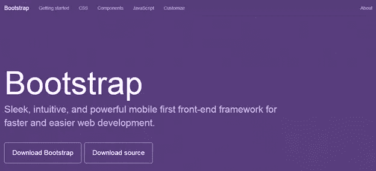
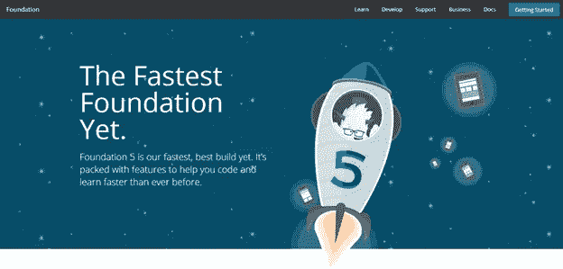
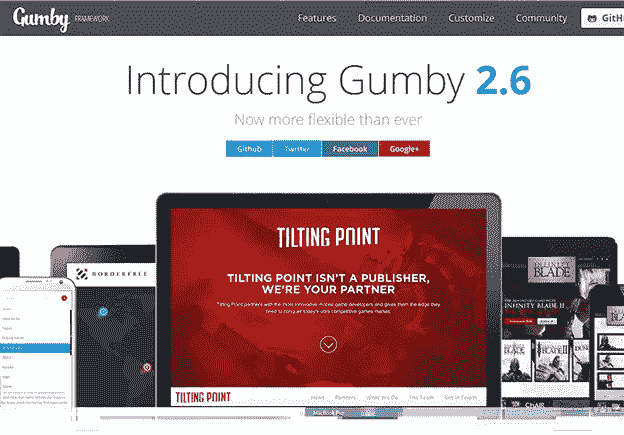
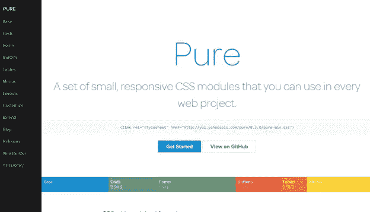

# 2014 年最佳网页设计框架

> 原文：<https://www.sitepoint.com/best-web-designing-frameworks-2014/>

对于网页设计师来说，开始新的一年没有比这更好的了。

我们有一些最好的、最强大的网页设计框架正等着我们去探索。这些框架可以帮助您在几分钟内构建功能齐全的 web 模板，并且只需要极少的 CSS 和 JavaScript 编码知识。

人们对 2014 年寄予厚望。响应式网站已经是下一个大事件。来自手机和平板电脑的访客已经成为所有网站的重要因素。每个网站都必须看起来很好，在每个设备上都能很好地工作。

在这篇文章中，我们将列出一些最好的 CSS 框架，它们将有助于网页设计者和开发者在 2014 年开发他们的潜力来构建响应迅速且漂亮的网页应用程序

## 推特自举 3

无论你想设计一个个人投资组合、一个商业网站还是一个购物车， [Twitter Bootstrap](http://getbootstrap.com/) 的灵活和响应能力在所有情况下都会派上用场。它不仅仅是一套 CSS 和 JavaScript 规则，Twitter Bootstrap 有一个内置的响应能力。随着 Twitter Bootstrap 第三版增加了许多新功能，它再次证明了它在 web 行业的长远发展。

Twitter Bootstrap 的 [JavaScript 组件帮助你](https://www.sitepoint.com/twitter-bootstrap-3-javascript-components/)[设计可以在任何设备上运行的滑块](https://www.sitepoint.com/creating-javascript-sliders-using-twitter-bootstrap-3/)。像模态、下拉菜单、ScrollSpy、标签、工具提示、弹出框和传送带这样的组件是 Twitter Bootstrap 中你最喜欢的部分。

你可以从今天开始学习 Twitter Bootstrap 3，并在 2014 年让你的网络体验变得更好。[试试 Twitter Bootstrap 3。](http://getbootstrap.com/)

## 基础框架

Zurb 的基础框架 5.0 版在 2013 年下半年成为网页设计的最佳框架之一。凭借与 Twitter Bootstrap 类似的功能和一些重大改进，它有望在 2014 年大受欢迎。

Foundation framework 拥有一个类似 Twitter Bootstrap 的 12 网格系统。它还在其包中提供了可重用的 HTML 组件和 JavaScript 插件。但与 Twitter Bootstrap 不同，Foundation 支持 Sass 样式表。您需要编译 Sass 样式表，将其转换成普通的 CSS 文件，然后在项目中使用它们。添加 Sass 支持使得它对于那些想要给网站带来个人风格的设计者来说更加可定制。

有了像 Off Canvas 和改进的表单这样的特性，在 2014 年看到 web 开发人员最大程度地探索这个框架将会很有趣。参考 Tahir Taous 的文章，了解[Foundation 5](https://www.sitepoint.com/foundation-5/)的新功能。[试试粉底霜 5。](http://foundation.zurb.com/)

## Gumby 框架

Gumby 框架建立在一个 Sass 预处理器上，允许你在 Gumby 框架上定制和构建设计。使用 Gumby 进行设计需要您了解 Sass 的基础知识。它可以通过使用 Sass 更改变量值来定制。模块比例是 Gumby 的另一个伟大的内置功能，它使用黄金比例工具进行排版。

就像 Twitter Bootstrap 3 一样，Gumby framework 提供了对 Internet Explorer 8 及以上版本以及所有开源的现代浏览器的支持。

继续行业标准，Gumby 也有 12 网格布局系统。它在逻辑上将浏览器的空间划分为 12 个网格，并支持嵌套网格。一些新概念，如混合网格、瓦片、花式瓦片和语义瓦片，使这个框架独一无二，绝对值得一试。Gumby Framework 还提供了可重用的 CSS 和 JavaScript 插件。[试试 Gumby 框架。](http://gumbyframework.com/)

## 雅虎纯 CSS

Yahoo Pure 或 [Pure CSS](http://purecss.io/) 是 Yahoo 的一个轻量级 CSS 框架。它不仅非常轻便，而且反应灵敏。与其他框架不同，Yahoo Pure 没有任何 JavaScript 插件。

这个框架还利用了流行的 12 网格布局系统，并有自己的 CSS 规则可以应用。对于喜欢 Windows metro 设计的人来说，Yahoo Pure 是开始设计的完美 CSS 框架。它提倡减少阴影效果，在设计中几乎没有圆角。使用纯 CSS 时，可以使用 Yahoo 的皮肤生成器来定制外观。

Yahoo Pure CSS 非常适合希望坚持各自框架但喜欢使用扁平设计的开发人员。要做到这一点，你必须包含雅虎在 CDN 中提供的 CSS 文件。[尝试纯 CSS。](http://purecss.io/)

## 墨水接口套件

作为该行业的新成员，并从其前辈那里学到了经验， [InK](http://ink.sapo.pt/) 提供了大多数人可能正在寻找的解决方案。它既有可重用的 HTML 插件，也有 JavaScript 插件。这个框架中最独特的特性是提供拖放支持的能力——例如，Twitter Bootstrap 3 中还没有这种功能。

InK 提供了一组非常有用的表单验证类。图像处理也是另一个强大的功能。使用 InK，您可以创建同一图像的多个版本，并减少各种设备类型的加载时间。它也有一套令人印象深刻的麻省理工学院许可图标玩。

有了这样一套惊人的强大工具，InK 作为一个网页设计框架，今天是值得一试的。[试墨。](http://ink.sapo.pt/)

可以尝试的其他框架:

*   [骷髅](http://www.getskeleton.com/)
*   [响应式电网系统](http://www.responsivegridsystem.com/)
*   基础
*   [指南针](http://compass-style.org/)
*   [流体基线网格](http://fluidbaselinegrid.com/)

这些至少是 2014 年你可以尝试的一些最好的网页设计框架。为什么要使用框架呢？谁想从头开始？

注意，上面的列表并不是按照喜好或者优秀程度来排名的，只是列表而已。列出的每个框架都有自己的客户端、优点和局限性。

我希望你喜欢通读列表。现在轮到你让我们知道你认为上面哪一个框架会在 2014 年对网页设计师和开发者产生最大的影响。请在下面留下您的评论和支持文字。

我们希望你在 2013 年过一个愉快的圣诞节，在 2014 年过一个快乐的新年。

## 分享这篇文章