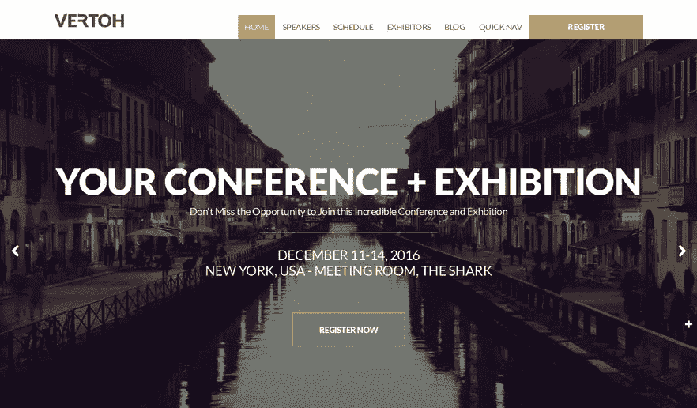
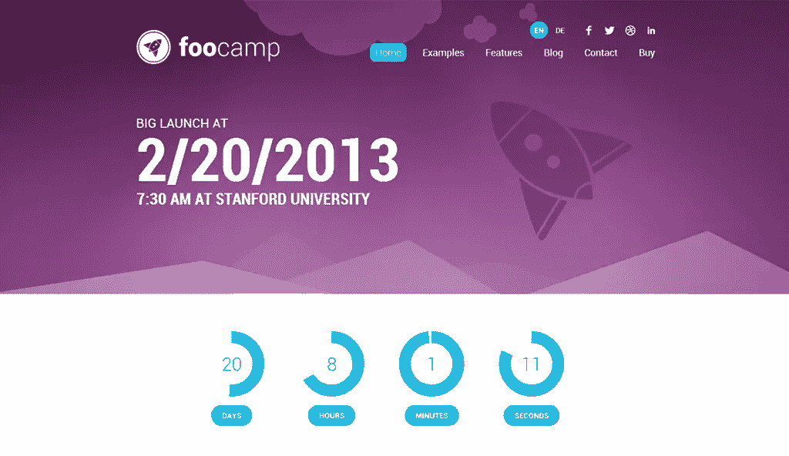
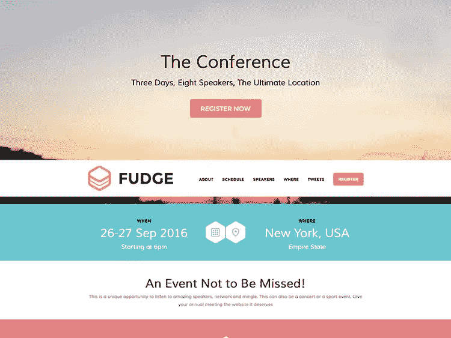
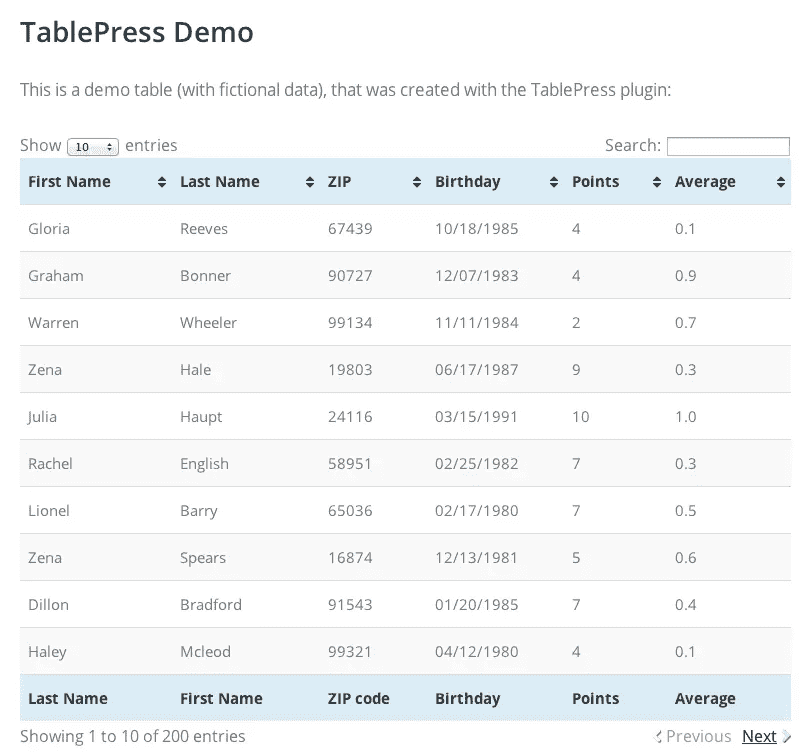

# 最好的 WordPress 主题和活动插件

> 原文：<https://www.sitepoint.com/best-wordpress-themes-plugins-events/>

不用说，WordPress 已经从最初的博客平台走了很长的路。显然，WordPress 拥有更广泛的受众，占全球所有网站的 23.6%。这是一个很好的例子，说明自由和开源软件是多么强大。

虽然大多数博客在 WordPress 上运行的事实并不令人吃惊，但是越来越多成熟的网站使用 WordPress 作为他们的内容管理系统。通常，有时候你真的无法判断一个网站什么时候是由 WordPress 支持的，因为后者允许你进行无限的定制。

如果你正在组织一个特别的活动，以及像 Eventbrite、Lanyrd、Meetup 等常见的网络。不能满足你的需求，用 WordPress 为你的活动创建一个网站是一个可行的选择。如果你最需要的是灵活性，这一点尤其有用，因为 WordPress 给了你你所需要的所有控制。

在接下来的文章中，我们将会介绍以活动为中心的 WordPress 主题和资源，它们可能会满足你的活动需求。

## 主题

### [Vertoh](http://www.showthemes.com/2015-event-wordpress-theme-vertoh)

Vertoh 是一个以会议为中心的活动主题，有很多元素和空间可以玩。它提供了各种定制功能，而不需要接触任何代码，如果你不是一个程序员，这可能是一个有吸引力的提议。它允许专门的参展商空间(或任何合适的替代空间)、赞助商、演讲者(或表演者；Vertoh 可以很容易地变成一个音乐节的主题)和其他各种小功能。

最重要的是，它允许与 Eventbrite、Event Espresso、WooCommerce 和 Xing Events 等整合，允许您将在线展示工作集中在一个地方。我猜不言而喻，也是有求必应。

如果你最终只使用了 Vertoh 提供的一小部分特性，那么它可能有点矫枉过正，所以要做好深入定制的准备。话虽如此，但它可能更适合有可靠赞助商的既定会议或活动；而非盈利或社会活动可能无法利用它。

你可以在这里查看现场演示。

### [FooCamp](http://themeforest.net/item/foocamp-conference-wordpress-theme/4429812)

如果你认为 Vertoh 可能会给你提供比你可能消化的更多的特性，FooCamp 是一个可能会唤醒你兴趣的主题。

凭借其扁平而现代的设计，它主要针对会议、活动或酒吧。该主题有一个内置的事件管理器工具，可以轻松地配置不同时间和不同房间的会议日程。它也完全响应，包括[旋转滑块插件](http://codecanyon.net/item/slider-revolution-responsive-wordpress-plugin/2751380)。正如您所看到的，它没有 Vertoh 主题那么多的功能，这并不一定是一个缺点，尤其是如果您正在寻找一个只有您需要的功能的可靠解决方案。

你可以在这里查看现场演示。

### [忽悠](http://www.showthemes.com/fudge-demo/)

从相同的作者作为 Vertoh 主题，软糖提供了一个单一的寻呼机广泛的功能，让观众找到他们所需要的没有太多的麻烦。

有趣的是，你可以在任意多的网站上使用许可证，这是一次性付款。如果你参与几个活动的组织，这可能是一个有利可图的提议。

与 Vertoh 主题类似，Fudge 包括一个活动管理器来安排会议，并与 Eventbrite、Event Espresso、WooCommerce 等兼容。

然而，如果你有很多内容要分享，并希望保持关注，福吉可能无法做到这一点(因为大多数一页纸反正)。软糖允许你有一个博客，但它并不像你想象的那样直观。

[你可以在这里查看现场演示](http://www.showthemes.com/fudge-demo/)

### [Expo18](http://themeforest.net/item/expo18-responsive-event-conference-wordpress-theme/2680170)

Expo18 与我之前提到的主题略有不同，它高度关注内容，在保持经典 WordPress 体验的同时提供了高度的灵活性。赞助商和演讲者的设置可能有点棘手，但是您可以利用各种插件来获得任何需要帮助的东西。

主题是完全响应和位置感知的。

**注:**我曾经为[开放实验室](http://openlabs.cc)的[OSCAL’15](http://oscal.openlabs.cc/)网站做过 Expo18 主题。尽管它缺少许多现代主题都有的一些快捷方式，但它提供了对功能的大量控制，与普通的 WordPress 安装没有太大的不同。

[你可以在这里查看现场演示](http://themeforest.net/item/expo18-responsive-event-conference-wordpress-theme/full_screen_preview/2680170)

## 插件

在大多数情况下，你可能需要进一步定制你的 WordPress 安装，使你的活动网站为你服务，而不是相反。有些插件确实让你的生活变得更简单，你应该好好利用。

### [喷气背包](http://jetpack.me/)

Jetpack 是 WordPress 的旗舰插件(也是最受欢迎的插件，下载量超过 1300 万次),允许你在自己的 WordPress 网站上使用通常只有在 WordPress 才有的功能。显然，这并不是专门针对关注事件的 WordPress 网站，但是类似性质的网站也可以受益于一些漂亮的功能，比如无限滚动、轮播、统计、宣传、降价等等。如果你想更深入地了解喷气背包， [Jacco Blankenspoor 以前写过相关的文章，可以读一读。](https://www.sitepoint.com/a-guide-to-jetpack/)

### [TablePress](https://tablepress.org/)

在 WordPress 中创建表格通常是一件痛苦的事情。TablePress 是允许您以多种不同格式定制和导入表格的一种替代方法。当你想显示一个不适合纯文本的基本议程或类似列表时，这非常有用。TablePress 保存您的表格，并为每个表格生成一个短代码，您可以轻松地将其粘贴到任何页面或帖子中。

**注意:** TablePress 在默认情况下不完全响应。如果你想调整它在手机和平板电脑上的设置，[可以看看它的响应插件](https://tablepress.org/extensions/responsive-tables/)。

### [Cr3ativ 大会](https://wordpress.org/plugins/cr3ativ-conference)

如果你在组织演讲者和会议方面需要帮助，你可能想看看[Cr 3 activ 会议插件](https://wordpress.org/plugins/cr3ativ-conference)。它允许您将一个会话绑定到无限数量的发言者，以及相关信息，如日期、开始和结束时间、会话的位置(会议室 B 等。)并分配类别。

该插件还包含一个名为“语言文件”的目录，您可以在其中找到用于翻译的 mo/po 文件。

### [Cr3 activ 赞助商](https://wordpress.org/plugins/cr3ativ-sponsor/)

在一个活动网站上组织赞助商可能很费时间，尤其是当一些赞助商很难合作的时候。Cr3ativ 赞助商插件可以帮助你在网上曝光你的活动的赞助商。

它允许您添加无限的赞助级别和赞助商，以及每个赞助商的公司名称、链接、简历和徽标。您可以通过短代码或小部件将它集成到您网站的任何地方。

## 结论

组织一次 BarCamp 甚至一次会议是一项巨大的组织工作。如果你需要提升你的在线形象，多花几块钱买一个合适的主题可能会更有利。在大多数情况下，花费 100 美元比在一个需要比你可用资源更多工作的网站上调整和摆弄要划算得多。

你在活动网站上使用 WordPress 有什么体验？请在评论中告诉我们。

## 分享这篇文章