# 紧跟最新设计趋势的 WordPress 主题

> 原文：<https://www.sitepoint.com/betheme-the-wordpress-theme-that-follows-the-latest-design-trends/>

*本文是与 [BAWMedia](https://bawmedia.com/) 合作创作的。感谢您对使 SitePoint 成为可能的合作伙伴的支持。*

2018 年可能是网页设计和网页设计师迄今为止最伟大的一年之一。有些网页设计师希望通过跟上最新的潮流来保持相关性。他们当然有自己的工作要做。毕竟，熟悉和适应新趋势需要一些时间。这也需要更多的时间来找到将它们融入网站设计的方法。

更糟糕的是，最新趋势成功地提高了竞争门槛。他们让设计师的工作变得更加困难。

幸运的是，有一个 WordPress 主题已经跟上了最新的设计。以下是 8 个最令人震惊的趋势。BeTheme 已经将它们整合到他们 330 多个预建的网站中。

[https://www.youtube.com/embed/z0jjTU-H43M](https://www.youtube.com/embed/z0jjTU-H43M)

## BeTheme 已经使用的 8 个创意设计趋势

### 设计趋势#1:插图和图形艺术

自定义艺术目前在网页设计中风靡一时，而且似乎不会很快消失。引人注目的老式水彩插图已经流行起来。它们带来了怀旧的感觉，让人感到放松和舒适。

[**贝萨尔蒙**](http://themes.muffingroup.com/be/salmon/?utm_source=sitepoint.com&utm_campaign=may18&utm_medium=content)

[**betea 2**](http://themes.muffingroup.com/be/tea2/?utm_source=sitepoint.com&utm_campaign=may18&utm_medium=content)

[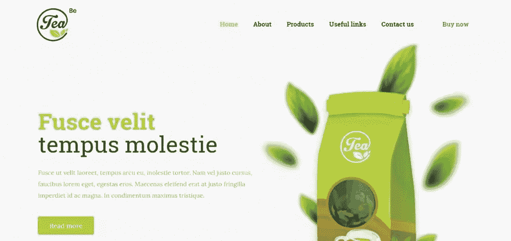](http://themes.muffingroup.com/be/tea2/?utm_source=sitepoint.com&utm_campaign=may18&utm_medium=content)

注意粗体的使用(在第二个例子中使用了衬线)。它吸引了注意力，同时又不影响插图。

### 设计趋势#2:光、影和烟

玩光影一直是一种流行的网页设计技巧。当你把烟加入其中时，设计潮流会呈现出全新的面貌，带来不同的氛围，尤其是在音乐和舞蹈方面。

光、影和烟的恰当组合会产生柔和、浪漫的效果:

 **[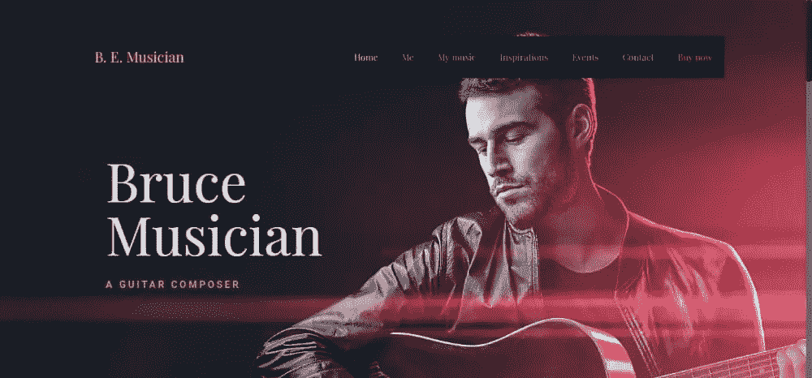](http://themes.muffingroup.com/be/musician/?utm_source=sitepoint.com&utm_campaign=may18&utm_medium=content)

或者更戏剧化一点:

[跳跳](http://themes.muffingroup.com/be/hiphop/?utm_source=sitepoint.com&utm_campaign=may18&utm_medium=content)

[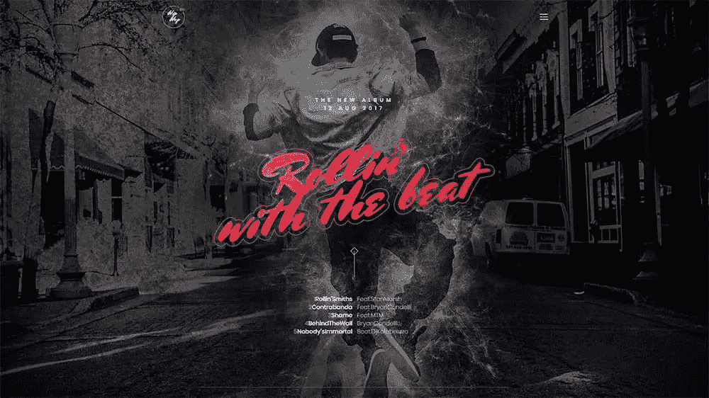](http://themes.muffingroup.com/be/hiphop/?utm_source=sitepoint.com&utm_campaign=may18&utm_medium=content)

或者是性感和优雅的完美结合…

[**【bepole】**](http://themes.muffingroup.com/be/pole/?utm_source=sitepoint.com&utm_campaign=may18&utm_medium=content)

[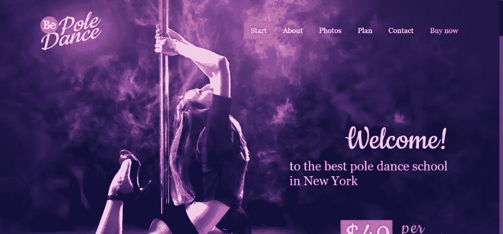](http://themes.muffingroup.com/be/pole/?utm_source=sitepoint.com&utm_campaign=may18&utm_medium=content)

### 设计趋势#3:渐变或颜色过渡

渐变很热。甚至比去年使用大胆的颜色还要火。渐变或颜色过渡特别适合柔和的颜色。当它们被允许与其他设计趋势发生冲突时，结果可能会令人惊讶。

[**困惑 C2**](http://themes.muffingroup.com/be/music2/?utm_source=sitepoint.com&utm_campaign=may18&utm_medium=content)

[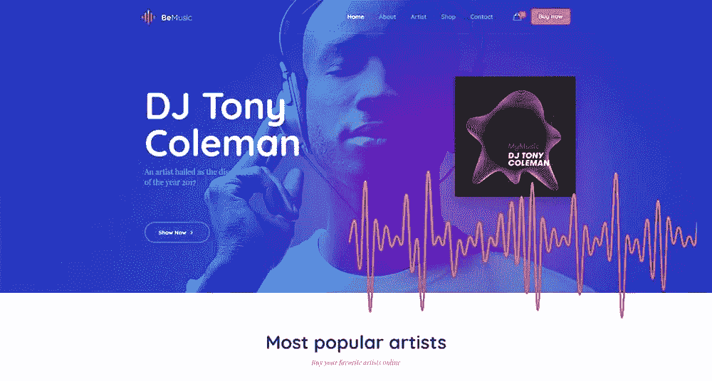](http://themes.muffingroup.com/be/music2/?utm_source=sitepoint.com&utm_campaign=may18&utm_medium=content)

[**BeApp3**](http://themes.muffingroup.com/be/app3/?utm_source=sitepoint.com&utm_campaign=may18&utm_medium=content)

[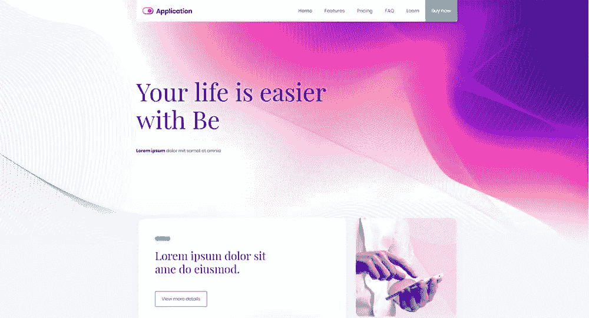](http://themes.muffingroup.com/be/app3/?utm_source=sitepoint.com&utm_campaign=may18&utm_medium=content)

### 设计趋势#4: 3D“移动”剧照

创造一个 3D 的“移动”仍然很难，但是如果做得好，它会是一个真正的吸引眼球的东西。也许是因为运动的幻觉往往比运动本身更吸引我们。这里有两个例子，你可以看到自己的结果——一个看起来流动的 3D 图像。

[**百事通**](http://themes.muffingroup.com/be/stone/?utm_source=sitepoint.com&utm_campaign=may18&utm_medium=content)

[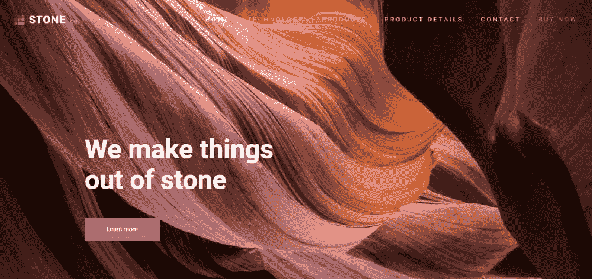](http://themes.muffingroup.com/be/stone/?utm_source=sitepoint.com&utm_campaign=may18&utm_medium=content)

[**BeDigital**](http://themes.muffingroup.com/be/digital/?utm_source=sitepoint.com&utm_campaign=may18&utm_medium=content)

你可以用这样的图像做很多事情。给他们任何纹理，玩光影，利用渐变或负空间。3D 动态剧照与许多其他趋势完美结合，产生独特的效果。

### 设计趋势#5: 2018 静物

静物已经流行很久了。这种趋势可能会永远持续下去，但这并不意味着它不能被改进。现代静物最受欢迎的形式是——你猜对了——3D。

 **[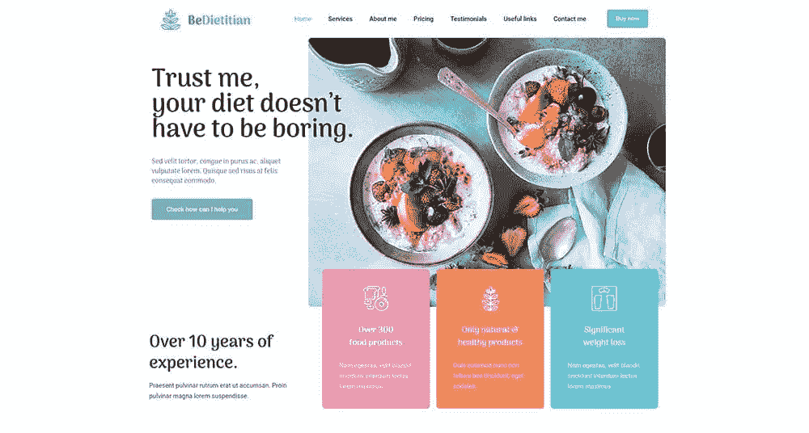](http://themes.muffingroup.com/be/dietitian/?utm_source=sitepoint.com&utm_campaign=may18&utm_medium=content)

你也可以使用摄影(或 3D 照片组合)。这里有两个非常好地利用了空白的例子:

[**贝霍姆**](http://themes.muffingroup.com/be/home/?utm_source=sitepoint.com&utm_campaign=may18&utm_medium=content)

 **[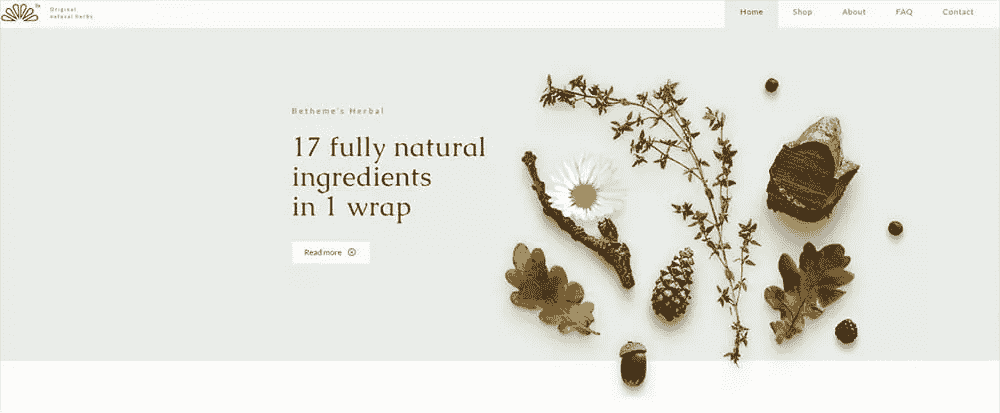](http://themes.muffingroup.com/be/herbal/?utm_source=sitepoint.com&utm_campaign=may18&utm_medium=content)

### 设计趋势#6:金属光泽

金属光泽已经不仅仅是一种迷人的趋势。这已经成为一种非常流行的狂热。事实上，它如此受欢迎，以至于它已经悄悄进入了代表各种不同行业的网站。

[**beyo ga 2**](http://themes.muffingroup.com/be/yoga2/?utm_source=sitepoint.com&utm_campaign=may18&utm_medium=content)

[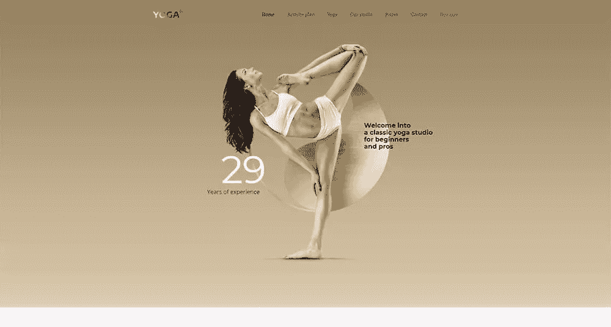](http://themes.muffingroup.com/be/yoga2/?utm_source=sitepoint.com&utm_campaign=may18&utm_medium=content)

[**Bei industry**](http://themes.muffingroup.com/be/industry/?utm_source=sitepoint.com&utm_campaign=may18&utm_medium=content)

[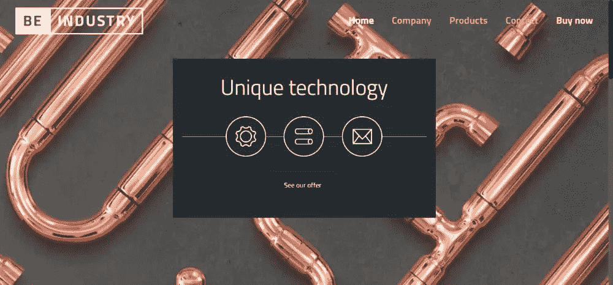](http://themes.muffingroup.com/be/industry/?utm_source=sitepoint.com&utm_campaign=may18&utm_medium=content)

金属光泽可以用于印刷，3D 元素，以及作为照片和插图中引人注目的插入。

### 设计趋势#7:混乱的排版

不——所有东西都不需要完美地排列起来！有些时候，当我们追求原创时，我们必须忘记一些我们被教导的东西。

混乱实际上可以是干净的、吸引人的，当然也是有趣的。玩一会儿，看看会有什么结果！

[**BeStylist**](http://themes.muffingroup.com/be/stylist/?utm_source=sitepoint.com&utm_campaign=may18&utm_medium=content)

[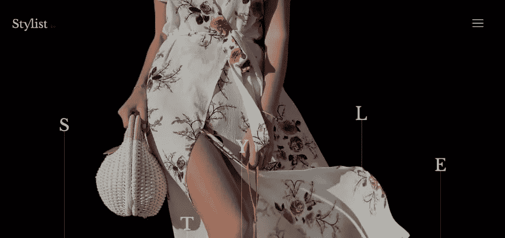](http://themes.muffingroup.com/be/stylist/?utm_source=sitepoint.com&utm_campaign=may18&utm_medium=content)

一定要记住 UX。在用户收到你的信息之前，可以“戏弄”他一会儿。只是不要要求用户为了理解一个页面的目标而去解决一个难题。那不是他们在那里的目的。

 **[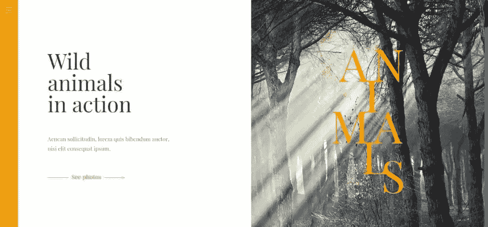](http://themes.muffingroup.com/be/story/?utm_source=sitepoint.com&utm_campaign=may18&utm_medium=content)

### 设计趋势#8:野性又回来了

野蛮主义确实又回来了。有些情况下，您最好避免这种趋势。在其他一些情况下，你应该接受它。野蛮主义不是艺术-矫情。这是一种引起访客注意的直接方式。

这种趋势鼓励直接、直率和切中要害。因此，你可能会小心使用它；但它确实产生了影响，传递了一个清晰的信息。

[**BeCopywriter**](http://themes.muffingroup.com/be/copywriter/?utm_source=sitepoint.com&utm_campaign=may18&utm_medium=content)

[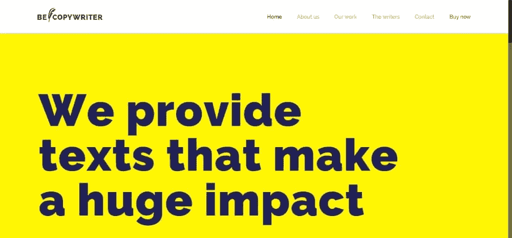](http://themes.muffingroup.com/be/copywriter/?utm_source=sitepoint.com&utm_campaign=may18&utm_medium=content)

## 总结最新趋势以及在哪里使用它们

*   借助插图和自定义图形艺术，尽情发挥创意
*   玩玩光影——然后添加烟雾来制造一些令人惊讶的效果
*   将渐变、颜色过渡与你喜欢的潮流结合起来
*   寻找催眠效果？带有“动态静止画面”的 3D 将会做到这一点
*   利用 3D 技术或巧妙运用摄影技术，创作自己的现代静物作品
*   魅力十足——尽可能添加金属元素
*   直截了当——用野性来传达你的信息
*   使用 BeTheme 的[预建网站](https://themeforest.net/item/betheme-responsive-multipurpose-wordpress-theme/7758048/?utm_source=sitepoint.com&utm_campaign=may18&utm_medium=content)跟踪所有这些趋势(以及更多！)而不会有严重倦怠的风险。

## 分享这篇文章********