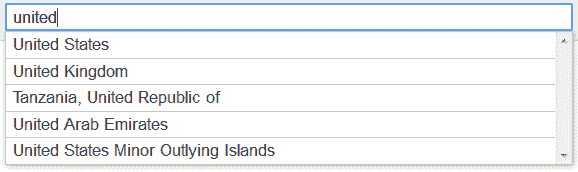

# 开发更好的国家选择器

> 原文：<https://www.sitepoint.com/better-country-selector/>

在每个 web 开发人员的一生中，都会有需要国家选择器的时候——可能是为了注册表单或投递地址。因此，我们找到了所有 249 个国家的列表，将一个`select`框插入到我们的 HTML 代码中，并认为这是一项出色的工作。

不是的。

国家选择框是可怕的。这些问题包括:

**1。太多选择**
在 249 个条目中找到你的国家是一场可用性噩梦。

**2。笨拙的界面**
选择框控件因设备、操作系统和浏览器而异，但有一点是肯定的——用户需要滚动鼠标才能找到他们的国家。这通常意味着从键盘切换到鼠标，或者在手机上大量滑动。

**3。排序问题**
如果你的网站主要被美国用户访问，字母列表会首先显示“阿联酋”和“英国”。一些开发人员通过将最有可能的国家放在顶部来解决这个问题，但这可能会使期望按字母顺序排序的用户感到困惑。

**4。不考虑备选国名**
国家名单很少考虑备选国名。我住在英国，但任何联合王国，英国，大不列颠，英国或英格兰可以由开发商定义。

**5。内部化不佳**
如果一个西班牙用户试图在你的英文列表中找到“Españ”该怎么办？最多，他们会找到爱沙尼亚。此外，列表很少考虑国际国家代码，如 es 或 US。

**6。不考虑缩写或输错的**
如果用户输入诸如“美国”、“州”或“美国”这样的术语，他们不太可能找到美国。

幸运的是，来自 [Baymard Institute](http://baymard.com/blog) 的 Christian Holst 开发了一个解决方案，为我们解决了这些问题:参见 [**重新设计国家选择器**](http://baymard.com/labs/country-selector) 。



这是一个 jQuery 插件，它用一个自动完成控件代替了标准的 HTML `select`框。提供了 jQuery UI 自动完成插件，但是如果需要，您可以使用自己的实现。

在 HTML 中可以定义几个属性:

```
 <select name="Country" id="country-selector" autofocus="autofocus">
<option value="Austria" data-alternative-spellings="AT Österreich Osterreich Oesterreich ">Austria</option>
<option value="Spain" data-alternative-spellings="ES España">Spain</option>
<option value="United Arab Emirates" data-alternative-spellings="AE UAE Emirates">United Arab Emirates</option>
<option value="United Kingdom" data-priority="2" data-alternative-spellings="GB Great Britain England UK Wales Scotland">United Kingdom</option>
<option value="United States" data-priority="1" data-alternative-spellings="US USA United States of America">United States</option>
</select> 
```

这个代码片段与大多数国家代码相同，除了:

*   如果定义了一个`data-priority`代码，它被认为比没有代码的国家具有更高的优先级。优先级越低，它在自动完成列表中的位置就越高。
*   可以在`data-alternative-spellings`属性中定义一个以空格分隔的替代代码和拼写列表。

要将`select`转换成自动完成框，只需调用 jQuery 插件方法:

```
 $("#country-selector").selectToAutocomplete(); 
```

还有更多选择，所以我建议你在[](http://baymard.com/labs/country-selector)**尝试演示并查看文档。开源代码在麻省理工学院许可下发布，可在 [GitHub](https://github.com/JamieAppleseed/selectToAutocomplete) 获得。**

 **这个插件远远优于我见过的其他实现——包括，咳咳，我自己的。请注意，它在 IE6 或 ie7 中不起作用，但这些浏览器仍然会显示标准的`select`框。它也不限于国家，你可以使用任何类型的数据。推荐。** 

## **分享这篇文章**