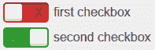
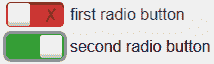

# 更好的 CSS3 拨动开关！

> 原文：<https://www.sitepoint.com/better-css3-toggle-switches/>

你们中的许多人喜欢我以前的文章，如何在 CSS3 中创建一个切换开关。然而，在评论和[推特](http://twitter.com/craigbuckler)上提出了一些问题……

1.  如何对单选按钮应用切换？
2.  可访问性可以提高吗？
3.  为什么它不能在旧的移动 Webkit 浏览器上运行？

我做了一些改进，所以请 [**查看演示页面**](http://cssdeck.com/labs/full/better-css-toggle-switches) 和[的 HTML/CSS 代码……](http://cssdeck.com/labs/full/better-css-toggle-switches)

## 单选按钮支持

一个简单的开始。单选按钮的功能与复选框几乎相同，因此我们可以简单地对每个输入应用一个“开关”类来使其工作，例如

```
<div>
<input type="radio" id="radio1" name="radio" class="switch" />
<label for="radio1">first radio button</label>
</div>

<div>
<input type="radio" id="radio2" name="radio" class="switch" checked="checked" />
<label for="radio2">second radio button</label>
</div>

<div>	
<input type="radio" id="radio3" name="radio" class="switch" />
<label for="radio3">third radio button</label>
</div> 
```

看到两个开关同时变换位置，非常满足！

## 修改的可访问性

来自[无障碍网页设计](http://accessibleweb.eu/)的理查德提出了几个问题。首先，开关在红色和绿色之间变换；如果你是色盲，就不容易确定开关是开着还是关着。为了解决这个问题，我在背景中添加了一个勾号和十字符号:



不需要额外的元素——我简单地使用了一个十字字符代替空格，并使用`text-indent`将其放置在背景的右侧:

```
input.switch:empty ~ label:before
{
	content: '2718';
	text-indent: 2.4em;
	color: #900;
}
```

当复选框/单选按钮被选中时，它会变成一个复选字符，并移动到背景的左侧:

```
input.switch:checked ~ label:before
{
  content: '2714';
  text-indent: 0.5em;
  color: #6f6;
}
```

**跨浏览器 CSS3 动画**
最初，我把勾/叉字符放在白色开关本身上。这对于浏览器来说很复杂，因为它必须在两个不同的字符之间创建一个过渡。火狐成功了，但是 Chrome 和 IE10 走了一条更容易的路线:*他们完全抛弃了动画！*Webkit 和 Trident 似乎不允许在伪元素的内容发生变化的情况下对其进行动画处理——即使你明确声明只应该对边距或颜色进行动画处理。

为了解决这个问题，我将勾/叉应用到:before 切换背景，并移除其过渡效果(颜色不会平滑地改变，但几乎看不出来)。现在只有白色的:在开关位置后是动画。

下一个可访问性问题:键盘焦点。之前的切换很难只在键盘上使用，所以当切换有焦点时，我对它应用了不同的标签颜色和方框阴影:

```
input.switch:focus ~ label
{
  color: #000;
}

input.switch:focus ~ label:before
{
  box-shadow: 0 0 0 3px #999;
}
```

结果可能有点太微妙，但添加自己的效果很容易:



focus 效果在 Firefox、IE 和 Opera 中有效——但在 Chrome 26 中无效？它看起来像一个浏览器错误，除非有人知道不同？

## 更多 Webkit 灾难

最后一个问题是:切换开关在使用旧版 Webkit 的移动浏览器中会失败，比如 iPad 1.0 上的 Safari 和 Android 浏览器。引擎支持标签，支持:复选框选择器并显示初始状态，但不希望在初始页面加载后修改伪元素。我甚至打破了自己的要求，添加了一点 JavaScript，但是浏览器嘲笑我无力的尝试，不肯让步。

伪元素动画是最近才加入 Webkit 的。这令人沮丧，而且不像过去的 IE6/7 时代，很难找到不对其他浏览器产生负面影响的解决方法。

无论如何，假设遗留 Webkit 用户不是你的人口统计的一部分，请[使用 HTML/CSS 代码](http://cssdeck.com/labs/full/better-css-toggle-switches)无论你喜欢什么。或者，您需要添加更多(真正的)元素或 JavaScript 来使其工作。

## 分享这篇文章