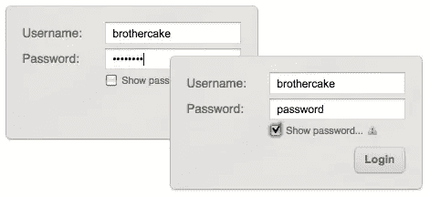

# 更好的密码#2:“显示密码”

> 原文：<https://www.sitepoint.com/better-passwords-2-show-password/>

在这个简短系列的前一篇文章中，我们看了一个创建[屏蔽密码字段](https://www.sitepoint.com/better-passwords-1-the-masked-password-field)的脚本，我被这篇文章的强烈反响所感动。伙计，你们讨厌它！在我发表它的时候，我对某些方面有所保留，但总的来说我认为这是一个好主意。

现在我改变主意了！通读了贴出的评论和担忧，我不再认为这是一个好主意。这与其说是个别细节——比如缺少自动完成支持，或者需要限制插入符号位置——不如说是 it **创建了这些限制，但并没有带来多少好处**。这些密码字段并不真正安全，不会被偷窥，也不一定比普通的星号字段更容易使用。

但是，我们仍然面临着最初的问题——普通的带星号的`"password"`字段可用性很差，如果能找到一个更好的解决方案就好了。

所以在这篇文章中，我们将会看到另一种想法，一些你们已经提到过的，这篇文章的标题也透露了一些…

## “显示密码”复选框

它的核心是一种比屏蔽符号解决方案更简单、更直接的方法，我们只需**在密码字段下方或旁边添加一个复选框**，当**被选中时，它会将该字段转换为纯文本**，这样您就可以清楚地看到它:


**带有“显示密码”复选框的登录表单。**

就我个人而言，无论在什么情况下，我都不会提倡一个纯文本的密码域，但是这个解决方案的要点是我们**给用户控制权**。毕竟，我们总是知道什么时候我们是安全的，不会被不经意的观察者发现——我现在背靠着墙，不管怎样，我独自一人在这个房间里！

所以我们给用户一个选项，让他们看清楚自己的密码，然后让他们自己考虑什么时候安全。(尽管如此，某种警告也无妨——我为这篇文章准备的演示在复选框标签中有一个注释，说明在公共场所这是<q>不可取的。)</q>

所以这里有一个脚本，它以一种渐进的、跨浏览器的方式将这个功能添加到`"password"`字段中。请看一下演示，并获取代码副本:

*   **[【显示密码】复选框演示](https://www.sitepoint.com/examples/password/ShowPasswordCheckbox/demo.html)**
*   **[下载脚本](https://www.sitepoint.com/examples/password/ShowPasswordCheckbox.zip)**

## 先标记

我们从与上次完全相同的标记开始这个例子:

```
<label for="pword">Password:</label>
<input type="password" id="pword" name="pword" />
```

但是这一次根本不需要修改现有的*T2 标记，我们只需要添加一些新的东西。首先是复选框和标签，它们是可见的开关，然后是第二个`"text"`字段，这是您选中复选框时看到的内容。*

理想情况下，我们只需翻转`"password"`和`"text"`之间的字段`type`就可以实现这一点，但这在<abbr title="Internet Explorer">即</abbr>中自然行不通。因此，我们所做的是创建第二个纯文本字段，在与原始字段相同的上下文中，然后通过切换它们的`display`在它们之间切换。

所以我们最终得到的是这样的标记:

```
<label for="pword">Password:</label>
<span>
    <input type="password" id="pword" name="pword" />
    <input type="text" id="pword" autocomplete="off" style="display:none;" />
    <label class="show-password" for="showpasscheckbox-1" title="Show the password as plain text">
        <input type="checkbox" id="showpasscheckbox-1" title="Show the password as plain text" />
        <span>Show Password</span>
    </label>
</span> 
```

现在，眼尖的观察者会注意到，原来的密码字段和新的文本字段都有相同的`ID`，从而使 <abbr title="Document Object Model">DOM</abbr> 无效。我将第一个承认这是错误的，但是它是实用的——不仅仅是`ID`,事实上，脚本复制了来自密码字段的每个属性(除了它的`name`和`type`),因此**继承了相同的外观和行为**,并且最终，产生了与它的祖先相同的结果。您可以从脚本中删除这种行为，但是如果这样的话，您需要用已知的样式挂钩语义来替换它，比如一个固定的`class`名称(这是像这样的第三方脚本永远无法做到的)。

您可能还发现了一个偷偷摸摸的 <samp>autocomplete="off"</samp> 在那里，但是放松！这只是在普通字段上防止重复——在密码字段上的自动完成和正常情况一样。

## 最后编写脚本

我们实现这一目标所需的事件实际上非常简单。首先，我们在密码和文本字段上都有一个`change`处理程序，因此对其中一个字段的输入会更新另一个字段的值。没有必要使用比`onchange`更直接的事件，因为根据定义，如果不将焦点从一个字段移开，就无法查看另一个字段。

复选框本身有一个`click`处理程序，用于切换两个字段的显示——这样一个字段可见，一个字段隐藏(默认情况下文本字段是隐藏的)。但是在这一点上还有一个小问题，这意味着每当我们切换字段时，我们也应该更新它们的值，即。将当前显示字段中的值重新复制到即将显示的字段中…

当在浏览器的历史中从提交的页面导航回表单时，你会在一些浏览器中发现**其中一个值仍然存在，而另一个已经被删除**(在 <abbr title="Internet Explorer">IE</abbr> 中，密码仍然存在，但普通值被删除；在歌剧中，情况正好相反；在 Firefox 中它们都是空的)。这些差异(源于浏览器安全性和事件模型的差异)会导致这两个值变得不同步，因此为了保持它们的同步，我们只需确保无论何时切换字段的显示，我们都会同步它们的值。

我们还必须做一些类似的预提交。用户可能会回到历史中，回到浏览器中的快照状态，在那里可以看到普通字段，然后重新输入或编辑该值，并立即重新提交，而不会切换回密码字段。这就产生了一个问题，因为密码字段是一个包含可提交值的字段；可以说，平原只是一个读数。因此，为了解决这个问题，我们在表单提交之前添加了一个例程(即一个不影响本机行为的`submit`监听器)，它将值从普通字段复制到密码字段，如果普通字段是可见的。

## 间奏曲！

然而，Opera 仍然存在一个挥之不去的安全问题，这是我无法阻止的。从某个角度来看，Opera 最大的优点之一也是它最大的缺点之一，那就是当你回顾 Opera 的历史时，它不会重新加载页面——甚至不会从缓存中重新加载——它**实际上会重新创建该页面的前一个处理器快照**。因此，举例来说，如果您从下拉菜单中的链接进入某个页面，当您返回到上一页时，该菜单仍将保持打开状态，就像您离开时一样——load 事件不会触发，并且没有任何其他线索提示开发人员页面加载已经发生……因为它没有发生！

对于 Opera 中的*所有*缓存的页面浏览量来说，情况也是如此，只是程度较轻，对于用户来说意味着所有缓存的页面浏览量都更快。但是对于我们的脚本来说，这意味着如果你提交的表单中有可见的明文密码，那么回到历史中，**明文密码仍然是可见的**——就在那里，如果你没有预料到的话，可能会将你的密码暴露给观察者。

我不认为我们有任何方法可以捕捉到这种情况，因为就脚本事件而言，什么都没有发生——没有事件触发，因为没有事件发生。奇怪吧。然而完全明智！

我想我们可以感到欣慰的是，Opera 用户——作为一般人群，他们往往更懂技术，更不用说非常熟悉他们的浏览器如何工作——可能不会对此感到太惊讶。我的意思是，我大部分时间都生活在 Opera 中，我最喜欢它的一点是你可以在不触发脚本事件的情况下逐步完成表单提交！！

## 太容易了！

这就是全部的内容——这里没有令人讨厌的惊喜！

我想，如果我们把简单放在心上，那么从总体上看，这显然是一个比屏蔽密码字段更好的解决方案。它更干净、更简单，并且不需要强制移除本机行为来使这该死的东西工作！但是它并不完美，如果这个解决方案真的是一个好的解决方案，如果由浏览器自己来实现，可能会更好。

请尽快加入我这个系列的第三篇也是最后一篇文章，我将会看到一些小巧可爱的东西，你几乎可以把它们扔在任何地方！

*缩略图鸣谢:[明显暧昧](http://www.flickr.com/photos/clearlyambiguous/123975157/)*

## 分享这篇文章