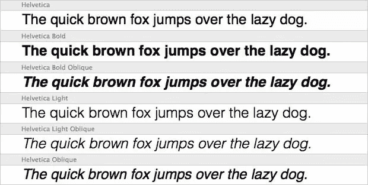
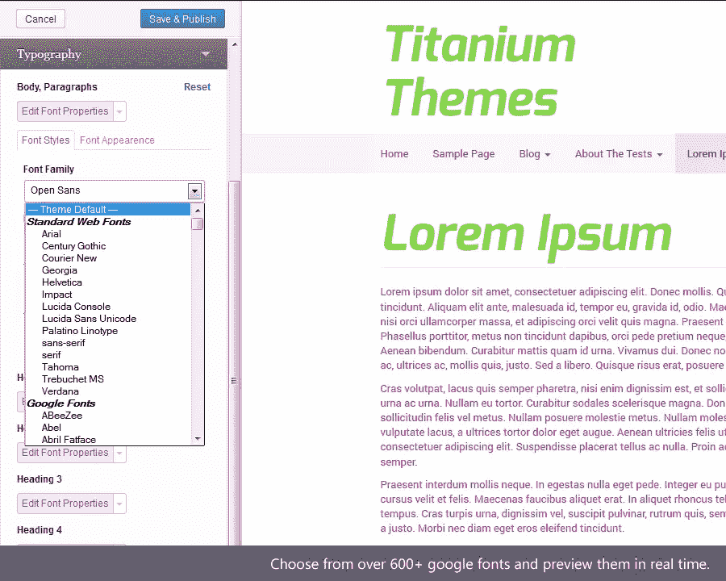
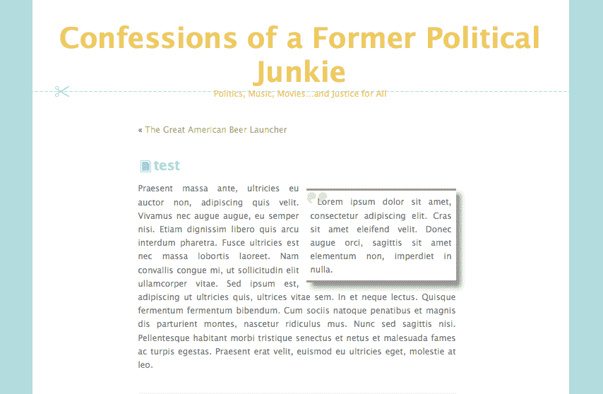
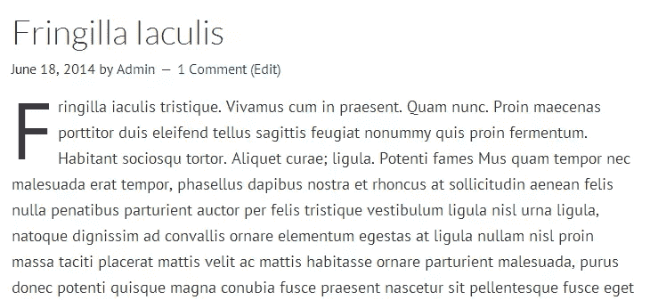
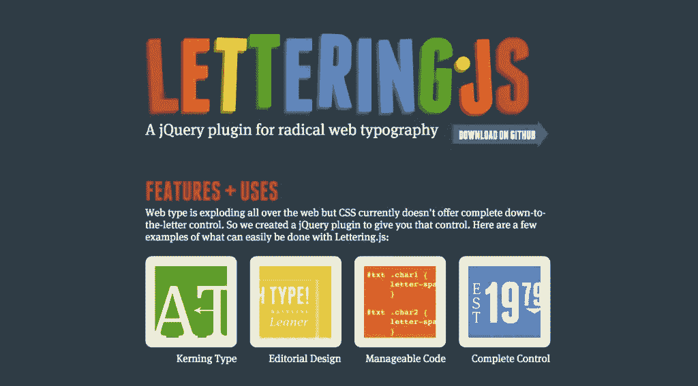
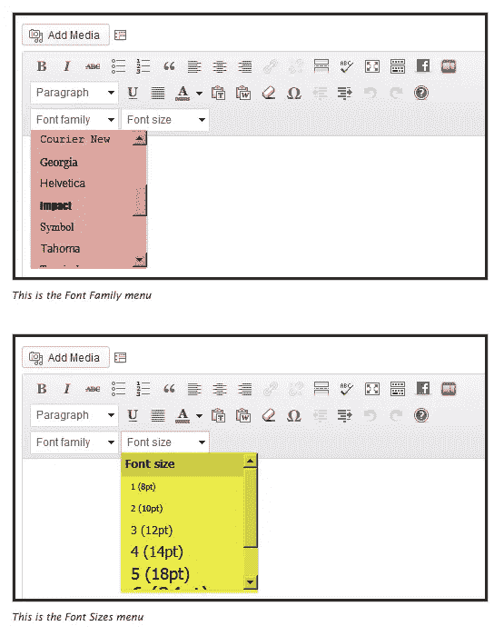
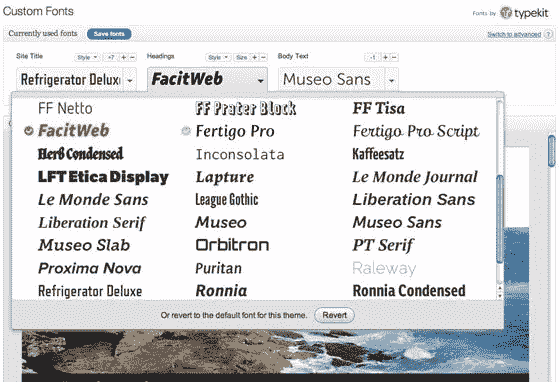
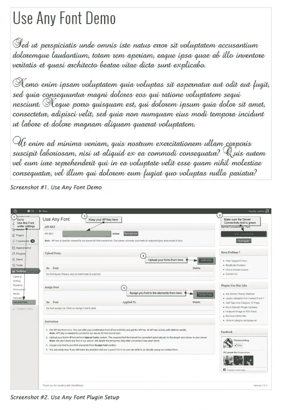
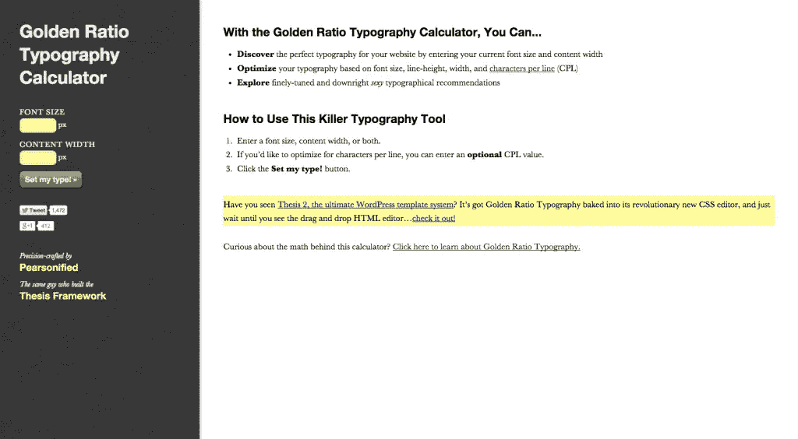

# 更好的 WordPress 排版插件和工具

> 原文：<https://www.sitepoint.com/better-wordpress-typography/>

在当今日益视觉化的文化中，排版比以往任何时候都更重要。我们比以往任何时候都更加关注视觉设计所产生的影响。在很大程度上，这要归功于加利·哈斯特维特的纪录片《Helvetica》(调查字体如何影响我们的日常生活)，频繁的“禁止漫画无”运动，以及最近将麦克阿瑟天才奖授予字体设计师马修·卡特。

但是很多时候，特别是在网页设计中，人们会一脸茫然，不知道为什么有人会为这些事情烦恼。WordPress 尤其如此，它的主题已经有了现成的字体和排版。这并不是说 WordPress 主题的设计者和开发者没有考虑过排版。我百分之百肯定他们有。只是他们还没有能力专门为你的内容、你的文字设计主题排版。而且，在一天结束的时候，这正是印刷术的意义所在。所以，我把一些方便的插件和工具放在了一起，它们可以让你的字体生动起来，让你的 WordPress 网站因为所有正确的原因而脱颖而出。

## 印刷术解释

在我直接进入排版工具和插件之前，我认为快速浏览一下常见的排版术语和定义是值得的。

这是:

*   字体是一组具有相似特征的字体。例如，Helvetica 是一种字体。
*   字样是字体的一个单独的家族成员。例如，Helvetica 大胆，Helvetica 轻，或 Helvetica 斜。

*   衬线字体:这是一种在字母末端或底部有小的装饰性线条的字体。它们几乎看起来像(并且经常被称为)“小脚”。正是这些“小脚”帮助眼睛更容易地浏览文本，解释了为什么衬线字体经常用于正文。例子包括坎布里亚和时代罗马。
*   无衬线字体:这些字体是无脚的。它们没有衬线字体那样的小脚，更常用于标题。例如 Arial 和 Calibri 以及 Century Gothic。
*   脚本:这些是流畅、优雅的字体，看起来几乎像手写文本。例子包括爱德华七世时代，萨沃伊和圆手。这些应该谨慎使用，尤其是在在线设计中。

## 用于排版的插件

### [简易谷歌字体](https://wordpress.org/plugins/easy-google-fonts/)

说到排版，这可能是我最喜欢的 WordPress 插件。它允许你将谷歌字体添加到你的 WordPress 主题中，而不需要任何 HTML 编码知识。它实际上与你的 WordPress 定制器无缝集成，这意味着你可以在你的主题中实时预览谷歌字体。您可以从目前提供的 600 多种 Google 字体中进行选择，创建无限的自定义字体控件，甚至可以在保存任何更改之前预览新字体在您的主题中的外观。实际上，只需简单的点击几下，你就可以改变网站的整体外观。如果你喜欢对插件背后的所有编码有一个完整的理解，那么你也会很高兴地得知，在 [Titanium Themes](http://titaniumthemes.com/) 的 Easy Google Fonts 背后的团队目前正在为主题开发者编写深入的文档。

统计数据: Easy Google Fonts 在超过 185，000 次下载中获得了 4.9 星的好评。它与 WordPress 版本 4.1.1 和更高版本兼容，最近一次更新是在几天前。

### [简单的拉报价](https://wordpress.org/plugins/simple-pull-quote/)

这个插件是一个超级简单的方法，你可以把引用插入到你的 WordPress 网站的文章和页面中。安装后，它会在 HTML 和 TinyMCE 编辑器中添加一个易于使用的“引用”按钮。基本上，在你的网站上安装了这个插件，你就可以把字体设计作为一个设计元素；引用成为另一个图形特征，以一种灰色文本不可能希望的方式给你的网站增加色彩和动感。

统计数据:超过 40，000 次下载，简单的引用得分为 4.8 星(满分 5 分)。不过，它只兼容 4.0.1 版本，自 2014 年 12 月以来就没有更新过，这一点需要记住。

### [简单首字下沉](https://wordpress.org/plugins/simple-drop-cap/)

如果你像我一样，是一个很久以前的小说爱好者，那么你会喜欢这个简单的首字下沉插件。一旦安装，这个插件会神奇地将文章或年龄的第一个字母转换成首字下沉(基本上只是一个花哨的术语，表示比页面上其他字体大的首字母)。它有一系列的特性，所以你可以在每篇文章、每页或每篇文章的基础上转换首字母。有各种各样的首字下沉样式，你甚至可以为不同的页面或文章设置不同的首字下沉样式。可能性真的是无穷无尽的！这个插件有专业版(一个站点一次性收费 10 美元，五个站点收费 25 美元)和免费版。

统计数据: Simple Drop Cap 只有 3000 次下载，但却获得了可观的 4 星评级。而且，它兼容 WordPress 4 . 1 . 1 版本，几天前刚刚更新过。

### [刻字. js](https://wordpress.org/plugins/lettering/)

Lettering.js WordPress 插件是一个轻量级、易于使用的 JavaScript span 注入器，用于激进的 web 排版。迷茫？当我看到那个描述的时候我也是。但是，我并不是一个真正的程序员，所以我的困惑并不奇怪。基本上，这个插件可以让你控制网站上的单个字母和文本行。您可以改变换行和字距调整等元素。您甚至可以拆分单词和文本行，并为每一行设置不同的排版参数。不幸的是，WordPress 插件目录上的 Lettering.js 页面没有包含太多的细节。不过，你可以访问 [Lettering.js 网站](http://letteringjs.com)了解更多信息。

**统计数据**:虽然它在功能和特性方面很强大，但 Lettering.js 只被下载了 1400 次，而且只有一篇评论，它的五星评级并没有太大的分量。它与 WordPress 4 . 1 . 1 版兼容，并在本月早些时候进行了更新。

### [Fonts](https://wordpress.org/plugins/fonts/)

这个插件让你可以选择添加额外的、预先确定的字体样式和大小到你的 WordPress 可视化编辑器中。这个插件使得排版比默认的 WordPress 设置更快更容易。如果你是 Adobe Creative Suite 的普通用户，那么在设置字体样式时，它的工作方式与这些软件平台非常相似。

统计数据:这个插件给自己打了令人羡慕的 4.5 分(5 颗星)，并且已经被下载了 40，000 多次。它兼容 4.1.1 版本，最近一次更新是在一月底。

### 用于 WordPress 的字体

这个插件能够在你的 WordPress 网站上安装并使用所有的 Adobe Typekit 字体，而不需要编辑你的网站主题的 CSS。要使用此插件，您需要有一个 [Adobe Typekit 帐户](https://typekit.com/)。Typekit 是一种订阅字体服务，它将 foundry 合作伙伴的数千种字体整理到一个库中，以便快速浏览，在 web 或桌面上轻松使用，并提供无尽的印刷灵感。这个插件实际上非常类似于简单的谷歌字体，但是让你访问 Typekit 字体，而不是谷歌字体。

统计数据:下载量超过 68，000 次，Typekit 兼容 WordPress 4 . 1 . 1 版本，本月早些时候进行了更新。不幸的是，它的星级只有 3.6。

### [使用任意字体](https://wordpress.org/plugins/use-any-font/)

顾名思义，这个插件让你有机会在你的 WordPress 网站上使用任何字体。不像上面提到的其他字体嵌入插件(比如 Typekit 和 Easy Google Fonts)，你可以使用任何你喜欢的字体，只要你能接触到它的官方字体格式(ttf，otf)。这意味着您不依赖于另一台服务器。最重要的是，这个插件安装起来既快又简单，不需要任何 CSS 或编程知识。这个插件支持所有主流浏览器，在你的自定义字体存储到你自己的服务器而不是第三方服务器之前，网站加载时间实际上可以得到改善。

**统计数据:**这个特殊的插件下载量超过 216，000 次，获得了 4.9 星的评分。此外，它在 2 月初进行了更新，并与 4.1.1 版兼容。

## 微调你的 WordPress 网站的其他排版工具

有一整套其他在线工具(除了插件)可以真正帮助你微调 WordPress 网站的排版。

### [黄金比例排版计算器](http://www.pearsonified.com/typography/)

这个了不起的免费在线工具可以帮助你找到完美的字体和字体设置组合。通过使用这个漂亮的计算器，你可以决定你的网站上的文字是否对所有的访问者来说既易读又赏心悦目。这真的很容易使用:只需输入您想要的字体大小，以及文本将占据的区域的宽度。就是这样。计算器会告诉你最好的排版设置。如果你使用建议的设置，你甚至可以用它来仔细阅读一系列可用的字体，以真正预览你的 WordPress 网站将会是什么样子。并且，如果你找到了完美的组合，那么你就可以安装上面提到的 [Easy Google Fonts](https://wordpress.org/plugins/easy-google-fonts/) 插件，实现所有需要的主题改变。

如果你正在寻找能让你比较和对比不同字体风格的在线排版工具，为什么不试试:

*   [类型转换](http://typecast.com/)
*   [网络字体组合器](http://font-combinator.com/)
*   [排字工人](http://www.typetester.org/)

这些只是目前市场上的一些排版工具和插件。而且，虽然它们绝对是一个很好的起点，并且肯定会让你的 WordPress 字体设计有一个很好的开端，但是我确信还有很多字体设计插件。因此，请随时让我知道任何我可能错过了以下。

如果你想更深入地研究排版，SitePoint 有大量关于这个主题的文章:

*   [漂亮排版的原则](https://www.sitepoint.com/principles-beautiful-typography/)
*   [排版 101](https://www.sitepoint.com/typography-101/)
*   [排版备忘单:要避免的 6 大错误](https://www.sitepoint.com/typography-cheat-sheet/)

## 分享这篇文章