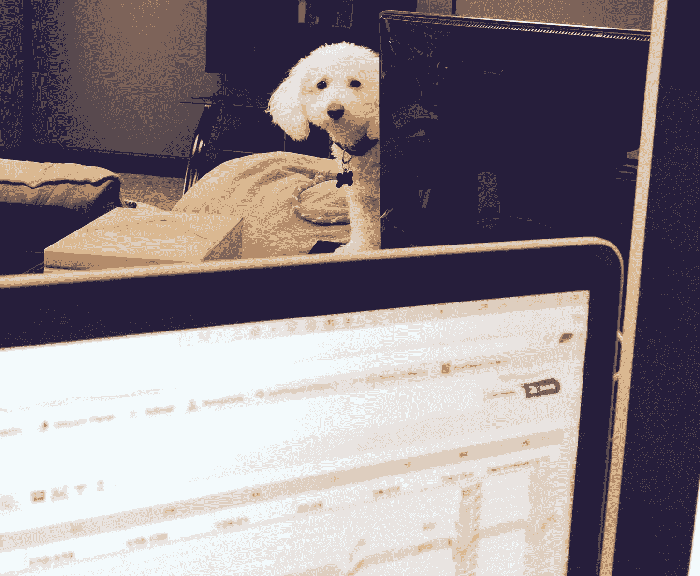
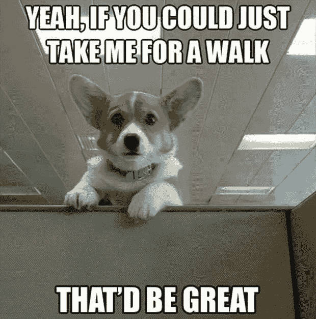
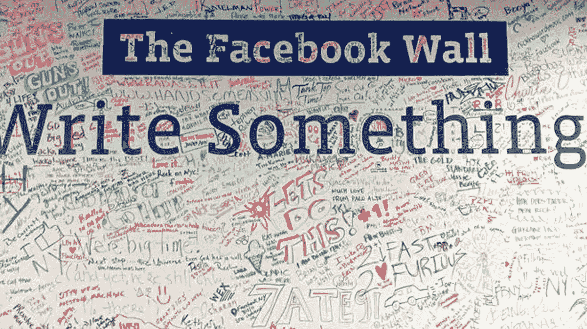

# 创造更好工作环境的 4 种简单方法

> 原文：<https://www.sitepoint.com/better-work-environment/>

现代工作场所正在经历一场复兴。

在谷歌和脸书等大型科技公司的带领下，越来越多的企业将办公室变成了迷你游轮，配备了现场托儿所、小睡舱、游戏室和水疗中心。

但是，虽然我们都喜欢在办公桌前滑水，在会议上滑滑梯，但并不是每个企业都有资源如此正当地装修他们的住所。

幸运的是，有很多更简单、更划算的方法来创造一个更快乐、更健康、更有效率的工作环境。

这里有任何聪明的创意者都会喜欢的四个额外津贴。

## 1.允许养狗

如果办公室里有几只可爱的小狗跑来跑去，这将是一部完全不同的电影。该死，当雪纳瑞的感觉真好。

一个对狗友好的工作场所有很多好处；奇怪的是，更多的公司没有参与进来。*允许养狗:* 

### 减少员工缺勤。

如果知道 Ozzy Pawsborn 会去上班，我们大多数人都会更兴奋。

### 减轻压力。

根据 2012 年的一项研究，白天带狗去工作的狗主人比把狗留在家里的狗主人感觉压力小。

### 引发工作场所互动。

同一项研究发现，狗引发了原本不会发生的职场互动。

### 提升公司形象。

一个叼着雪茄的企业大亨抱着一只猫？邪恶。

一个叼着雪茄的企业大亨牵着一只狗？可爱。

支持养狗政策的公司将自己树立为放松、灵活和进步的形象，并可能吸引具有相似价值观的候选人。

### 鼓励锻炼。

你要坐下来听吗？因为我要说的可能会让你震惊。

每天坐八个小时以上会在四年内增加 15%的死亡几率。

转念一想，还是不要坐了。

有一只狗在身边是起床运动的额外动力。

无论你是在玩捡东西游戏、遛狗，还是在 Dumbleroar 教授把你赶出休息室的时候逃命，任何程度的身体活动对于那些在久坐的工作环境中的人来说都是重要的。

## 2.工藤盒

为了衡量工作场所感激和欣赏的心理影响，宾夕法尼亚大学沃顿商学院的研究人员对大学筹款人进行了一项研究。

首先，他们把筹款人分成两组。

在他们开始工作之前，一个小组收到了主任的鼓励讲话，她对他们的所有努力表示感谢。

另一组没有收到任何鼓舞士气的讲话。

经过一周的筹款，研究人员发现，收到鼓舞士气讲话的员工比没有收到的员工多打了 50%的筹款电话。

受到感激和赏识的员工通常比不受赏识的同事更有动力和生产力。工藤盒是鼓励这种姿态的一种简单方式。

kudo 是一种恭维或赞美的表达方式，kudo 盒子是字面上的 Kudo 盒子。

想参加工藤活动的员工将工藤写在工藤卡片上，然后放进盒子里。在周末，有人大声朗读工藤卡片。

工藤盒营造了一种相互尊重和欣赏的氛围。它鼓励员工评估同事和自己的成就，并认可他人的优点。

工藤盒也使工作场所更加令人兴奋，并激励员工更加努力工作。有人给我写了工藤吗？上面写了什么？谁送的？我打赌如果我早点交上去，我会得到一个荣誉。以此类推。

## 3.干擦板

给你的员工一张空白的选票和一堆记号笔可能会让一些老板感到不安。

他们可以写任何东西。任何事！

但是，偶尔出现的粗糙草图带来的任何缺点都远远超过了写字板的所有优点，例如:

*   鼓励自发的头脑风暴会议。
*   鼓励合作。
*   增强视觉传达。
*   作为一个创造性的出口。
*   培养社区意识。
*   用职场幽默来缓和气氛。

Pssst:如果你喜欢复古风格的可重复使用的书写表面，可以考虑买块黑板。

## 4.团队聚餐

纵观历史，掰面包是和平与团结的象征。

分享一顿饭意味着平等地聚在一起，虽然在 Twitter 上喋喋不休地谈论菠萝披萨的争执，可能不会像古代那样充满神圣的力量，但它仍然是一个强大的团队建设工具。

一起吃饭会引发与工作无关的谈话，让员工之间更容易建立社交纽带。

一起吃饭通常会带来亲密的工作友谊，根据[盖洛普的一项研究，](https://hbr.org/2013/07/we-all-need-friends-at-work)亲密的工作友谊会使员工的满意度提高 50%，在工作中有一个最好的朋友的员工更有可能全身心地投入工作。

以下是一些鼓励共进晚餐的建议:

*   在办公室里有一个指定的用餐区。
*   建立“免费用餐日”，办公室提供早餐或午餐。
*   享受快乐时光。
*   办一次办公室聚餐。

## 结论

要创造一个更好的工作环境，你不必在接待区建一个游乐场，或者在自动售货机旁设一个巧克力饮水机。

然而，你确实需要理解并解决表现不佳背后的根本原因(压力、缺乏动力、没有人际关系)。所以，建立一个永久的带狗上班日，或者上面列出的其他三个想法中的任何一个。

鼓励表达感激之情，为创造力和协作创造机会。举办一个披萨派对。

与其说是津贴，不如说是津贴背后的目的。

#### 你梦想中的公司会提供哪些额外津贴？请在下面的评论中告诉我们。

## 分享这篇文章