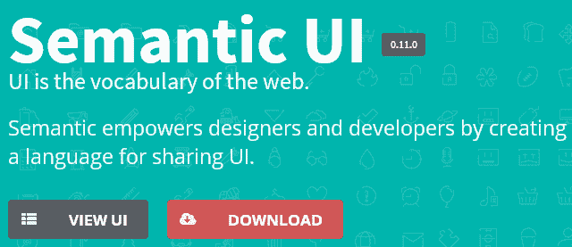
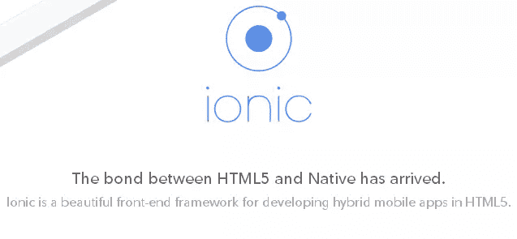
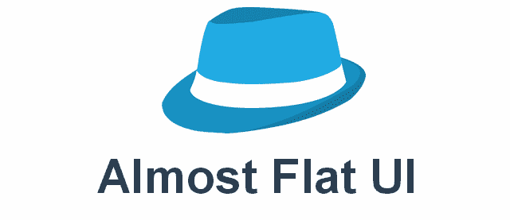
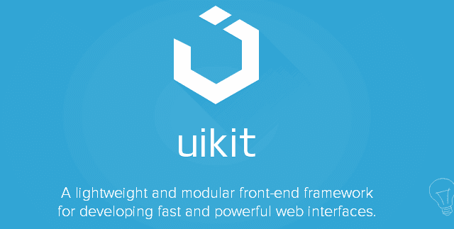
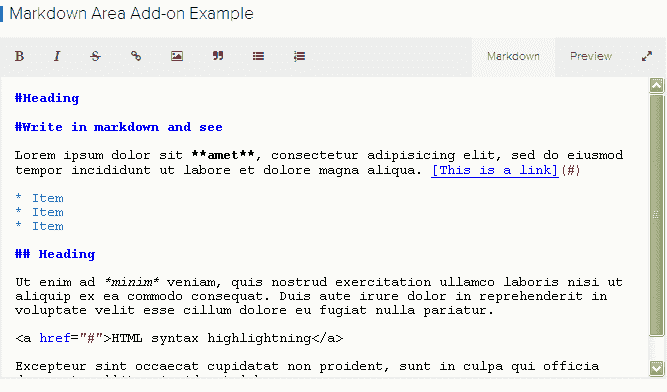
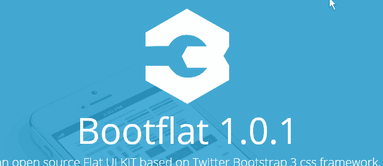
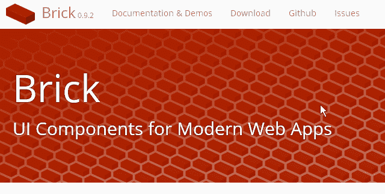

# 超越引导和基础:前所未闻的框架

> 原文：<https://www.sitepoint.com/beyond-bootstrap-foundation-frameworks-never-heard/>

前端框架，如 ZURB 的 [Twitter bootstrap、](https://www.sitepoint.com/css/bootstrap/ "learn more about Bootstrap") [Foundation](https://www.sitepoint.com/css/foundation/ "learn more about Foundation") 等，对于快速、轻松地创建漂亮、响应迅速、跨浏览器友好的网站非常有用，无需学习大量代码或最佳实践。

虽然 Bootstrap 和 Foundation 是两个比较知名的前端框架，但是还有其他一些你们很多人可能都没有听说过的优秀框架。在这篇文章中，我将列出其中的一些，所以你可以考虑尝试一下。

## 语义用户界面

语义 UI 是一个非常好的用户界面套件，使用较少。要了解语义 UI 的不同之处，请访问[的介绍页面](http://semantic-ui.com/introduction.html)。框架完全响应，所有组件都使用 ems 或 rems 定义。

语义 UI 提供的组件包括按钮、分隔线、图标、图像、标签、显示、分段等等。我喜欢这个框架中的标签。您可以使用标签在元素上显示一个 [CSS 功能区](https://www.sitepoint.com/pure-css3-ribbons/)。

该框架的其他功能包括在图像上添加“禁用”状态的能力，以及可以用不同颜色和大小格式化的图标。一些流行的图标(脸书，推特，谷歌+等)包括在内。

语义 UI 附带了大量的特性(元素、集合、模块、行为等)。)，很多都是它特有的。

### 语义 UI 框架和包

*   Sass 的语义 UI[GitHub repo](https://github.com/doabit/semantic-ui-sass)
*   Knockout.js 和语义 UI 一起工作 Knockout-Semantic
*   语义 UI 的 AngularJS 指令 [AngularSemantic](https://github.com/caitp/angular-semantic)
*   meteor 的语义 UI 包 [meteor-semantic-ui](https://github.com/nooitaf/meteor-semantic-ui)
*   semantic-UI Rails gem[semantic-UI-Rails 包](https://github.com/nd0ut/semantic-ui-rails)

### 语义 UI 主题

WordPress 和 Tumblr 主题也可以。

*   [Semantic-Tumblr](https://github.com/brigand/semantic-tumblr)
*   [语义界面文字新闻](https://github.com/ProjectCleverWeb/Semantic-UI-WordPress)

**[下载语义 UI](http://semantic-ui.com/)**

## 离子的

Ionic 是一个漂亮的前端框架，用于在 HTML5 中开发混合移动应用。它仍处于早期开发阶段，但你可以下载一个阿尔法预览。Ionic 是免费和开源的，它提供了一个移动优化的 HTML、CSS 和 JavaScript 组件库，用于构建高度互动的应用程序。它是用 Sass 构建的，并针对 AngularJS 进行了优化。为了充分利用 Ionic，AngularJS 是必需的——尽管没有 Angular js 也可以使用 CSS 特性。

Ionic 团队计划在未来发布 Cordova/PhoneGap 插件，以扩展您的移动应用程序的功能。它是用 SASS 编写的，所以 SASS 爱好者可以很容易地定制变量和 mixins。

**[下载离子](http://ionicframework.com/)**

## 几乎平面的用户界面

[近乎扁平化的 UI](http://websymphony.net/almost-flat-ui/) 基于基础框架。这意味着如果你熟悉 Foundation，那么你可以快速轻松地使用几乎扁平的 UI。几乎是平面的 UI 包括一系列有用的小部件，如 CSS 面板、价格表、带有良好悬停效果的缩略图、面包屑、标签、提醒和工具提示。

**[下载近平 UI](http://websymphony.net/almost-flat-ui/)**

## UIkit

UIkit 是“一个轻量级和模块化的前端框架，用于开发快速和强大的 web 界面”。UIkit 是在 LESS 中开发的，并且像许多框架一样是开源的，提供了一些很棒的组件和插件。

降价区功能是一个独特而有用的附加功能。这使您可以创建一个丰富的 markdown 编辑器，它具有实时预览和对 HTML 语法高亮显示的支持。

其他有用的组件和附加组件包括样式文章和评论部分的 CSS 类。此外，与可排序的附加组件，您可以创建嵌套列表，可以通过拖放排序。

Datepicker 和 Timepicker 附加组件以及一个粘性附加组件也可用，以使导航元素保持在视口的顶部。

**[下载 UIkit](http://www.getuikit.com)**

## 靴筒

Bootflat 是一个基于 Twitter Bootstrap 3 的开源平面 UI 套件。它提供了两种不同的皮肤:Bootflat 默认 UI 皮肤和 Bootflat 方形 UI 皮肤。如果你喜欢平面设计，那么这可能是一个不错的选择。

## 砖

Mozilla 的 Brick 是“一个可重用的 UI 组件包，用于快速开发跨浏览器和移动友好的 HTML5 web 应用程序。”

Brick 不是 Twitter Bootstrap 或 Foundation 的替代品。也就是说，它不是像那些完整的前端开发框架。Brick 为现代 Web 应用程序提供了跨平台的 UI 组件。

Brick 目前处于测试阶段。如果您在使用这些组件时遇到问题，您可以在 GitHub 帐户上提出问题。

**[下载砖块](http://mozilla.github.io/brick/)**

## 知道其他的吗？

这当然不是一个完整的列表——还有许多其他可用的框架。如何看待这些鲜为人知的框架？你试过其他的 UI 工具包或者框架吗？欢迎在评论中分享你的观点。

## 分享这篇文章