# 超越 console . log()–提升您的调试技能

> 原文：<https://www.sitepoint.com/beyond-console-log-level-up-your-debugging-skills/>

你可能已经建立了一种利用浏览器控制台提供的一些关键工具的编码模式。但是你最近有没有更深入的挖掘呢？有一些强大的工具可供你使用，它们可能会彻底改变你的工作方式。

## 舒适区

作为开发人员，我们喜欢找到一种让我们感觉高效的工作方式。然而，陷阱在于我们习惯于某个工作流程，并认为没有更好的方法。我们已经内化了一种方法，不需要考虑我们做什么。

一个常见的开发人员工作流程是在编辑器中编写代码，保存它，然后切换到浏览器并加载产品，看看是否一切正常。然后，我们使用浏览器中的开发工具来调整 CSS，并测试产品对调整大小和移动仿真的反应。我们通过添加一个`console.log()`语句来调试我们的脚本，只要我们需要一些洞察力——保持行号和调试之间的紧密联系。

这导致了一点混乱。如果您在网上冲浪时保持浏览器工具打开，您会在代码中看到许多不应该出现在最终产品中的消息。这不仅会让无意中打开它们的人感到困惑，而且会让新开发人员望而生畏。

我们只使用了我们所能使用的一小部分工具，我们可能会错过用更少的努力做得更好的机会。没关系，但是让我们看看我们如何能做得更好。

我们将看看免费提供的开发人员工具的一些特性，您可能会使用这些工具，但并不了解它们。具体来说，这些特性在 [Chromium 浏览器开发工具](https://docs.microsoft.com/microsoft-edge/devtools-guide-chromium)中，还有一些在 [Visual Studio 代码](https://code.visualstudio.com)中。让我们从了解一个长期的最爱——游戏机开始。

## 升级我们的主机游戏

在开发生涯的早期，我们习惯于在代码的任何地方添加一个`console.log(thing)`来了解正在发生的事情。通常这就足够了，但有时您仍然没有获得正确的信息，或者信息是难以理解的原始格式。

通过在 GitHub 上抓取[这个演示页面，并在你的浏览器中打开它，你就可以看到下面所有的技巧。(或者在 CodePen](https://github.com/sitepoint-editors/beyond-console-log/blob/main/demos/log-examples.html) 上观看[的现场演示)。](https://codepen.io/SitePoint/pen/mdOzyWE?editors=0012)

这里的第一个技巧是给你记录的变量加上花括号。这不仅打印出它们的值，还打印出变量的名称。这使得在日志中跟踪什么值来自哪里变得更加容易。

```
let x = 2;
console.log(x) // 2
console.log({x}) // {x: 2} 
```

### 格式化日志

您还可以在日志消息中使用以百分号开头的说明符。这些允许您以不同的格式记录某些值:

*   `%s`:字符串形式的日志
*   `%i`或`%d`:整数形式的日志
*   `%f`:以浮点值记录
*   `%o`:作为可扩展 DOM 元素的日志
*   `%O`:作为可扩展的 JavaScript 对象登录

你可以混合搭配这些。第一个字符串中的替换顺序是其后的参数顺序:

```
console.log('%ix %s developer', 10, 'console');
// 10x console developer 
```

如果您得到的信息不是您喜欢的格式，您甚至可以用这个进行转换:

```
console.log('%i', 12.34455241234324234); // 12 
```

`%c`说明符允许您使用 CSS 来设计日志消息的样式，以防您真的想脱颖而出:

```
console.log('%cPay attention to me','color:firebrick;font-size:40px') 
```

日志是很棒的，但是有更多的选项可以使用来使事情变得更明显，并且避免自己编写功能。

### 分组日志

您可以使用`console.group()`对日志进行分组，将它们显示为可展开和可折叠的组。

```
const label = 'The Millenium Falcon Crew';
console.group(label);
console.log('Leia');
console.log('Han');
console.log('Chewie');
console.log('Ben');
console.groupEnd(label); 
```

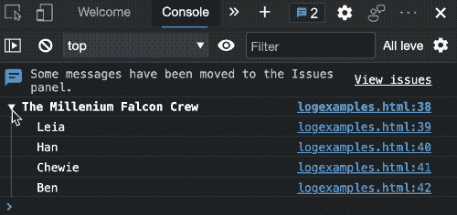

您可以嵌套组，并且可以使用`console.groupCollapsed()`在默认情况下不展开它们:

```
const extendedlabel = 'The Millenium Falcon Crew extended';
const meat = 'Humanoids';
const metal = 'Droids';
console.group(extendedlabel);
console.groupCollapsed(meat);
console.log('Leia');
console.log('Han');
console.log('Chewie');
console.log('Ben');
console.groupEnd(meat);
console.group(metal);
console.log('R2D2');
console.log('C3PO');
console.groupEnd(metal);
console.groupEnd(extendedlabel); 
```

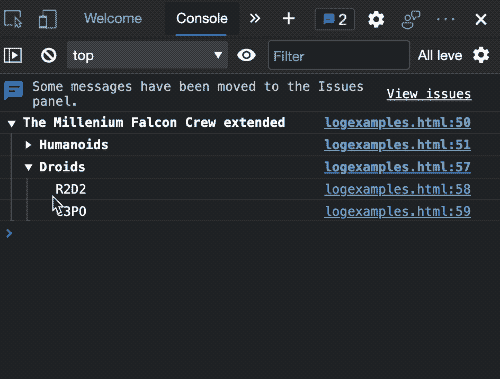

### 允许日志过滤

你也可以用`console.info()`、`console.error()`和`console.warn()`来代替`console.log()`。这允许您使用控制台侧栏或级别选择器过滤您在控制台中看到的消息。这样，您可以更容易地在来自第三方脚本和项目中其他脚本的消息中找到自己的消息。

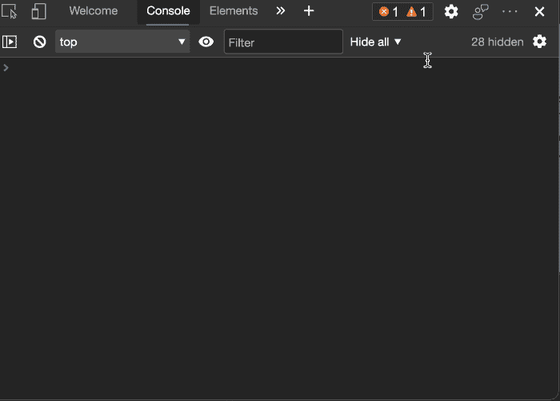

### 其他有用的控制台方法

您可能在调试过程中创建了一些变量，用来计算某个方法被调用或某个功能被执行的频率。您可以通过使用`console.count()`和`console.countReset()`方法来做同样的事情。您可以根据需要创建任意数量的标签，并通过标签进行区分:

```
console.count('Chocula'); // Chocula: 1
console.count(); // default: 1
console.count('Chocula'); // Chocula: 2
console.countReset('Chocula'); 
console.count(); // default: 2 
console.count(); // default: 3
console.count('Chocula'); // Chocula: 1 
```

您还可以使用`console.time()`方法测量脚本的某个部分需要多长时间:

```
console.time('go');
for(let i = 0; i < 200000; i+=1) {
  let x = Math.random()*2000;
}
console.timeEnd('go'); // go: 11.7861328125 ms 
```

根据您想要记录的数据，使用正确的方法也是有意义的。使用`console.dir()`不仅可以显示内容，还可以显示发送的数据类型。例如，如果您想要一个节点的 XML 表示，您可以使用`console.dirxml()`。而`console.table()`非常适合将 JSON 数据显示为可排序的表格。

## 用实时表达式替换日志记录

使用`console.log()`来监控变化很大的事物是很有诱惑力的。这不仅很慢，而且很难做到。虽然控制台自动将相似的值作为实例分组是有用的，但这仍然需要大量的移动，并且您经常会发现自己只想检查值，而不是向后滚动以查看特定的更改发生在哪里。

这就是**现场表情**的用武之地。您可以通过激活开发工具中的眼睛按钮来添加实时表达式。然后要求您输入任何有效的 JavaScript 表达式，其值将显示在控制台上方。

通过激活眼睛按钮并输入`document.activeElement`进行尝试。表达式应该将`body`显示为一个值，直到您激活或关注页面中的任何其他元素。在以下视频中，您可以在 SitePoint 网站上看到它的实际应用:

<video class="wp-video-shortcode" id="video-181552-2" width="718" height="334" preload="metadata" controls=""><source type="video/mp4" src="https://uploads.sitepoint.com/wp-content/uploads/2021/03/1615178951sitepoint-active-element.mp4?_=2">[https://uploads.sitepoint.com/wp-content/uploads/2021/03/1615178951sitepoint-active-element.mp4](https://uploads.sitepoint.com/wp-content/uploads/2021/03/1615178951sitepoint-active-element.mp4)</video>

每个表达式旁边都有一个`x`按钮，用于停止监视值。实时表达式是持久的，并且不连接到某个域或站点。这就是为什么在完成调试后删除它们以避免错误是有意义的。

实时表达式是监视脚本数据变化的极好的小助手，无需使用控制台。当您记录非常繁忙的值(如鼠标位置)时，这尤其有用。你可能会这样处理:

```
let x = 0;
let y = 0;
document.addEventListener('mousemove', e => {
  x = e.x;
  y = e.y;
  console.log({x}, {y});
}); 
```

结果是一个非常繁忙的日志，并且很容易错过重要的信息。使用实时表达式，您不必掌握快速移动的日志，这很可能也是更快的调试体验。你可以在下面的视频中看到不同之处。

<video class="wp-video-shortcode" id="video-181552-3" width="800" height="410" preload="metadata" controls=""><source type="video/mp4" src="https://uploads.sitepoint.com/wp-content/uploads/2021/03/1615179082log-vs-live-expression-smaller.mp4?_=3">[https://uploads.sitepoint.com/wp-content/uploads/2021/03/1615179082log-vs-live-expression-smaller.mp4](https://uploads.sitepoint.com/wp-content/uploads/2021/03/1615179082log-vs-live-expression-smaller.mp4)</video>

自己尝试一下:获取带日志记录的移动鼠标和不带日志记录的移动鼠标的演示代码，并尝试在浏览器中运行这两个例子。

## 使用控制台操作当前文档

开发人员工具中的控制台不仅仅是一种显示日志的方式。这是一个 [REPL](https://en.wikipedia.org/wiki/Read%E2%80%93eval%E2%80%93print_loop) ，允许您编写和执行 JavaScript，并使用自动完成功能了解当前文档的可用方法和属性。只需在开发者工具中进入控制台，输入`doc`，点击`tab`，它就会自动将其转换为`document`。如果您添加一个句号，您将看到所有可用的方法和属性。这是学习可用方法和属性的一种有趣而简单的方式，它允许您在短时间内编写大量代码。

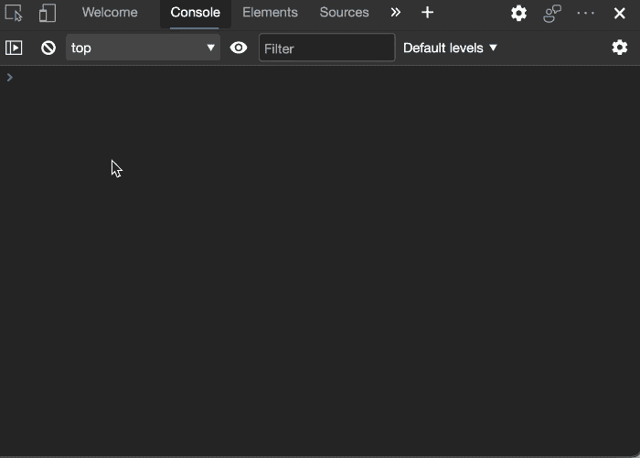

除此之外，控制台也是与当前文档交互和访问文档各部分的一种很好的方式。作为[控制台实用程序](https://docs.microsoft.com/en-gb/microsoft-edge/devtools-guide-chromium/console/utilities)，有大量方便的方法和快捷方式可供您使用。其中一些是:

*   `$_`存储最后一个命令的结果。因此，如果你键入`2+2`并按回车键，键入`$_`将得到 4。
*   `$0`到`$4`是最后检查的元素的堆栈，其中`$0`总是最新的。
*   `$()`和`$$()`是`document.querySelector()`和`document.querySelectorAll()`的简称。
*   `$x()`允许您通过 XPATH 选择 DOM 元素。
*   将你给的任何东西复制到剪贴板。
*   `clear()`清除控制台。
*   `getEventListeners(node)`列出一个节点的所有事件监听器。
*   `monitorEvents(node, events)`监控并记录节点上发生的事件。
*   每当调用一个方法时，创建一个日志项。

这些方法中的一些非常强大，并且是我们在过去可能自己编写的一系列`console.log()`语句。

以下是您可以使用这些方法的一些方式:

```
monitorEvents(window, ['resize', 'scroll']);

monitorEvents($0, 'key'); 
```

每次窗口滚动或调整大小时都会记录。第二个例子很有趣，因为它记录了当前所选元素上的任何按键操作:

```
console.table($$('a'),['href','text']) 
```

这将检索文档中的所有链接(因为`$$('a')`是`document.querySelectorAll('a')`的缩写)并将它们显示为一个可排序的表格。该数组作为`table`方法的第二个参数定义了表格的列。否则，链接的每个属性都会变成一列，很难导航。有趣的是，这个表格不仅可以排序，还可以复制和粘贴到 Excel 中。

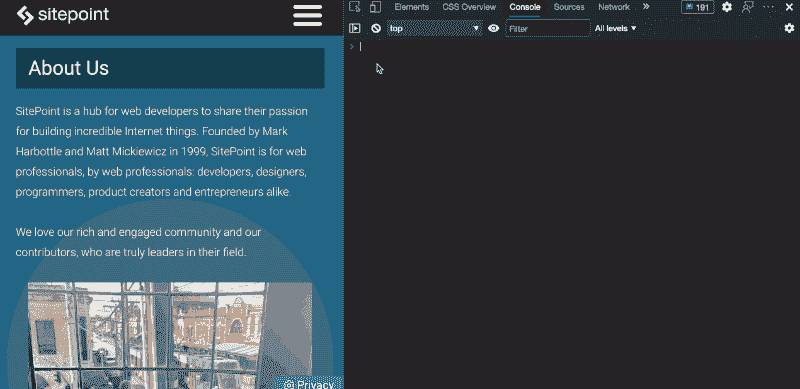

您可以使用 CSS 选择器的强大功能，而不是编写复杂的 JavaScript 来过滤这些结果。例如，如果您想要一个包含文档中所有非内嵌图像的`src`和`alt`信息的表格，您可以使用以下内容:

```
console.table($$('img:not([src^=data])'), ['src','alt']) 
```

然而，最有趣的是编写在页面上下文中运行的脚本。

例如，当您使用 Markdown 生成 HTML 时，大多数页面生成器会在标题上创建自动 id，以允许深度链接到文档的该部分。一个`# New Stuff`航向会变成`<h1 id="new-stuff">New stuff</h1>`。我需要批量创建大量指向这些深层链接的短 URL，并且不想手工创建它们。

所以我开始为控制台写一个脚本来帮我做这件事:

```
let out = '';
$$('#main [id]').filter(
    elm => {return elm.nodeName.startsWith('H')}
).forEach(elm => {
   out += `${elm.innerText}  ${document.location.href}#${elm.id}  ` 
});
copy(out); 
```

结果是一个文本块，每个标题的文本内容后跟指向它的完整 URL。

这也显示了`$$`快捷方式的一个有趣的额外特性。一个`document.querySelectorAll('#main [id]').filter()`会导致一个错误，因为返回值不是一个`Array`，而是一个`NodeList`。你需要用`[...document.querySelectoAll('#main [id]').filter()]`或`Array.from(document.querySelectoAll('#main [id]').filter())`将它转换成一个`Array`，对于从 jQuery 转向 JavaScript 的人来说，这已经是一个很长时间的烦恼了。`$$`方便的方法直接允许所有的数组方法。

通常，您有很大的权力从控制台访问和更改浏览器中呈现的页面上的任何内容。你还可以使用开发者工具的**元素**标签来获得正确的路径。激活每个节点旁边的`...`菜单，并从上下文菜单的**复制**菜单中选择您需要的内容。

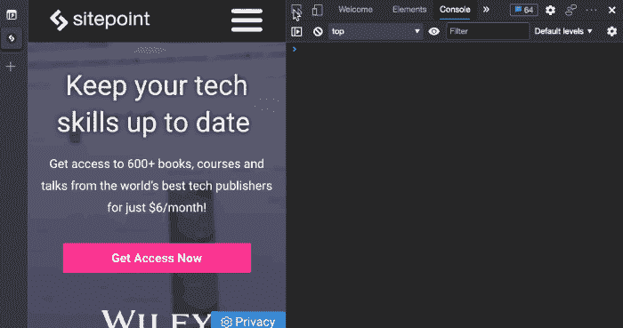

## 从控制台移动到源

一旦你找到了一些操作网站的有趣方法，你很快就会遇到控制台作为脚本环境的局限性。在控制台上编码可能有点困难，因为您是在单行环境中工作。点击`Enter`会立即执行你输入的内容，你经常会不小心这么做。不过，有个窍门。你可以用`Shift` + `Enter`代替来写多行脚本。

总的来说，控制台是一个很好的测试环境，但是编辑体验很差。幸运的是，在 **Sources** 面板中还有一个完整的编辑器。在那里，您可以检查当前页面的代码，并编写更复杂的脚本来与之交互。

## 功能提示:使用命令菜单更快地导航开发人员工具

在浏览器的开发者工具中找到某个工具可能会令人望而生畏，因为有太多可用的工具。这些工具已经有机地发展了多年，许多专业部分可能永远不适合你，而其他人依赖它们。

有一个方便的快捷方式，即[命令菜单](https://docs.microsoft.com/en-us/microsoft-edge/devtools-guide-chromium/command-menu/)，而不是通过几个菜单来找到你需要的东西。

通过按`Control` + `Shift` + `P` (Windows、Linux)或`Command` + `Shift` + `P` (macOS)可以进入命令菜单。或者选择“定制和控制开发工具”( **…** 或 **⋮** )菜单(开发工具窗口的右上角)，然后选择**运行命令**。

无论哪种方式，您都会得到一个菜单，允许您通过键盘访问所有的 devtools 功能，这通常意味着更快和更直接的方式。顾名思义，您也可以使用此菜单触发功能。

### 片段

片段是保存你写的与文档交互的脚本的好方法。它们是小脚本，可以访问当前打开的浏览器文档和控制台的便利方法。

通过点击命令菜单键盘快捷键，键入`snip`并点击`Enter`，有效地告诉开发人员工具创建一个新的代码片段。这将使您进入代码片段编辑器，它将创建一个具有通用名称的新代码片段。打开左边片段文件名的右键菜单，选择**重命名**并将其命名为**获取所有链接**，如这张 GIF 所示:

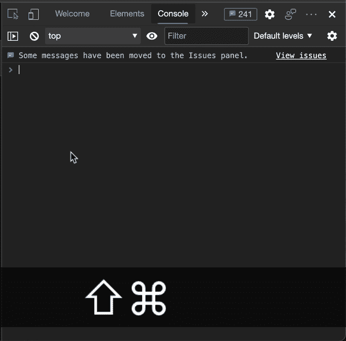

在右边，你有一个成熟的编辑器，有颜色编码、自动完成、多光标和所有你现在期待的其他东西。你可以开始写剧本了。编写一个从当前文档中获取所有链接及其文本(或等同内容)的脚本怎么样？我们还应该标记出图像周围的内容，并打印出一条错误消息，列出所有没有任何文本的内容。这些也应该有一个红色的边界，这样我们就可以看到问题。

这是剧本。它使用了很多我们之前看到的东西。将其复制并粘贴到代码片段编辑器中:

```
console.clear();
let out = '';
let problems = [];
$$('a').forEach(a => {
  let text = a.innerText.trim();
  let prefix = ''; 
  if (!text) {
    if (a.querySelector('img')){
      text = a.querySelector('img').alt;
      prefix = 'Image: ';
    }
    if (a.getAttribute('aria-label')) {
      text = a.getAttribute('aria-label');
      prefix = 'Aria Label: ';
    }        
    if (a.getAttribute('aria-labelledby')) {
      text = $('#' + a.getAttribute('aria-labelledby')).innerText;
      prefix = 'Aria Labelled By: ';
    }        
  }
  if (text) {
    text = prefix + text
  } else {
    a.style.border = '1px solid firebrick';
    problems.push(a);
  }
  out += `  ${text||'No Link text'}  ${a.href}`;
});
if (out === '') {
  console.warn('Sorry, no links found');
} else {
  copy(out);
  console.info('done harvesting links, ready to paste');
  if (problems.length > 0) {
    console.warn('There were %d issues:', problems.length);
    console.groupCollapsed('Links without text');
    problems.forEach(a => {console.dirxml(a)});
    console.groupEnd('Links without text');
  }
} 
```

粘贴新内容或编辑片段后，您会看到上方选项卡和左侧列表中的文件名有一个星号。这意味着它是一个未保存的文件。要将其存储在电脑上，在 macOS 上按`CMD` + `s`，在 Windows/Linux 上按`Ctrl` + `s`。通过激活下面的播放按钮，或者在 macOS 上点击`CMD` + `Enter`，在 Windows/Linux 上点击`Ctrl` + `Enter`，就可以在编辑器中运行这个片段。

下面的 GIF 显示了在 DevTools 89 文档中运行的脚本:

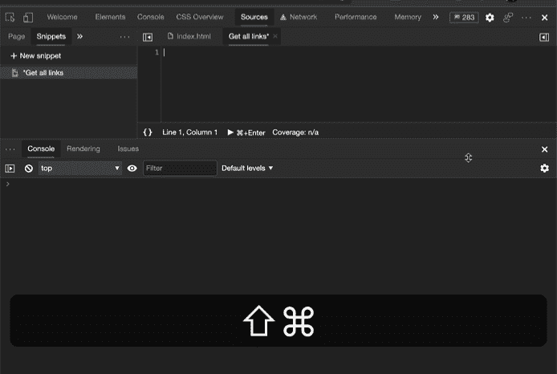

您可以根据需要创建任意数量的代码片段，并且它们不会连接到特定的 URL 或文档。你可以对任何你想要的网页内容运行它们。

片段的一个非常好的特性是你不需要进入编辑器来运行它们。一旦您将它们保存在设备上，您也可以从命令菜单访问它们。你所需要做的就是删除`>`并用一个`!`代替它。这将为您提供一个包含计算机上所有代码片段的自动完成菜单。开始输入你想运行的并点击`Enter`。

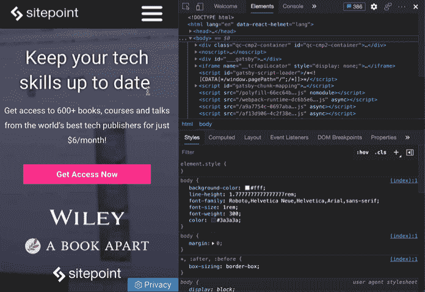

这样，您可以快速访问所有代码片段，并在当前网站上运行。所有这些都是通过键入`!`后跟代码片段的名称来完成的。

在我的例子中，这个看起来像这样:

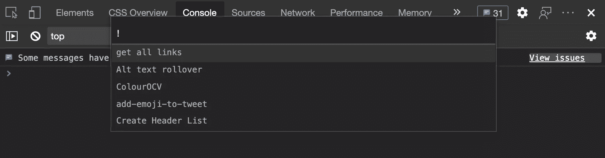

如果您想手动运行一个脚本来操作当前文档，代码片段非常有用。但是，如果您想在每次加载时自动运行脚本或更改网站中的某些内容，该怎么办呢？请继续阅读。

### 推翻

[覆盖](https://docs.microsoft.com/en-us/microsoft-edge/devtools-guide-chromium/javascript/overrides)是远程文件的本地副本。浏览器的开发工具会插入文件并用本地副本替换文件，而不是总是从服务器加载文件。例如，如果您想编辑一个复杂网站的完整样式表，而不在本地构建它或等待部署完成，这是非常有用的。这也是一个很好的方法，通过在开发过程中提供从硬盘加载缓慢的文件来发现性能问题。

您可以通过在本地硬盘上设置一个文件夹来开始覆盖。在我的例子中，我在下载文件夹中创建了一个名为`local-overrides`的文件夹。

举个例子，如果你现在想在我的博客中注入一些 JavaScript，你需要在开发者工具中导航到**源**标签，并在底部菜单中选择**覆盖**标签。

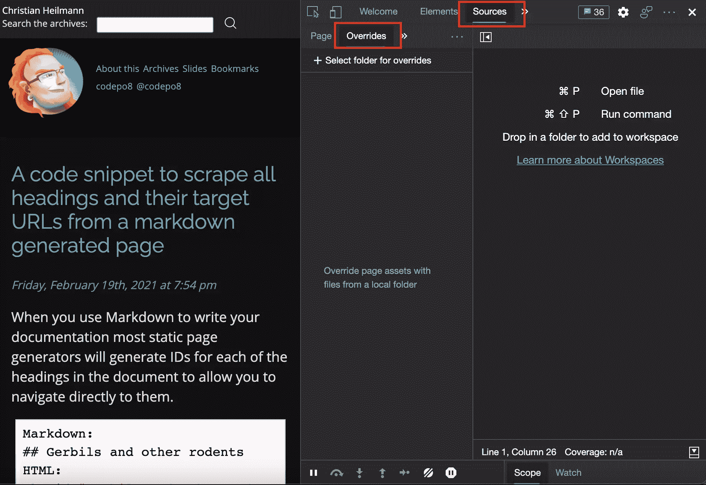

下面，你可以找到一个 **+选择文件夹的 overides** 按钮。激活此选项将提示您在硬盘上选择一个文件夹来存储文件。

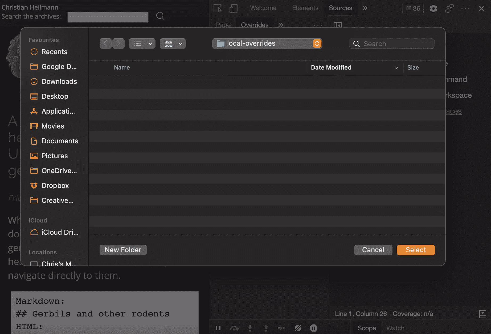

由于开发人员工具需要在那里存储信息，您需要通过激活 **Accept** 按钮来允许这样做。

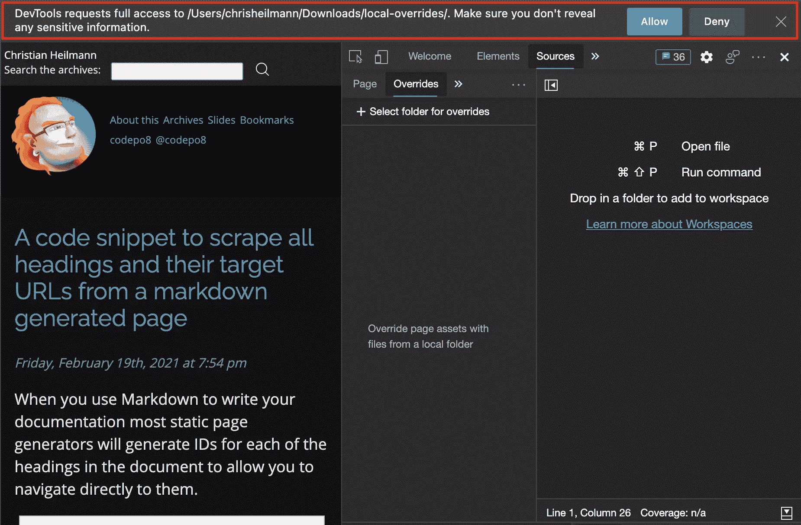

一旦完成，下面会出现`local overrides`文件夹。上面是切换覆盖的复选框。这很方便，因为这意味着您不需要一直删除文件夹或脚本。您可以取消选中此选项，浏览器将再次从 Web 加载资源。选项旁边带有圆形图标的按钮会删除所有覆盖。

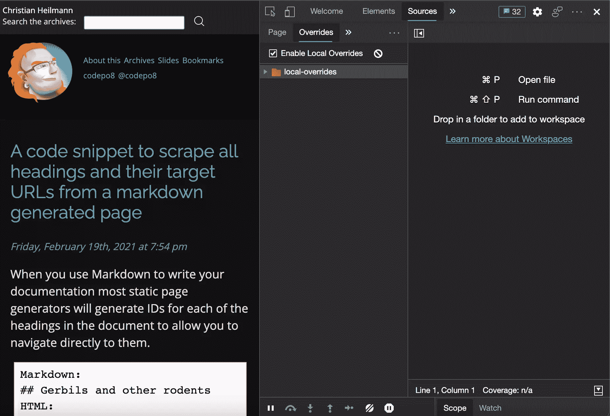

接下来，您可以选择要覆盖的文件。切换到**页面**选项卡，并向下进入`www.google-analytics.com`条目。展开该部分，您会发现一个`analytics.js`文件。单击它以在编辑器中打开它。

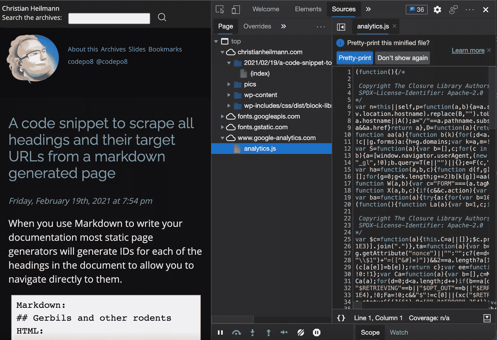

这也显示了编辑器的一个有趣的特性。它会自动检测文件何时被缩小，并提供漂亮的打印，使其更容易阅读。您可以通过激活右下角的 **{}** 按钮对任何文件执行此操作。

现在，让我们选择所有的代码并用一个简单的代码替换它:

```
console.info('I am in!') 
```

一旦你用`CMD` + `s` (macOS)或者`Ctrl` + `s` (Windows，Linux)保存了文件，你会在文件名旁边看到一个紫色的点。这将向您显示哪些文件不再从源网站加载，而是来自您的硬盘。

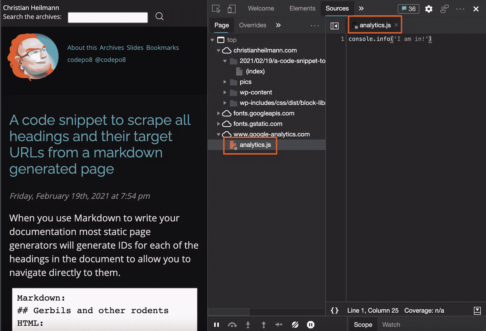

如果你现在在[christianheilmann.com](https://christianheilmann.com)上导航到任何地方，它将不再加载分析文件，而是运行你硬盘上的文件。控制台显示“我已进入”，我从未编写过该代码。

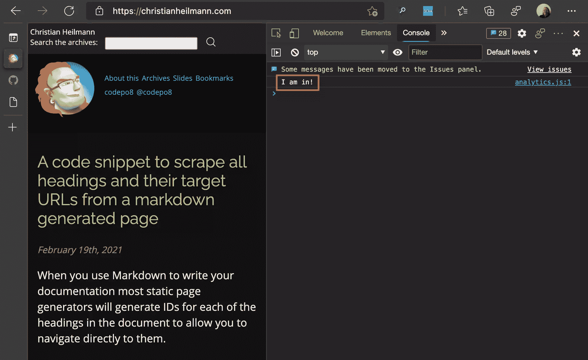

如果你现在查看你的`local-overrides`文件夹，你会发现一个`www.google-analytics.com`文件夹，里面有`analytics.js`文件。您可以在开发人员工具中编辑该文件，或者使用您选择的编辑器直接在该文件夹中编辑。对文件的任何更改都将反映在其他环境中。

## 将开发和调试任务与工作区同步

说到同步，[工作区](https://docs.microsoft.com/en-us/microsoft-edge/devtools-guide-chromium/workspaces/)是另一个似乎没有得到足够使用的功能。当我们回想起本文开头的常见开发方法时，我们似乎是在编辑器中开发，在浏览器中调试。这是有道理的，但是更大的问题是我们如何把我们改变的东西放回我们的源代码？通常我们只是调整一些设置，然后在编辑器中重复修改。有更好的方法。

你可能还不知道的第一件事是有一个**变更**工具。比方说，你在做一个小的[待办事项清单演示](https://github.com/sitepoint-editors/beyond-console-log/blob/main/demos/bare-bones-todo/index.html)，你想调整一下外观和感觉。你通常在**元素**工具中这样做，如下图所示:


将这种改变恢复到代码中的常见方法是从 CSS 中复制并粘贴颜色代码，然后在编辑器中将它复制回源代码中。但是更多的变化呢？开发者工具还会跟踪你所做的修改，如果你进入**修改**标签，你会得到一个列表，列出你修改过的所有文件以及其中的修改内容。最简单的方法是再次使用命令菜单并输入`changes`，这将给出“显示更改”选项。

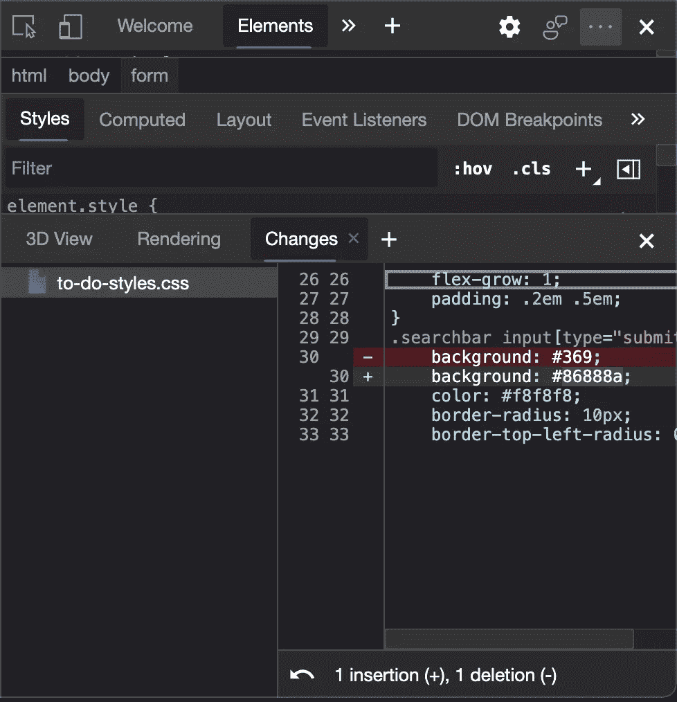

这使得跟踪您的更改变得更加容易，但是将更改复制回您的源代码仍然感觉怪怪的。

您可以通过将项目文件夹添加到工作空间来使开发人员工具与您的编辑器协同工作。要做到这一点，请转到 **Sources** 工具，将您的项目文件夹拖放到上面。

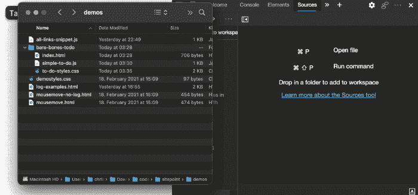

您必须再次授予开发人员工具访问该文件夹的权限，就像我们在前面的覆盖示例中所做的那样。完成后，您在开发人员工具中对文件所做的任何更改都将被同步。你可以在下面的 GIF 中看到这一点。左边是我的 VS 代码编辑器，文件是打开的，右边是浏览器。现在，在元素工具中更改颜色不仅会在浏览器中实时更新它，还会在我的编辑器中更改代码。您所做的任何调整都不需要额外的复制和粘贴步骤。

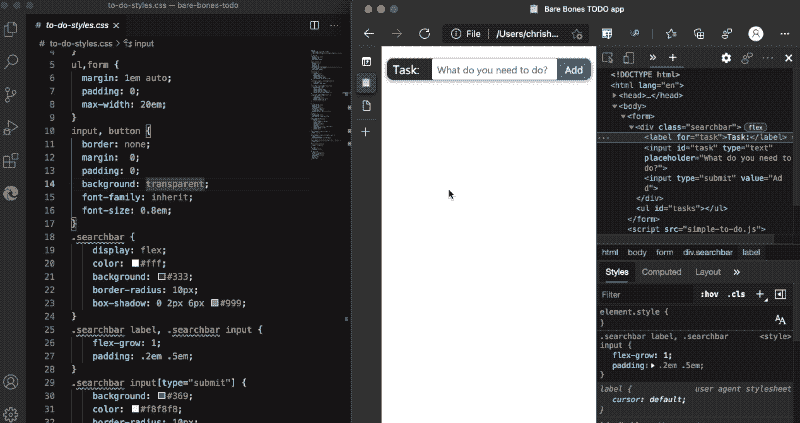

## 将开发工具与编辑器合并:VS 代码扩展的 Devtools

将优秀编辑器的功能和浏览器开发工具的检查功能结合在一起似乎是个不错的主意。这就是为什么我们为 Visual Studio 代码创建了一个扩展来做这件事。如果这是您选择的编辑器，您可以安装[Microsoft Edge Tools for VS Code extension](https://aka.ms/devtools-for-vscode)并在您的编辑器中获得开发者工具，包括一个功能齐全的浏览器。你可以在下面的 GIF 中看到它的样子。

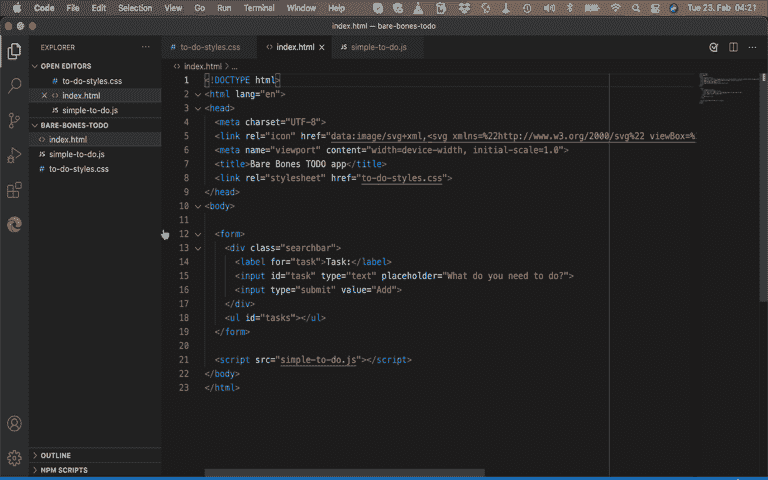

## 下一步是什么？

我希望，在阅读这篇文章时，你已经得到了一些关于如何使用你的浏览器的开发者工具特性的想法，而不仅仅是在你的脚本中添加一个`console.log()`。作为开发人员，我的下一步是完全远离控制台，习惯使用[断点调试](https://docs.microsoft.com/en-gb/microsoft-edge/devtools-guide-chromium/javascript/breakpoints)。好处是您的代码停止，您可以检查过程中发生的变化，而不是追溯执行后发生的事情。这是解决同一个问题的不同方法，不那么容易，但是非常值得你花时间。

## 分享这篇文章