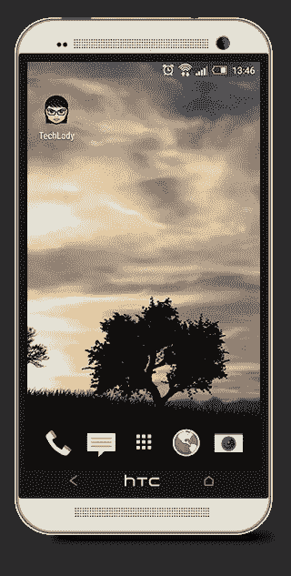
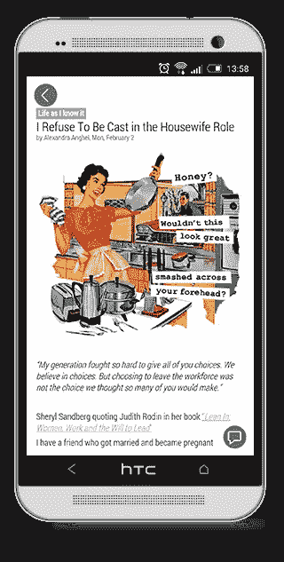
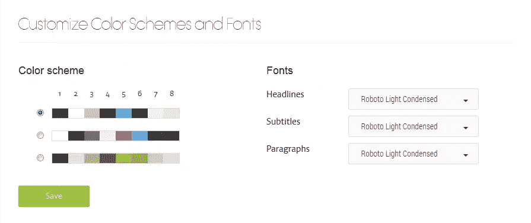
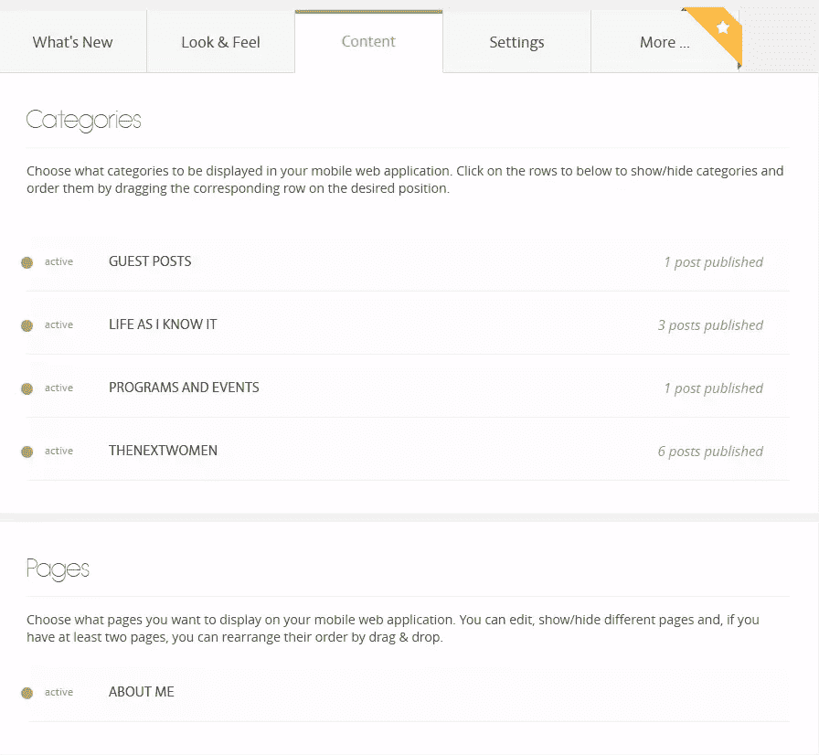
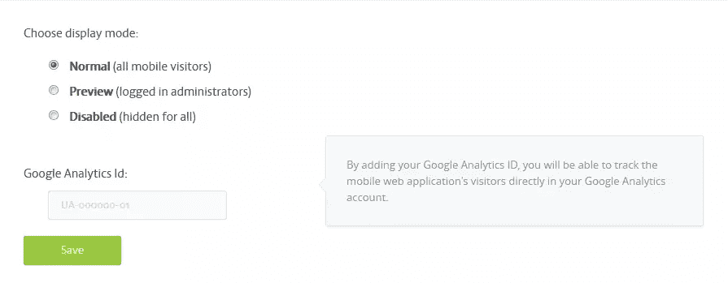

# 除了响应能力，WordPress Mobile Pack 插件

> 原文：<https://www.sitepoint.com/beyond-responsiveness-wordpress-mobile-pack-plugin/>

我们喜欢移动应用程序，因为它们有丰富的用户界面和体验，但是关于类似的体验在网络上是否可能的讨论是永无止境的。由于应用程序创建和参与的复杂阶段，网络出版商很难吸引他们的移动用户，这些阶段通常包括:

1.  创建应用程序
2.  发布到 App Store
3.  等待它被批准，最后…
4.  将其推荐给您的用户进行安装

2011 年 6 月，英国《金融时报》推出了基于 HTML5 浏览器的应用，开创了一个先例，向出版业证明了在应用商店之外取得成功的可能性。紧随其后的是《纽约时报》、亚马逊(Kindle Cloud Reader)、大西洋电讯(Atlantic Wire)等。今天，我们看到越来越多的开发围绕 HTML5 展开，包括由 Mozilla 开发的 Firefox OS，由 Telefonica 提供支持。

这表明，移动网络有潜力超越响应能力，发展成为一个新的令人兴奋的环境，一个网站可以从只有应用程序才能访问的环境中受益。用户交互比页面浏览量更重要，最终，所有的应用都被链接成一个应用网络。

## WordPress 移动包插件

WordPress 为世界上 23%的网站提供支持，它们的存在对我们所有人都产生了巨大的影响。2013 年，WordPress 的创始人之一马特·莫楞威格要求开发者将 WordPress 作为一个应用平台来看待和使用。社区开始意识到 WordPress 可以用于支持在 Web 浏览器环境中运行的数据库支持的应用程序。

任何开发人员都会告诉你，编写一个单页 web 应用程序是有挑战的。插件[WordPress Mobile Pack by app articles](https://wordpress.org/plugins/wordpress-mobile-pack/)帮助博客作者、出版商和其他内容创作者将他们现有的内容打包到单页移动网络应用程序中，这些应用程序可以在 iPhone、Android 和 Firefox OS 上跨平台运行。

你可以从 WordPress.org 的[插件部分或者你的 WordPress 安装中下载插件。然后激活插件。](https://wordpress.org/plugins/wordpress-mobile-pack/)

*WordPress Mobile Pack 2.0 的特点:*
选择主题和定制颜色&字体
添加图标和标志
改变封面艺术
定制内容

下次您从支持的设备(iPhone、Android、Windows 8 或 Firefox OS)访问您的网站时，您将看到移动 web 应用程序已加载。

读者可以将移动网络应用添加到他们的主屏幕上，并以全屏模式运行，创造一种模仿本地应用的阅读体验。

## 定制颜色、字体和封面

一组预定义的配色方案和字体可用于自定义移动 web 应用程序。该插件带有 6 个预定义的抽象封面，随机显示在加载屏幕上。如果你想使用你自己的封面图片，你可以从管理面板添加一个，以及一个 logo & app 图标。

***提示**:如果你很难创作出好的封面，尤其是如果你的目标是支持 Android，那么保持它的简约和抽象。为了寻找灵感，Designshock 提供了一些很棒的材料设计，比如封面。*

## 内容管理

从内容区域，您可以选择要在移动 web 应用程序中显示的类别。这些页面可以专门针对移动版本进行编辑。这在添加特定于移动 web 应用的点击呼叫按钮时很方便，同时保持桌面内容不变。

## 设置选项卡

“设置”选项卡允许控制谁可以查看移动 web 应用程序。该插件包括一个“预览”选项，只允许经过认证的管理员访问，这使得在读者不知道的情况下编辑移动网络应用成为可能。

从设置区，你可以添加你的谷歌分析 ID，并在获得一个 API 密钥后连接到高级平台。付费计划提供了更多的主题、平板电脑支持、AdSense 集成以及创建自定义配色方案的选项。

## 限制

有一些限制可能会影响您使用该插件的决定:

*   *有限的定制选项*——因为它使用单页应用程序，没有先进的技术知识，主题定制是不可能的。
*   *不与其他 WordPress 插件*集成(例如 WooCommerce 或 Contact Form)
*   *不包括 iframes 支持*(视频网络除外)_

## 搜索引擎优化和谷歌

单页应用程序在搜索引擎优化方面一直表现不佳，但随着谷歌最近对其搜索引擎做出的改变，这不再是一个问题。自 2014 年 5 月以来，谷歌执行能够索引单页应用程序的 Javascript 代码，例如由 WordPress Mobile Pack 生成的代码。

从今年 4 月 21 日开始，谷歌将扩大使用手机友好度作为排名信号。这一变化将对谷歌的移动搜索结果产生重大影响，WordPress Mobile Pack 应用程序符合谷歌的移动友好测试。此外，谷歌刚刚支付了 2500 万美元的独家版权。虽然该公司还没有宣布针对. app 的具体计划。

## 结论

很有可能你很快就能在`http://your-blog.app`拥有自己的单页移动网络应用。这是你热切期待的吗？或者你害怕一波看起来像普通的应用程序可能会向我们走来？

## 分享这篇文章