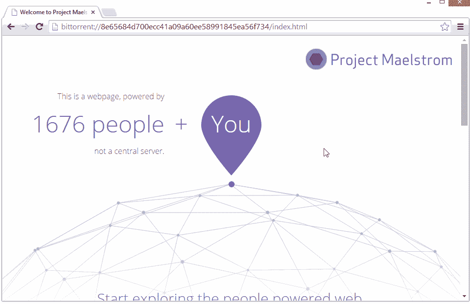
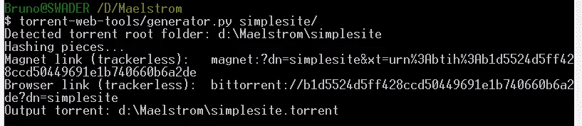
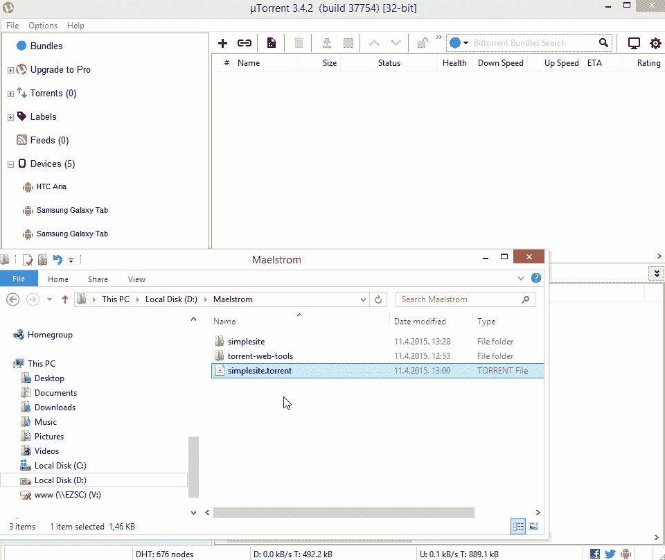

# Bittorrent 的漩涡:使用 torrent 托管网站

> 原文：<https://www.sitepoint.com/bittorrents-maelstrom-using-torrents-host-websites/>

2014 年 12 月， [Bittorrent 发布了 Project Maelstrom](http://blog.bittorrent.com/2014/12/10/project-maelstrom-the-internet-we-build-next/)——一种通过 [torrents](http://en.wikipedia.org/wiki/Torrent_file) 为互联网供电的方式。一个真正去中心化的互联网，你浏览的网站由互联网的其他用户托管，而不是一个中央服务器。

其他门户网站已经重新发布了他们最近的公告——一个面向 Windows 用户的[公开测试版](http://blog.bittorrent.com/2015/04/10/project-maelstrom-enters-beta/),所以我就不赘述了。相反，我想把重点放在技术方面——实际使用浏览器，了解它的工作原理，并为它开发。请注意，Mac 测试版即将推出。

## 它是如何工作的？

当使用 torrents 共享文件时，你会从其他各种已经拥有这些文件碎片的机器上获得文件碎片(我们称这些机器为 *seeders* )。torrent 客户端(如洪水、传输或 uTorrent 等软件)知道在一个特殊的`.torrent`文件的帮助下在哪里找到这些片段，并通过比较哈希签名从所有这些不同的位置获取数据。更重要的是，它将来自一个来源的各种片段与来自另一个来源的对应片段进行比较，因此您知道您总能得到您想要的文件。此外，许多种子包括一个哈希字符串，通过它你可以手动验证它们的完整性，如果你愿意的话。

Maelstrom 只不过是一个高度定制化的 Chromium(因此它也适用于普通网站)，你可以通过与 *torrenting* 完全相同的方式浏览 Maelstrom 特有的互联网。要托管一个网站，你只需要一个`.torrent`文件来存放你的内容，一旦人们点击或输入它的 Magnet 链接或 Bittorrent 链接(稍后会有更多介绍)，这些内容就会从每个已经拥有它们的人那里获取。很自然，这意味着你的内容(网页)越年轻，获取就越慢——因为很少有人拥有它。它传播得越广，就有越多的人可以被用作播种者，新的访问者就会下载得越快，从而也成为新的播种者。

简而言之，Maelstrom 绕过托管公司和中央服务器，从已经下载的用户那里读取网站内容。它是*分布式的、去中心化的、免费托管的*——但是仅仅针对静态网站，原因很明显。

## 安装

要安装 Maelstrom，你(目前)需要在 Windows 平台上(一旦 Mac 版本出来，这篇文章将相应更新)并[下载](http://project-maelstrom.bittorrent.com/)该应用程序。

注意，如果你安装了一个运行版本的 Chromium，安装很可能会失败，而是在执行时调用已安装的 Chromium 版本。我希望 Bittorrent 会尽快修复他们的客户端安装，但同时，你需要在安装 Maelstrom 之前删除 Chromium。还要注意的是，Maelstrom 是 Chromium 的一个严重过时的版本(在撰写本文时是 37 版本)，所以不要认为你可以用它来取代你的主浏览器——它充其量还是实验性的技术。

一旦打开，浏览器会向你展示一个主页，这个主页本身就是一个 torrent 托管的页面，并且包含其他类似网站的链接(检查这些链接会发现它们是以`magnet`协议开始的)。

## 磁铁链接

在过去，当你想要*种子*什么的时候，你需要下载一个`.torrent`文件，在客户端打开它，在你的客户端解析其中的数据之后，获取过程就开始了。如今，有可能使用磁铁链接。磁铁链接包含了一个`.torrent`文件通常会包含的所有元数据，避免了像 PirateBay 这样的集中跟踪器(种子网站)来托管它们的需要。这有助于这些追踪器避免法律麻烦，因为它们不再实际托管任何东西，并且有助于分发工作——你所需要做的就是与某人共享一个磁铁链接，他们可以立即与共享网络挂钩，而无需下载任何额外的文件。

你可以在这里阅读更多关于磁铁链接[。](http://lifehacker.com/5875899/what-are-magnet-links-and-how-do-i-use-them-to-download-torrents)

Maelstrom 项目使用磁铁链接从一个站点导航到另一个站点。当你点击浏览器问候页面的磁贴时，你实际上是点击了一个磁铁链接，它读取了亚马逊 S3 主机上一个`.torrent`文件的数据。

试着安装浏览器如果你在 Windows 上，点击一两个链接，看看它的效果。下面是一张 gif 图片，展示了它是如何为我工作的:

你可以看到它在第一次加载时有点慢，但所有后续的加载都会更快，因为本质上，它只是你现在机器上的一个静态站点。

## 空间问题

在常规的种子处理过程中，你将文件下载到一个文件夹中，然后从那里下载文件，直到它们被删除，你就不再是一个种子了。当然，这个文件夹占用空间，并且可以增长到巨大的尺寸，这就是为什么很少有人是长期播种者。

当 Maelstrom 下载网站时，它有自己的内部缓存，它将数据保存在其中，并从中为其他人播种。这个缓存的大小可以在设置中修改，甚至可以清除。自然地，内容越多，速度越慢，所以人们不能期望最终把整个网络都放进去——存储量是有限的。这也意味着:

1.  拥有图像、电影和音乐等流媒体内容的大型网站将比其他网站更快地占据这一空间。
2.  最终，一些网页会从网格中消失，因为它们失去了受欢迎程度，从而失去了种子。他们的缓存将被清除，较少使用的网站将被删除，他们将不再被请求。这个洪流驱动的“互联网”在内容上显然将是高度动态和易变的。

## 发展中的

要开发在 Maelstrom 中使用的静态站点，你可以遵循这些指令。它们非常具体，但这就是测试版的作用——消除缺陷，改进流程，使其更加用户友好。

可惜需要 Python 2.7，不过可以轻松安装。然后，您像往常一样构建一个静态网站，包含所有 CSS 和 JS 的附加功能。对于我们的例子，我们将使用[这个简单的两页“站点”](https://github.com/Swader/maelstromsample)。

如果你想跟着做，将 [torrent web 工具](https://github.com/bittorrent/torrent-web-tools)和[简单站点](https://github.com/Swader/maelstromsample)克隆到各自的文件夹中。该网站只是默认的 HTML 5 样板文件，HTML 和 CSS 略有编辑，以提供不同的配色方案和链接。

一旦完成，我们在包含站点的整个文件夹上运行`generator.py`脚本。它从那里接管，不到一秒钟，`.torrent`文件就在运行脚本的文件夹中准备好了。

请注意，您可以在生成器中使用的其他参数在 Github 自述文件中有解释。

现在剩下的就是把这一页带给人们。为此，我们需要将它添加到 [uTorrent](http://www.utorrent.com/downloads/win) 或 [BitTorrent](http://www.bittorrent.com) 中，这是目前仅有的两个官方支持的传播 Maelstrom 网站的客户端。

请注意，您需要将 torrent 指向文件的位置，而不是您通常的下载位置，以便它自动进入种子模式。

一旦有足够多的人下载，这个网站就可以访问了。为了加快这个过程，你可以在播种的时候给你的朋友发送 torrent 文件或它的磁铁 URI，并告诉他们在将它添加到 torrent 客户端时选择“跳过哈希检查”,这样他们的客户端就不会在下载之前等待 4 个或更多的同行来验证网站的内容哈希。这在已经流行的种子中是不安全的，但是当你刚刚开始传播你的种子时是必要的。请注意，只有当你希望你的朋友帮助你传播你的网站时，这才是必要的——通过 Maelstrom 访问实际网站的访问者不必向他们的客户端添加任何种子或选择任何选项。他们可以像往常一样访问它。

我们可以尝试通过 Maelstrom 访问网站，使用`generator.py`为我们输出的链接:`bittorrent://b1d5524d5ff428ccd50449691e1b740660b6a2de?dn=simplesite`。医生说磁铁链接`magnet:?dn=simplesite&xt=urn%3Abtih%3Ab1d5524d5ff428ccd50449691e1b740660b6a2de`应该也能起作用，但对我来说它并没有立即起作用——我必须等到至少有 4 个人通过 uTorrent 成为网站的种子。

再次注意，Maelstrom 的工作方式就像普通客户端一样，它也验证散列。因此，它需要不止一个或两个播种机。为了能够在你的浏览器中访问这个网站，你必须像上面提到的那样传播它——请一两个安装了 uTorrent 的朋友帮助你播种。几个人开始播种后，网站应该可以公开访问了。

## 结论

这是一种时尚吗？也许吧，但仅限于比特币。这完全取决于人们的采用率。

需要注意的一点是，Maelstrom 对于网络中立性非常有用。政府的肥猫们已经在为最近的网络中立胜利寻找新的诉求，但这种方法至少对静态网站来说会减轻这种担忧——如果我们在彼此之间共享网站，他们可以随心所欲地攻击服务器——我们不在那里。

你试过大漩涡吗？你觉得这个项目怎么样？让我们知道！

## 分享这篇文章