# 设计师和开发商的 2019 年黑色星期五

> 原文：<https://www.sitepoint.com/black-friday-2019-designers-developers/>

*本文是与 [Mekanism](http://mekanism.co/) 合作创作的。感谢您对使 SitePoint 成为可能的合作伙伴的支持。*

黑色星期五是一年中获得各种新事物的最佳机会之一，包括数字网络工具和服务。一些公司提供巨大的折扣来大幅增加他们的销售额，而其他公司已经为他们的客户和合作伙伴提供了很好的优惠。

在这篇文章中，你会发现免费和优质的网络工具和服务，以及一些最好的[黑色星期五 WordPress 交易](https://wpastra.com/blackfriday-cybermonday-wordpress-deals/)。我们包括网站建设者，用户界面工具包，管理员主题，WordPress 主题，有效的标志和品牌标识创建者，等等。在这 38 个优秀解决方案的展示中，每个人都有一个网络工具或服务。

我们开始吧。

## 1.[免费和高级 Bootstrap 4 管理主题和 UI 套件](https://dashboardpack.com/)

[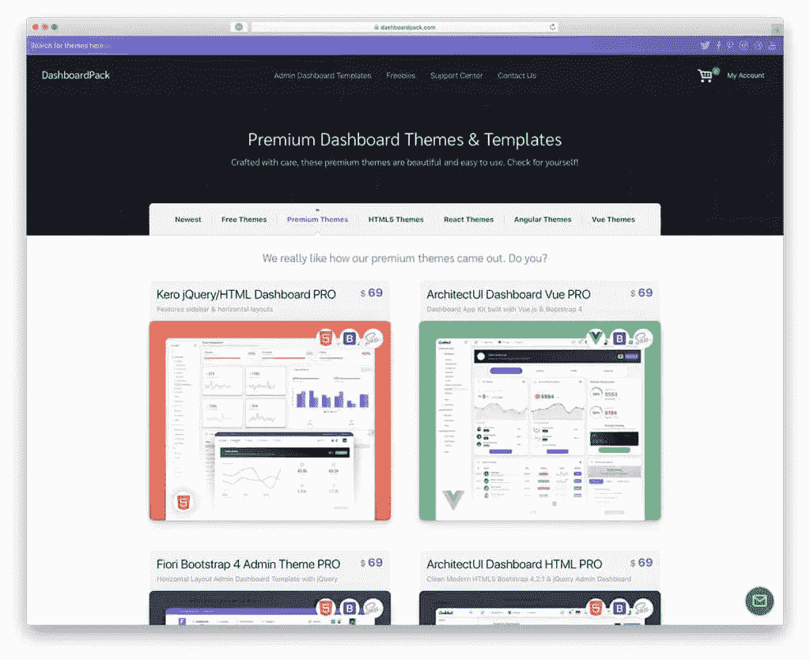](https://dashboardpack.com/)

DashboardPack 是免费和高级 Bootstrap 4 管理主题和 UI 工具包的主要供应商之一，被成千上万的人使用，取得了巨大的成功。在这里，你会发现免费和优质的主题，非常注重细节——html 5 主题，React 主题，Angular 主题和 Vue 主题。

在 DashboardPack 网站上有一个免费赠品的专区。这里有四个华丽的仪表板主题(HTML、Angular、Vue 和 React ),你可以看到现场演示并免费使用。从 11 月 29 日到 12 月 3 日，所有模板和所有许可证类型(个人版、开发者版和终身版)均可享受 50%的折扣。使用优惠券代码: **MADBF50** 。

## 2.[总主题](https://total.wpexplorer.com/)

[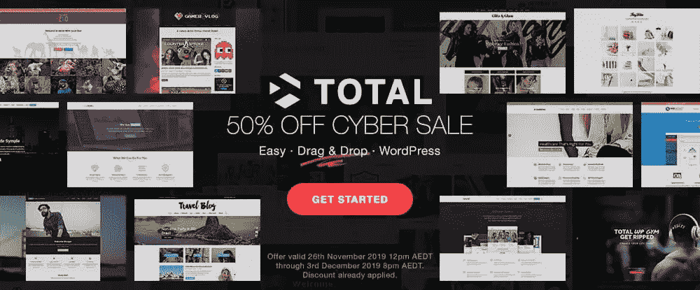](https://total.wpexplorer.com/)

总主题是一个超级强大和完整的 WordPress 主题，灵活，易于使用和定制。它包括出色的设计和其他很酷的东西。

拥有超过 38k 的快乐用户，Total Theme 是一个受欢迎的 WordPress 主题。它装载了超过 80 个构建模块，超过 40 个预先制作的演示，可以通过单击安装，500 个样式选项，以及友好和闪电般的界面。

预先制作的演示涵盖了商业、一页、作品集、个人、创意、商店、博客、摄影等领域。总主题将帮助您实现几乎任何目标-从零开始使用包括可视化页面生成器，或通过编辑演示设计。

限时主题优惠 50%的有效期为 2019 年 11 月 26 日(AEDT 中午 12 点)至 2019 年 12 月 3 日(AEDT 晚上 8 点)。折扣已经应用。

## 3.[定制品牌](https://www.tailorbrands.com/)

想象一下，如果你梦想中的商业创意有一个名字，一张脸，和品牌文件，使它成为正式的。使用定制品牌在线标志制作和设计工具，您可以立即将梦想变成活生生的公司！在 30 秒内设计一个徽标，根据您的喜好进行定制，并将其放在任何东西上—从专业名片到在线演示。

Tailor Brand 的使命是成为最大的人工智能驱动的品牌代理机构。这是一个巨大的目标，但它是可以实现的，他们已经在这个阶梯上占据了首位。

用裁缝品牌设计一个标志是超级简单的，你不需要任何特殊的技能或以前的经验来获得一个顶级的标志设计。你写下你喜欢的标志名称，添加标语(可选步骤)，指明你的标志是针对哪个行业的，选择你想要基于图标、名称还是首字母的标志，从左和右进行选择(你会得到设计作为例子)，强大的人工智能将为你提供大量的标志设计供选择。超级简单明了。

继续用定制品牌设计一个标志。

## 4.[自由职业税](https://www.hellobonsai.com/freelance-taxes)

[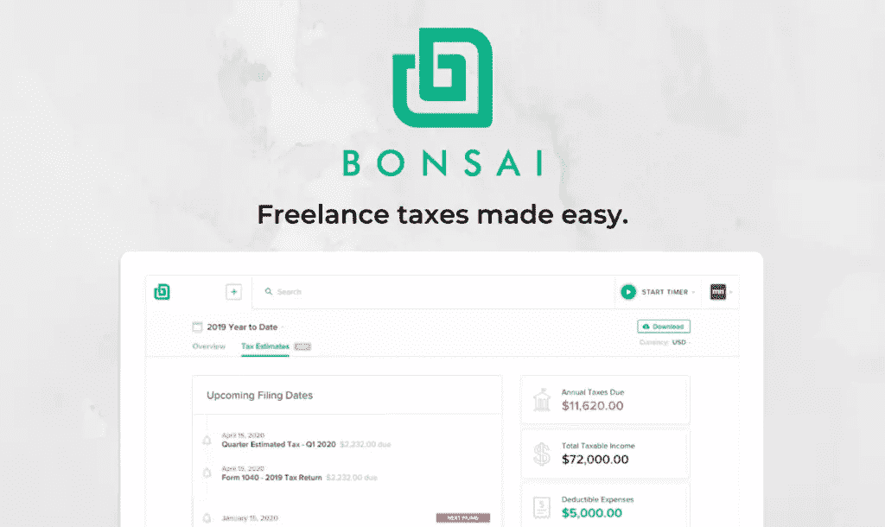](https://www.hellobonsai.com/freelance-taxes)

Bonsai 是世界上最优秀的创意自由职业者使用的产品集成套件。

随着产品阵容中自由职业者税收的最新增加，Bonsai 比以往任何时候都更有准备来帮助您的自由职业者业务所需的一切。

为纳税季做好准备，只需花几秒钟就能大致了解你每年或每季度所欠的税款。

Bonsai 的自由职业者税务软件会查看您的费用，自动对其进行分类，并突出显示哪些费用可以扣除以及扣除的比例。

所有盆景产品都与彼此深度融合，以确保它能适合每一种工作风格。你应该知道的其他功能包括合同、提案、时间跟踪和发票。

今天就开始免费试用 Bonsai 吧，提前为你的自由职业税做好准备！

## 5.[编码员](https://www.codester.com/)

[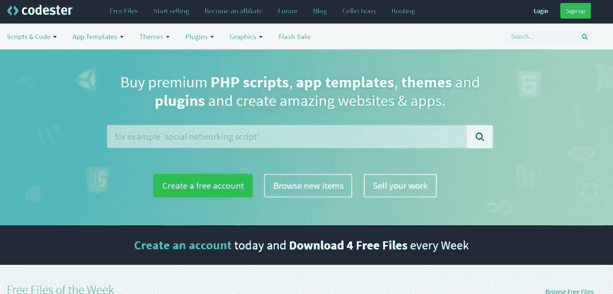](https://www.codester.com/)

Codester 是一个巨大的市场，网页设计者和开发者可以在这里找到数以千计的优质脚本、代码、应用程序模板、主题(各种类型)、插件、图形等等。经常查看打折区，那里有打折商品出售。

## 6.[手机应用测试](https://testingbot.com/)

[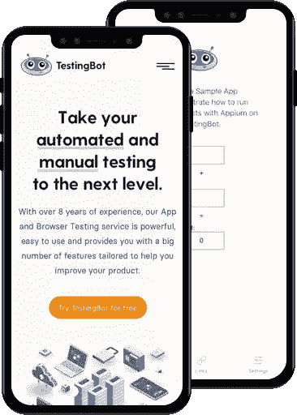](https://testingbot.com/)

这款应用和浏览器测试服务拥有超过八年的经验，功能强大、易于使用，并为您提供大量量身定制的功能，帮助您改进产品。使用 TestingBot 进行自动化 web 和应用程序测试、实时 web 和应用程序测试、可视化测试等等。

开始为期 14 天的免费试用，不需要信用卡。

## 7. [FunctionFox](https://www.functionfox.com/demo)

[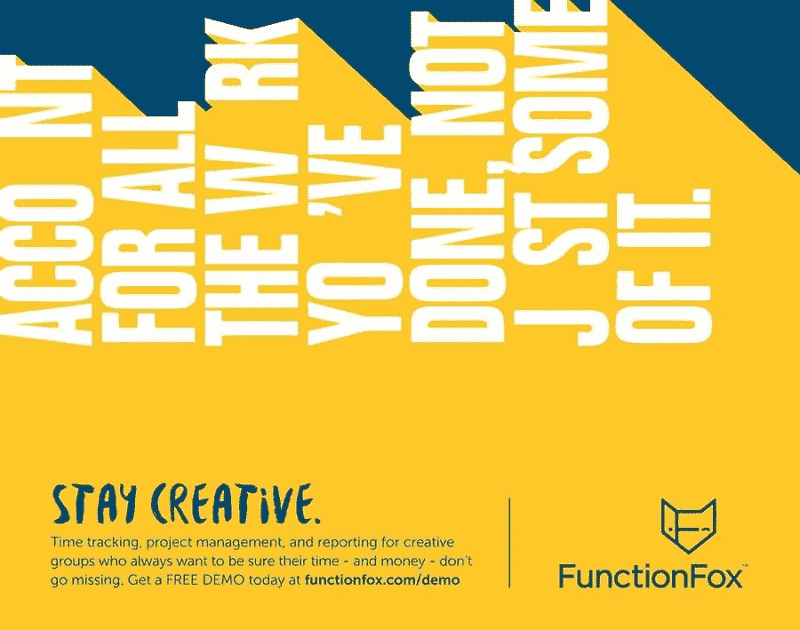](https://www.functionfox.com/demo)

创意专业人士的首选， [FunctionFox](https://www.functionfox.com/mekanism) 为您提供简单而强大的时间跟踪和项目管理工具，使您能够通过项目日程安排、基于任务的任务分配、内部沟通工具和全面的报告来跟踪多个项目、预测工作量、减少沟通障碍并在截止日期前完成任务。不要错过最后期限和截止日期！

今天在 [FunctionFox](https://www.functionfox.com/mekanism) 尝试免费演示。

## 8. [Taskade:简单的任务，笔记，聊天](https://www.taskade.com/)

[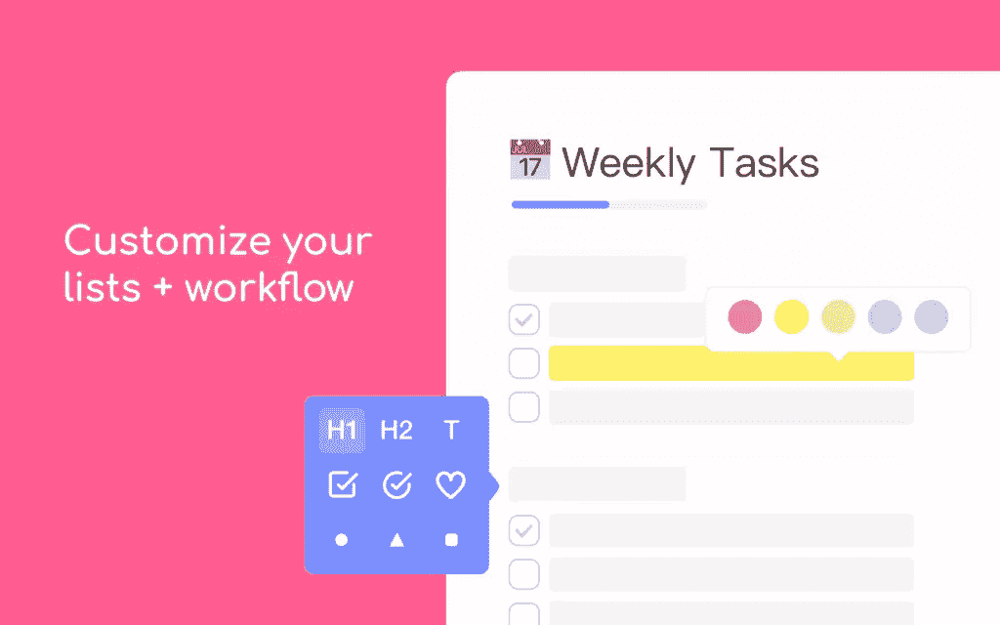](https://www.taskade.com/)

Taskade 是一个统一的工作空间，您可以在这里聊天、写作，并与您的团队一起完成工作。实时编辑项目。聊天和视频会议在同一个页面。跨多个团队和工作区跟踪任务。计划、管理和可视化项目。还有更多。

使用 Taskade，您可以构建自己的工作空间模板。你可以从一张空白页开始，也可以在周计划、会议议程、项目板、思维导图等等中选择(你会发现很多模板可以开始)。你需要的一切都可以完全配置完美契合。

## 9.[实时聊天软件](https://www.appypie.com/live-chat)

AppyPie 是一款专业且超级易用的实时聊天解决方案，可帮助您接触客户，并通过您的网站和手机使用平台实时聊天软件为他们提供实时响应和支持。

这是一个快速提高转化率、增加销售额(你可以回答想购买的人的问题)和提高顾客满意度的好方法。(无论他们有什么问题，他们都知道你会快速提供帮助。)

请求邀请以测试平台。

## 10.[移动网站建设者](https://mobirise.com/extensions/kit/)

Mobirise 可以说是 2019 年最好的网站建设者，你可以用它在几分钟内创建快速、响应迅速、谷歌友好的网站，零编码，只需拖放。

这个出色的构建器装载了超过 2000 个非常棒的网站模板，包括电子商务和购物车、滑块、图库、表单、弹出窗口、图标等等。

在此期间有 94%的折扣，所以接受吧。

## 11.[简讯模板](https://www.mailmunch.com/newsletter-templates/)

MailMunch 是一个强大的拖放式构建器，它装载了大量漂亮的、预先设计好的新闻稿模板，具有模板块和媒体库等高级功能，可以使工作流程更加流畅，等等。使用 MailMunch 不需要编码。

开始用 MailMunch 提高你的转化率。

## 12. [Astra 主题:元素或模板](https://wpastra.com/elementor-templates-free-downloads/)

[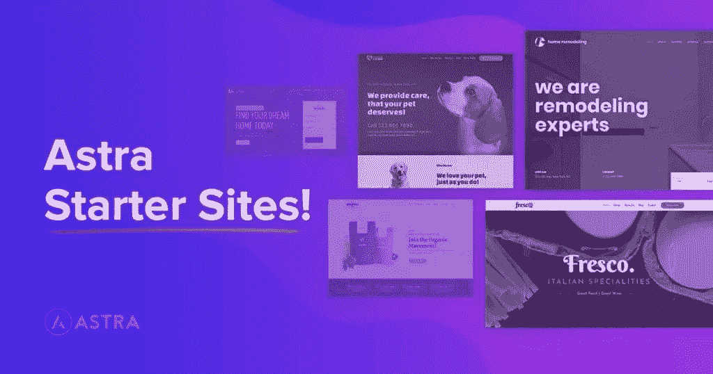](https://wpastra.com/elementor-templates-free-downloads/)

Elementor 是市场上最强大的网站构建工具，被数百万人使用，取得了巨大的成功。为了脱离人群，你可以使用这个套装，用 100 多个免费和高级模板来增强 Elementor。

免费使用。

## 13.[模式 Pro](https://wpschema.com/)

[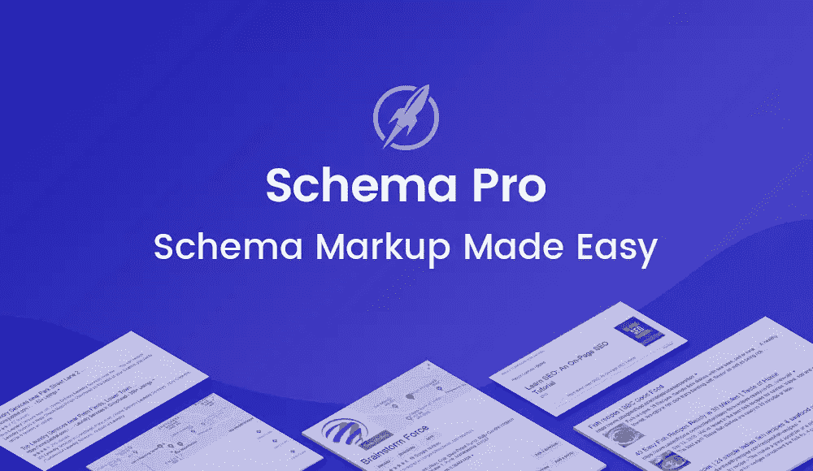](https://wpschema.com/)

创建模式标记不再是一项任务！通过一个简单的点击和选择界面，您可以在几分钟内设置一个标记。您将设置的所有标记配置将自动应用于所有选定的页面和帖子。

获得 Schema Pro，在搜索引擎中胜过你的竞争对手。

## 14.[排名数学 SEO](https://rankmath.com/wordpress/plugin/seo-suite/)

[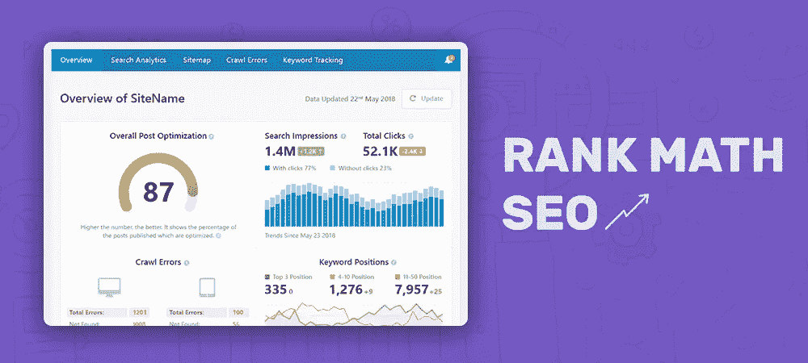](https://rankmath.com/wordpress/plugin/seo-suite/)

Rank Math 是市场上最强大、最容易使用的 WordPress SEO 插件，让你的网站在搜索引擎中的排名迅速上升。经过快速安装和设置，排名数学搜索引擎优化做整个工作，没有监督。

## 15.[电子邮件模板构建器](https://unlayer.com/)

Unlayer 是 SaaS 最受欢迎的电子邮件编辑器和页面生成器，它将让您的客户直接从您的应用程序创建移动就绪的电子邮件和登录页面。

有大量的模板可以开始，一个拖放生成器，以及其他一些很酷的功能，可以帮助你和你的客户创建专业的电子邮件。

立即注册。

## 16. [WixToWordPress。PRO](https://wixtowordpress.pro/)

WixToWordPress。PRO 为任何打算将网站从 Wix 迁移到 WordPress 的人提供高质量的迁移服务。他们保证每个客户的个性化方法、可靠性、效率和高速网站传输，而不影响质量。对细节的关注和物有所值使这项服务与众不同。

## 17.[内容陷阱](https://contentsnare.com/)

[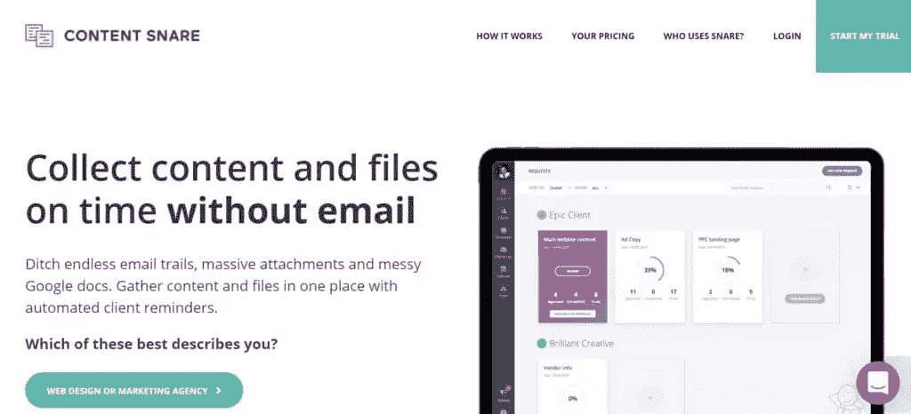](https://contentsnare.com/)

如果你是一个网页设计或营销机构，一个自由职业者，或者是一个内部营销团队的一员，你可以抛弃无休止的电子邮件，大量的附件和凌乱的谷歌文档。使用 Content Snare，您可以通过自动客户端提醒将内容和文件收集在一个地方。

立即开始为期 14 天的免费试用。

## 18. [Logaster 标志制造商](https://www.logaster.com/logo/)

Logaster 是一个超级流行的标志和品牌标识制作工具，你可以用它在几分钟内制作出漂亮的标志，而无需任何经验。你首先写下标志名称和口号，然后平台会显示数百个标志设计供你选择。

## 19. [KnowAll 知识库主题](https://herothemes.com/themes/knowall-wordpress-knowledge-base/)

KnowAll 是 WordPress 的一个全功能知识库主题。你可以为你的客户提供即时的答案，他们会喜欢得到帮助，而不必等待你或你的团队的回应。这是在增加销售的同时留住现有支持人员的好方法。

## 20. [8b 建站者](https://8b.com/)

[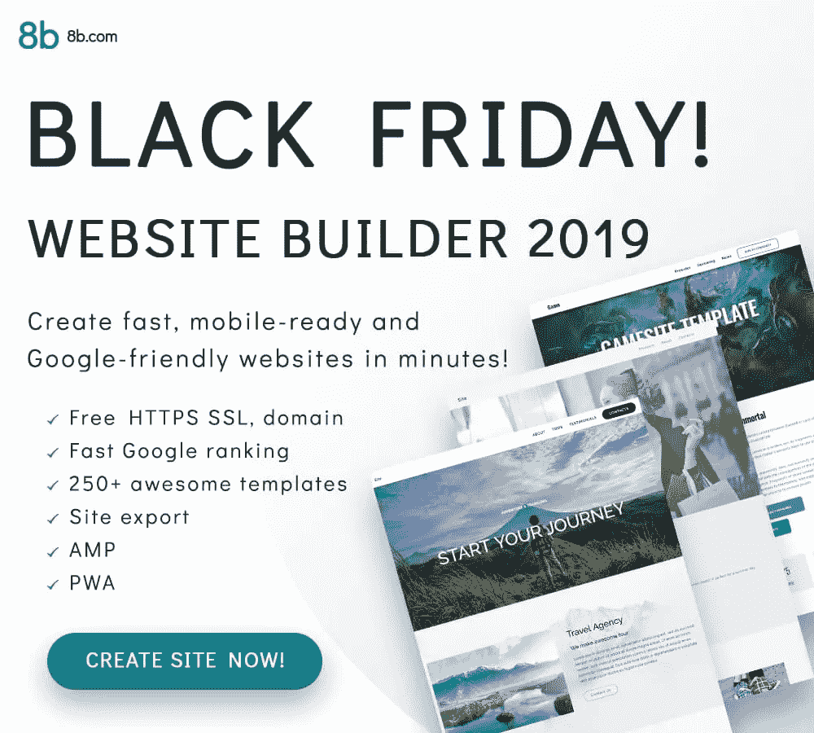](https://8b.com/)

8b 是一个出色的网站构建器，它装载了超过 250 个令人敬畏和像素完美的模板，带有免费的 HTTPS SSL、域名、网站导出功能、AMP、PWA 等等。使用 8b 在几分钟内创建专业且功能齐全的网站，无需任何特殊技能或以前的经验。

## 21.[24x7 WP 支持](https://www.24x7wpsupport.com/)

[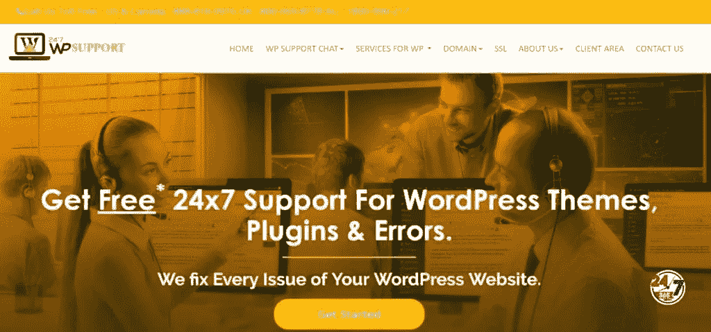](https://www.24x7wpsupport.com/)

你想找一家 WordPress 设计和开发支持公司吗？您的搜索将在 24x7 WP 支持下结束。作为领先的代理机构之一，他们提供全天候服务，并以不懈的支持和定制的援助为后盾。无论是博客作者还是 WooCommerce 网站所有者，他们都可以通过一致的支持服务帮助你扩大在线影响力。联系这些专家并移交支持和管理任务，同时专注于您的业务需求。

## 22. [Wix2WP。Pro](https://wix2wp.pro/)

[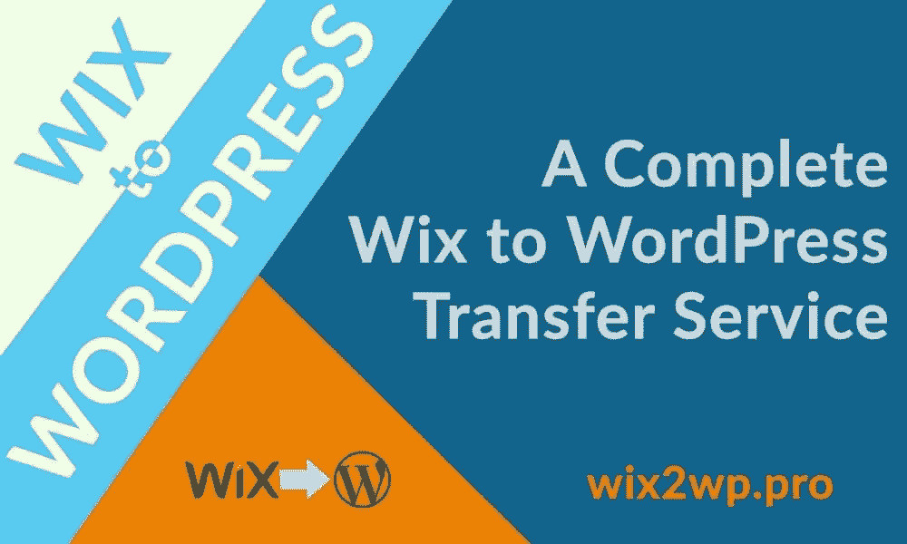](https://wix2wp.pro/)

Wix2WP。Pro 是一个专业的、一体化的 Wix 到 WordPress 迁移服务，它帮助非编码人员和网页设计专业人员将网站从一个平台迁移到另一个平台，而无需任何额外的时间和精力投入。为该服务工作的专家为他们处理任务，特别注意每个项目的细节以及客户的特殊要求和偏好。

## 23.[MMThomasBlog.com](https://mmthomasblog.com/)

[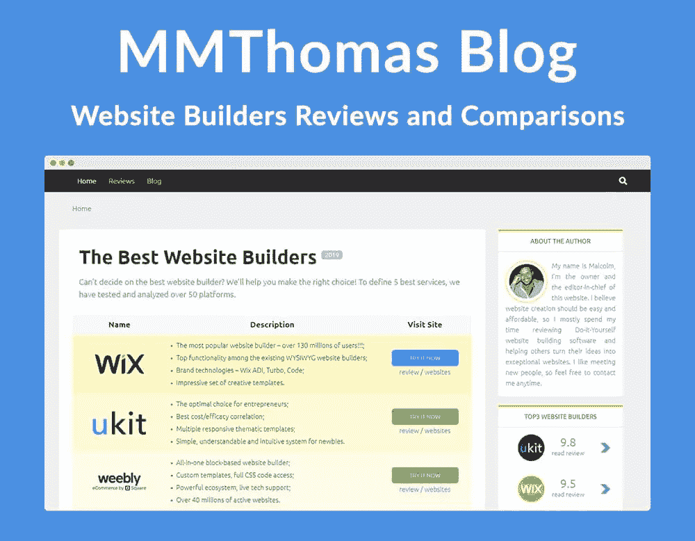](https://mmthomasblog.com/)

MMThomasBlog.com 提供了一个选择最佳网站建设者的详细指南，以创建不同类型的项目。该服务提供了最佳网站构建系统的信息描述、最受欢迎服务的评论以及深入的比较，帮助用户为他们的项目选择最佳平台。

## 24. [uCoz](https://www.ucoz.com/)

Coz 是一个成熟的网站建设者，它允许用户——无论是专业人士还是新手——点击几下就可以创建一个网站！你会发现所有必要的工具，各种各样的模板和其他功能。需要网上商店、论坛或博客吗？有了 uCoz，一切皆有可能。更重要的是，它是无缝的，不会花你一捆。

## 25.[48 小时口号](https://www.48hourslogo.com/)

[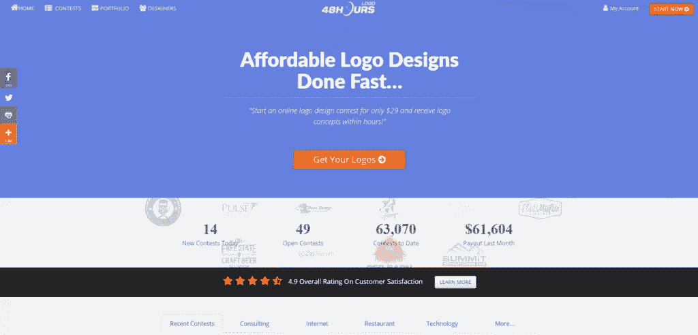](https://www.48hourslogo.com/)

48 小时 Logo 是一项非常高效的服务，你可以用它在 48 小时或更短时间内获得一个超级 logo。花 29 美元开始你自己的标志设计比赛，让真正的设计师为你的设计而竞争。它真的很有效，而且效果令人印象深刻。

立即获取您的徽标。

## 26. [HTMLtoWordPress。Pro](https://htmltowordpress.pro/)

[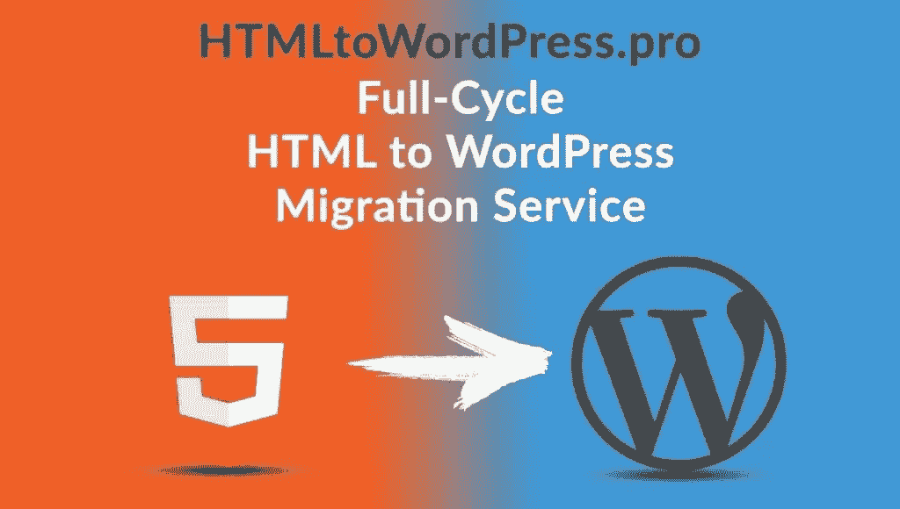](https://htmltowordpress.pro/)

HTMLtoWordPress。Pro 使 HTML 网站以一种专业和无麻烦的方式转移到 WordPress 成为可能。该服务具有多年的专业经验，这使他们了解网站迁移程序的所有细微差别和特殊参数。为 HTMLtoWordPress 工作的专家。专业人士是真正的专业人士，他们能够以最好的方式处理网站转移过程。

## 27. [Brizy 云网站构建器](https://www.brizy.cloud/)

Brizy 是一款出色的免费网站构建工具，无需编码(甚至无需设计师技能)，您就可以在几分钟内创建像素级的专业网站。它装有 700 个预制块，超过 150 个华丽的布局，等等。你需要的一切都包含在 Brizy 里。

在 [Brizy 网站](https://www.brizy.cloud/#pricing)上的购物车中使用折扣代码**BF 40 off**——从 11 月 29 日到 12 月 2 日可用。您还可以通过购买 Brizy Cloud 获得 Brizy PRO WordPress 插件。

## 28.[WP2Wix.Com](https://wp2wix.com/)

[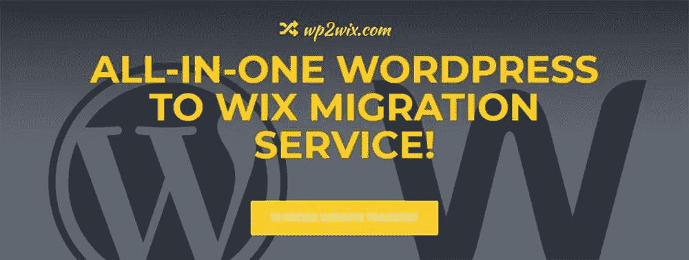](https://wp2wix.com/)

WP2Wix.Com 为那些需要在平台间切换和寻求专业帮助的人提供一体化的 WordPress 到 Wix 迁移服务。这项服务涵盖了转账过程的每一个细节，特别注意用户可能忽略的所有细微差别。

## 29. [Shella: Ultima 快速响应 Shopify 主题](https://themeforest.net/item/shella-ultimate-fashion-responsive-shopify-theme/22804833)

[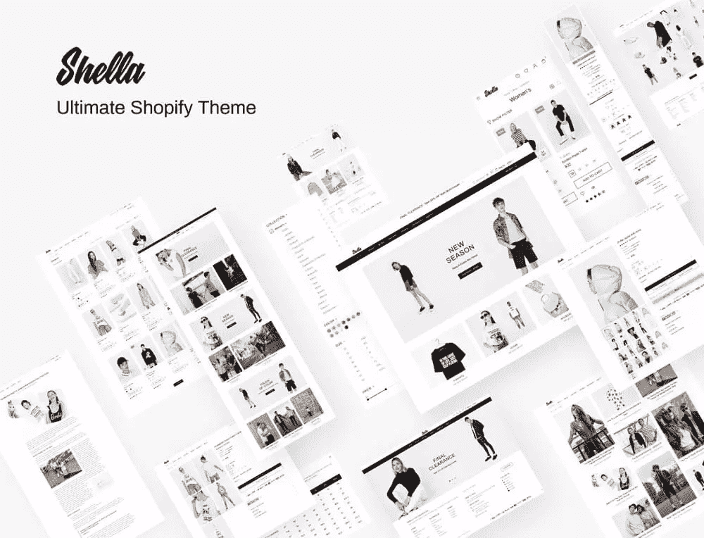](https://themeforest.net/item/shella-ultimate-fashion-responsive-shopify-theme/22804833)

Shella 是一个超级多用途的 Shopify 主题，加载了超过 80 个预先设计的页面，有许多皮肤，像素完美的设计，以及大量的功能和选项。配置和定制需要几分钟，您就可以开始了。

## 30. [Pixpa:投资组合网站](https://www.pixpa.com/)

Pixpa 是一个一体化平台，摄影师、艺术家和创意人员可以在一个地方创建他们的专业组合网站、客户画廊、博客和电子商务商店。

Pixpa 的漂亮和移动友好的模板是完全可定制的，是创建专业网站的一个很好的起点。使用 Pixpa 的拖放式网站构建器，创意人员可以轻松地以他们想要的方式构建他们的网站，而无需任何编码知识。

## 31.[免费发票模板](https://www.invoiceberry.com/free-invoice-templates)

[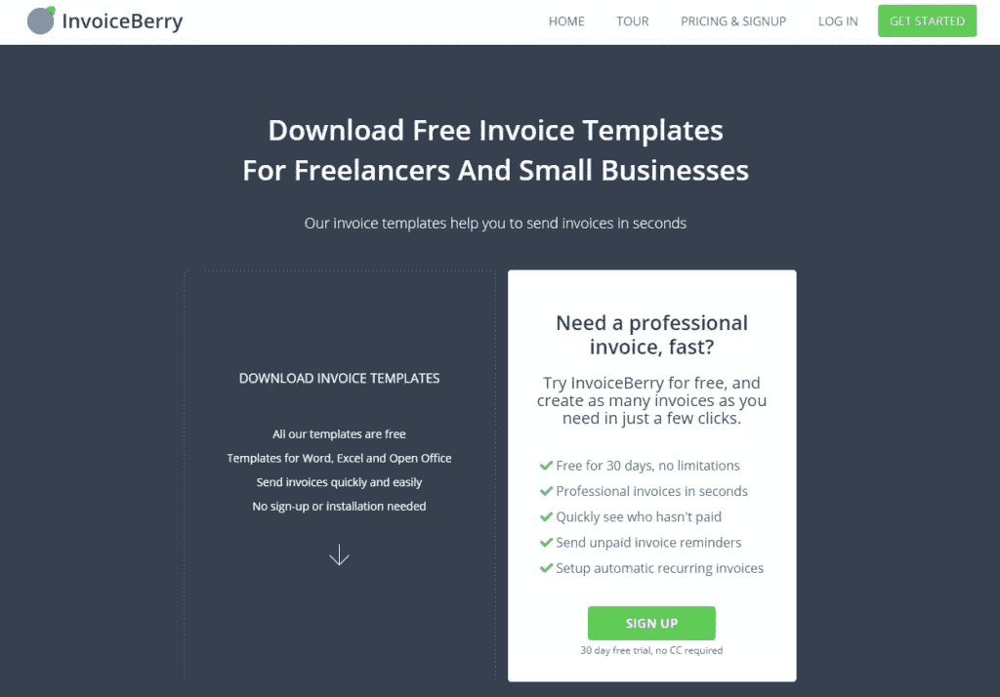](https://www.invoiceberry.com/free-invoice-templates)

InvoiceBerry 是一个专业和流行的发票软件包，您可以使用它在 60 秒或更短的时间内创建和发送完全定制的发票，跟踪费用，创建报告，管理客户，跟踪付款等。

免费试用 InvoiceBerry 天；只有爱，才会付出。

## 32.[现场活动聊天平台](https://www.rumbletalk.com/)

[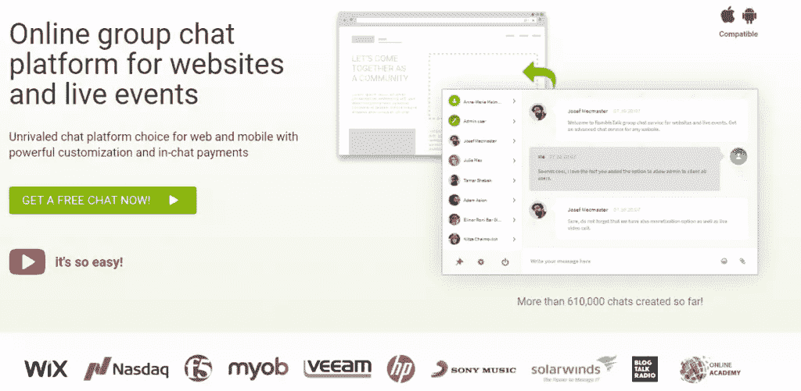](https://www.rumbletalk.com/)

RumbleTalk 是最受欢迎的网站和生活事件在线群聊平台之一。立即实施免费聊天，并与您的网站访问者和客户取得联系。创建您自己的时尚群聊只需两分钟。

## 33. [Fotor 免费照片编辑器](https://www.fotor.com/)

Fotor 处理了数十亿张照片，拥有超过 3 亿用户，是最受欢迎的一体化视觉内容解决方案，可用于照片编辑和图形设计。你不需要任何设计技巧或经验，就能为你的网站或社交媒体渠道创作出极具吸引力的照片。

## 34. [WrapPixel](https://www.wrappixel.com/blackfriday)

[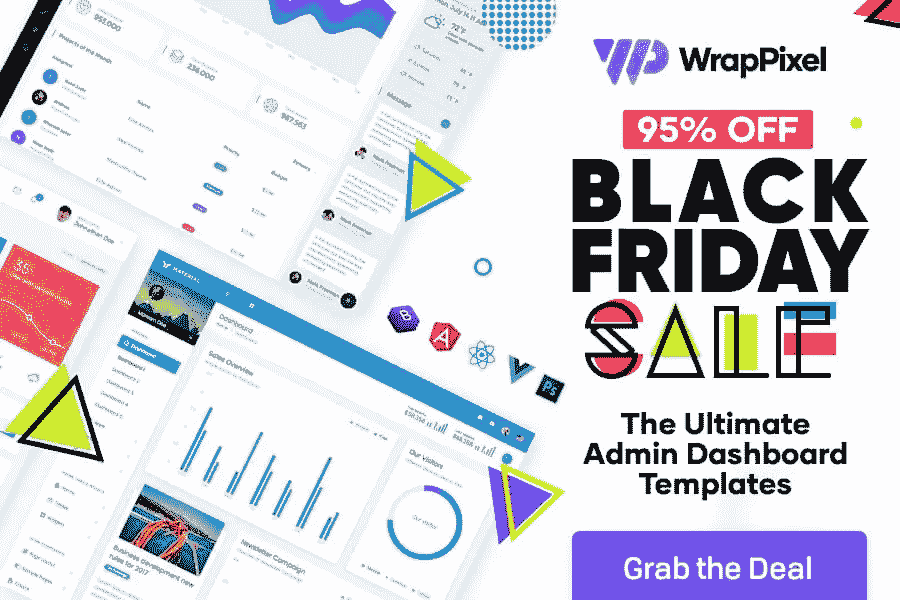](https://www.wrappixel.com/blackfriday)

WrapPixel 自 2016 年以来一直提供高质量、免费和优质的 Bootstrap、Angular、React 和 Vuejs admin dashboard 模板。他们为黑色星期五提供机不可失的优惠。在大宗交易中获得 95%的折扣。看看吧！

## 35. [Adminmart](https://adminmart.com/)

[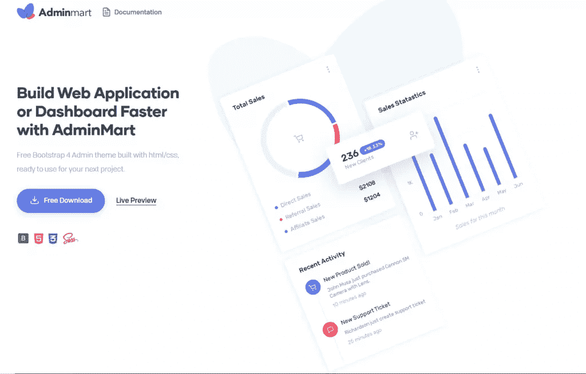](https://adminmart.com/)

Adminmart 是一个免费的 Boostrap 4 Admin 主题，使用 HTML 和 CSS 构建，您可以立即使用它来构建 web 应用程序或仪表板。它有一个干净和现代的用户界面，易于使用的代码。它对商业项目是免费的，并且有终身免费更新、随时可用的元素等等。

进行实时预览，了解 Adminmart 的运行情况。

## 36.[同流合污](https://www.cahoot.ai/)

[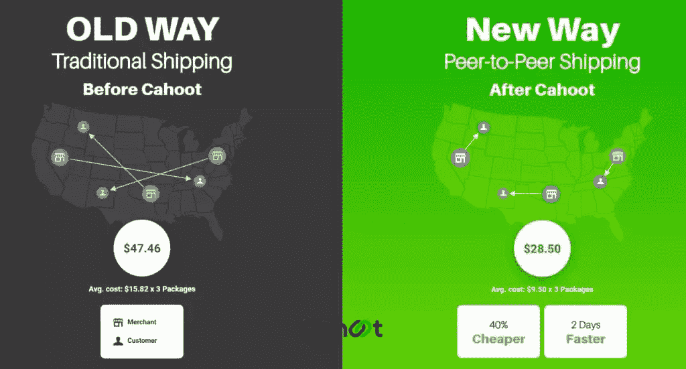](https://www.cahoot.ai/)

Cahoot 正在扰乱在线卖家的履约，就像 Airbnb 扰乱短期住宿市场一样。借助 Cahoot 网络，您可以在以前无法服务的市场中提供卖方履行优惠(SFP)。拉近与客户的距离，提高因运输成本过高而无利可图的产品的利润。

## 37. [Icons8 照片](https://photos.icons8.com/)

Icons8 Photos 是一个结合了机器学习和专业摄影的资源，旨在建立一个创意社区。使用各种模型、对象和背景，并与其他创作者一起定制照片——就像开发人员在 GitHub 上处理代码一样。照片是免费链接的。

## 38.[古腾类型](https://themerex.net/downloads/gutentype-a-trendy-gutenberg-wordpress-theme/)

[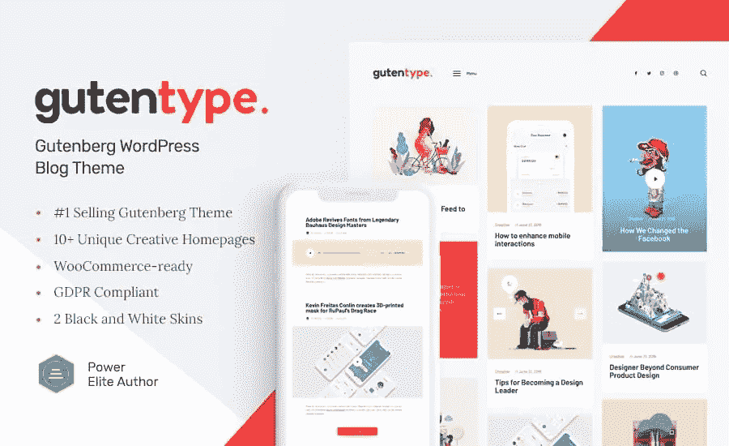](https://themerex.net/downloads/gutentype-a-trendy-gutenberg-wordpress-theme/)

Gutentype WordPress 主题提供了创建一个实用的博客所需的所有功能。它的特点是代码简洁且平衡。该主题基于 Gutenberg 页面生成器，可以与所有 Gutenberg 块和内容编辑组件完美配合。这是 WooCommerce-ready，使其易于使用电子商务目的的主题。

## 分享这篇文章